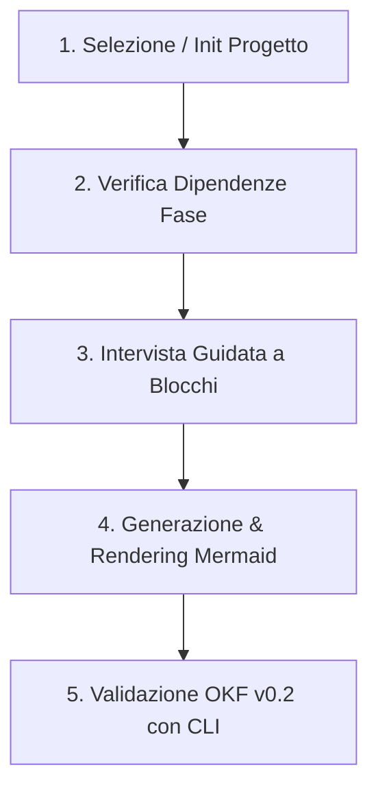

# ITInfra Assistant Skill — Compilazione Guidata Documentazione IT (OKF v0.2)

Questa skill definisce la metodologia di lavoro per assistere ingegneri di rete, architetti di sistemi e team DevOps nella redazione di documentazione di infrastruttura IT complessa, trasformando i template statici in un **processo interattivo e guidato a turni**.

---

## 1. Principi di Funzionamento

1. **Mai generazione "one-shot" senza intervista:** Non tentare di generare un documento di decine di pagine a partire da un prompt generico. Conduci l'intervista per blocchi tematici logici.
2. **Uso del manifesto condiviso:** Tutti i parametri di base (CIDR, ASN, siti, RTO/RPO, password vault) devono risiedere in `projects/<slug>/project-manifest.yaml` e venire ereditati automaticamente.
3. **Zero allucinazioni sui dati di rete:** Se un parametro (IP, gateway, VLAN ID, modello hardware) non è noto, usa `<DA-RICHIEDERE>` e segnalalo come Open Issue.
4. **Validazione automatica obbligatoria:** Prima di presentare il documento come completato o pronto per revisione, esegui sempre `python scripts/itinfra.py validate <file>`.

---

## 2. Workflow a 5 Step



### Step 1: Inizializzazione o Caricamento Progetto
- Verifica se esiste la cartella `projects/<slug>/project-manifest.yaml`.
- Se il progetto non esiste, chiedi il nome del cliente e avvia:
  ```powershell
  python scripts/itinfra.py init <slug> --client "<Nome Cliente>" --name "<Titolo Progetto>"
  ```
- Leggi i parametri condivisi dal manifest (`network_baseline`, `sites`, `sla_baseline`).

### Step 2: Verifica Dipendenze (`depends_on`)
- Consulta la matrice delle 7 fasi e dei 9 documenti (`00-INDEX.md` o `python scripts/itinfra.py status <slug>`):
  - **Fase 1:** `01-RSD-URS.md` (nessuna dipendenza)
  - **Fase 2:** `02-HLD.md` (dipende da RSD)
  - **Fase 2:** `03-LLD.md` (dipende da HLD)
  - **Fase 3:** `04-MOP.md` e `05-Rollback.md` (dipendono da LLD)
  - **Fase 5:** `06-As-Built.md` (dipende da LLD e MOP)
  - **Fase 6:** `07-ATP.md` (dipende da LLD e As-Built)
  - **Fase 7:** `08-SOP-Runbook.md` e `09-Handover-Inventory.md` (dipendono da ATP e As-Built)
- Se il documento propedeutico manca o è in bozza, avvisa l'utente prima di procedere.

### Step 3: Intervista Guidata a Blocchi Tematici
Non fare 30 domande in una volta sola. Suddividi l'intervista in moduli da 3-4 domande mirate per il documento selezionato:

#### A. Per RSD/URS (Fase 1)
- **Blocco Requisiti Business:** Obiettivi del progetto, SLA target, RTO/RPO tier-1 e tier-2.
- **Blocco Vincoli & Compliance:** Regolamenti applicabili (GDPR, NIS2, ISO 27001), vincoli di budget o di fornitore.
- **Blocco Ambito & Siti:** Quali sedi/DC sono inclusi nel perimetro e quali esclusi.

#### B. Per HLD (Fase 2)
- **Blocco Topologia Macro:** Architettura di rete (Spine-Leaf, Core/Aggregation/Access, WAN SD-WAN).
- **Blocco Ridondanza & Disaster Recovery:** Meccanismi di failover (active-active, active-passive), interconnessioni DCI.
- **Blocco Compute & Virtualizzazione:** Hypervisor (VMware, Proxmox, Nutanix, OpenStack), storage SAN/NAS.

#### C. Per LLD (Fase 2)
- **Blocco IP Addressing & VLAN:** Matrice VLAN, subnet /24 o /28, gateway HSRP/VRRP, pool DHCP.
- **Blocco Cablaggio & Rack Layout:** Assegnazione Unità Rack (RU), schede di rete (SFP28, QSFP+), connessioni fisiche.
- **Blocco Routing & ACL:** Policy di routing (BGP/OSPF), regole di firewalling tra zone (DMZ, Trust, Untrust).

#### D. Per MOP & Rollback (Fase 3)
- **Blocco Finestra & Team:** Orari di change window, team on-site, escalation path.
- **Blocco Fasi di Esecuzione:** Step operativi con comandi CLI esatti e tempo stimato.
- **Blocco Criteri di Abort/Rollback:** Trigger point (cosa fa scattare l'abort?) e procedura di ripristino.

#### E. Per ATP, Runbook & Handover (Fase 6-7)
- **Blocco Test di Collaudo:** Test di connettività, test di failover alimentazione/cavo, test prestazionali.
- **Blocco Manutenzione Ordinaria:** Procedure di backup, rotazione credenziali, riavvio controllato dei servizi.
- **Blocco Asset & Licenze:** Seriali hardware, licenze software, date di scadenza contratti di supporto.

### Step 4: Generazione & Integrazione Schemi Mermaid
- Leggi il template originale da `templates/<NN-TIPO>.md`.
- Inserisci nel frontmatter l'`id` univoco: `<canonical-type>-<project_slug>-<subtype>-01`.
- Popola le entità e le relazioni nel frontmatter YAML.
- **Coerenza OBBLIGATORIA:** Per ogni stringa in `related_docs`, inserisci una riga corrispondente in `relations` con medesimo `targetId`.
- Includi diagrammi Mermaid topologici direttamente nel corpo Markdown.

### Step 5: Validazione Automatica & Audit di Coerenza con la CLI
Prima di proporre il documento completato, lancia obbligatoriamente:
```powershell
# 1. Validazione formale OKF v0.2
python scripts/itinfra.py validate projects/<project_slug>/<NN-TIPO>.md

# 2. Audit di coerenza semantica incrociata (Strict Grounding & Zero-Hallucination)
python scripts/itinfra.py audit-consistency <project_slug>
```
- Se il linter segnala violazioni (es. credenziali in chiaro, disallineamento `related_docs` vs `relations`, IP fuori subnet), correggi il documento prima di consegnarlo.
- L'AI non deve mai inventare valori mancanti: in caso di dato non noto, usa tassativamente `<DA-RICHIEDERE>` e segnalalo tra le Open Issues.
- Mostra all'utente l'esito della validazione (`[V] Validazione completata con successo`).

---

## 3. Parallelismo e Git Worktree per Multi-Agente

Se più agenti o sessioni operano in parallelo sul medesimo progetto:
1. Crea un worktree dedicato per il ruolo operativo dell'agente:
   ```powershell
   python scripts/itinfra.py worktree add [infra-architect|infra-security|infra-automation|infra-qa]
   ```
2. Ciascun agente lavora nel proprio branch e directory isolata `.worktrees/<ruolo>/`.
3. Il vault crittografico e il manifesto rimangono sincronizzati alla radice del repository.
4. Al termine del lavoro sul documento, sincronizza con `main`:
   ```powershell
   python scripts/itinfra.py worktree sync <ruolo>
   ```

---

## 4. Esportazione Configuration Playbooks

Per estrarre dai documenti tecnici gli script operativi pronti per l'esecuzione sistemistica:
```powershell
python scripts/itinfra.py export-configs <slug> --out projects/<slug>/configs
```
Vengono estratti e validati:
- `sw-core-01.rsc`: comandi RouterOS v7 per MikroTik Switch/Firewall.
- `setup_ad_hyperv.ps1`: script PowerShell esecutivo per il provisioning di VM, vSwitch e utenti AD.

---

## 5. Gestione della Memoria Locale Ibrida a 3 Livelli, Global Scratchpad & Trust Signals (Release v0.6 & v0.8)

Per preservare il contesto tra sessioni, condividere limitazioni hardware note ed evitare l'inquinamento di Git con micro-commit provvisori:

1. **Prima di porre domande all'utente (Step 0):**
   - Esegui prima `python scripts/itinfra.py memory show --global` per verificare best practice aziendali, limitazioni hardware note e linee guida di vendor trasversali (`projects/_global_scratchpad.md`).
   - Esegui poi `python scripts/itinfra.py memory show <slug>` per verificare le decisioni già concordate o i requisiti pendenti nello scratchpad del progetto specifico. Non ripetere domande già risolte.

2. **Durante l'intervista tecnica (Step 3):**
   - Per ogni decisione tecnica confermata dall'utente sul singolo progetto, registra la nota:
     ```powershell
     python scripts/itinfra.py memory log <slug> --section decisioni --text "<decisione approvata>" [--role <ruolo>]
     ```
   - Per regole di architettura o vincoli hardware generali validi per tutta l'azienda (senza riferimenti a clienti o secret), registra nello scratchpad globale:
     ```powershell
     python scripts/itinfra.py memory log --global --section "Best Practices & Design Patterns" --text "<regola generica>"
     ```
     *(Nota di sicurezza: il sistema esegue un controllo preventivo di sicurezza; è severamente vietato inserire riferimenti `vault://` o secret nella memoria globale).*
   - Per ogni informazione mancante o dubbia, usa tassativamente `<DA-RICHIEDERE>`:
     ```powershell
     python scripts/itinfra.py memory log <slug> --section sospesi --text "<DA-RICHIEDERE> <parametro mancante>" [--role <ruolo>]
     ```

3. **In caso di esecuzione multi-agente parallela:**
   - Ciascun agente appunta con proprio `--role` (scrive in `.memory/scratchpad.<ruolo>.md`).
   - Prima della redazione finale, unifica le note:
     ```powershell
     python scripts/itinfra.py memory merge <slug>
     ```

4. **In fase di consegna del documento (Step 5):**
   - Consolida le decisioni nel documento target OKF v0.2 applicando i metadati di confidenza (**Trust Signals**):
     ```powershell
     python scripts/itinfra.py memory consolidate <slug> --target <NN-TIPO> --reviewer "<Nome Revisore>" [--stale-days 90]
     ```
   - Valida che il documento aggiornato soddisfi `itinfra.py validate` e `itinfra.py audit-consistency`.

---

## 6. Global Enterprise Knowledge Graph & Asset Inventory (Release v0.7)

Quando l'utente richiede informazioni su componenti hardware, modelli, vendor o tecnologie trasversali tra più clienti o per la pianificazione di un nuovo impianto:

1. **Consultazione Cross-Progetto (Step 0):**
   - Esegui una ricerca rapida per verificare l'adozione e le configurazioni storiche:
     ```powershell
     python scripts/itinfra.py inventory find "<modello o tecnologia>"
     python scripts/itinfra.py inventory list-hardware --vendor <vendor>
     ```
2. **Prevenzione Proattiva Incidenti (Incident Intelligence):**
   - Se l'output segnala allarmi `[!] CROSS-CLIENT INCIDENT ALERT`, consulta immediatamente la scheda post-mortem indicata (es. `10-RCA-*.md`) per adottare fin dalla fase di design le contromisure e workaround documentati (es. MTU/MSS clamping su overlay VPN, firmware consigliati).
3. **Mappatura Globale D3.js:**
   - Per visualizzare l'intero grafo enterprise federato e le connessioni tra progetti tramite i nodi ponte (`Shared Entity Bridges`):
     ```powershell
     python scripts/itinfra.py export-graph all --out projects/global-graph.html
     ```

---

## 7. Enterprise System Test & Verification Dashboard (Release v0.8)

Per verificare periodicamente o prima di ogni consegna formale la piena integrità funzionale, la conformità ontologica e l'assenza di secret leaks su tutti i 10 moduli dell'ecosistema:

1. **Esecuzione Suite di Collaudo Unificata:**
   ```powershell
   python scripts/itinfra.py test-suite --report-html
   ```
2. **Dashboard di Verifica Offline (Zero-CDN):**
   - Apri il report generato in `projects/system-test-report.html`.
   - Verifica che tutti i 10 moduli (Linter OKF v0.2, Strict Grounding Audit, Encrypted Vault, Multi-Agent Worktrees, Playbook Exporter, Triage & RCA Engine, Hybrid Memory System, Asset Inventory Engine, Cross-Client Incident Intelligence, Interactive Knowledge Graph) risultino con esito `[PASS]` e Pass Rate 100%.
