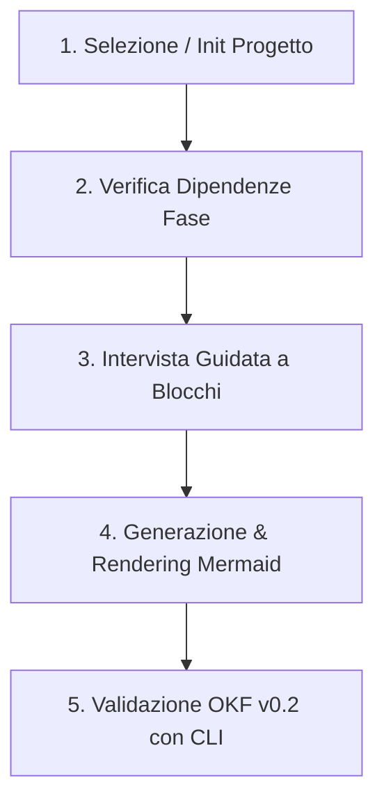

# ITInfra Assistant Skill — Compilazione Guidata Documentazione IT (OKF v0.2)

Questa skill definisce la metodologia di lavoro per assistere ingegneri di rete, architetti di sistemi e team DevOps nella redazione di documentazione di infrastruttura IT complessa, trasformando i template statici in un **processo interattivo e guidato a turni**.

---

## 1. Principi di Funzionamento

1. **Mai generazione "one-shot" senza intervista:** Non tentare di generare un documento di decine di pagine a partire da un prompt generico. Conduci l'intervista per blocchi tematici logici.
2. **Uso del manifesto condiviso:** Tutti i parametri di base (CIDR, ASN, siti, RTO/RPO, password vault) devono risiedere in `projects/<slug>/project-manifest.yaml` e venire ereditati automaticamente.
3. **Zero allucinazioni sui dati di rete:** Se un parametro (IP, gateway, VLAN ID, modello hardware) non è noto, usa `<DA-RICHIEDERE>` e segnalalo come Open Issue.
4. **Validazione automatica obbligatoria:** Prima di presentare il documento come completato o pronto per revisione, esegui sempre `python scripts/itinfra.py validate <file>`.

---

## 2. Workflow a 5 Step



### Step 1: Inizializzazione o Caricamento Progetto
- Verifica se esiste la cartella `projects/<slug>/project-manifest.yaml`.
- Se il progetto non esiste, chiedi il nome del cliente e avvia:
  ```powershell
  python scripts/itinfra.py init <slug> --client "<Nome Cliente>" --name "<Titolo Progetto>"
  ```
- Leggi i parametri condivisi dal manifest (`network_baseline`, `sites`, `sla_baseline`).

### Step 2: Verifica Dipendenze (`depends_on`)
- Consulta la matrice delle 7 fasi e dei 9 documenti (`00-INDEX.md` o `python scripts/itinfra.py status <slug>`):
  - **Fase 1:** `01-RSD-URS.md` (nessuna dipendenza)
  - **Fase 2:** `02-HLD.md` (dipende da RSD)
  - **Fase 2:** `03-LLD.md` (dipende da HLD)
  - **Fase 3:** `04-MOP.md` e `05-Rollback.md` (dipendono da LLD)
  - **Fase 5:** `06-As-Built.md` (dipende da LLD e MOP)
  - **Fase 6:** `07-ATP.md` (dipende da LLD e As-Built)
  - **Fase 7:** `08-SOP-Runbook.md` e `09-Handover-Inventory.md` (dipendono da ATP e As-Built)
- Se il documento propedeutico manca o è in bozza, avvisa l'utente prima di procedere.

### Step 3: Intervista Guidata a Blocchi Tematici
Non fare 30 domande in una volta sola. Suddividi l'intervista in moduli da 3-4 domande mirate per il documento selezionato:

#### A. Per RSD/URS (Fase 1)
- **Blocco Requisiti Business:** Obiettivi del progetto, SLA target, RTO/RPO tier-1 e tier-2.
- **Blocco Vincoli & Compliance:** Regolamenti applicabili (GDPR, NIS2, ISO 27001), vincoli di budget o di fornitore.
- **Blocco Ambito & Siti:** Quali sedi/DC sono inclusi nel perimetro e quali esclusi.

#### B. Per HLD (Fase 2)
- **Blocco Topologia Macro:** Architettura di rete (Spine-Leaf, Core/Aggregation/Access, WAN SD-WAN).
- **Blocco Ridondanza & Disaster Recovery:** Meccanismi di failover (active-active, active-passive), interconnessioni DCI.
- **Blocco Compute & Virtualizzazione:** Hypervisor (VMware, Proxmox, Nutanix, OpenStack), storage SAN/NAS.

#### C. Per LLD (Fase 2)
- **Blocco IP Addressing & VLAN:** Matrice VLAN, subnet /24 o /28, gateway HSRP/VRRP, pool DHCP.
- **Blocco Cablaggio & Rack Layout:** Assegnazione Unità Rack (RU), schede di rete (SFP28, QSFP+), connessioni fisiche.
- **Blocco Routing & ACL:** Policy di routing (BGP/OSPF), regole di firewalling tra zone (DMZ, Trust, Untrust).

#### D. Per MOP & Rollback (Fase 3)
- **Blocco Finestra & Team:** Orari di change window, team on-site, escalation path.
- **Blocco Fasi di Esecuzione:** Step operativi con comandi CLI esatti e tempo stimato.
- **Blocco Criteri di Abort/Rollback:** Trigger point (cosa fa scattare l'abort?) e procedura di ripristino.

#### E. Per ATP, Runbook & Handover (Fase 6-7)
- **Blocco Test di Collaudo:** Test di connettività, test di failover alimentazione/cavo, test prestazionali.
- **Blocco Manutenzione Ordinaria:** Procedure di backup, rotazione credenziali, riavvio controllato dei servizi.
- **Blocco Asset & Licenze:** Seriali hardware, licenze software, date di scadenza contratti di supporto.

### Step 4: Generazione & Integrazione Schemi Mermaid
- Leggi il template originale da `templates/<NN-TIPO>.md`.
- Inserisci nel frontmatter l'`id` univoco: `<canonical-type>-<project_slug>-<subtype>-01`.
- Popola le entità e le relazioni nel frontmatter YAML.
- **Coerenza OBBLIGATORIA:** Per ogni stringa in `related_docs`, inserisci una riga corrispondente in `relations` con medesimo `targetId`.
- Includi diagrammi Mermaid topologici direttamente nel corpo Markdown.

### Step 5: Validazione Automatica con la CLI
Prima di proporre il documento completato, lancia:
```powershell
python scripts/itinfra.py validate projects/<project_slug>/<NN-TIPO>.md
```
- Se il linter segnala violazioni (es. credenziali in chiaro, disallineamento `related_docs` vs `relations`), correggi il documento prima di consegnarlo.
- Mostra all'utente l'esito della validazione (`[V] Validazione completata con successo`).
