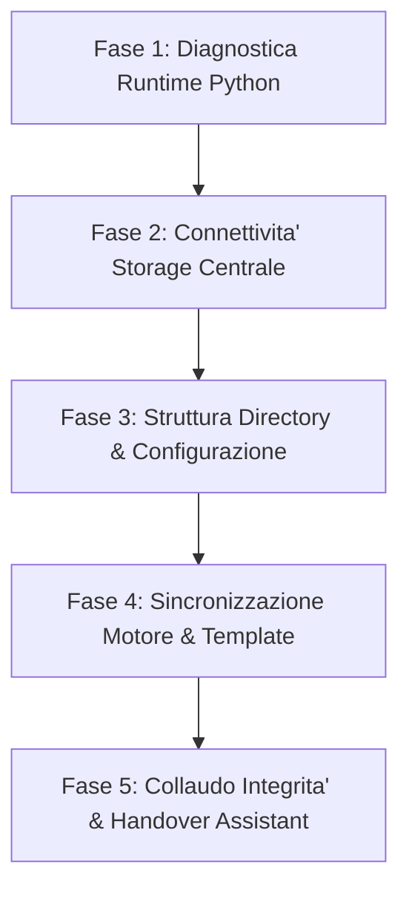

# ITInfra Setup & Client Environment Bootstrapper

Questa skill guida l'agente Antigravity nell'allestimento, nella diagnostica e nell'auto-configurazione di un nuovo workspace di lavoro **ITInfra** su macchine client (Windows 11).

---

## 🎯 Quando attivare questa Skill

Attiva questa procedura quando l'utente scrive richieste come:
- *"Configura l'ambiente di lavoro ITInfra"*
- *"Prepara questo client per lavorare sui progetti"*
- *"Verifica se il mio workspace e' configurato correttamente"*
- *"Connetti questo PC alla share centrale \\fileserv01\dati01\workaure"*
- *"Installa le dipendenze e collauda ITInfra"*

---

## 🛠️ Procedura Operativa a 5 Fasi



### Fase 1: Diagnostica Runtime & Dipendenze Python
1. Esegui la verifica della versione di Python:
   ```powershell
   python --version
   ```
   - Requisito minimo: **Python 3.10+**. Se assente, avvisa l'utente di installarlo dal Microsoft Store o da `python.org`.
2. Verifica la presenza delle librerie necessarie (`pyyaml`, `cryptography`):
   ```powershell
   python -c "import yaml, cryptography; print('[OK] Dipendenze presenti')"
   ```
   - Se una libreria manca, installala automaticamente:
     ```powershell
     pip install pyyaml cryptography
     ```

---

### Fase 2: Rilevamento e Verifica Storage Centrale
1. Verifica se lo storage centrale predefinito e' raggiungibile:
   ```powershell
   Test-Path "\\fileserv01\dati01\workaure"
   ```
2. Se la share e' raggiungibile:
   - Imposta come sorgente master centrale: `\\fileserv01\dati01\workaure`.
3. Se la share NON e' raggiungibile (es. utente fuori sede o senza VPN):
   - Chiedi all'utente se desidera utilizzare la modalità Git remota (`origin: https://github.com/matrixNeo76/ItInfra.git`) oppure specificare un percorso di rete alternativo.

---

### Fase 3: Struttura Directory & Configurazione Locale
1. Assicurati che nella cartella di lavoro corrente (es. `C:\itinfra`) esistano le sottodirectory essenziali:
   ```powershell
   New-Item -ItemType Directory -Path "projects", "scripts", "templates", "docs" -Force
   ```
2. Genera o aggiorna il file di configurazione locale `.itinfra_config.json`:
   ```json
   {
     "central_share": "\\\\fileserv01\\dati01\\workaure",
     "workspace_mode": "local_technician",
     "setup_status": "ready"
   }
   ```

---

### Fase 4: Sincronizzazione Motore e Template
1. Se il workspace e' collegato alla share master centrale:
   ```powershell
   python scripts/itinfra.py sync-engine
   ```
   - Questo comando assicura che il client disponga dell'ultima versione di tutti i 10 template OKF v0.2 e degli script CLI aggiornati.

---

### Fase 5: Collaudo Finale & Transizione
1. Esegui un rapido self-test locale:
   ```powershell
   python scripts/itinfra.py list-templates
   ```
2. Fornisci all'utente un riepilogo rassicurante e chiaro:
   ```text
   Workspace ITInfra configurato con successo al 100%!
   - Runtime: Python rilevato e configurato
   - Connessione Centrale: \\fileserv01\dati01\workaure attiva
   - Template OKF v0.2: 10/10 allineati
   - Quality Gate Publisher: pronto per itinfra.py publish

   Cosa desideri fare adesso?
   1. Creare un nuovo progetto (es. "Crea un nuovo progetto per il cliente Acme")
   2. Consultare l'inventario hardware globale (es. "Quali clienti hanno Dell R630?")
   3. Risolvere un incidente tecnico (es. "Apri un ticket RCA per disservizio SMB")
   ```
3. Passa il controllo alla skill principale `itinfra-assistant`.
