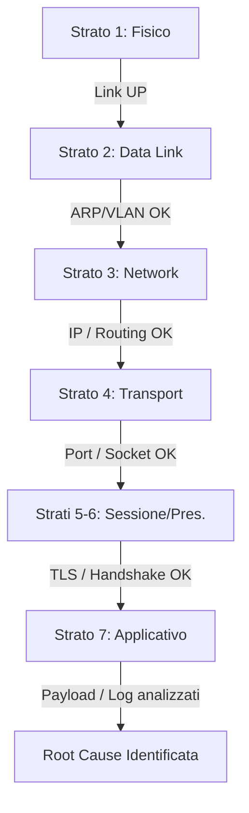

# ITInfra Troubleshooter Skill — Incident RCA & Diagnostica Deterministica

Questa skill guida l'agente AI nella gestione rigorosa, deterministica e documentata dei disservizi e incidenti di infrastruttura IT.
Fornisce il protocollo d'indagine a 7 strati ISO/OSI (L1-L7), la tecnica dei 5 Perché, la validazione telemetrica e la generazione del documento risolutivo **`10-RCA-Troubleshooting.md`** su standard **OKF v0.2**.

---

## 1. Regola Aurea: Zero Allucinazioni e Strict Grounding

1. **DIVIETO ASSOLUTO DI INVENTARE CAUSE O DATI:** L'agente non deve MAI presumere guasti o anomalie senza riscontro oggettivo nei log, telemetrie o output di comando forniti dall'utente o estratti via CLI.
2. **FALLBACK OBBLIGATORIO `<DA-RICHIEDERE>`:** Qualora un log, un indirizzo IP, una versione firmware o un riscontro strumentale non sia disponibile, l'unico valore ammesso è tassativamente `<DA-RICHIEDERE>`.
3. **CONFRONTO CON IL MANIFESTO E L'AS-BUILT:** Ogni apparato, subnet, VLAN, interfaccia o servizio citato DEVE corrispondere rigidamente a quanto censito in:
   - `projects/<slug>/project-manifest.yaml`
   - `projects/<slug>/07-As-Built.md`
   - `projects/<slug>/03-LLD.md`

---

## 2. Protocollo Diagnostico Deterministico a 7 Strati OSI (L1-L7)

Per isolare il guasto in modo scientifico ed eliminare false piste, l'agente DEVE procedere rigorosamente dal basso verso l'alto (Bottom-Up):



### Strato 1: Livello Fisico (L1)
- **Oggetto:** Integrità cavi patch Cat.6A, transceiver SFP+, porte switch/router, alimentazione e LED.
- **Comandi tipici:** `show interfaces status`, `/interface ethernet monitor`, verifica link state.
- **Esito atteso:** Porta `UP`, negoziazione corretta (1 Gbps / 10 Gbps Full Duplex), assenza di CRC error.

### Strato 2: Livello Collegamento Dati (L2)
- **Oggetto:** Tabelle MAC address, bridge VLAN filtering, framing Ethernet, collisioni, switch fabric.
- **Comandi tipici:** `/interface bridge host print`, `arp -a`, `show mac address-table`.
- **Esito atteso:** MAC address del nodo visibile nella VLAN corretta.

### Strato 3: Livello Rete (L3)
- **Oggetto:** Indirizzamento IP (CIDR), gateway di subnet, rotte statiche/dinamiche, tunnel VPN (ZeroTier, WireGuard, IPsec).
- **Comandi tipici:** `ping <IP_TARGET>`, `traceroute <IP_TARGET>`, `/ip route print`, `Get-NetRoute`.
- **Esito atteso:** Packet loss 0%, latenza entro SLA, next-hop coerente con LLD.

### Strato 4: Livello Trasporto (L4)
- **Oggetto:** Socket TCP/UDP, porte di servizio (445 SMB, 53 DNS, 80/443 HTTP, 3389 RDP, 8291 Winbox), handshake TCP SYN/ACK, regole di firewalling di trasporto.
- **Comandi tipici:** `Test-NetConnection -ComputerName <IP> -Port <PORT>`, `nc -zv <IP> <PORT>`.
- **Esito atteso:** `TcpTestSucceeded: True` o risposta UDP verificata.

### Strato 5 & 6: Livello Sessione & Presentazione (L5/L6)
- **Oggetto:** Negoziazione sessioni RPC, certificati TLS/SSL, cifratura (AES-128/256), versione SMB (SMB 2.1 vs 3.1.1).
- **Comandi tipici:** `openssl s_client -connect <IP>:<PORT>`, cattura pacchetti Wireshark per TLS handshake.
- **Esito atteso:** Negoziazione completata con cipher suite supportata da entrambi i nodi.

### Strato 7: Livello Applicativo (L7)
- **Oggetto:** Servizio software, permessi NTFS/ACL, record DNS, risposte HTTP, demoni di sistema, errori nei log.
- **Comandi tipici:** `Get-WinEvent -LogName System`, `journalctl -xeu <service>`, log applicativi dedicati.
- **Esito atteso:** Codici di ritorno 200 OK, assenza di `STATUS_ACCESS_DENIED` o timeout applicativi.

---

## 3. Metodo dei 5 Perché (5 Whys Root Cause Analysis)

Una volta isolato lo strato anomalo, l'agente conduce l'analisi causale con domande progressive concatenate:
1. **Perché si è manifestato il sintomo visibile all'utente?** (Es. Impossibile aprire cartella di rete)
2. **Perché si è verificata la condizione tecnica sottostante?** (Es. Porta TCP 445 non rispondeva)
3. **Perché la porta o il demone non rispondeva?** (Es. Il servizio è andato in stato Stopped dopo riavvio)
4. **Perché il servizio non è ripartito automaticamente?** (Es. Dipendenza RPC mancante o startup type manuale)
5. **Perché la dipendenza o la configurazione era scorretta?** (**ROOT CAUSE:** Es. Mancata definizione nel playbook di provisioning o deviazione manuale non tracciata nel Runbook).

---

## 4. Workflow Operativo di Risoluzione Incidente

```
1. Rilevamento Allarme o Segnalazione Ticket
   ↓
2. Inizializzazione Ticket RCA (`python scripts/itinfra.py troubleshoot init <slug> <ticket_id>`)
   ↓
3. Esecuzione Health Check Non Distruttivo (`python scripts/itinfra.py health-check <slug>`)
   ↓
4. Indagine Deterministica a Strati OSI L1-L7 (Intervista guidata senza allucinazioni)
   ↓
5. Root Cause Analysis (5 Perché) e Isolamento
   ↓
6. Applicazione Workaround / Fix Definitivo
   ↓
7. Suite di Collaudo e Non-Regressione (TR-01..TR-04)
   ↓
8. Piano CAPA (Corrective and Preventive Actions)
   ↓
9. Aggiornamento Documentale (Wiki-links verso LLD, As-Built, Runbook)
   ↓
10. Validazione OKF v0.2 (`python scripts/itinfra.py validate`) e Chiusura
```

---

## 5. Sicurezza e Segretezza

- Se l'indagine richiede l'accesso con credenziali di livello amministrativo, fare riferimento ESCLUSIVAMENTE al Secret Vault locale tramite URI simbolico:
  `vault://it/projects/<slug>/<apparato>/<utenza>`
- Non stampare né inserire nei documenti chiavi API o password in chiaro.
