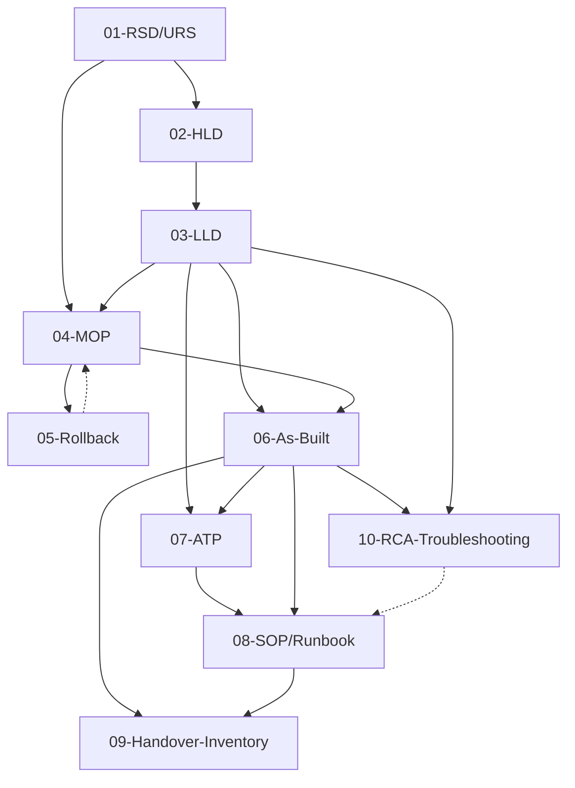

# ItInfra — Template Documentali OKF v0.2 per Ciclo Lavorativo IT

[](https://github.com/matrixNeo76/KnowledgeVault/blob/main/docs/OKF_v0.2_SPECIFICATION.md)
[](./LICENSE)
[](https://github.com/matrixNeo76/KnowledgeVault)
[]()

> **Repository di template documentali e suite agentica di automazione per infrastrutture IT complesse — dalla fase di Assessment al Go-Live, gestione incidenti (RCA), crittografia locale, memoria ibrida e Knowledge Graph, conformi allo standard OKF v0.2 (Open Knowledge Format).**
>
> Progettato per essere guidato e compilato da agenti AI (Google Antigravity, Claude Code, Cursor, Windsurf, Copilot) tramite interviste a blocchi, salvato in un knowledge vault con `entities` e `relations` ontologiche, e collaudato programmaticamente con una test suite integrata.

---

## 🎯 A chi è rivolto

- **Integratori / System Engineer / Network Architect** che progettano, installano e documentano infrastrutture IT
- **Team Operations & SRE** che gestiscono la manutenzione post-rilascio e la Root Cause Analysis (RCA)
- **Agenti AI & Ingegneri di Prompt** che orchestrano la redazione documentale con garanzia Zero-Hallucination
- **Knowledge Engineers** che mantengono grafi di conoscenza ontologici inter-progetto e inventari enterprise

---

## 📦 Struttura del repository

```
ItInfra/
├── it.cmd                             ← CLI rapida a zero attrito per Windows / PowerShell
├── README.md                          ← Questo file (orientamento GitHub)
├── ROADMAP.md                         ← Roadmap strategica del repository (OKF v0.2)
├── AGENTS.md                          ← Istruzioni per agenti AI (Cursor, Aider, Cline, Roo Code)
├── GEMINI.md                          ← Istruzioni per Google Antigravity e Gemini
├── CLAUDE.md                          ← Istruzioni auto-caricate da Claude Code (CLI Anthropic)
├── INTEGRAZIONE-REPO.md               ← Guida master in formato OKF v0.2: come integrare tutto nel Knowledge Vault
├── LICENSE                            ← MIT License
├── .gitignore                         ← Esclusione automatica .vault.enc, .vault.lock e secret
│
├── .agents/
│   ├── rules/
│   │   └── 00-fastpath.md             ← Regola deterministica Zero-Search per comandi a 0 secondi
│   └── skills/                        ← Skill universali per Antigravity e moderni agent framework
│       ├── itinfra-assistant/SKILL.md ← Procedura guidata a turni (intervista a blocchi)
│       ├── itinfra-vault/SKILL.md     ← Gestione sicura del Secret Vault crittografato (AES-256-GCM)
│       └── itinfra-troubleshooter/SKILL.md ← Triage deterministico L1-L7 e compilazione RCA
│
├── docs/                              ← Documentazione architetturale interna (OKF v0.2)
│   ├── 00-INDEX-DOCS.md               ← Indice navigazionale della documentazione
│   ├── 01-SPEC-ITINFRA-ASSISTANT.md   ← Specifica tecnica suite agentica e CLI
│   ├── 02-ROADMAP-PIANO-SVILUPPO.md   ← Piano di sviluppo esecutivo e milestone
│   ├── 03-GUIDA-CLI-ITINFRA.md        ← Manuale operativo completo di scripts/itinfra.py
│   ├── 04-GUIDA-ASSISTENTE-AGENTICO.md← Guida per Antigravity, Claude Code e Cursor
│   ├── 05-MANIFEST-E-PROGETTI.md      ← Specifica registro progetti e manifest condiviso
│   ├── 06-COMPLIANCE-E-SICUREZZA.md   ← Framework normativi NIS2, ISO 27001 e DORA
│   ├── 07-GUIDA-RISOLUZIONE-PROBLEMATICHE-AI.md ← Guida troubleshooting, telemetria e RCA per agenti AI
│   ├── 08-GUIDA-MEMORIA-IBRIDA-TRUST-SIGNALS.md ← Guida memoria locale a 3 livelli, scratchpad e Trust Signals
│   ├── 09-GUIDA-GLOBAL-ENTERPRISE-GRAPH.md      ← Knowledge Graph globale, nodi ponte e inventario cross-client
│   ├── 10-GUIDA-GLOBAL-MEMORY-SYSTEM-TEST.md    ← Global Staging Memory e Enterprise System Test Suite
│   ├── 11-GUIDA-LOCAL-WORKSPACE-CENTRAL-PUBLISH.md ← Architettura client locale e publishing su share centrale
│   ├── 12-GUIDA-ONBOARDING-TECNICI-ANTIGRAVITY.md ← Onboarding immediato e comandi a zero attrito
│   ├── 13-SPECIFICA-CLIENT-INTERACTIVE-AUTO-DISTRIBUTION.md ← Specifica distribuzione automatizzata
│   └── 14-PIPELINE-CREAZIONE-GUIDATA-ANTIGRAVITY-OKF.md ← Pipeline di creazione guidata OKF v0.2 con Antigravity
│
├── projects/                          ← Registro progetti e manifest globali
│   ├── _schema/                       ← Schema JSON formale del manifest
│   ├── _template/                     ← Template di project-manifest.yaml e _scratchpad.md
│   ├── _global_scratchpad.md          ← Staging Memory globale condivisa (hardware limitations & patterns)
│   ├── enterprise_dashboard.html      ← Cruscotto Esecutivo Generative UI interattivo
│   ├── system-test-report.html        ← Dashboard HTML offline di collaudo globale di tutti i moduli
│   ├── global-graph.html              ← Mappa interattiva D3.js Global Enterprise Knowledge Graph
│   ├── demo-acme/                     ← Progetto demo collaudato (Acme Corporation)
│   ├── demo-aure/                     ← Progetto onboarding collaudato (10 documenti OKF v0.2)
│   └── severino-srl/                  ← Progetto reale pilota (100% delle 7 fasi + ticket RCA completati)
│       ├── configs/                   ← Script operativi RouterOS e PowerShell esportati
│       ├── _scratchpad.md             ← Staging Memory (Livello 2) con decisioni consolidate
│       ├── 10-RCA-FS01-SMB-Connectivity.md ← Caso pilota reale post-mortem SMB su ZeroTier
│       ├── report.html                ← Dashboard consolidata HTML offline con tab Incident & RCA
│       └── graph.html                 ← Mappa interattiva D3.js Knowledge Graph (10 nodi, 52 archi)
│
├── scripts/                           ← Toolchain CLI e automazione
│   ├── itinfra.py                     ← CLI master: start, init, scaffold, validate, status, vault, publish, ui, test-suite
│   ├── itinfra_scaffold.py            ← Motore di auto-scaffolding atomico con auto-inizializzazione trasparente
│   ├── itinfra_ui.py                  ← Motore Enterprise Generative UI Dashboard (Zero-CDN)
│   ├── itinfra_sync.py                ← Motore di sincronizzazione automatica bidirezionale SMB / Git
│   ├── itinfra_test_suite.py          ← Suite di collaudo unificata (13 moduli) e generatore HTML Zero-CDN
│   ├── itinfra_inventory.py           ← Motore globale di asset & entity inventory cross-progetto
│   ├── itinfra_memory.py              ← Gestore della Memoria Locale Ibrida a 3 Livelli, Global Memory e Trust Signals
│   ├── itinfra_vault.py               ← Motore crittografico locale AES-256-GCM con atomic file locking
│   └── graph_generator.py             ← Generatore di Knowledge Graph D3.js v7 interattivo
│
├── templates/                         ← 11 template documentali OKF v0.2 + file orientamento
│   ├── 00-INDEX.md                    ← Indice navigazionale con link graph Mermaid
│   ├── 01-RSD-URS.md                  ← Fase 1 — Requirements Specification
│   ├── 02-HLD.md                      ← Fase 2 — High-Level Design
│   ├── 03-LLD.md                      ← Fase 2 — Low-Level Design (IP, VLAN, rack, ACL)
│   ├── 04-MOP.md                      ← Fase 3 — Method of Procedure
│   ├── 05-Rollback.md                 ← Fase 3 — Rollback / Fallback Plan
│   ├── 06-As-Built.md                 ← Fase 5-7 — As-Built Documentation
│   ├── 07-ATP.md                      ← Fase 6 — Acceptance Test Plan
│   ├── 08-SOP-Runbook.md              ← Fase 7 — Standard Operating Procedures
│   ├── 09-Handover-Inventory.md       ← Fase 7 — Handover & Asset Inventory
│   ├── 10-RCA-Troubleshooting.md      ← Fase 7 Post-Go-Live — Root Cause Analysis & Incident Resolution
│   ├── graph.html                     ← Mappa interattiva D3.js del knowledge graph dei template
│   └── README.md                      ← Documentazione umana dei template
│
└── examples/                          ← 11 prompt di esempio per agenti AI
    ├── README.md                      ← Indice esempi + workflow d'uso
    ├── 00-prompt-master-template.md   ← Struttura generica di un prompt efficace
    └── 01-prompt-RSD-URS.md ...       ← 9 prompt completi e personalizzabili
```

---

## 🧭 Architettura di Utilizzo: Cruscotto Visivo (UI) vs Assistente AI (Chat)

ITInfra è progettato come un ambiente **100% Offline-First & Zero-Dipendenze**: non richiede microservizi in background, demoni né server REST API o MCP da configurare. Tutta la logica poggia su **Python standard, file Markdown su filesystem locale, Git e share SMB aziendale**.

La produttività si basa sulla sinergia tra due componenti complementari:

| Componente | Ruolo nel Sistema | A cosa risponde | Funzionalità Chiave |
| :--- | :--- | :--- | :--- |
| **🎛️ Cruscotto Esecutivo (Generative UI)** | **La Mente Visiva & Telemetria** | *"Cosa c'è e cosa manca?"* | • Matrice a colori dei 10 documenti per cliente (`Approved`, `In-Review`, `Draft`, `Missing`)<br>• Stato della share di rete centrale e diagnostica permessi<br>• Selettore dinamico dei progetti (`demo-aure`, `severino-srl`, ecc.)<br>• Pulsanti Click-to-Action (zero sforzo per ricordare la sintassi CLI) |
| **🧠 Assistente AI (Chat Antigravity / Claude / Cursor)** | **Il Braccio Esecutivo & Architetto** | *"Come progettare e compilare?"* | • Intervista guidata a blocchi logici (Scope → Rete → Compute → Sicurezza → ATP)<br>• Politica **Zero-Hallucination**: calcolo IP/VLAN e nessun dato inventato (`<DA-RICHIEDERE>`)<br>• Generazione schemi topologici Mermaid e configurazioni RouterOS/PowerShell<br>• Validazione semantica incrociata e compilazione diretta su disco |

### 🔄 Il Ciclo di Lavoro Quotidiano

```
        ┌────────────────────────────────────────────────────────┐
        │             1. GUARDI IL CRUSCOTTO (UI)                │
        │ "Vedo che in demo-aure 01-RSD-URS è ancora in bozza"   │
        └──────────────────────────┬─────────────────────────────┘
                                   │
                                   ▼
        ┌────────────────────────────────────────────────────────┐
        │               2. LAVORI IN CHAT (AGENTE)               │
        │ "Compiliamo il documento con i dati dei server"        │
        │  -> L'agente fa l'intervista e compila il file         │
        └──────────────────────────┬─────────────────────────────┘
                                   │
                                   ▼
        ┌────────────────────────────────────────────────────────┐
        │             3. IL CRUSCOTTO SI AGGIORNA (UI)           │
        │ Il badge passa da giallo a verde (Approved/In-Review)  │
        │ e avanza la percentuale della Fase 1                   │
        └────────────────────────────────────────────────────────┘
```

---

## 🚀 Quick Start

### 1. Avvio Rapido & Comandi a Zero Attrito (Release v0.9.11)

Puoi interagire sia dalla chat del tuo agente AI (scrivendo parole chiave veloci) sia dal terminale Windows tramite `it <comando>`:

| Azione Desiderata | Da Chat Antigravity | Da Terminale (PowerShell / CMD) |
| :--- | :--- | :--- |
| **All-in-One: Avvia Progetto (Init+Scaffold+UI)** | `start <slug>` *(o `avvia <slug>`)* | `it start <slug>` |
| **Allineare Template e Motore** | `aggiorna` *(o `update`)* | `it update` |
| **Verificare Rete e Permessi** | `controlla` *(o `check`)* | `it check` |
| **Pubblicare Progetto su Server** | `pubblica <slug>` | `it publish <slug>` |
| **Auto-Scaffold Template da Manifest** | `scaffold <slug>` | `it scaffold <slug>` |
| **Verificare Stato 7 Fasi** | `stato <slug>` | `it status <slug>` |
| **Valida Documento Attivo** | `valida` *(o tasto `Ctrl+Shift+B`)* | `it validate <percorso_file>` |
| **Cruscotto Grafico Esecutivo** | `ui` *(o `dashboard`)* | `it ui` |
| **Collaudo Completo Sistema** | `test-suite` | `it test-suite` |

### 2. Gestione Completa con la CLI ITInfra (`scripts/itinfra.py`)

```bash
# Onboarding all-in-one a passaggio singolo (inizializza, scaffolda 10 file e apre UI):
python scripts/itinfra.py start acme-dc --client "Acme S.p.A." --name "Modernizzazione Data Center"

# Auto-scaffolding con propagazione automatica (e auto-inizializzazione trasparente):
python scripts/itinfra.py scaffold acme-dc

# Mostra lo stato di avanzamento dei 10 documenti nelle 7 fasi:
python scripts/itinfra.py status acme-dc

# Valida formalmente la conformità OKF v0.2 di un file o dell'intero progetto:
python scripts/itinfra.py validate projects/acme-dc/01-RSD-URS.md

# Genera o aggiorna il Cruscotto Esecutivo Generative UI:
python scripts/itinfra.py ui [--open]

# Reverse Reconciliation inversa (allinea As-Built -> manifesto con Drift Report):
# Auto-scaffolding deterministico con supporto Phased Milestones (Release v0.9.13):
python scripts/itinfra.py scaffold acme-dc [--phase assessment|design|staging|deployment|testing|handover|all]

# Reverse Reconciliation automatica da As-Built a Manifesto (Release v0.9.12):
python scripts/itinfra.py reconcile acme-dc [--dry-run]

# Intervista modulare a checkpoint atomici (anti-saturazione del contesto):
python scripts/itinfra.py interview acme-dc --status
python scripts/itinfra.py interview acme-dc --prompt network
python scripts/itinfra.py interview acme-dc --block network --set dc_ip="10.100.10.10"

# Pubblicazione protetta da Remote Lock e Drift Detection crittografico su share centrale (Release v0.9.13):
python scripts/itinfra.py publish acme-dc [--include-vault] [--force]

# Esegui l'Enterprise Test Suite di collaudo (15 moduli, 100% PASS):
python scripts/itinfra.py test-suite --report-html

# Esegui l'Audit di Coerenza Incrociata con Fenced YAML Blocks & Strict Grounding:
python scripts/itinfra.py audit-consistency acme-dc

# Gestisci il Secret Vault (AES-256-GCM) con input mascherato anti-leak e Team Bundling:
python scripts/itinfra.py vault init acme-dc
python scripts/itinfra.py vault set acme-dc fw/admin            # Mascherato con getpass (zero leak)
Get-Content secret.txt | python scripts/itinfra.py vault set acme-dc fw/admin # Tramite stdin sicuro
python scripts/itinfra.py vault export-bundle acme-dc --out projects/acme-dc/team.vbundle
python scripts/itinfra.py vault import-bundle acme-dc --in projects/acme-dc/team.vbundle

# Esporta playbook esecutivi (RouterOS .rsc e PowerShell .ps1):
python scripts/itinfra.py export-configs acme-dc

# Gestione incidenti, Root Cause Analysis e live telemetria:
python scripts/itinfra.py troubleshoot init acme-dc INC-001
python scripts/itinfra.py health-check acme-dc

# Memoria Locale Ibrida (L1-L3), Staging Scratchpad e Trust Signals:
python scripts/itinfra.py memory show --global
python scripts/itinfra.py memory log acme-dc --section decisioni --text "Confermato MTU 9000 su VLAN 40"
python scripts/itinfra.py memory consolidate acme-dc --target 03-LLD --reviewer "Lead Architect"

# Global Enterprise Asset & Entity Inventory:
python scripts/itinfra.py inventory find "ZeroTier"
python scripts/itinfra.py inventory list-hardware --vendor Dell
```

### 2. Compilazione Interattiva con Agenti AI & Strict Grounding

- **Google Antigravity & Modern Frameworks**: Dispongono delle skill universali in `.agents/skills/`:
  - `itinfra-assistant`: avvia un'**intervista guidata per blocchi logici** (Scope & SLA → Rete & IP → Compute & Storage → Sicurezza → Collaudo). Impone la policy **Zero-Hallucination**: è tassativamente vietato inventare dati tecnici; i valori non forniti devono essere registrati con `<DA-RICHIEDERE>`.
  - `itinfra-vault`: gestisce la crittografia dei secret locali e convalida i riferimenti `vault://`.
- **Claude Code / Cursor / Cline**: Leggono automaticamente `CLAUDE.md` o `AGENTS.md` ed eseguono i comandi `scripts/itinfra.py` dal terminale integrato.

### 3. Integrare nel Knowledge Vault (Livello 2 + 3)

Per integrare il modulo completo nel tuo Knowledge Vault:

```bash
git clone https://github.com/matrixNeo76/ItInfra.git
git clone https://github.com/matrixNeo76/KnowledgeVault.git

cd KnowledgeVault
# Segui la guida master:
cat ../ItInfra/INTEGRAZIONE-REPO.md
```

La guida `INTEGRAZIONE-REPO.md` (in formato OKF v0.2 nativo) ti porta passo-passo attraverso i 3 livelli di integrazione.

---

## 🗺️ Le 7 fasi del ciclo lavorativo IT

| Fase | Denominazione | Documenti | Template |
|------|---------------|-----------|----------|
| 1. Analisi | Assessment & Site Survey | RSD/URS | `01-RSD-URS.md` |
| 2. Progettazione | Architectural Design | HLD, LLD | `02-HLD.md`, `03-LLD.md` |
| 3. Approvvigionamento | Procurement & Staging | MOP, Rollback | `04-MOP.md`, `05-Rollback.md` |
| 4. Posa e Montaggio | Racking & Cabling | (confluisce in As-Built) | `06-As-Built.md` |
| 5. Configurazione | Commissioning & Implementation | (confluisce in As-Built) | `06-As-Built.md` |
| 6. Collaudo | Testing & Validation | ATP | `07-ATP.md` |
| 7. Rilascio | Go-Live / Handover | As-Built, SOP/Runbook, Handover | `06-As-Built.md`, `08-SOP-Runbook.md`, `09-Handover-Inventory.md` |
| 7. Post-Rilascio | Incident & RCA | Root Cause Analysis, 5 Perché, CAPA | `10-RCA-Troubleshooting.md` |

---

## 🔗 Schema OKF v0.2

Tutti i template usano lo standard **OKF v0.2 (Open Knowledge Format)** nativo del [Knowledge Vault](https://github.com/matrixNeo76/KnowledgeVault). Il frontmatter YAML è composto da:

- **Campi canonici** (riconosciuti dal parser): `okf_version`, `id`, `title`, `type` (6 tipi canonici), `domain`, `tags`, `entities`, `relations`
- **Metadati estesi IT** (preservati in `rawFrontmatter`): `project_id`, `phase`, `related_docs`, `depends_on`, `status`, `version`, `author`, ecc.

### Mappatura 10 tipi IT → 6 tipi canonici OKF

| Tipo IT | Tipo canonico OKF |
|---------|-------------------|
| RSD/URS, ATP, Handover & Inventory | `specification` |
| HLD, LLD, As-Built | `architecture` |
| MOP, Rollback, SOP/Runbook, RCA & Troubleshooting | `guide` |

Vedi [`templates/00-INDEX.md`](./templates/00-INDEX.md) per dettagli completi.

---

## 🤖 Agenti AI supportati

I file `AGENTS.md` e `CLAUDE.md` vengono letti automaticamente da:

| Agente | File letto / Modalità |
|--------|----------------------|
| **Google Antigravity** | `.agents/skills/` (3 skill native: `itinfra-assistant`, `itinfra-vault`, `itinfra-troubleshooter`) |
| **Claude Code** (Anthropic CLI) | `CLAUDE.md` + comandi terminale `scripts/itinfra.py` |
| **Cursor** | `AGENTS.md` |
| **Aider** | `AGENTS.md` |
| **Continue** | `AGENTS.md` |
| **Cline / Roo Code** | `AGENTS.md` |
| **Altri agenti** | Manualmente via prompt: "Prima di iniziare, leggi `AGENTS.md`" |

---

## 📊 Link Graph dei documenti



---

## 🛣️ Roadmap e Stato di Avanzamento

> Per la visione strategica dettagliata e il piano esecutivo completo, consulta il documento ufficiale [`ROADMAP.md`](./ROADMAP.md) e il cronoprogramma esecutivo in [`docs/02-ROADMAP-PIANO-SVILUPPO.md`](./docs/02-ROADMAP-PIANO-SVILUPPO.md).

### ✅ Stato Attuale: Rilasciato e Operativo al 100% (v0.2 — v0.8)

Il progetto si è evoluto da una raccolta iniziale di template statici a un **ecosistema agentico end-to-end completo, 100% locale, file-based e verificato programmaticamente**:

1. **v0.2 Core Templates & Vault Integration:**
   - 10 template documentali in standard nativo **OKF v0.2** per le 7 fasi del ciclo lavorativo IT + indice navigazionale (`00-INDEX.md`).
   - Manifesto condiviso del progetto (`project-manifest.yaml`) con schema JSON formale e baseline di rete/SLA.
   - CLI di base `scripts/itinfra.py` con linter formale OKF v0.2.
   - Integrazione completa col repository Knowledge Vault (Livelli 1, 2 e 3).

2. **v0.3 Compliance, Diagrammi & Progetto Pilota Reale:**
   - Integrazione nativa dei requisiti di conformità **NIS2**, **ISO/IEC 27001:2022** e **DORA**.
   - Generatore visuale di topologie di rete e rack elevation in formato Mermaid.js.
   - Esportazione IPAM per NetBox in CSV e JSON.
   - Completamento al 100% delle 7 fasi del **progetto pilota reale Severino Srl** (9 documenti tecnici approvati).
   - Generatore di dashboard HTML offline con rendering vettoriale.

3. **v0.4 Security Vault, Git Worktrees & Anti-Hallucination:**
   - **Local Encrypted Secret Vault (AES-256-GCM)** con derivazione PBKDF2-HMAC-SHA256 e atomic file locking (`.vault.lock`).
   - Orchestrazione multi-agente parallela su **Git Worktree** dedicati per ruolo operativo (`infra-architect`, `infra-security`, `infra-automation`, `infra-qa`).
   - Motore di audit semantico incrociato e **Strict Grounding** anti-allucinazione (`audit-consistency`): divieto di generare parametri non accertati e fallback obbligatorio a `<DA-RICHIEDERE>`.
   - Esportatore automatico di configurazioni operative (`export-configs`): script RouterOS (`.rsc`) e PowerShell (`.ps1`).

4. **v0.5 Incident Resolution, Telemetry & Deterministic RCA:**
   - Template **`10-RCA-Troubleshooting.md`** post-mortem per la gestione strutturata dei disservizi e incidenti cliente.
   - Subagent specializzato e skill **`itinfra-troubleshooter`** con albero diagnostico deterministico a 7 strati ISO/OSI (L1-L7) e metodo dei 5 Perché.
   - CLI diagnostica `troubleshoot` e telemetria live non distruttiva `health-check` (ICMP ping + probe TCP su porte critiche).
   - Mappa interattiva D3.js Knowledge Graph per singolo progetto e risoluzione al 100% del caso reale di connettività SMB/ZeroTier.

5. **v0.6 Hybrid Local Memory & Trust Signals:**
   - Sistema di memoria locale a 3 livelli temporali: L1 (Working volatile), L2 (Staging Scratchpad `_scratchpad.md`), L3 (Ground Truth OKF v0.2).
   - Isolamento note su Git Worktree (`.memory/scratchpad.<ruolo>.md`) e fusione atomica (`memory merge`).
   - Metadati di confidenza **Trust Signals** nel frontmatter (`verified`, `verified_by`, `last_vetted`, `stale_after`) con rilevamento obsolescenza e badge visivi D3.js.

6. **v0.7 Global Enterprise Knowledge Graph & Asset Inventory:**
   - Grafo enterprise federato cross-progetto (`export-graph all`): clusterizzazione tenant e nodi ponte **Shared Entity Bridges** (colore ambra) per apparati hardware e tecnologie comuni.
   - Motore di ricerca asset globale (`inventory find`, `list-hardware`, `summary`) per interrogare in tempo reale server, switch e vendor in tutto il parco installato.
   - **Cross-Client Incident Intelligence**: allarmi proattivi incrociati se una tecnologia oggetto di design ha causato disservizi pregressi in altri clienti.
   - Segregazione multi-tenant Zero-Leakage: segretezza assoluta dei secret locali.

7. **v0.8 Global Staging Memory & Enterprise System Test Suite:**
   - Staging scratchpad globale ([`projects/_global_scratchpad.md`](./projects/_global_scratchpad.md)) per la condivisione aziendale di best practice, limitazioni hardware note e linee guida vendor (`memory --global`).
   - Sanitizer preventivo anti-leakage che blocca categoricamente qualsiasi secret o credenziale con `PermissionError`.
   - **Enterprise System Test Suite** (`scripts/itinfra_test_suite.py` / `itinfra.py test-suite`): batteria di collaudo automatizzata end-to-end con **Pass Rate 100%**.
   - **Unified Verification Dashboard** ([`projects/system-test-report.html`](./projects/system-test-report.html)): report HTML offline consolidato **100% Zero-CDN** con scorecard KPI esecutive e log diagnostici.

8. **v0.9 — Local Workspace & Central Publish Architecture:**
   - Disaccoppiamento tra workspace locale ad alte prestazioni (SSD) e storage master centrale SMB (`\\fileserv01\dati01\workaure`).
   - Modulo `scripts/itinfra_publish.py` con Quality Gate pre-publish atomico, lock distribuito anti-collisione (`.publish_<slug>.lock`) e CLI `publish`, `sync-engine`.

9. **v0.9.5 — Client Interactivity & Continuous Delivery:**
   - Wrapper CLI rapido a zero attrito `it.cmd` (`it status`, `it publish`, `it start`, `it check`).
   - Diagnostica di rete preventiva `check-share` e distribuzione differenziale master `deploy-share`.

10. **v0.9.9 — Enterprise Generative UI & Executive Cockpit:**
    - Cruscotto esecutivo offline `enterprise_dashboard.html` (`it ui`) con design token scuri, telemetria in tempo reale e matrice interattiva dei 10 documenti OKF v0.2.

11. **v0.9.10 — Auto-Scaffolding Engine & Manifest Propagation:**
    - Motore `scripts/itinfra_scaffold.py` (`it scaffold <slug>`) per generare e allineare istantaneamente i 10 documenti dal manifesto, preservando Zero-Hallucination.

12. **v0.9.11 — All-in-One Onboarding & Zero-Friction Desktop Flow:**
    - Comando universale `it start <slug>` (init + auto-scaffold + cruscotto UI) e auto-healing trasparente in caso di manifesto assente.

13. **v0.9.12 — Resiliency, Typo Guard & Reverse Reconciliation:**
    - Fuzzy Typo Guard con `difflib` ($\ge 0.70$) contro cartelle orfane, motore di riconciliazione inversa `it reconcile <slug>`, intervista guidata a checkpoint `it interview <slug>` e secret team bundling `.vbundle`.

14. **v0.9.13 — Enterprise Integrity, Mermaid Linter, Anti-Leak & Remote Drift Guard:**
    - Validazione sintattica offline per blocchi ```mermaid, blocchi canonici strutturati ```yaml:inventory e ```yaml:network, scaffolding a milestone (`--phase`), rilevamento conflitti out-of-band con `.publish_manifest.json` e direttiva vincolante `DIVIETO ASSOLUTO CHAT LEAKAGE`.

15. **v0.9.14 — Remote Resiliency, Vault TTL, VPN FastPath & Semantic Drift Guard:**
    - **Dead Lock SMB Auto-Break**: lock con TTL di 300s, risoluzione automatica lock orfani post-crash e opzione CLI `--break-lock`.
    - **Vault Bundle TTL & Key Rotation**: scadenza temporale certificata (default 168h/7d, `--ttl-hours`, `--force-expired`) per conformità NIS2/ISO 27001 e re-encryption totale `it vault rotate-key <slug>`.
    - **SMB/VPN Stat-First Fast Path**: verifica immediata di dimensione e timestamp mtime in `.publish_manifest.json` per evitare hash byte-a-byte su VPN lente.
    - **D3 Semantic Drift Guard**: controllo incrociato tra dispositivi in blocchi YAML strutturati ed entità/relazioni del frontmatter con avviso proattivo `[WARN: Unmapped Entity in OKF Graph]`.
    - **Enterprise Test Suite 16/16**: collaudo a 16 moduli integrati con 100% Pass Rate.

---

### 🔮 Tabella di Marcia Futura: Prossimi Traguardi (v0.10+ / v1.0)

I prossimi sviluppi mirano all'espansione delle topologie complesse e all'automazione avanzata mantenendo l'architettura 100% Offline-First:

#### 🚀 Release v0.10 — Advanced Topology Engine & Automated CI/CD (Pianificato Q1 2027)
- [ ] **Server MCP Standalone (`scripts/itinfra_mcp.py`):**
  - Esposizione di tutti i tool della suite (init, status, validate, audit-consistency, memory, inventory, troubleshoot, test-suite) come **Server Model Context Protocol (MCP)** standard.
  - Integrazione nativa headless con Claude Desktop, Cursor MCP, Windsurf, Roo Code e agenti LLM esterni.
- [ ] **Advanced Topology & Cabling Generator:**
  - Generazione automatica di schemi architetturali Spine-Leaf multi-tier con raggruppamento per rack/ruolo e mappatura visiva delle VLAN.
  - Generazione diagrammi dettagliati di cablaggio e patch-panel (SFP28, QSFP28, Cat.6A) direttamente dal documento LLD.
- [ ] **Automated CI/CD Quality Gates (GitHub Actions):**
  - Workflow `.github/workflows/quality-gate.yml` per validazione automatica di ogni Pull Request:
    - Controllo conformità formale OKF v0.2 di tutti i file Markdown modificati.
    - Esecuzione obbligatoria di `audit-consistency` e dell'Enterprise System Test Suite.
    - Blocco automatico del merge in presenza di warning, allucinazioni o tentativi di secret leak.
- [ ] **Direct IPAM REST API Integration:**
  - Connettore client REST per sincronizzazione diretta e provisioning di subnet, pool IP e VLAN verso le API di NetBox e Nautobot.

#### 🌐 Release v1.0 — Enterprise Ecosystem & Sincronizzazione Live (Pianificato Q2 2027)
- [ ] **Sincronizzazione Bidirezionale Live NetBox / Nautobot:**
  - Connettore API bidirezionale per allineare dinamicamente lo stato dell'infrastruttura reale con il manifesto di progetto e i documenti As-Built.
- [ ] **Knowledge Graph 3D per Datacenter (WebGL / Three.js):**
  - Visualizzatore tridimensionale interattivo per esplorare sale dati, rack, apparati montati e relazioni logico-fisiche.
- [ ] **Lifecycle & Contract Automation:**
  - Scadenziario automatico ed emissione di alert (ICS / Webhook) per date di rinnovo garanzie hardware, licenze software e contratti di supporto documentati in `09-Handover-Inventory.md`.

---

## 🤝 Contribuire

Le contribuzioni sono benvenute! Apri una issue o una PR se:

- Trovi un bug in un template
- Vuoi aggiungere un nuovo tipo documentale IT
- Hai migliorato le AI-INSTRUCTIONS
- Vuoi tradurre i template in inglese o altre lingue
- Hai casi d'uso reali da condividere come esempi

### Standard per le PR

1. Mantieni lo schema OKF v0.2 nativo nel frontmatter
2. Aggiorna la checklist di validazione in fondo a ogni template
3. Verifica la coerenza `relations` vs `related_docs`
4. Testa con il linter: `python scripts/itinfra.py validate templates/`

---

## 📚 Risorse correlate

- **Knowledge Vault** (repo principale): https://github.com/matrixNeo76/KnowledgeVault
- **Specifica OKF v0.2**: https://github.com/matrixNeo76/KnowledgeVault/blob/main/docs/OKF_v0.2_SPECIFICATION.md
- **Architettura del Vault**: https://github.com/matrixNeo76/KnowledgeVault/blob/main/docs/SYSTEM_ARCHITECTURE_OKF.md
- **Pipeline di ingestione**: https://github.com/matrixNeo76/KnowledgeVault/blob/main/docs/INGESTION_PIPELINE_SPEC.md

---

## 📄 Licenza

Distribuito sotto licenza MIT. Vedi [`LICENSE`](./LICENSE) per dettagli.

---

## 🙋 Supporto

- Apri una [issue](https://github.com/matrixNeo76/ItInfra/issues) per bug o richieste
- Consulta [`INTEGRAZIONE-REPO.md`](./INTEGRAZIONE-REPO.md) per la guida master
- Leggi [`AGENTS.md`](./AGENTS.md) prima di far compilare un template a un agente AI
