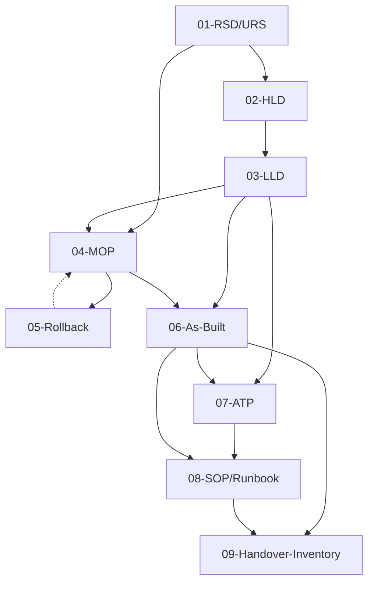

# ItInfra — Template Documentali OKF v0.2 per Ciclo Lavorativo IT

[](https://github.com/matrixNeo76/KnowledgeVault/blob/main/docs/OKF_v0.2_SPECIFICATION.md)
[](./LICENSE)
[](https://github.com/matrixNeo76/KnowledgeVault)
[]()

> **Repository di template documentali per infrastrutture IT complesse — dalla fase di Assessment al Go-Live, conformi allo standard OKF v0.2 (Open Knowledge Format).**
>
> Progettato per essere compilato da agenti AI (Claude, GPT, Gemini, Cursor, Copilot) tramite chat agentiche, e salvato in un knowledge vault dove i documenti vengono relazionati tra loro tramite `entities` e `relations` ontologiche.

---

## 🎯 A chi è rivolto

- **Integratori / System Engineer IT** che producono documentazione tecnica per progetti di infrastruttura
- **Team Operations** che devono gestire la documentazione post-rilascio
- **Agenti AI** che compilano template a partire da dati forniti in chat
- **Knowledge Engineers** che mantengono un knowledge vault ontologico

---

## 📦 Struttura del repository

```
ItInfra/
├── README.md                          ← Questo file (orientamento GitHub)
├── ROADMAP.md                         ← Roadmap strategica del repository (OKF v0.2)
├── AGENTS.md                          ← Istruzioni per agenti AI (Cursor, Aider, Cline, Roo Code)
├── CLAUDE.md                          ← Istruzioni auto-caricate da Claude Code (CLI Anthropic)
├── INTEGRAZIONE-REPO.md               ← Guida master in formato OKF v0.2: come integrare tutto nel Knowledge Vault
├── LICENSE                            ← MIT License
├── .gitignore
│
├── docs/                              ← Documentazione architetturale interna (OKF v0.2)
│   ├── 01-SPEC-ITINFRA-ASSISTANT.md   ← Specifica tecnica suite agentica e CLI
│   └── 02-ROADMAP-PIANO-SVILUPPO.md   ← Piano di sviluppo esecutivo e milestone
│
├── projects/                          ← Registro progetti e manifest globali
│   ├── _schema/                       ← Schema JSON formale del manifest
│   ├── _template/                     ← Template di project-manifest.yaml
│   └── demo-acme/                     ← Progetto demo collaudato (Acme Corporation)
│
├── scripts/                           ← Toolchain CLI e automazione
│   └── itinfra.py                     ← CLI: init progetti, linter OKF v0.2, status avanzamento
│
├── skills/                            ← Skill agentiche per compilazione guidata
│   └── itinfra-assistant/SKILL.md     ← Procedura guidata a turni (intervista a blocchi)
│
├── templates/                         ← 10 template documentali OKF v0.2 + 3 file orientamento
│   ├── 00-INDEX.md                    ← Indice navigazionale con link graph Mermaid
│   ├── 01-RSD-URS.md                  ← Fase 1 — Requirements Specification
│   ├── 02-HLD.md                      ← Fase 2 — High-Level Design
│   ├── 03-LLD.md                      ← Fase 2 — Low-Level Design (IP, VLAN, rack, ACL)
│   ├── 04-MOP.md                      ← Fase 3 — Method of Procedure
│   ├── 05-Rollback.md                 ← Fase 3 — Rollback / Fallback Plan
│   ├── 06-As-Built.md                 ← Fase 5-7 — As-Built Documentation
│   ├── 07-ATP.md                      ← Fase 6 — Acceptance Test Plan
│   ├── 08-SOP-Runbook.md              ← Fase 7 — Standard Operating Procedures
│   ├── 09-Handover-Inventory.md       ← Fase 7 — Handover & Asset Inventory
│   └── README.md                      ← Documentazione umana dei template
│
├── examples/                          ← 11 prompt di esempio per agenti AI
│   ├── README.md                      ← Indice esempi + workflow d'uso
│   ├── 00-prompt-master-template.md   ← Struttura generica di un prompt efficace
│   ├── 01-prompt-RSD-URS.md           ← 9 prompt completi e personalizzabili
│   ├── 02-prompt-HLD.md               ← Scenario coerente: Acme S.p.A. Milano
│   ├── 03-prompt-LLD.md
│   ├── 04-prompt-MOP.md
│   ├── 05-prompt-Rollback.md
│   ├── 06-prompt-As-Built.md
│   ├── 07-prompt-ATP.md
│   ├── 08-prompt-SOP-Runbook.md
│   └── 09-prompt-Handover-Inventory.md
│
└── integration/                       ← Estensioni per Knowledge Vault (https://github.com/matrixNeo76/KnowledgeVault)
    ├── level-2/                       ← Estensione parser OKF per 9 tipi documentali IT
    │   ├── README.md
    │   ├── 01-PATCH-okfParser.md      ← Modifica a src/lib/okfParser.ts
    │   ├── 02-PATCH-types.md          ← Modifica a src/types.ts
    │   ├── 03-NEW-okfItTemplates.ts  ← Nuovo file src/lib/okfItTemplates.ts
    │   ├── 04-PR-DESCRIPTION.md       ← PR description pronta per GitHub
    │   └── 05-MIGRATION-GUIDE.md      ← Guida migrazione 7-step
    │
    └── level-3/                       ← Modulo UI completo + API AI compiler
        ├── README.md
        ├── 01-NEW-ITProjectMetadataCard.tsx       ← Scheda metadata IT nel reader
        ├── 02-NEW-ITWorkflowTimeline.tsx          ← Timeline visuale 7 fasi
        ├── 03-NEW-ITInfrastructureSidebar.tsx      ← Drawer laterale con stats
        ├── 04-NEW-ITTemplateCompilerModal.tsx     ← Modale compilazione AI
        ├── 05-PATCH-KnowledgeReader.tsx.md         ← Patch: aggiungi tab "Ciclo IT"
        ├── 06-PATCH-Sidebar.tsx.md                 ← Patch: aggiungi voce "Ciclo IT"
        ├── 07-PATCH-CaptureBar.tsx.md              ← Patch: aggiungi pulsante "Template IT"
        ├── 08-PATCH-captureRoutes.ts.md            ← Patch: 2 nuovi endpoint API
        ├── 09-NEW-itInfrastructureService.ts        ← Servizio backend Gemini
        ├── 10-PR-DESCRIPTION.md                    ← PR description
        └── 11-MIGRATION-GUIDE.md                   ← Guida migrazione 11-step
```

---

## 🚀 Quick Start

### 1. Gestione Progetti e Validazione con la CLI ITInfra (Consigliato)

Il repository include la CLI standalone `scripts/itinfra.py` per automatizzare il ciclo documentale:

```bash
# Mostra tutti i template e le 7 fasi:
python scripts/itinfra.py list-templates

# Inizializza un nuovo progetto con manifesto condiviso:
python scripts/itinfra.py init acme-dc --client "Acme S.p.A." --name "Modernizzazione Data Center"

# Verifica lo stato di avanzamento dei 9 documenti:
python scripts/itinfra.py status acme-dc

# Valida formalmente la conformità OKF v0.2 di un file o dell'intero progetto:
python scripts/itinfra.py validate projects/acme-dc/01-RSD-URS.md
```

### 2. Compilazione Interattiva con Agenti AI

- **Google Antigravity**: Dispone della skill nativa `.agents/skills/itinfra-assistant/` che avvia un'**intervista guidata per blocchi logici** (Scope & SLA → Rete & IP → Compute & Storage → Sicurezza → Collaudo) prima di compilare e validare il documento.
- **Claude Code / Cursor / Cline**: Leggono automaticamente `CLAUDE.md` o `AGENTS.md` e possono eseguire i comandi `scripts/itinfra.py` dal terminale integrato.

### 3. Integrare nel Knowledge Vault (Livello 2 + 3)

Per integrare il modulo completo nel tuo Knowledge Vault:

```bash
git clone https://github.com/matrixNeo76/ItInfra.git
git clone https://github.com/matrixNeo76/KnowledgeVault.git

cd KnowledgeVault
# Segui la guida master:
cat ../ItInfra/INTEGRAZIONE-REPO.md
```

La guida `INTEGRAZIONE-REPO.md` (in formato OKF v0.2 nativo) ti porta passo-passo attraverso i 3 livelli di integrazione.

---

## 🗺️ Le 7 fasi del ciclo lavorativo IT

| Fase | Denominazione | Documenti | Template |
|------|---------------|-----------|----------|
| 1. Analisi | Assessment & Site Survey | RSD/URS | `01-RSD-URS.md` |
| 2. Progettazione | Architectural Design | HLD, LLD | `02-HLD.md`, `03-LLD.md` |
| 3. Approvvigionamento | Procurement & Staging | MOP, Rollback | `04-MOP.md`, `05-Rollback.md` |
| 4. Posa e Montaggio | Racking & Cabling | (confluisce in As-Built) | `06-As-Built.md` |
| 5. Configurazione | Commissioning & Implementation | (confluisce in As-Built) | `06-As-Built.md` |
| 6. Collaudo | Testing & Validation | ATP | `07-ATP.md` |
| 7. Rilascio | Go-Live / Handover | As-Built, SOP/Runbook, Handover | `06-As-Built.md`, `08-SOP-Runbook.md`, `09-Handover-Inventory.md` |

---

## 🔗 Schema OKF v0.2

Tutti i template usano lo standard **OKF v0.2 (Open Knowledge Format)** nativo del [Knowledge Vault](https://github.com/matrixNeo76/KnowledgeVault). Il frontmatter YAML è composto da:

- **Campi canonici** (riconosciuti dal parser): `okf_version`, `id`, `title`, `type` (6 tipi canonici), `domain`, `tags`, `entities`, `relations`
- **Metadati estesi IT** (preservati in `rawFrontmatter`): `project_id`, `phase`, `related_docs`, `depends_on`, `status`, `version`, `author`, ecc.

### Mappatura 9 tipi IT → 6 tipi canonici OKF

| Tipo IT | Tipo canonico OKF |
|---------|-------------------|
| RSD/URS, ATP, Handover & Inventory | `specification` |
| HLD, LLD, As-Built | `architecture` |
| MOP, Rollback, SOP/Runbook | `guide` |

Vedi [`templates/00-INDEX.md`](./templates/00-INDEX.md) per dettagli completi.

---

## 🤖 Agenti AI supportati

I file `AGENTS.md` e `CLAUDE.md` vengono letti automaticamente da:

| Agente | File letto / Modalità |
|--------|----------------------|
| **Google Antigravity** | `.agents/skills/itinfra-assistant/` (Skill nativa per intervista guidata a turni) |
| **Claude Code** (Anthropic CLI) | `CLAUDE.md` + comandi terminale `scripts/itinfra.py` |
| **Cursor** | `AGENTS.md` |
| **Aider** | `AGENTS.md` |
| **Continue** | `AGENTS.md` |
| **Cline / Roo Code** | `AGENTS.md` |
| **Altri agenti** | Manualmente via prompt: "Prima di iniziare, leggi `AGENTS.md`" |

---

## 📊 Link Graph dei documenti



---

## 🛣️ Roadmap

> Per la visione strategica dettagliata e la pianificazione delle prossime release (v0.3, v0.4, v1.0), consulta il documento ufficiale [`ROADMAP.md`](./ROADMAP.md).

### ✅ Completato (v0.2)
- [x] **Livello 1**: 10 template OKF v0.2 nativi per le 7 fasi IT
- [x] **Livello 2**: Estensione parser Knowledge Vault con 9 alias IT + 9 boilerplate
- [x] **Livello 3**: Modulo UI completo + API AI compiler (Gemini) per Knowledge Vault
- [x] **Automation CLI (`scripts/itinfra.py`)**: Linter OKF v0.2, init progetti, status avanzamento
- [x] **Project Registry (`projects/`)**: Manifesto globale condiviso per parametri di rete e SLA
- [x] **Antigravity Custom Skill**: Procedura a turni per intervista guidata per blocchi logici

### 🔮 Prossimi Traguardi (v0.3+)
- [ ] Checklist e requisiti di conformità integrati (NIS2, ISO 27001, DORA)
- [ ] Generazione automatica di diagrammi topologici Spine-Leaf e rack layout in Mermaid
- [ ] Export tabelle VLAN e IP per import bulk in NetBox / IPAM
- [ ] GitHub Actions per validazione automatica PR
- [ ] Wrapper MCP per integrazione con Claude Desktop

---

## 🤝 Contribuire

Le contribuzioni sono benvenute! Apri una issue o una PR se:

- Trovi un bug in un template
- Vuoi aggiungere un nuovo tipo documentale IT
- Hai migliorato le AI-INSTRUCTIONS
- Vuoi tradurre i template in inglese o altre lingue
- Hai casi d'uso reali da condividere come esempi

### Standard per le PR

1. Mantieni lo schema OKF v0.2 nativo nel frontmatter
2. Aggiorna la checklist di validazione in fondo a ogni template
3. Verifica la coerenza `relations` vs `related_docs`
4. Testa con il linter: `python scripts/itinfra.py validate templates/`

---

## 📚 Risorse correlate

- **Knowledge Vault** (repo principale): https://github.com/matrixNeo76/KnowledgeVault
- **Specifica OKF v0.2**: https://github.com/matrixNeo76/KnowledgeVault/blob/main/docs/OKF_v0.2_SPECIFICATION.md
- **Architettura del Vault**: https://github.com/matrixNeo76/KnowledgeVault/blob/main/docs/SYSTEM_ARCHITECTURE_OKF.md
- **Pipeline di ingestione**: https://github.com/matrixNeo76/KnowledgeVault/blob/main/docs/INGESTION_PIPELINE_SPEC.md

---

## 📄 Licenza

Distribuito sotto licenza MIT. Vedi [`LICENSE`](./LICENSE) per dettagli.

---

## 🙋 Supporto

- Apri una [issue](https://github.com/matrixNeo76/ItInfra/issues) per bug o richieste
- Consulta [`INTEGRAZIONE-REPO.md`](./INTEGRAZIONE-REPO.md) per la guida master
- Leggi [`AGENTS.md`](./AGENTS.md) prima di far compilare un template a un agente AI
