# Roadmap Strategica di Sviluppo: ItInfra Repository

<!-- AI-INSTRUCTIONS:
  Questo documento fissa la visione strategica, i traguardi raggiunti e le priorità di evoluzione
  del repository ItInfra per trasformarlo nello standard di riferimento per la documentazione
  e l'automazione di infrastrutture IT complesse tramite AI.
-->

## 🎯 Visione

Passare da una collezione di template documentali Markdown statici a una **suite agentica end-to-end** in grado di:
1. **Guidare l'operatore** con interviste strutturate per blocchi tematici (senza prompt monolitici).
2. **Garantire la conformità formale e di sicurezza** mediante validazione automatica locale (OKF v0.2).
3. **Mantenere uno stato globale coerente** per ogni progetto (evitando ridondanze di IP, VLAN, ASN, SLA).
4. **Interfacciarsi con i moderni strumenti di Operations** (NetBox, IPAM, CI/CD, Knowledge Vault).

---

## 🗺️ Panoramica delle Release

```mermaid
timeline
    title Tabella di Marcia Evolutiva ItInfra
    section v0.2 (Rilasciato)
        Template OKF v0.2 Nativo : 9 Documenti + 1 Indice
        Knowledge Vault Patches   : Livelli 2 & 3
        Automation Suite CLI      : scripts/itinfra.py
        Antigravity Native Skill  : Step-by-Step Wizard
        Project Manifest Schema   : projects/
    section v0.3 (Rilasciato)
        Compliance Frameworks     : NIS2, ISO 27001, DORA
        Generatore Visuale       : Mermaid Rack & Topologie
        IPAM / NetBox Export      : Esportazione CSV & JSON
        Progetto Pilota 100%      : Severino Srl (7 Fasi)
        Report HTML Offline       : Dashboard Interattiva
    section v0.4 (Rilasciato)
        Local Encrypted Vault     : AES-256-GCM + File Lock
        Multi-Agent Worktree      : 4 Ruoli Paralleli
        Anti-Hallucination Engine : Strict Grounding & Audit
        Multi-Framework Skills    : .agents/skills/ Universali
        Configuration Playbooks   : RouterOS .rsc & PowerShell
    section v0.5 (Rilasciato)
        Incident & RCA Template   : 10-RCA-Troubleshooting.md
        Agent & Skill Troubleshooter: Diagnosi Deterministica OSI
        CLI Diagnostic Assistant  : itinfra.py troubleshoot
        Knowledge Graph Linking   : Relazioni Incidente-Topologia
    section v0.6 (Rilasciato)
        Hybrid Memory L1-L3       : _scratchpad.md & itinfra_memory.py
        Trust Signals & Staleness : verified, last_vetted, stale_after
        CLI Memory Suite          : itinfra.py memory [init|log|consolidate]
        D3.js Badges & Linter     : OKFValidator & Graph Badges
    section v0.7 (Rilasciato)
        Global Enterprise Graph   : itinfra.py export-graph all
        Entity Bridges (Hardware) : Nodi Ponte Cross-Progetto
        CLI Inventory Search      : itinfra.py inventory find/list
        Cross-Client RCA Insights : Prevenzione Disservizi Multi-Tenant
    section v0.8 (Rilasciato)
        Global Staging Memory     : _global_scratchpad.md & memory --global
        Secret Leak Prevention    : Sanitizer Preventivo Multi-Tenant
        End-to-End Test Suite     : itinfra.py test-suite (10 Moduli)
        Unified System Dashboard  : projects/system-test-report.html (Zero-CDN)
    section v0.9 (Q1 2027)
        Model Context Protocol    : Server MCP per Claude Desktop & IDE
        Advanced Topology Engine  : Diagrammi Spine-Leaf e Cablaggi
        CI/CD GitHub Actions      : Quality Gates & PR Validation
        Direct IPAM REST API      : NetBox & Nautobot Importer
    section v1.0 (Q2 2027)
        Sincronizzazione Live     : NetBox / Nautobot Sync
        Knowledge Graph 3D        : Viewer interattivo per topologie
        Lifecycle Automation      : Monitoraggio scadenze contratti
```

---

## 📌 Dettaglio delle Fasi di Sviluppo

### ✅ Release v0.2 — Fondamenta e Suite Agentica (Completato)
- [x] **10 Template OKF v0.2 nativi:** 9 tipologie documentali per le 7 fasi del ciclo lavorativo IT + indice navigazionale (`templates/`).
- [x] **CLI di automazione & linter (`scripts/itinfra.py`):**
  - Validatore formale OKF v0.2 (campi canonici, coerenza `related_docs` vs `relations`, blocco password in chiaro).
  - Gestione progetti: comandi `init`, `status`, `validate`, `list-templates`.
- [x] **Registro Progetti Condiviso (`projects/`):**
  - Schema JSON formale (`projects/_schema/project-manifest.schema.json`).
  - Template manifesto di configurazione globale (`project-manifest.yaml`).
- [x] **Antigravity Custom Skill (`skills/itinfra-assistant/SKILL.md`):**
  - Motore di intervista guidata a blocchi logici (Requisiti, Rete, Compute/Storage, Sicurezza, Collaudo).
- [x] **Istruzioni operative allineate:** Aggiornati `AGENTS.md`, `CLAUDE.md`, `README.md`.

---

### ✅ Release v0.3 — Compliance, Visualizzazioni, IPAM Export, CI/CD & Pilota 100% (Completato)
- [x] **Integrazione Framework di Compliance:**
  - Estensione di `01-RSD-URS.md` e `02-HLD.md` con checklist specifiche per **NIS2** (gestione rischi e early warning), **ISO 27001:2022** (domini A.5-A.8) e **DORA** (resilienza digitale e test TLPT).
- [x] **Generatore Automatico Topologie Mermaid:**
  - Comando CLI `python scripts/itinfra.py generate-diagram <file> --type [topology|rack|all]` per estrarre la tabella delle connessioni inter-switch e generare diagramma topologico Spine-Leaf e rack elevation.
- [x] **Esportazione Matrici IPAM verso NetBox / CSV / JSON:**
  - Comando CLI `python scripts/itinfra.py export-ipam <file> --format [csv|json] --out <dir>` per estrarre VLAN, Subnet e IP host per l'import bulk.
- [x] **GitHub Actions per Validazione Continua:**
  - Workflow `.github/workflows/validate.yml` con validazione continua ad ogni push e PR.
- [x] **Progetto Reale Pilota Severino Srl (100% delle 7 Fasi):**
  - Redazione, collaudo e validazione formale di tutti i 9 documenti tecnici (`01-RSD` fino a `09-Handover`).
- [x] **Generatore di Report HTML Consolidato Interattivo:**
  - Comando CLI `python scripts/itinfra.py export-html <slug>` con dashboard moderna, KPI, rendering vettoriale Mermaid.js e tab navigabili offline.

---

### ✅ Release v0.4 — Security Vault, Multi-Agent Git Worktree & Anti-Hallucination (Completato)
- [x] **Local Encrypted Secret Vault (AES-256-GCM) Concurrency-Safe:**
  - Modulo crittografico standalone `scripts/itinfra_vault.py` con derivazione PBKDF2-HMAC-SHA256 (100.000 iterazioni).
  - Storage centralizzato `projects/<slug>/.vault.enc` protetto da **File Locking atomico** (`.vault.lock`) per accessi paralleli concorrenti senza race condition.
  - Comandi CLI completi: `python scripts/itinfra.py vault [init|set|get|list|audit] <slug>`.
  - Protezione totale dei secret esclusi da Git via `.gitignore`.
- [x] **Orchestrazione Multi-Agente Parallela con Git Worktree:**
  - Comando CLI `scripts/itinfra.py worktree [add|list|sync|cleanup]` per consentire a più subagenti AI di lavorare simultaneamente su branch isolati in `.worktrees/<ruolo>/`:
    - `infra-architect`: branch `feat/architecture` (HLD, LLD, topologie Mermaid).
    - `infra-security`: branch `feat/security-vault` (Vault AES-256, compliance NIS2/ISO 27001).
    - `infra-automation`: branch `feat/ops-mop` (MOP, script RouterOS, PowerShell e Runbook).
    - `infra-qa`: branch `feat/testing-atp` (Casi di test ATP, Handover, audit consistenza).
- [x] **Anti-Hallucination & Cross-Document Consistency Engine (Strict Grounding):**
  - Linter semantico `python scripts/itinfra.py audit-consistency <slug>`:
    - Verifica che tutti gli IP appartengano alle supernet dichiarate nel manifesto di progetto.
    - Controllo incrociato delle entità critiche (Domain Controller, Switch Core, Gateway) su tutti i 9 documenti.
    - Divieto assoluto di inventare parametri tecnici; obbligo tassativo di utilizzare il placeholder standard `<DA-RICHIEDERE>`.
- [x] **Standardizzazione Skills Universali Multi-Framework (.agents/skills/):**
  - Standardizzate `.agents/skills/itinfra-assistant/SKILL.md` e `.agents/skills/itinfra-vault/SKILL.md` per Google Antigravity, Claude Code, Cursor, Cline, Roo Code e Aider.
  - Regole vincolanti allineate in `AGENTS.md` e `CLAUDE.md`.
- [x] **Generatore di Configuration Playbooks Eseguibili:**
  - Comando CLI `python scripts/itinfra.py export-configs <slug>` per estrarre script pronti all'uso: `sw-core-01.rsc` (RouterOS) e `setup_ad_hyperv.ps1` (PowerShell).

---

### ✅ Release v0.5 — Client Incident Management, Deterministic Troubleshooting & AI RCA (Completato)
- [x] **Template OKF v0.2 `10-RCA-Troubleshooting.md` (Root Cause Analysis & Incident Resolution):**
  - Struttura formalizzata post-incidente per tracciare disservizi cliente:
    - Sintomatologia riscontrata e impatto sul business (SLA breach, utenti impattati, calcolo RTO/RPO).
    - Cronistoria degli eventi e timeline dell'incidente (Mermaid.js).
    - Albero diagnostico deterministico a strati (Layer OSI L1-L7).
    - Causa radice accertata (Root Cause Analysis con tecnica dei 5 Perché).
    - Azione correttiva immediata applicata (Workaround provvisorio).
    - Soluzione strutturale e definitiva (PowerShell e RouterOS, test e non-regressione TR-01..TR-04).
    - Piano di prevenzione e azioni correttive (CAPA a lungo termine).
    - Relazioni ontologiche OKF (`relations`) collegate all'LLD, all'As-Built e al Runbook del cliente.
- [x] **Subagent Specializzato e Skill Standardizzata `itinfra-troubleshooter`:**
  - Standardizzata in `.agents/skills/itinfra-troubleshooter/SKILL.md` (e `skills/itinfra-troubleshooter/`).
  - Metodologia rigorosamente deterministica a 7 strati (Bottom-Up L1-L7) con Strict Grounding.
- [x] **Suite CLI per Incidenti, Telemetria Live & Mappa D3.js Graph:**
  - `python scripts/itinfra.py troubleshoot [init|list] <slug> <ticket_id>`: inizializza ed elenca i ticket collegati al manifesto e all'As-Built.
  - `python scripts/itinfra.py health-check <slug> [--timeout 1.0]`: sonda live non distruttiva (ICMP ping, probe TCP su porte critiche 53/80/443/445/3389/8291).
  - `python scripts/itinfra.py export-graph <slug|templates>`: genera la mappa interattiva D3.js Knowledge Graph con nodi tipizzati e relazioni orientate.
  - Aggiornamento stato documentale in `itinfra.py status <slug>` con riepilogo ticket RCA post-go-live.
  - Integrazione completa in `itinfra.py export-html <slug>` con tab interattiva dedicata "Incident & RCA" e pulsante diretto al Knowledge Graph.
- [x] **Caso Pilota Reale Severino Srl Risolto al 100%:**
  - Redatto e validato `projects/severino-srl/10-RCA-FS01-SMB-Connectivity.md` (risoluzione timeout SMB su ZeroTier via TCP MSS Clamping e MTU 1400).
  - Validazione formale OKF v0.2 superata con 0 errori e audit di coerenza semantica superato al 100%.

---

### ✅ Release v0.6 — Sistema di Memoria Locale Ibrida a 3 Livelli & Trust Signals (Completato)
- [x] **Sistema di Memoria Locale Ibrida a Tre Livelli (100% File-Based & Git-Native):**
  - **Livello 1: Memoria a Breve Termine (Working Memory):** Contesto volatile della sessione conversazionale per il parsing immediato.
  - **Livello 2: Memoria a Medio Termine (Staging / Scratchpad):**
    - File semi-strutturato `projects/<slug>/_scratchpad.md` con sezioni standard (*Decisioni Tecniche Confermate*, *Requisiti in Sospeso <DA-RICHIEDERE>*, *Note Operative & Contatti*, *Cronologia Consolidamenti*).
    - Supporto isolamento concorrente multi-agente per Git Worktrees (`.memory/scratchpad.<ruolo>.md`).
    - Hashing SHA-256 e deduplicazione automatica di ogni voce (`<!-- id:mem-xxxxxxxx -->`).
  - **Livello 3: Memoria a Lungo Termine (Ground Truth OKF v0.2):** I 10 documenti ufficiali di progetto (`01-RSD` .. `10-RCA`) convalidati con linter.
- [x] **Iniezione dei Trust Signals (Metadati di Affidabilità nel Frontmatter OKF v0.2):**
  - `verified`: booleano per attestare la convalida umana formale.
  - `verified_by`: revisore / lead architect che ha validato l'informazione.
  - `last_vetted`: data ISO dell'ultima revisione confermata.
  - `stale_after`: data ISO di obsolescenza tecnica con emissione di avviso automatico `[STALE-WARNING]`.
  - Estensione di `OKFValidator` e `audit-consistency` per verificare i Trust Signals e segnalare obsolescenze.
- [x] **CLI Memory Suite (`scripts/itinfra.py memory`):**
  - `python scripts/itinfra.py memory init <slug>`: inizializzazione staging scratchpad.
  - `python scripts/itinfra.py memory log <slug> --section <sec> --text "..." [--role <ruolo>]`: logging atomico con timestamp.
  - `python scripts/itinfra.py memory show <slug>`: visualizzazione sezioni, conteggi e note pendenti.
  - `python scripts/itinfra.py memory merge <slug>`: riconciliazione non distruttiva degli scratchpad worktree.
  - `python scripts/itinfra.py memory consolidate <slug> --target <doc> --reviewer "<nome>" [--stale-days 90]`: passaggio guidato in L3 con Trust Signals.
  - `python scripts/itinfra.py memory prune <slug>`: archiviazione pulita in `_scratchpad.archive.md`.
- [x] **Knowledge Graph D3.js con Trust Badges:**
  - Nodi con `verified: true` contraddistinti da bordo verde brillante `✓`.
  - Nodi con certificazione scaduta (`is_stale`) contraddistinti da bordo tratteggiato rosso `⚠`.
  - Sidebar informativa arricchita con badge di confidenza e validità.
- [x] **Template & Documentazione Operativa:**
  - Template `templates/99-Scratchpad-Template.md` convalidato OKF v0.2.
  - Guida `docs/08-GUIDA-MEMORIA-IBRIDA-TRUST-SIGNALS.md` convalidata OKF v0.2.
  - Skill `.agents/skills/itinfra-assistant/SKILL.md` e `skills/itinfra-assistant/` allineate con Step 0 e istruzioni di memoria.

---

### ✅ Release v0.7 — Global Enterprise Asset & Entity Knowledge Graph (Completato)
- [x] **Cross-Project Global Graph Engine (`itinfra.py export-graph all` / `--global`):**
  - Generazione di una mappa unificata ad alta densità che aggrega tutti i progetti censiti nella directory `projects/`.
  - Clusterizzazione visiva e colorazione differenziata per cliente/tenant, preservando il perimetro progettuale di ciascun sito.
- [x] **Hub Ontologici delle Entità Condivise (Shared Entity Bridges):**
  - Proiezione dinamica nel grafo delle `entities` condivise (modelli server Dell/HP, switch MikroTik/Cisco, firewall Fortinet, hypervisor Hyper-V/Proxmox, subnet SDN).
  - Collegamento bidirezionale automatico: due documenti di clienti diversi che citano lo stesso hardware (es. *Dell PowerEdge R630*) si collegano al medesimo nodo centrale entità.
  - Toggle interattivo in D3.js per accendere/spegnere la vista ad entità ponte inter-cliente.
- [x] **CLI Global Inventory & Asset Search (`scripts/itinfra.py inventory`):**
  - `python scripts/itinfra.py inventory find "<modello/termine>"`: ricerca istantanea cross-progetto (es. interroga tutti i server Dell R630 o switch CRS326 e restituisce clienti, documenti As-Built e ruoli).
  - `python scripts/itinfra.py inventory list-hardware [--vendor <vendor>]`: catalogo normalizzato di tutto l'hardware installato nei vari data center/filiali.
  - `python scripts/itinfra.py inventory summary`: dashboard riassuntiva del parco tecnologico, sistemi operativi e apparati attivi.
- [x] **Cross-Client Incident Intelligence & Prevenzione RCA Proattiva:**
  - Correlazione automatica tra ticket di incidente (`10-RCA`) di un cliente e apparati identici in uso presso altri clienti.
  - Generazione di alert preventivi ("*Rilevata criticità nota su Dell R630 / Broadcom NIC registrata in Severino Srl; verificare configurazione su Acme SpA*").
- [x] **Zero-Leakage Multi-Tenant Security Policy:**
  - Rigorosa segregazione delle credenziali: i secret `.vault.enc` rimangono ermeticamente isolati e cifrati per singolo tenant; solo i metadati tecnici e ontologici delle entità sono aggregati a livello di intelligence globale.
- [x] **Nuova Guida Operativa & Skill Update:**
  - Redazione della guida `docs/09-GUIDA-GLOBAL-ENTERPRISE-GRAPH.md` conforme a OKF v0.2.

---

### ✅ Release v0.8 — Global Enterprise Staging Memory & Unified Verification Dashboard (Completato)
- [x] **Global Staging Memory Pool (`projects/_global_scratchpad.md`):**
  - Estensione del modulo `scripts/itinfra_memory.py` per supportare lo scope `--global` in `init`, `log`, `show` e `prune`.
  - Persistenza centralizzata delle lezioni apprese, pattern architetturali approvati, limitazioni firmware note e linee guida trasversali non legate a un singolo cliente.
  - Segregazione rigorosa rispetto ai singoli tenant: i dati specifici (IP operativi, credenziali vault, configurazioni riservate) restano nei singoli `projects/<slug>/_scratchpad.md`, mentre la memoria globale raccoglie esclusivamente *Knowledge & Best Practices*.
- [x] **Protezione Preventiva Secret Leaks & Concorrenza Atomica:**
  - Sanitizer preventivo `validate_global_entry_safety` che blocca sul nascere injection di `vault://it/projects/` o secret in chiaro con `PermissionError`.
  - Meccanismo di `AtomicFileLock` cross-platform con timeout di 10s e auto-prune di lock orfani (> 120s).
- [x] **Consultazione Trasparente Multi-Livello per Agenti AI (Step 0):**
  - La skill `itinfra-assistant` interroga contestualmente `memory show --global` e `memory show <slug>` all'avvio di una sessione tecnica.
  - Ereditarietà automatica delle best practice (es. parametri MTU standard, configurazione switch trunk) nei nuovi progetti.
- [x] **Enterprise System Test Suite (`scripts/itinfra.py test-suite`):**
  - Batteria di test automatizzata end-to-end che valida programmaticamente tutti i 10 moduli del framework:
    1. Linter formale OKF v0.2 su tutti i template e progetti
    2. Strict Grounding Audit & coerenza IP/subnet
    3. Local Encrypted Secret Vault (AES-256-GCM + lockfile atomico)
    4. Multi-Agent Git Worktree Isolator
    5. Configuration Playbooks integrity (.rsc e .ps1)
    6. Incident Management & OSI L1-L7 Diagnostic Telemetry
    7. Hybrid Memory L1-L3 & Trust Signals (tenant + global)
    8. Global Asset & Entity Inventory
    9. Cross-Client Incident Intelligence & Alert
    10. D3.js Interactive Knowledge Graph
- [x] **Unified System Test & Verification Dashboard (`projects/system-test-report.html`):**
  - Generazione di un report HTML consolidato offline moderno, reattivo e ad alto impatto visivo (`--report-html`).
  - Scorecard KPI esecutiva (100% Pass Rate, 0 Allucinazioni, 0 Credenziali esposte, Nodi & Entità censite).
  - Accordion di dettaglio con output diagnostico live di ogni singolo modulo collaudato.
  - Funzionamento 100% Zero-CDN per piena operatività in data center air-gapped.

---

---

### ✅ Release v0.9 — Local Workspace, Central Publish Architecture & Diagnostics (Completato)
- [x] **Disaccoppiamento Local Workspace su SSD & Central Hub (`\\fileserv01\dati01\workaure`):**
  - I tecnici LAN lavorano sulla propria cartella locale (`C:\itinfra\`) beneficiando della massima velocità SSD per Antigravity.
  - Eliminazione alla radice di problemi di latenza SMB, lock Git concorrenti e blocchi di file watcher su percorsi UNC.
- [x] **Modulo Central Publisher & Quality Gate (`scripts/itinfra_publish.py`):**
  - Comando CLI `python scripts/itinfra.py publish <slug> [--dest <path>] [--dry-run] [--force]`.
  - **Pre-Publish Quality Gate obbligatorio**: validazione formale OKF v0.2 a 0 errori, audit di coerenza semantica IP/subnet e scansione anti-leak di credenziali in chiaro prima della copia.
  - **Copia Atomica Confinata**: sincronizzazione esclusiva dei file di `projects/<slug>/`, garantendo l'inviolabilità di `scripts/`, `templates/` e dei progetti altrui.
  - Protezione automatica dei progetti in stato `approved` contro sovrascritture accidentali.
- [x] **Sincronizzazione Unidirezionale del Motore Locale (`itinfra.py sync-engine`):**
  - Comando CLI per aggiornare template e script scaricando le ultime release consolidate dal server master centrale.
- [x] **Diagnostica di Rete e Matrice Permessi (`itinfra.py check-share`):**
  - Comando CLI diagnostico con simulazione utente (--user/--password) o sessione Windows per verificare raggiungibilità SMB, lettura core, scrittura su projects/ e protezione da manomissione cartelle core.
- [x] **Setup One-Click per Client Windows 11 & Condivisione Master:**
  - Script `scripts/init_central_share.ps1` per allestire e manutenere la share centrale.
  - Script `scripts/setup_client_workspace.ps1` con installazione automatica di Python via `winget` e librerie minime.
- [x] **Skill Dedicata Antigravity `itinfra-setup`:**
  - Bootstrapper autonomo in 5 fasi in `.agents/skills/itinfra-setup/SKILL.md` e `skills/itinfra-setup/`.
- [x] **Nuove Guide Operative OKF v0.2:**
  - Manuale `docs/11-GUIDA-LOCAL-WORKSPACE-CENTRAL-PUBLISH.md`.
  - Manuale `docs/12-GUIDA-ONBOARDING-TECNICI-ANTIGRAVITY.md`.
- [x] **Enterprise System Test Suite (MOD-11):**
  - Modulo 11/11 collaudato con successo al 100% (Pre-flight, Anti-leak, dry-run e diagnostica check-share).

---

### ✅ Release v0.9.5 — Client Interactive Experience & Automated Distribution Workflow (Completato)
- [x] **Automated Continuous Delivery su Share Master (Git Post-Commit Hook / Auto-Deploy):**
  - Hook `.git/hooks/post-commit` e motore differenziale atomico SHA-256 (`scripts/itinfra_deploy.py`) che aggiorna automaticamente la share centrale `\\fileserv01\dati01\workaure` a ogni commit senza interventi manuali.
- [x] **Client Startup Auto-Sync Hook (Controllo di Versione Trasparente):**
  - Script `scripts/itinfra_sync.py` che all'apertura del workspace o su richiesta rileva discrepanze di hash/timestamp e allinea template, script e guide in locale.
- [x] **Suite di Attività GUI One-Click (`.vscode/tasks.json`):**
  - Task preconfigurati visuali richiamabili con `Ctrl+Shift+B` o dalla Status Bar di Antigravity:
    - `[ITInfra] Diagnostica Share (check-share)`
    - `[ITInfra] Sincronizza Motore e Template da Server (sync-engine)`
    - `[ITInfra] Inizializza Nuovo Progetto Cliente (init)`
    - `[ITInfra] Valida Documento OKF v0.2`
    - `[ITInfra] Audit Coerenza e Zero-Hallucination`
    - `[ITInfra] Pubblica Progetto su Server`
    - `[ITInfra] Esegui Enterprise System Test Suite`
    - `[ITInfra] Genera e Apri Knowledge Graph D3.js`
- [x] **Cruscotto Interattivo Generative UI (Card Cliccabili in Chat):**
  - Modulo `scripts/itinfra_ui.py` con rendering di card HTML/CSS per Welcome Action Card e Pre-Flight Quality Gate Card.
- [x] **Specifica Tecnica e Modulo di Test MOD-12:**
  - Documento formale `docs/13-SPECIFICA-CLIENT-INTERACTIVE-AUTO-DISTRIBUTION.md` (conforme OKF v0.2).
  - Estensione dell'Enterprise Test Suite al Modulo 12 con 100% Pass Rate.

---

### ✅ Release v0.9.6 — Zero-Friction Client Architecture (Completato)
- [x] **Launcher 1-Clic sul Desktop Tecnico (`ITInfra - Aggiorna e Avvia.cmd`):**
  - Icona generata sul Desktop utente (`$env:USERPROFILE\Desktop`) da `setup_client_workspace.ps1`.
  - Probe TCP non-bloccante sulla porta 445 (timeout 1.5s): sincronizza se online, avvia subito in modalità offline senza ritardi.
- [x] **CLI Breve a 1 Parola (`it.cmd` e `update.cmd`):**
  - Registrazione automatica della cartella workspace nel `PATH` utente di Windows.
  - Comandi diretti: `it start`, `it update`, `it check`, `it publish <slug>`, o semplicemente `update`.
- [x] **Trigger a 1 Parola per Chat Antigravity:**
  - Aggiornamento della skill `itinfra-assistant` per interpretare comandi rapidi (*"aggiorna"*, *"controlla"*, *"pubblica <slug>"*) e notificare proattivamente la disponibilità di nuovi template.

---

### ✅ Release v0.9.7 — Deterministic Zero-Search Fast-Path & Context Awareness (Completato)
- [x] **Zero-Search Fast-Path in `AGENTS.md` e `CLAUDE.md`:**
  - Sezione 0 con divieto categorico di scansione file (`find_by_name`, `grep_search`, `list_dir`) per richieste di orientamento, comandi o saluti.
  - Risposta istantanea a tempo zero (0s) con Cruscotto Operativo formattato.
- [x] **Zero-Hesitation Action:**
  - Esecuzione immediata dei comandi a 1 parola (`aggiorna`, `controlla`, `pubblica <slug>`, `stato <slug>`) senza richieste preventive di conferma.
- [x] **Espansione Scope Skill `itinfra-assistant`:**
  - Frontmatter `description` universale per catturare assistenza, orientamento e comandi rapidi su qualsiasi editor (Antigravity, Cursor, Claude Code).

---

### 🔮 Release v0.10 — Advanced Topology Engine, MCP Server & Automated CI/CD (Pianificato Q1 2027)
- [ ] **Server MCP Nativo (Model Context Protocol):**
  - Implementazione del server standalone `scripts/itinfra_mcp.py` basato sullo standard open-source MCP.
  - Esposizione di strumenti nativi (init, status, validate, audit-consistency, memory, inventory, troubleshoot, test-suite) per Claude Desktop, Cursor MCP, Windsurf e agenti LLM esterni.
- [ ] **Advanced Topology & Cabling Generator:**
  - Generazione automatica di schemi topologici Spine-Leaf ad alta definizione con raggruppamento per rack/ruolo e mappatura colori per VLAN.
  - Generazione di diagrammi di cablaggio e patch-panel (SFP28, QSFP28, Cat.6A) direttamente dal documento LLD.
- [ ] **Automated CI/CD Quality Gates (GitHub Actions):**
  - Workflow `.github/workflows/quality-gate.yml` per la validazione automatica di tutte le Pull Request.
  - Esecuzione obbligatoria del linter OKF v0.2, dell'audit di coerenza semantica incrociata e della suite di test unificata con blocco merge in caso di warning o secret leaks.
- [ ] **Direct IPAM REST API Integration:**
  - Connettore client REST per sincronizzazione diretta e provisioning di subnet, pool IP e VLAN verso le API di NetBox e Nautobot.

---

### 🌐 Release v1.0 — Enterprise Ecosystem & Sincronizzazione Live (Pianificato Q2 2027)
- [ ] **Sincronizzazione Bidirezionale NetBox / Nautobot:**
  - Connettore API per popolare automaticamente il `project-manifest.yaml` e l'As-Built a partire dai dati live dell'infrastruttura.
- [ ] **Knowledge Graph 3D per Infrastrutture:**
  - Integrazione col visualizzatore D3/Three.js del Knowledge Vault per navigare graficamente rack, switch, server e relative relazioni contrattuali.
- [ ] **Gestione Ciclo di Vita Contrattuale (Handover):**
  - Generazione di alert calendario (ICS / Webhook) per le date di rinnovo garanzie hardware e licenze software documentate in `09-Handover-Inventory.md`.

---

## 🛠️ Linee Guida per i Collaboratori

Tutti i contributi al repository devono rispettare i seguenti principi:
1. **Nessuna regressione sullo standard OKF v0.2:** Ogni modifica ai template o alla documentazione deve superare `python scripts/itinfra.py validate`.
2. **Idempotenza e sicurezza:** Nessun dato sensibile o credenziale deve essere inserito nei template o negli esempi; utilizzare sempre il vault cifrato.
3. **Approccio guidato e Zero-Hallucination:** L'AI non deve mai inventare requisiti, IP, seriali o configurazioni; in assenza di dati certi, utilizzare `<DA-RICHIEDERE>` e segnalare la voce tra le Open Issues.
