# Roadmap Strategica di Sviluppo: ItInfra Repository

<!-- AI-INSTRUCTIONS:
  Questo documento fissa la visione strategica, i traguardi raggiunti e le priorità di evoluzione
  del repository ItInfra per trasformarlo nello standard di riferimento per la documentazione
  e l'automazione di infrastrutture IT complesse tramite AI.
-->

## 🎯 Visione

Passare da una collezione di template documentali Markdown statici a una **suite agentica end-to-end** in grado di:
1. **Guidare l'operatore** con interviste strutturate per blocchi tematici (senza prompt monolitici).
2. **Garantire la conformità formale e di sicurezza** mediante validazione automatica locale (OKF v0.2).
3. **Mantenere uno stato globale coerente** per ogni progetto (evitando ridondanze di IP, VLAN, ASN, SLA).
4. **Interfacciarsi con i moderni strumenti di Operations** (NetBox, IPAM, CI/CD, Knowledge Vault).

---

## 🗺️ Panoramica delle Release

```mermaid
timeline
    title Tabella di Marcia Evolutiva ItInfra
    section v0.2 (Rilasciato)
        Template OKF v0.2 Nativo : 9 Documenti + 1 Indice
        Knowledge Vault Patches   : Livelli 2 & 3
        Automation Suite CLI      : scripts/itinfra.py
        Antigravity Native Skill  : Step-by-Step Wizard
        Project Manifest Schema   : projects/
    section v0.3 (Rilasciato)
        Compliance Frameworks     : NIS2, ISO 27001, DORA
        Generatore Visuale       : Mermaid Rack & Topologie
        IPAM / NetBox Export      : Esportazione CSV & JSON
        Progetto Pilota 100%      : Severino Srl (7 Fasi)
        Report HTML Offline       : Dashboard Interattiva
    section v0.4 (Rilasciato)
        Local Encrypted Vault     : AES-256-GCM + File Lock
        Multi-Agent Worktree      : 4 Ruoli Paralleli
        Anti-Hallucination Engine : Strict Grounding & Audit
        Multi-Framework Skills    : .agents/skills/ Universali
        Configuration Playbooks   : RouterOS .rsc & PowerShell
    section v0.5 (Q4 2026)
        Incident & RCA Template   : 10-RCA-Troubleshooting.md
        Agent & Skill Troubleshooter: Diagnosi Deterministica OSI
        CLI Diagnostic Assistant  : itinfra.py troubleshoot
        Knowledge Graph Linking   : Relazioni Incidente-Topologia
    section v0.6 (Q1 2027)
        Health-Check & Telemetry  : itinfra.py health-check
        Graph Semantic Search     : Query locale RAG su OKF
        Change Management RFC     : Request For Change formale
    section v1.0 (Q2 2027)
        Sincronizzazione Live     : NetBox / Nautobot Sync
        Knowledge Graph 3D        : Viewer interattivo per topologie
        Lifecycle Automation      : Monitoraggio scadenze contratti
```

---

## 📌 Dettaglio delle Fasi di Sviluppo

### ✅ Release v0.2 — Fondamenta e Suite Agentica (Completato)
- [x] **10 Template OKF v0.2 nativi:** 9 tipologie documentali per le 7 fasi del ciclo lavorativo IT + indice navigazionale (`templates/`).
- [x] **CLI di automazione & linter (`scripts/itinfra.py`):**
  - Validatore formale OKF v0.2 (campi canonici, coerenza `related_docs` vs `relations`, blocco password in chiaro).
  - Gestione progetti: comandi `init`, `status`, `validate`, `list-templates`.
- [x] **Registro Progetti Condiviso (`projects/`):**
  - Schema JSON formale (`projects/_schema/project-manifest.schema.json`).
  - Template manifesto di configurazione globale (`project-manifest.yaml`).
- [x] **Antigravity Custom Skill (`skills/itinfra-assistant/SKILL.md`):**
  - Motore di intervista guidata a blocchi logici (Requisiti, Rete, Compute/Storage, Sicurezza, Collaudo).
- [x] **Istruzioni operative allineate:** Aggiornati `AGENTS.md`, `CLAUDE.md`, `README.md`.

---

### ✅ Release v0.3 — Compliance, Visualizzazioni, IPAM Export, CI/CD & Pilota 100% (Completato)
- [x] **Integrazione Framework di Compliance:**
  - Estensione di `01-RSD-URS.md` e `02-HLD.md` con checklist specifiche per **NIS2** (gestione rischi e early warning), **ISO 27001:2022** (domini A.5-A.8) e **DORA** (resilienza digitale e test TLPT).
- [x] **Generatore Automatico Topologie Mermaid:**
  - Comando CLI `python scripts/itinfra.py generate-diagram <file> --type [topology|rack|all]` per estrarre la tabella delle connessioni inter-switch e generare diagramma topologico Spine-Leaf e rack elevation.
- [x] **Esportazione Matrici IPAM verso NetBox / CSV / JSON:**
  - Comando CLI `python scripts/itinfra.py export-ipam <file> --format [csv|json] --out <dir>` per estrarre VLAN, Subnet e IP host per l'import bulk.
- [x] **GitHub Actions per Validazione Continua:**
  - Workflow `.github/workflows/validate.yml` con validazione continua ad ogni push e PR.
- [x] **Progetto Reale Pilota Severino Srl (100% delle 7 Fasi):**
  - Redazione, collaudo e validazione formale di tutti i 9 documenti tecnici (`01-RSD` fino a `09-Handover`).
- [x] **Generatore di Report HTML Consolidato Interattivo:**
  - Comando CLI `python scripts/itinfra.py export-html <slug>` con dashboard moderna, KPI, rendering vettoriale Mermaid.js e tab navigabili offline.

---

### ✅ Release v0.4 — Security Vault, Multi-Agent Git Worktree & Anti-Hallucination (Completato)
- [x] **Local Encrypted Secret Vault (AES-256-GCM) Concurrency-Safe:**
  - Modulo crittografico standalone `scripts/itinfra_vault.py` con derivazione PBKDF2-HMAC-SHA256 (100.000 iterazioni).
  - Storage centralizzato `projects/<slug>/.vault.enc` protetto da **File Locking atomico** (`.vault.lock`) per accessi paralleli concorrenti senza race condition.
  - Comandi CLI completi: `python scripts/itinfra.py vault [init|set|get|list|audit] <slug>`.
  - Protezione totale dei secret esclusi da Git via `.gitignore`.
- [x] **Orchestrazione Multi-Agente Parallela con Git Worktree:**
  - Comando CLI `scripts/itinfra.py worktree [add|list|sync|cleanup]` per consentire a più subagenti AI di lavorare simultaneamente su branch isolati in `.worktrees/<ruolo>/`:
    - `infra-architect`: branch `feat/architecture` (HLD, LLD, topologie Mermaid).
    - `infra-security`: branch `feat/security-vault` (Vault AES-256, compliance NIS2/ISO 27001).
    - `infra-automation`: branch `feat/ops-mop` (MOP, script RouterOS, PowerShell e Runbook).
    - `infra-qa`: branch `feat/testing-atp` (Casi di test ATP, Handover, audit consistenza).
- [x] **Anti-Hallucination & Cross-Document Consistency Engine (Strict Grounding):**
  - Linter semantico `python scripts/itinfra.py audit-consistency <slug>`:
    - Verifica che tutti gli IP appartengano alle supernet dichiarate nel manifesto di progetto.
    - Controllo incrociato delle entità critiche (Domain Controller, Switch Core, Gateway) su tutti i 9 documenti.
    - Divieto assoluto di inventare parametri tecnici; obbligo tassativo di utilizzare il placeholder standard `<DA-RICHIEDERE>`.
- [x] **Standardizzazione Skills Universali Multi-Framework (.agents/skills/):**
  - Standardizzate `.agents/skills/itinfra-assistant/SKILL.md` e `.agents/skills/itinfra-vault/SKILL.md` per Google Antigravity, Claude Code, Cursor, Cline, Roo Code e Aider.
  - Regole vincolanti allineate in `AGENTS.md` e `CLAUDE.md`.
- [x] **Generatore di Configuration Playbooks Eseguibili:**
  - Comando CLI `python scripts/itinfra.py export-configs <slug>` per estrarre script pronti all'uso: `sw-core-01.rsc` (RouterOS) e `setup_ad_hyperv.ps1` (PowerShell).

---

### ✅ Release v0.5 — Client Incident Management, Deterministic Troubleshooting & AI RCA (Completato)
- [x] **Template OKF v0.2 `10-RCA-Troubleshooting.md` (Root Cause Analysis & Incident Resolution):**
  - Struttura formalizzata post-incidente per tracciare disservizi cliente:
    - Sintomatologia riscontrata e impatto sul business (SLA breach, utenti impattati, calcolo RTO/RPO).
    - Cronistoria degli eventi e timeline dell'incidente (Mermaid.js).
    - Albero diagnostico deterministico a strati (Layer OSI L1-L7).
    - Causa radice accertata (Root Cause Analysis con tecnica dei 5 Perché).
    - Azione correttiva immediata applicata (Workaround provvisorio).
    - Soluzione strutturale e definitiva (PowerShell e RouterOS, test e non-regressione TR-01..TR-04).
    - Piano di prevenzione e azioni correttive (CAPA a lungo termine).
    - Relazioni ontologiche OKF (`relations`) collegate all'LLD, all'As-Built e al Runbook del cliente.
- [x] **Subagent Specializzato e Skill Standardizzata `itinfra-troubleshooter`:**
  - Standardizzata in `.agents/skills/itinfra-troubleshooter/SKILL.md` (e `skills/itinfra-troubleshooter/`).
  - Metodologia rigorosamente deterministica a 7 strati (Bottom-Up L1-L7) con Strict Grounding.
- [x] **Suite CLI per Incidenti, Telemetria Live & Mappa D3.js Graph:**
  - `python scripts/itinfra.py troubleshoot [init|list] <slug> <ticket_id>`: inizializza ed elenca i ticket collegati al manifesto e all'As-Built.
  - `python scripts/itinfra.py health-check <slug> [--timeout 1.0]`: sonda live non distruttiva (ICMP ping, probe TCP su porte critiche 53/80/443/445/3389/8291).
  - `python scripts/itinfra.py export-graph <slug|templates>`: genera la mappa interattiva D3.js Knowledge Graph con nodi tipizzati e relazioni orientate.
  - Aggiornamento stato documentale in `itinfra.py status <slug>` con riepilogo ticket RCA post-go-live.
  - Integrazione completa in `itinfra.py export-html <slug>` con tab interattiva dedicata "Incident & RCA" e pulsante diretto al Knowledge Graph.
- [x] **Caso Pilota Reale Severino Srl Risolto al 100%:**
  - Redatto e validato `projects/severino-srl/10-RCA-FS01-SMB-Connectivity.md` (risoluzione timeout SMB su ZeroTier via TCP MSS Clamping e MTU 1400).
  - Validazione formale OKF v0.2 superata con 0 errori e audit di coerenza semantica superato al 100%.

---

### ⚡ Release v0.6 — Local Semantic Graph RAG, Change Management RFC & Proactive Alerting (Prospettiva)
- [ ] **Local Semantic Graph Querying (Offline AI Search su OKF):**
  - Interfaccia CLI per interrogare in linguaggio naturale il grafo ontologico del cliente (`python scripts/itinfra.py ask <slug> "chi è il server di backup e dove risiede la share?"`).
  - Utilizza la rete ontologica (`entities` e `relations`) per restituire risposte certe al 100% senza allucinazioni basandosi su cammini esatti.
- [ ] **Modulo RFC (Request For Change / Change Management Formale):**
  - Template `11-RFC-Change-Request.md` per governare modifiche e manutenzioni post-Go-Live con matrice di rischio, finestra approvata e piano di rollback collegato.
- [ ] **Proactive Monitoring & Telemetry Daemon:**
  - Esecuzione periodica programmata di `health-check` con allarmi webhook (Teams/Slack) in caso di degradazione dei socket critici.

---

### 🌐 Release v1.0 — Enterprise Ecosystem & Sincronizzazione Live
- [ ] **Sincronizzazione Bidirezionale NetBox / Nautobot:**
  - Connettore API per popolare automaticamente il `project-manifest.yaml` e l'As-Built a partire dai dati live dell'infrastruttura.
- [ ] **Knowledge Graph 3D per Infrastrutture:**
  - Integrazione col visualizzatore D3/Three.js del Knowledge Vault per navigare graficamente rack, switch, server e relative relazioni contrattuali.
- [ ] **Gestione Ciclo di Vita Contrattuale (Handover):**
  - Generazione di alert calendario (ICS / Webhook) per le date di rinnovo garanzie hardware e licenze software documentate in `09-Handover-Inventory.md`.

---

## 🛠️ Linee Guida per i Collaboratori

Tutti i contributi al repository devono rispettare i seguenti principi:
1. **Nessuna regressione sullo standard OKF v0.2:** Ogni modifica ai template o alla documentazione deve superare `python scripts/itinfra.py validate`.
2. **Idempotenza e sicurezza:** Nessun dato sensibile o credenziale deve essere inserito nei template o negli esempi; utilizzare sempre il vault cifrato.
3. **Approccio guidato e Zero-Hallucination:** L'AI non deve mai inventare requisiti, IP, seriali o configurazioni; in assenza di dati certi, utilizzare `<DA-RICHIEDERE>` e segnalare la voce tra le Open Issues.
