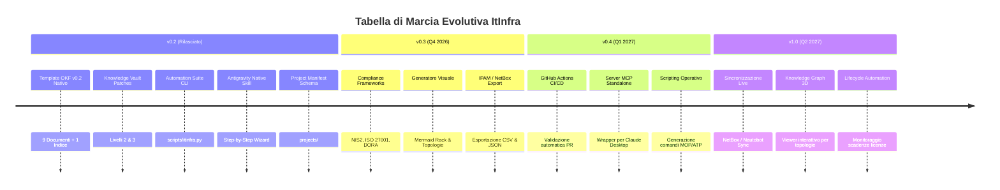

# Roadmap Strategica di Sviluppo: ItInfra Repository

<!-- AI-INSTRUCTIONS:
  Questo documento fissa la visione strategica, i traguardi raggiunti e le priorità di evoluzione
  del repository ItInfra per trasformarlo nello standard di riferimento per la documentazione
  e l'automazione di infrastrutture IT complesse tramite AI.
-->

## 🎯 Visione

Passare da una collezione di template documentali Markdown statici a una **suite agentica end-to-end** in grado di:
1. **Guidare l'operatore** con interviste strutturate per blocchi tematici (senza prompt monolitici).
2. **Garantire la conformità formale e di sicurezza** mediante validazione automatica locale (OKF v0.2).
3. **Mantenere uno stato globale coerente** per ogni progetto (evitando ridondanze di IP, VLAN, ASN, SLA).
4. **Interfacciarsi con i moderni strumenti di Operations** (NetBox, IPAM, CI/CD, Knowledge Vault).

---

## 🗺️ Panoramica delle Release

---

## 📌 Dettaglio delle Fasi di Sviluppo

### ✅ Release v0.2 — Fondamenta e Suite Agentica (Completato)
- [x] **10 Template OKF v0.2 nativi:** 9 tipologie documentali per le 7 fasi del ciclo lavorativo IT + indice navigazionale (`templates/`).
- [x] **CLI di automazione & linter (`scripts/itinfra.py`):**
  - Validatore formale OKF v0.2 (campi canonici, coerenza `related_docs` vs `relations`, blocco password in chiaro).
  - Gestione progetti: comandi `init`, `status`, `validate`, `list-templates`.
- [x] **Registro Progetti Condiviso (`projects/`):**
  - Schema JSON formale (`projects/_schema/project-manifest.schema.json`).
  - Template manifesto di configurazione globale (`project-manifest.yaml`).
- [x] **Antigravity Custom Skill (`skills/itinfra-assistant/SKILL.md`):**
  - Motore di intervista guidata a blocchi logici (Requisiti, Rete, Compute/Storage, Sicurezza, Collaudo).
- [x] **Istruzioni operative allineate:** Aggiornati `AGENTS.md`, `CLAUDE.md`, `README.md`.

---

### 🚀 Release v0.3 — Compliance, Visualizzazioni & IPAM Export (Prossimo Traguardo)
- [ ] **Integrazione Framework di Compliance:**
  - Estensione di `01-RSD-URS.md` e `02-HLD.md` con checklist specifiche per **NIS2**, **ISO 27001:2022** e **DORA** (Digital Operational Resilience Act).
- [ ] **Generatore Automatico Topologie Mermaid:**
  - Comando CLI `python scripts/itinfra.py generate-diagram <lld_file>` per estrarre la tabella delle connessioni inter-switch e generare automaticamente il diagramma topologico Mermaid Spine-Leaf.
  - Generatore di diagrammi rack front/rear in formato Mermaid o ASCII/SVG da tabella Unità Rack (RU).
- [ ] **Esportazione Matrici IPAM verso NetBox / CSV:**
  - Script CLI per estrarre tabelle VLAN e Subnet da `03-LLD.md` o `06-As-Built.md` ed esportarle in formato CSV pronto per l'import bulk in **NetBox** o fogli di calcolo.

---

### ⚙️ Release v0.4 — CI/CD & Integrazioni Esterne
- [ ] **GitHub Actions per Validazione Continua:**
  - Workflow `.github/workflows/validate.yml` che esegue `python scripts/itinfra.py validate` su ogni pull request, bloccando merge se vi sono errori OKF o credenziali in chiaro.
- [ ] **Server MCP (Model Context Protocol) Opzionale:**
  - Wrapper FastMCP o Node.js che espone i tool di `itinfra.py` per Claude Desktop senza shell diretta.
- [ ] **Generatore di Script di Esecuzione Operativa:**
  - Estrazione dei comandi di staging e collaudo da `04-MOP.md` e `07-ATP.md` in playbook Ansible o script PowerShell/Bash pronti per l'esecuzione in staging.

---

### 🌐 Release v1.0 — Enterprise Ecosystem & Sincronizzazione Live
- [ ] **Sincronizzazione Bidirezionale NetBox / Nautobot:**
  - Connettore API per popolare automaticamente il `project-manifest.yaml` e l'As-Built a partire dai dati live dell'infrastruttura.
- [ ] **Knowledge Graph 3D per Infrastrutture:**
  - Integrazione col visualizzatore D3/Three.js del Knowledge Vault per navigare graficamente rack, switch, server e relative relazioni contrattuali.
- [ ] **Gestione Ciclo di Vita Contrattuale (Handover):**
  - Generazione di alert calendario (ICS / Webhook) per le date di rinnovo garanzie hardware e licenze software documentate in `09-Handover-Inventory.md`.

---

## 🛠️ Linee Guida per i Collaboratori

Tutti i contributi al repository devono rispettare i seguenti principi:
1. **Nessuna regressione sullo standard OKF v0.2:** Ogni modifica ai template o alla documentazione deve superare `python scripts/itinfra.py validate`.
2. **Idempotenza e sicurezza:** Nessun dato sensibile o credenziale deve essere inserito nei template o negli esempi.
3. **Approccio guidato:** Qualsiasi nuova funzionalità deve prioritizzare l'esperienza dell'ingegnere guidato passo-passo dall'AI.
