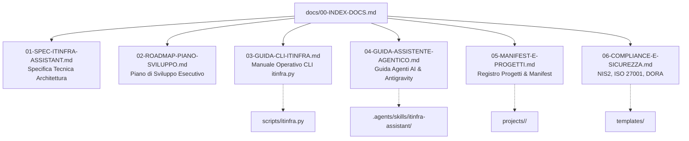

# Indice Generale della Documentazione ITInfra

<!-- AI-INSTRUCTIONS:
  Questo file è l'indice master di navigazione per tutti i documenti della cartella docs/.
  Tutti i file sono formattati in standard OKF v0.2.
-->

Benvenuto nell'hub di documentazione tecnica e operativa del repository **ItInfra**.

Questa directory raccoglie i manuali operativi per gli utenti e per gli agenti AI, le specifiche architetturali e i dettagli normativi necessari per governare l'intero ciclo documentale di infrastrutture IT complesse.

---

## 🗺️ Mappa della Documentazione

---

## 📚 Elenco dei Documenti

| Documento | Tipo OKF | Scopo e Contenuto |
|-----------|----------|-------------------|
| [`01-SPEC-ITINFRA-ASSISTANT.md`](./01-SPEC-ITINFRA-ASSISTANT.md) | `specification` | Architettura dei componenti della suite: Project Registry, Linter CLI, Wizard a turni e Skill. |
| [`02-ROADMAP-PIANO-SVILUPPO.md`](./02-ROADMAP-PIANO-SVILUPPO.md) | `guide` | Tabella di marcia esecutiva a 5 fasi, criteri di accettazione e tracciabilità. |
| [`03-GUIDA-CLI-ITINFRA.md`](./03-GUIDA-CLI-ITINFRA.md) | `guide` | Guida passo-passo a tutti i comandi di `scripts/itinfra.py` (`init`, `status`, `validate`, `export-ipam`, `generate-diagram`). |
| [`04-GUIDA-ASSISTENTE-AGENTICO.md`](./04-GUIDA-ASSISTENTE-AGENTICO.md) | `guide` | Come utilizzare Google Antigravity, Claude Code e Cursor per condurre l'intervista guidata per blocchi. |
| [`05-MANIFEST-E-PROGETTI.md`](./05-MANIFEST-E-PROGETTI.md) | `specification` | Gestione della cartella `projects/`, ereditarietà parametri di rete e schema `project-manifest.yaml`. |
| [`06-COMPLIANCE-E-SICUREZZA.md`](./06-COMPLIANCE-E-SICUREZZA.md) | `specification` | Approfondimento normativo: integrazione e checklist per NIS2, ISO/IEC 27001:2022 e regolamento DORA. |

---

## 🔗 Collegamenti Rapidi Esterni

- **Visione Strategica:** [`ROADMAP.md`](../ROADMAP.md)
- **Regole per Agenti AI:** [`AGENTS.md`](../AGENTS.md)
- **Istruzioni per Claude Code:** [`CLAUDE.md`](../CLAUDE.md)
- **Catalogo dei 10 Template:** [`templates/00-INDEX.md`](../templates/00-INDEX.md)
- **Integrazione con Knowledge Vault:** [`INTEGRAZIONE-REPO.md`](../INTEGRAZIONE-REPO.md)
