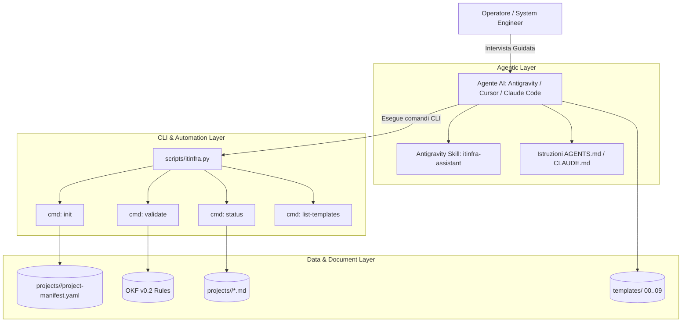

# Specifica Tecnica: ITInfra Agentic Assistant & Python CLI Suite

## 1. Obiettivo e Visione

Il progetto **ITInfra Assistant** estende il set di template statici OKF v0.2 per trasformare il repository in un **sistema agentico attivo e interattivo**, focalizzato sull'integrazione nativa con **Google Antigravity**, **Claude Code**, **Cursor** e altri ambienti agentici dotati di shell terminale.

L'approccio sostituisce la generazione statica monolitica ("one-shot") con un **workflow guidato a intervista modulare**, supportato da:
1. Una **CLI Python** snella, senza dipendenze esterne pesanti, per inizializzare progetti, validare la conformità OKF v0.2 e verificare lo stato dei documenti.
2. Una **Skill Antigravity** strutturata per orchestrare l'intervista per blocchi tematici (Requisiti, Rete, Compute, Storage, Security, Collaudo).
3. Un **Registro di Progetto** (`project-manifest.yaml`) che eredita automaticamente i parametri comuni a tutte le 7 fasi.

*(Nota architetturale: l'implementazione di un server demone FastMCP è posposta a favore di questa architettura diretta basata su CLI e Skill native, eliminando l'overhead di background daemon).*

---

## 2. Architettura dei Componenti

### 2.1 Project Context Registry & Manifest (`projects/`)
Evita la duplicazione di informazioni tra le fasi:
- Posizione: `projects/<project-slug>/project-manifest.yaml`
- Parametri condivisi:
  - `project_id`, `client_name`, `site_list`, `lead_architect`
  - Parametri di rete (CIDR Supernet, ASN BGP, pool VLAN, server DNS, NTP)
  - Parametri di business (SLA, RTO, RPO, Change Windows)
  - Stato di avanzamento (matrice dei 9 documenti con stato `draft`, `in-review`, `approved`)

### 2.2 ITInfra CLI & Linter (`scripts/itinfra.py`)
Script Python standalone che fornisce:
- `python scripts/itinfra.py init <slug> [--client <name>]`: inizializza la directory del progetto con il manifesto precompilato.
- `python scripts/itinfra.py validate <file_o_dir>`: analizza i documenti Markdown:
  - Convalida del frontmatter YAML conforme a OKF v0.2.
  - Verifica della coerenza biunivoca tra `related_docs` e `relations` (`targetId`).
  - Rilevamento di segreti in chiaro (esige `vault://`).
  - Conteggio e segnalazione di placeholder orfani (`<DA-RICHIEDERE>`, `<...>`).
- `python scripts/itinfra.py status <slug>`: visualizza la matrice di avanzamento del ciclo a 7 fasi.
- `python scripts/itinfra.py list-templates`: catalogo dei template con fasi e dipendenze.

### 2.3 Antigravity Native Skill (`skills/itinfra-assistant/SKILL.md`)
Istruisce Antigravity a:
- Condurre interviste a blocchi prima di compilare un template.
- Estrarre e inserire automaticamente le variabili dal `project-manifest.yaml`.
- Eseguire il linter `itinfra.py validate` prima di restituire il documento all'utente.
