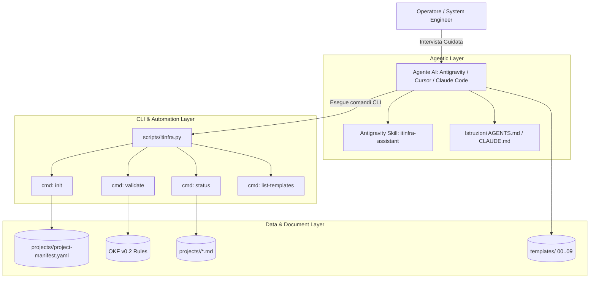

# Specifica Tecnica: ITInfra Agentic Assistant & Python CLI Suite

## 1. Obiettivo e Visione

Il progetto **ITInfra Assistant** estende il set di template statici OKF v0.2 per trasformare il repository in un **sistema agentico attivo e interattivo**, focalizzato sull'integrazione nativa con **Google Antigravity**, **Claude Code**, **Cursor** e altri ambienti agentici dotati di shell terminale.

L'approccio sostituisce la generazione statica monolitica ("one-shot") con un **workflow guidato a intervista modulare**, supportato da:
1. Una **CLI Python** snella, senza dipendenze esterne pesanti, per inizializzare progetti, validare la conformità OKF v0.2 e verificare lo stato dei documenti.
2. Una **Skill Antigravity** strutturata per orchestrare l'intervista per blocchi tematici (Requisiti, Rete, Compute, Storage, Security, Collaudo).
3. Un **Registro di Progetto** (`project-manifest.yaml`) che eredita automaticamente i parametri comuni a tutte le 7 fasi.

*(Nota architetturale: l'implementazione di un server demone FastMCP è posposta a favore di questa architettura diretta basata su CLI e Skill native, eliminando l'overhead di background daemon).*

---

## 2. Architettura dei Componenti

### 2.1 Project Context Registry & Manifest (`projects/`)
Evita la duplicazione di informazioni tra le fasi:
- Posizione: `projects/<project-slug>/project-manifest.yaml`
- Parametri condivisi:
  - `project_id`, `client_name`, `site_list`, `lead_architect`
  - Parametri di rete (CIDR Supernet, ASN BGP, pool VLAN, server DNS, NTP)
  - Parametri di business (SLA, RTO, RPO, Change Windows)
  - Stato di avanzamento (matrice dei 9 documenti con stato `draft`, `in-review`, `approved`)

### 2.2 ITInfra CLI & Linter (`scripts/itinfra.py`)
Script Python standalone che fornisce:
- `python scripts/itinfra.py init <slug> [--client <name>]`: inizializza la directory del progetto con il manifesto precompilato.
- `python scripts/itinfra.py validate <file_o_dir>`: analizza i documenti Markdown:
  - Convalida del frontmatter YAML conforme a OKF v0.2.
  - Verifica della coerenza biunivoca tra `related_docs` e `relations` (`targetId`).
  - Rilevamento di segreti in chiaro (esige `vault://`).
  - Conteggio e segnalazione di placeholder orfani (`<DA-RICHIEDERE>`, `<...>`).
- `python scripts/itinfra.py status <slug>`: visualizza la matrice di avanzamento del ciclo a 7 fasi.
- `python scripts/itinfra.py list-templates`: catalogo dei template con fasi e dipendenze.
- `python scripts/itinfra.py audit-consistency <slug>`: linter semantico anti-allucinazione che valida la coerenza incrociata di subnet, IP, hostname, ruoli AD e contratti tra tutti i 9 documenti e il manifesto.
- `python scripts/itinfra.py vault [init|set|get|list|audit] <slug>`: gestione crittografica locale dei secret (AES-256-GCM) concurrency-safe con file locking.
- `python scripts/itinfra.py worktree [add|sync|status|cleanup]`: gestione orchestrata di Git Worktrees per agenti AI paralleli.
- `python scripts/itinfra.py export-configs <slug> --out <dir>`: estrazione automatica degli script operativi RouterOS e PowerShell dai documenti tecnici.

### 2.3 Local Encrypted Secret Vault (`scripts/itinfra_vault.py`)
- Cifratura simmetrica autenticata **AES-256-GCM** / PBKDF2-HMAC-SHA256 (100.000 iterazioni con salt casuale a 16 byte).
- Storage centralizzato in `projects/<slug>/.vault.enc`, rigorosamente escluso da git (`.gitignore`).
- Meccanismo di **File Locking atomico** (`.vault.lock`) per consentire accessi sicuri e privi di race condition da worktree paralleli.
- Sintassi nei documenti Markdown conforme allo standard `vault://it/projects/<slug>/<path/to/secret>`.
- Funzione di `audit` per rilevare riferimenti a secret inesistenti o chiavi non utilizzate.

### 2.4 Multi-Agent Worktree Orchestration Pattern
Per consentire a più agenti AI (Antigravity, Cursor, Claude Code, Cline) di lavorare in parallelo senza conflitti:
- Ogni subagente opera in un **Git Worktree** isolato su un branch feature dedicato:
  - `infra-architect`: branch `feat/architecture` (HLD, LLD, topologie Mermaid)
  - `infra-security`: branch `feat/security-vault` (Vault, audit credenziali, compliance NIS2/ISO 27001)
  - `infra-automation`: branch `feat/ops-mop` (MOP, script RouterOS, PowerShell Hyper-V, Runbook)
  - `infra-qa`: branch `feat/testing-atp` (Casi di test ATP, verifica consistenza e reportistica)
- Condivisione sicura del Vault e del Manifest tramite risoluzione della root repository (`git rev-parse --show-toplevel`).
- Sincronizzazione atomica tramite merge non distruttivo o pull request review.

### 2.5 Strict Grounding & Motore Anti-Allucinazione
- **Regola Tassativa Zero-Hallucination:** L'AI ha il divieto assoluto di inventare parametri tecnici (IP, MAC, seriali, versioni firmware, password o date).
- **Fallback Standardizzato:** Qualsiasi informazione non fornita esplicitamente dall'utente o non presente nel `project-manifest.yaml` deve essere registrata come `<DA-RICHIEDERE>` e inclusa nella tabella "Open Issues".
- **Cross-Document Consistency Audit:** Verifica automatica che nessun documento contenga parametri contraddittori rispetto al resto dell'infrastruttura.

### 2.6 Multi-Framework Skills (`.agents/skills/`)
Struttura standard compatibile con tutti i moderni agenti:
- `.agents/skills/itinfra-assistant/SKILL.md`: wizard interattivo per la stesura dei 9 documenti tecnici.
- `.agents/skills/itinfra-vault/SKILL.md`: procedure operative per l'interazione con il vault cifrato e la gestione dei secret.

