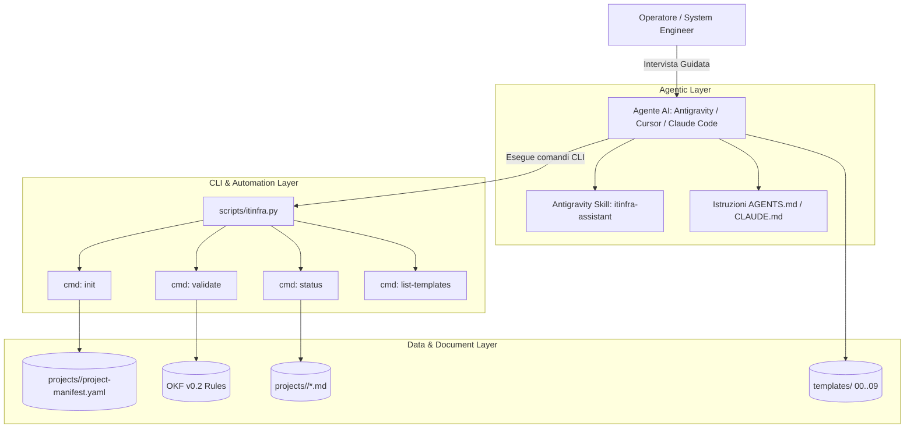

# Specifica Tecnica: ITInfra Agentic Assistant & Python CLI Suite

## 1. Obiettivo e Visione

Il progetto **ITInfra Assistant** estende il set di template statici OKF v0.2 per trasformare il repository in un **sistema agentico attivo e interattivo**, focalizzato sull'integrazione nativa con **Google Antigravity**, **Claude Code**, **Cursor** e altri ambienti agentici dotati di shell terminale.

L'approccio sostituisce la generazione statica monolitica ("one-shot") con un **workflow guidato a intervista modulare**, supportato da:
1. Una **CLI Python** snella, senza dipendenze esterne pesanti, per inizializzare progetti, validare la conformità OKF v0.2 e verificare lo stato dei documenti.
2. Una **Skill Antigravity** strutturata per orchestrare l'intervista per blocchi tematici (Requisiti, Rete, Compute, Storage, Security, Collaudo).
3. Un **Registro di Progetto** (`project-manifest.yaml`) che eredita automaticamente i parametri comuni a tutte le 7 fasi.

*(Nota architetturale: l'implementazione di un server demone FastMCP è posposta a favore di questa architettura diretta basata su CLI e Skill native, eliminando l'overhead di background daemon).*

---

## 2. Architettura dei Componenti



### 2.1 Project Context Registry & Manifest (`projects/`)
Evita la duplicazione di informazioni tra le fasi:
- Posizione: `projects/<project-slug>/project-manifest.yaml`
- Parametri condivisi:
  - `project_id`, `client_name`, `site_list`, `lead_architect`
  - Parametri di rete (CIDR Supernet, ASN BGP, pool VLAN, server DNS, NTP)
  - Parametri di business (SLA, RTO, RPO, Change Windows)
  - Stato di avanzamento (matrice dei 9 documenti con stato `draft`, `in-review`, `approved`)

### 2.2 ITInfra CLI & Linter (`scripts/itinfra.py`)
Script Python standalone che fornisce:
- `python scripts/itinfra.py init <slug> [--client <name>]`: inizializza la directory del progetto con il manifesto precompilato.
- `python scripts/itinfra.py validate <file_o_dir>`: analizza i documenti Markdown:
  - Convalida del frontmatter YAML conforme a OKF v0.2.
  - Verifica della coerenza biunivoca tra `related_docs` e `relations` (`targetId`).
  - Rilevamento di segreti in chiaro (esige `vault://`).
  - Conteggio e segnalazione di placeholder orfani (`<DA-RICHIEDERE>`, `<...>`).
- `python scripts/itinfra.py status <slug>`: visualizza la matrice di avanzamento del ciclo a 7 fasi.
- `python scripts/itinfra.py list-templates`: catalogo dei template con fasi e dipendenze.
- `python scripts/itinfra.py audit-consistency <slug>`: linter semantico anti-allucinazione che valida la coerenza incrociata di subnet, IP, hostname, ruoli AD e contratti tra tutti i 9 documenti e il manifesto.
- `python scripts/itinfra.py vault [init|set|get|list|audit] <slug>`: gestione crittografica locale dei secret (AES-256-GCM) concurrency-safe con file locking.
- `python scripts/itinfra.py worktree [add|sync|status|cleanup]`: gestione orchestrata di Git Worktrees per agenti AI paralleli.
- `python scripts/itinfra.py export-configs <slug> --out <dir>`: estrazione automatica degli script operativi RouterOS e PowerShell dai documenti tecnici.

### 2.3 Local Encrypted Secret Vault (`scripts/itinfra_vault.py`)
- Cifratura simmetrica autenticata **AES-256-GCM** / PBKDF2-HMAC-SHA256 (100.000 iterazioni con salt casuale a 16 byte).
- Storage centralizzato in `projects/<slug>/.vault.enc`, rigorosamente escluso da git (`.gitignore`).
- Meccanismo di **File Locking atomico** (`.vault.lock`) per consentire accessi sicuri e privi di race condition da worktree paralleli.
- Sintassi nei documenti Markdown conforme allo standard `vault://it/projects/<slug>/<path/to/secret>`.
- Funzione di `audit` per rilevare riferimenti a secret inesistenti o chiavi non utilizzate.

### 2.4 Multi-Agent Worktree Orchestration Pattern
Per consentire a più agenti AI (Antigravity, Cursor, Claude Code, Cline) di lavorare in parallelo senza conflitti:
- Ogni subagente opera in un **Git Worktree** isolato su un branch feature dedicato:
  - `infra-architect`: branch `feat/architecture` (HLD, LLD, topologie Mermaid)
  - `infra-security`: branch `feat/security-vault` (Vault, audit credenziali, compliance NIS2/ISO 27001)
  - `infra-automation`: branch `feat/ops-mop` (MOP, script RouterOS, PowerShell Hyper-V, Runbook)
  - `infra-qa`: branch `feat/testing-atp` (Casi di test ATP, verifica consistenza e reportistica)
- Condivisione sicura del Vault e del Manifest tramite risoluzione della root repository (`git rev-parse --show-toplevel`).
- Sincronizzazione atomica tramite merge non distruttivo o pull request review.

### 2.5 Strict Grounding & Motore Anti-Allucinazione
- **Regola Tassativa Zero-Hallucination:** L'AI ha il divieto assoluto di inventare parametri tecnici (IP, MAC, seriali, versioni firmware, password o date).
- **Fallback Standardizzato:** Qualsiasi informazione non fornita esplicitamente dall'utente o non presente nel `project-manifest.yaml` deve essere registrata come `<DA-RICHIEDERE>` e inclusa nella tabella "Open Issues".
- **Cross-Document Consistency Audit:** Verifica automatica che nessun documento contenga parametri contraddittori rispetto al resto dell'infrastruttura.

### 2.6 Multi-Framework Skills (`.agents/skills/`)
Struttura standard compatibile con tutti i moderni agenti:
- `.agents/skills/itinfra-assistant/SKILL.md`: wizard interattivo per la stesura dei 9 documenti tecnici.
- `.agents/skills/itinfra-vault/SKILL.md`: procedure operative per l'interazione con il vault cifrato e la gestione dei secret.
- `.agents/skills/itinfra-troubleshooter/SKILL.md`: procedura deterministica di diagnosi guasti a strati (OSI L1-L7) e stesura schede post-mortem.

### 2.7 Modulo Troubleshooting & AI Root Cause Analysis (Release v0.5)
Estende la suite operativa al supporto post-rilascio e alla gestione dei disservizi cliente:
- **Template OKF v0.2 `10-RCA-Troubleshooting.md`:**
  - Tipo canonico OKF: `guide`.
  - Struttura: Identificativi disservizio, Impatto business, Cronologia, Albero diagnostico a 7 strati OSI, Root Cause (5 Perché), Workaround immediato, Soluzione strutturale definitiva (con snippet comandi convalidati), Piano di prevenzione.
  - Relazioni: archi `relates_to` verso LLD (`03-LLD`) e `extends` verso As-Built (`06-As-Built`) e Runbook (`08-SOP-Runbook`).
- **Subagent `infra-troubleshooter`:**
  - Agente AI con prompt vincolante: divieto di diagnosi ipotetiche o log simulati; richiede comandi di verifica esatti (ping, traceroute, ARP table, test porte TCP, nslookup, log RouterOS/Windows).
- **CLI Assistant `scripts/itinfra.py troubleshoot`:**
  - `python scripts/itinfra.py troubleshoot init <slug> --incident "<Titolo>"`: crea la scheda precompilata con riferimenti al manifesto del cliente.

### 2.8 Live Infrastructure Health-Check & Telemetry Engine (Release v0.5)
- Script di diagnostica live non distruttiva `python scripts/itinfra.py health-check <slug>`:
  - Estrae automaticamente tutti gli host, IP e server dal `project-manifest.yaml` e dai documenti di progetto.
  - Esegue verifiche di connettività ICMP, probe TCP su porte standard (53, 80, 443, 445, 3389, 8291) e test di risoluzione DNS locale.
  - Segnala disallineamenti tra lo stato reale dell'infrastruttura e quanto documentato nell'As-Built.

### 2.9 Mappa Interattiva D3.js Knowledge Graph (Release v0.5)
- Script generatore standalone `scripts/graph_generator.py` e comando CLI `python scripts/itinfra.py export-graph <slug|templates> [--out graph.html]`:
  - Parsing istantaneo di nodi OKF v0.2 ed archi semantici pesati (`relations`).
  - Visualizzazione interattiva SVG/D3.js con filtri per tipologia, pannello dettagli nodo, ricerca full-text e zoom/pan fluido.
  - Generazione di grafi sia per il corpus dei template standard che per i progetti attivi (`projects/<slug>/graph.html`).

### 2.10 Knowledge Graph Navigation & Semantic Graph RAG
- Ogni documento del repository costituisce un **nodo tipizzato** collegato da archi semantici pesati (`relations`).
- L'agente AI naviga il grafo seguendo percorsi logici formalizzati anziché affidarsi alla mera somiglianza lessicale vettoriale, eliminando il rischio di allucinazioni incrociate tra apparati o clienti diversi.

### 2.11 Architettura di Memoria Locale Ibrida a 3 Livelli & Trust Signals (Release v0.6)
Sistema di persistenza deterministica 100% file-based e Git-native progettato per eliminare qualsiasi demone esterno (no SQLite, no Redis, no ChromaDB, nessuna porta di rete locale) e proteggere il repository dall'inquinamento da micro-commit:

1. **Livello 1 — Working Memory (Volatile):**
   - Corrisponde al context window della sessione di chat dell'agente AI.
   - Utilizzato per il ragionamento immediato, la decodifica dei prompt e l'elaborazione sintattica. Si azzera al termine della sessione.

2. **Livello 2 — Staging / Scratchpad Memory (Semi-strutturato):**
   - File di accumulo locale `projects/<slug>/_scratchpad.md`.
   - Sezioni standardizzate: `# Decisioni Tecniche Confermate`, `# Requisiti in Sospeso (<DA-RICHIEDERE>)`, `# Note Operative & Contatti`.
   - Per esecuzioni concorrenti multi-agente su Git Worktrees: isolamento in `.memory/scratchpad.<ruolo>.md` con riconciliazione automatica (`merge-scratchpad`).
   - Evita il commit prematuro di frammenti provvisori o pensieri intermedi dell'LLM nei documenti ufficiali.

3. **Livello 3 — Ground Truth & Canonical Knowledge (OKF v0.2):**
   - I 10 documenti ufficiali di progetto (`projects/<slug>/NN-TIPO.md`) e il `project-manifest.yaml`.
   - Modificati esclusivamente tramite operazione di consolidamento esplicita e controllata dall'operatore.

4. **Trust Signals & Metadata di Validità (OKF v0.2 Extended):**
   - Estensione del frontmatter YAML riconosciuta dal linter e dal generatore di grafo:
     ```yaml
     verified: true              # Booleano: validazione umana esplicita
     verified_by: "Lead Architect" # Nome o ruolo dell'approvatore
     last_vetted: "2026-09-16"   # Data ultima revisione confermata
     stale_after: "2026-12-31"   # Data di scadenza validità tecnica
     ```
   - Riconoscimento automatico delle informazioni "stale" (obsolete) che richiedono riconsultazione prima dell'uso in LLD o MOP.

5. **Tooling CLI dedicato (`scripts/itinfra.py memory`):**
   - `python scripts/itinfra.py memory log <slug> --section <sec> --entry "<testo>"`
   - `python scripts/itinfra.py memory show <slug>`
   - `python scripts/itinfra.py memory consolidate <slug> --target <doc_id>`
   - `python scripts/itinfra.py memory prune <slug>`

### 2.12 Architettura Global Enterprise Asset & Cross-Project Knowledge Graph (Release v0.7)
Evolve il modello di conoscenza da grafi di singoli progetti isolati a una rete ontologica enterprise federata:

1. **Aggregazione Multi-Tenant & Cross-Project:**
   - La suite analizza l'intero catalogo `projects/*` per costruire una mappa globale unificata.
   - I documenti di ciascun cliente mantengono la loro identità e clusterizzazione visiva, mentre le entità tecnologiche condivise fungono da nodi cerniera.

2. **Hub Ontologici delle Entità Condivise (Shared Entity Bridges):**
   - Quando due o più progetti (es. `severino-srl` e `acme-milano`) dichiarano nel frontmatter `entities` la medesima tecnologia (es. `Dell PowerEdge R630`, `MikroTik CRS326`, `ZeroTier SDN`, `Hyper-V`), il generatore di grafo crea un nodo entità centrale condiviso a cui collegano tutti i rispettivi documenti.
   - Permette l'ispezione immediata delle adozioni hardware e architetturali trasversali all'intero portfolio clienti.

3. **Motore di Ricerca Asset & Hardware Inventory CLI (`scripts/itinfra_inventory.py`):**
   - Interfaccia CLI deterministica per interrogare il patrimonio tecnologico globale:
     - `python scripts/itinfra.py inventory find "<termine>"`: ricerca istantanea di server, switch, router o software e restituisce l'elenco dei progetti, dei documenti As-Built e degli IP assegnati.
     - `python scripts/itinfra.py inventory list-hardware [--vendor <vendor>]`: estrazione tabellare dell'inventario hardware aggregato.
     - `python scripts/itinfra.py inventory summary`: dashboard statistica per vendor, modelli e sistemi operativi.

4. **Cross-Client Incident Intelligence & Prevenzione RCA Proattiva:**
   - Correlazione automatica tra ticket di incidente (`10-RCA-*.md`) di un cliente e apparati identici presenti presso altri clienti.
   - In fase di stesura o manutenzione, l'agente AI avvisa proattivamente se un dato hardware/firmware è stato oggetto di anomalie note (es. problematiche NIC Broadcom o bug RouterOS), suggerendo fix strutturali già convalidati.

5. **Segregazione Rigorosa Multi-Tenant & Sicurezza Secret:**
   - I file di credenziali cifrate (`.vault.enc`) restano strettamente confinati nel repository/directory del singolo progetto.
   - L'Enterprise Graph aggrega unicamente metadati ontologici e tecnici non confidenziali, garantendo compliance a NIS2 e ISO/IEC 27001.

### 2.13 Architettura della Memoria Globale Enterprise & Global Scratchpad (Release v0.8)
Estende il Livello 2 (Staging Memory) oltre i confini del singolo tenant per preservare la conoscenza organizzativa trasversale senza violare l'isolamento dei dati riservati:

1. **Global Staging Memory Pool (`projects/_global_scratchpad.md`):**
   - Pool centralizzato di appunti, decisioni architetturali confermate e lezioni apprese valide per tutti i clienti dell'organizzazione.
   - Struttura a 4 sezioni standard:
     - `# Best Practices & Design Patterns`: convenzioni confermate (es. impostazioni MTU/MSS clamping su tunnel VPN, policy di trunking VLAN, configurazioni switch standard).
     - `# Known Issues & Hardware Limitations`: bug noti di firmware, incompatibilità transceiver, limiti operativi documentati.
     - `# Hardware & Vendor Guidelines`: raccomandazioni su modelli hardware collaudati (es. requisiti iDRAC, BIOS minimi).
     - `# Open Architectural Questions`: questioni trasversali aperte a livello di portfolio.
   - Gestito tramite flag `--global` nei comandi CLI: `python scripts/itinfra.py memory log --global ...` e `python scripts/itinfra.py memory show --global`.

2. **Segregazione dei Dati (Multi-Tenant Zero-Leakage):**
   - La memoria globale non contiene mai: indirizzi IP specifici di produzione, credenziali o percorsi vault, nomi utente, diagrammi logici riservati di singoli clienti.
   - L'agente AI consulta in cascata prima la memoria globale (`--global`) per ereditare le best practice, e successivamente lo scratchpad di progetto (`<slug>`) per applicarle ai parametri specifici del cliente.

### 2.14 Architettura della Enterprise System Test Suite & Unified Verification Dashboard (Release v0.8)
Introduce un framework automatizzato di collaudo end-to-end e visualizzazione esecutiva dello stato di salute dell'intero repository ITInfra:

1. **Batteria di Collaudo Automatizzata End-to-End (`itinfra.py test-suite`):**
   - Esegue una sequenza deterministica di verifica sui 10 moduli fondamentali:
     1. *OKF v0.2 Formal Linter*: conformità sintattica e frontmatter su template e progetti.
     2. *Strict Grounding & Consistency Audit*: verifica semantica IP/subnet e assenza placeholder illegali.
     3. *Local Encrypted Secret Vault*: test crittografico AES-256-GCM, lock atomico e assenza secret in chiaro su Git.
     4. *Multi-Agent Worktree Orchestrator*: verifica isolamento branch e toolchain di sincronizzazione.
     5. *Configuration Playbooks*: validazione sintattica playbook RouterOS (.rsc) e script PowerShell (.ps1).
     6. *Incident Management & Telemetry*: verifica schede 10-RCA e connettività socket/ping live.
     7. *Hybrid Memory L1-L3*: test staging scratchpad (locale e globale) e marcatura Trust Signals.
     8. *Global Asset Inventory*: indicizzazione cross-tenant, normalizzazione vendor e deduplica apparati.
     9. *Cross-Client Incident Intelligence*: correlazione automatica tra ticket di incidente ed entità tecnologiche.
     10. *D3.js Interactive Knowledge Graph*: integrità del modello di nodi, archi semantici pesati e render HTML.

2. **Unified System Test & Verification Dashboard (`projects/system-test-report.html`):**
   - Report HTML offline autonomo, responsive e interattivo generabile con il flag `--report-html`.
   - Elementi architetturali della dashboard:
     - *Executive Summary Scorecard*: KPI globali (Overall Pass Rate, Numero Moduli Convalidati, Numero Progetti Attivi, Allucinazioni Rilevate: 0, Credenziali Esposte: 0).
     - *Interactive Accordion Modules*: card per ciascun modulo con esito (PASS/WARN/FAIL), tempo di esecuzione, descrizione del test ed estratti dei log operativi.
     - *Deep Navigation Tab Bar*: navigazione istantanea tra Documentazione, Sicurezza & Vault, Telemetria & Incidenti, e Inventario Globale.
     - *Quick Action Links*: collegamenti one-click alla mappa `global-graph.html`, ai report di progetto e ai documenti ufficiali.

### 2.15 Architettura Local Workspace & Central Publish con Quality Gate (`itinfra.py publish`) (Release v0.9)
Risolve in modo deterministico le criticità di latenza SMB, lock concorrenti di Git e conflitti di permessi NTFS su percorsi di rete, separando l'ambiente operativo dell'agente dal repository centrale aziendale:

1. **Disaccoppiamento tra Ambiente Operativo (Local Workspace) e Hub Centrale (Central Share):**
   - *Ambiente di Lavoro del Tecnico (SSD Locale)*:
     - Ciascun tecnico o client LAN opera su una cartella locale su SSD (es. `C:\itinfra` o `C:\Users\<user>\itinfra`).
     - Antigravity lavora a piena velocità SSD locale, senza crash o timeout dei file watcher su percorsi UNC/SMB.
     - L'agente conduce l'intervista guidata, inizializza il nuovo cliente (`itinfra.py init <slug>`) e compila i template OKF v0.2 nella cartella locale `projects/<slug>/`.
   - *Hub di Archiviazione e Conoscenza Centrale (`\\fileserv01\dati01\workaure`)*:
     - Funge da archivio master aziendale per tutti i progetti approvati, l'inventario hardware aggregato e i grafi D3.js.
     - I file del motore centrale (`scripts/`, `templates/`, `docs/`, `.git/`) restano protetti e immutabili rispetto all'attività dei client LAN.

2. **Meccanismo di Pubblicazione Atomica e Pre-Flight Quality Gate (`scripts/itinfra_publish.py`):**
   - Il tecnico pubblica il proprio progetto sul server centrale tramite comando dedicato:
     `python scripts/itinfra.py publish <slug> [--dest \\fileserv01\dati01\workaure] [--dry-run] [--force]`
   - *Pre-Publish Quality Gate obbligatorio*:
     1. *Linter Formale OKF v0.2*: tutti i documenti in `projects/<slug>/` devono avere 0 errori di validazione.
     2. *Strict Grounding Audit*: verifica semantica di coerenza IP/subnet e assenza di placeholder illegali.
     3. *Zero Cleartext Secret Scan*: scansione automatica per prevenire fughe di credenziali o password in chiaro verso lo storage condiviso.
     Se anche un solo controllo fallisce, la pubblicazione viene respinta con errore bloccante.
   - *Copia Atomica Confinata*:
     - La sincronizzazione copia **esclusivamente** i file all'interno di `projects/<slug>/` verso la cartella corrispondente sul server centrale.
     - È strutturalmente impossibile per il comando toccare, sovrascrivere o alterare file al di fuori dello slug del cliente (nessun rischio per `scripts/`, `templates/` o progetti di altri clienti).

3. **Protezione dei Progetti Approvati & Versioning:**
   - Se sul server centrale esiste già un progetto con lo stesso `<slug>` avente stato `approved`, la pubblicazione viene rifiutata a meno del passaggio esplicito del flag `--force` (riservato al superamento dell'As-Built ufficiale).

4. **Sincronizzazione Unidirezionale del Motore Locale (`itinfra.py sync-engine`):**
   - I tecnici possono aggiornare in qualsiasi momento la propria copia locale di template e script scaricando l'ultima versione consolidata dal server centrale con un solo comando:
     `python scripts/itinfra.py sync-engine [--source \\fileserv01\dati01\workaure]`
   - Garantisce che tutti i client LAN utilizzino sempre gli standard normativi e le release software più recenti.


