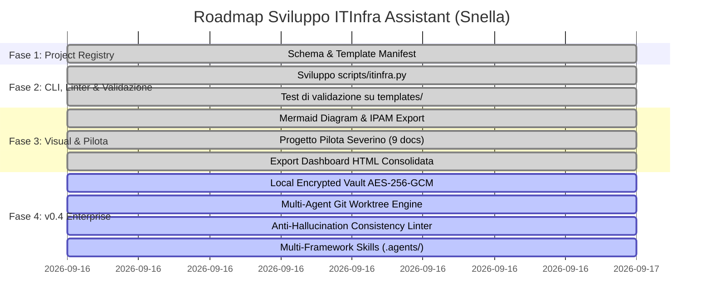

# Piano di Sviluppo e Roadmap: Suite ITInfra Assistant

## 1. Fasi di Sviluppo

---

## 2. Dettaglio Deliverable per Release

### Release v0.2 / v0.3 (Completati)
- Schema JSON e template per `project-manifest.yaml`.
- CLI Python `scripts/itinfra.py` (comandi `init`, `validate`, `status`, `list-templates`, `generate-diagram`, `export-ipam`, `export-html`).
- Integrazione framework di compliance (NIS2, ISO 27001, DORA).
- Completamento al 100% di tutte le 7 fasi del progetto reale Severino Srl (9 documenti OKF v0.2 convalidati).
- Generatore di reportistica HTML offline con diagrammi vettoriali Mermaid.js.

### Release v0.4 — Security, Multi-Agent & Zero-Hallucination (In Corso)
- **Local Encrypted Vault:** modulo `scripts/itinfra_vault.py` (AES-256-GCM, PBKDF2-HMAC-SHA256, lock atomico `.vault.lock`) e comandi CLI `vault`.
- **Git Worktree Orchestration:** comando CLI `itinfra.py worktree` per orchestrare agenti paralleli su branch isolati (`feat/architecture`, `feat/security-vault`, `feat/ops-mop`, `feat/testing-atp`).
- **Motore Anti-Allucinazione:** comando CLI `itinfra.py audit-consistency` e linter con regole di Strict Grounding (fallback obbligatorio a `<DA-RICHIEDERE>`).
- **Multi-Framework Skills:** cartella standard `.agents/skills/` con `itinfra-assistant` e `itinfra-vault`, allineate a `AGENTS.md` e `CLAUDE.md`.
- **Esportazione Script Operativi:** comando `export-configs` per estrarre script RouterOS `.rsc` e PowerShell `.ps1`.

