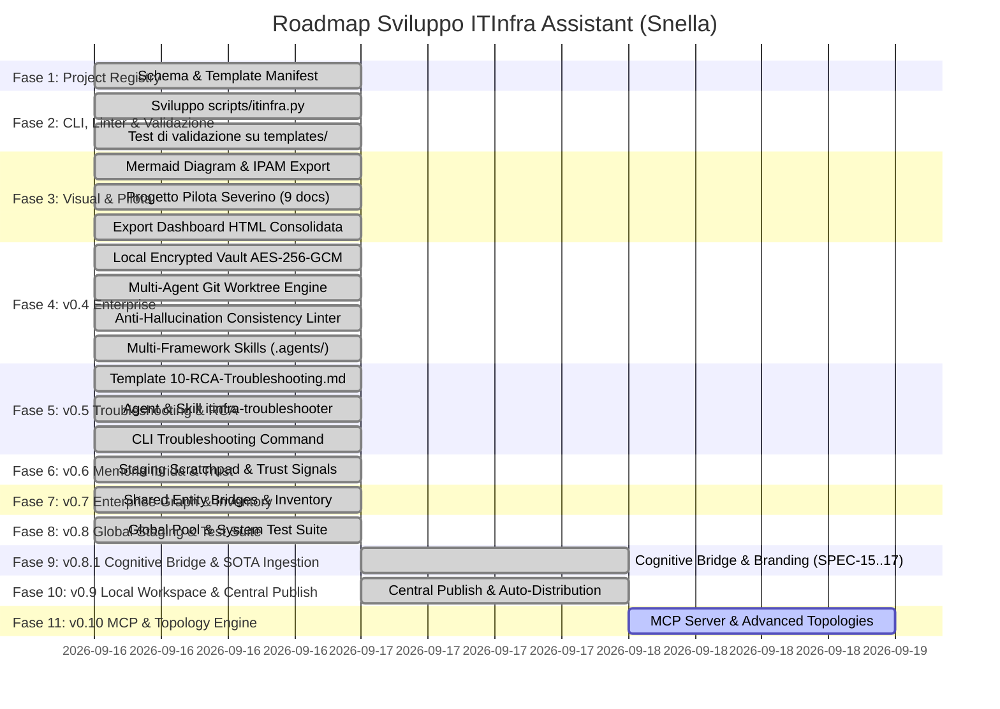

# Piano di Sviluppo e Roadmap: Suite ITInfra Assistant

## 1. Fasi di Sviluppo

---

## 2. Dettaglio Deliverable per Release

### Release v0.2 / v0.3 (Completati)
- Schema JSON e template per `project-manifest.yaml`.
- CLI Python `scripts/itinfra.py` (comandi `init`, `validate`, `status`, `list-templates`, `generate-diagram`, `export-ipam`, `export-html`).
- Integrazione framework di compliance (NIS2, ISO 27001, DORA).
- Completamento al 100% di tutte le 7 fasi del progetto reale Severino Srl (9 documenti OKF v0.2 convalidati).
- Generatore di reportistica HTML offline con diagrammi vettoriali Mermaid.js.

### Release v0.4 — Security, Multi-Agent & Zero-Hallucination (Completato)
- **Local Encrypted Vault:** modulo `scripts/itinfra_vault.py` (AES-256-GCM, PBKDF2-HMAC-SHA256, lock atomico `.vault.lock`) e comandi CLI `vault`.
- **Git Worktree Orchestration:** comando CLI `itinfra.py worktree` per orchestrare agenti paralleli su branch isolati (`feat/architecture`, `feat/security-vault`, `feat/ops-mop`, `feat/testing-atp`).
- **Motore Anti-Allucinazione:** comando CLI `itinfra.py audit-consistency` e linter con regole di Strict Grounding (fallback obbligatorio a `<DA-RICHIEDERE>`).
- **Multi-Framework Skills:** cartella standard `.agents/skills/` con `itinfra-assistant` e `itinfra-vault`, allineate a `AGENTS.md` e `CLAUDE.md`.
- **Esportazione Script Operativi:** comando `export-configs` per estrarre script RouterOS `.rsc` e PowerShell `.ps1`.

### Release v0.5 — Incident Management & Deterministic RCA (Completato)
- **Template OKF v0.2 `10-RCA-Troubleshooting.md`:** modello formale post-incidente con sintomatologia, impatto, albero diagnostico Layer OSI 1-7, root cause, risoluzione verificata e piano di prevenzione.
- **Subagent & Skill `itinfra-troubleshooter`:** agente AI specializzato con albero diagnostico deterministico e zero allucinazioni sui log e test di rete.
- **CLI Assistant (`scripts/itinfra.py troubleshoot`):** inizializzazione guidata delle schede incidente e consolidamento report.
- **Live Health-Check (`scripts/itinfra.py health-check`):** test automatici ICMP, TCP e DNS live.

### Release v0.6 — Memoria Locale Ibrida a 3 Livelli & Trust Signals (Completato)
- **Staging Memory L2 (`_scratchpad.md`):** isolamento delle decisioni volatili di chat prima del commit su Git.
- **Modulo Core `scripts/itinfra_memory.py`:** gestione atomica log, show, merge per worktree e consolidate.
- **Trust Signals & Certificazione Tecnica:** metadati `verified`, `last_vetted`, `stale_after` per contrastare l'allucinazione e l'obsolescenza documentale.

### Release v0.7 — Global Enterprise Asset & Entity Knowledge Graph (Completato)
- **Motore Global Inventory (`scripts/itinfra_inventory.py`):** scansione cross-progetto di hardware, modelli e vendor con comandi `inventory find/list-hardware/summary`.
- **Nodi Ponte Shared Entity Bridges:** proiezione D3.js interattiva delle entità condivise tra clienti diversi con comando `export-graph all`.
- **Cross-Client Incident Intelligence:** correlazione immediata tra apparati in uso e ticket RCA pregressi del portfolio per prevenzione proattiva dei disservizi.

### Release v0.8 — Global Enterprise Staging Memory & Unified Verification Dashboard (Completato)
- **Global Staging Memory Pool (`projects/_global_scratchpad.md`):** estensione del modulo memoria con scope `--global` per raccogliere best practice, lezioni apprese e regole hardware condivise con protezione preventiva da secret leaks (`validate_global_entry_safety`).
- **Cross-Platform Atomic Lock:** classe `AtomicFileLock` a tutela delle scritture concorrenti.
- **Enterprise System Test Suite (`scripts/itinfra.py test-suite`):** collaudo end-to-end automatizzato di tutti i 10 moduli del framework con output a terminale e Pass Rate 100%.
- **Unified Verification Dashboard (`projects/system-test-report.html`):** report HTML consolidato offline 100% Zero-CDN con KPI esecutive, tab interattivi e log diagnostico di collaudo.

### Release v0.8.1 — Visual Document Ingestion, Enterprise Branding & Cognitive Bridge (SPEC-15, SPEC-16, SPEC-17) (Completato)
- **Visual Document Ingestion SOTA (`SPEC-15`):** pipeline nativa Pixel-to-Markdown per scansioni, preventivi e contratti complessi con modularizzazione OKF v0.2 multi-file (`docs/severino-sla/`, `docs/viola-preventivo/`).
- **Audit Engine Deterministici 2026:** conformità matematica e legale automatica per contratti SLA (`ContractAuditEngine`) e computi metrici/preventivi commerciali (`QuoteAuditEngine`).
- **Enterprise Document Templating & Official Branding (`SPEC-16`):** identità visiva Aure System con logo ufficiale integrato, esportazione multi-formato (DOCX, PDF vettoriale A4, HTML Zero-CDN).
- **Unified Cognitive Memory Bridge (`SPEC-17`):** federazione cross-repo tra la memoria a 3 livelli di `itinfra` e il motore auto-correttivo attestato di `itinfra-business-ops` con promozione automatica da L2 Staging Scratchpad (`_global_scratchpad.md`) a Guardrail Attestati Antigravity (`.agents/rules/`).

### Release v0.9 — Local Workspace & Central Publish Architecture (`itinfra.py publish`) (Completato)
- **Disaccoppiamento Local Workspace & Central Storage (`\\fileserv01\dati01\workaure`):** i tecnici operano in locale (`C:\itinfra\`) a piena velocità SSD senza latenze SMB, timeout dei file watcher o conflitti di lock Git concorrenti.
- **Modulo Central Publisher & Pre-Flight Quality Gate (`scripts/itinfra_publish.py`):** comando CLI `itinfra.py publish <slug>` con validazione obbligatoria prima della copia (linter formale OKF v0.2 a 0 errori, strict grounding audit semantico e scansione anti-leak credenziali).
- **Copia Atomica Confinata:** sincronizzazione esclusiva dei file appartenenti a `projects/<slug>/`, garantendo l'assoluta inviolabilità di `scripts/`, `templates/`, `docs/`, `.git/` e dei progetti degli altri clienti.
- **Protezione Progetti Approvati & Versioning:** blocco delle sovrascritture accidentali su progetti consolidati (`status: approved`) a meno di flag esplicito `--force`.
- **Sincronizzazione Unidirezionale del Motore Locale (`itinfra.py sync-engine`):** comando per aggiornare la copia locale di script e template scaricando l'ultima release consolidata dal server master centrale.
- **Automazione Setup & Guida Operativa:** script `init_central_share.ps1`, `setup_client_workspace.ps1` e manuale `docs/11-GUIDA-LOCAL-WORKSPACE-CENTRAL-PUBLISH.md`.

### Release v0.10 — Advanced Topology Engine, MCP Server & Automated CI/CD (Pianificato Q1 2027)
- **Server MCP Standalone (`scripts/itinfra_mcp.py`):** protocollo aperto per esporre tool e risorse a Claude Desktop, Cursor MCP e agenti LLM esterni.
- **Advanced Topology & Cabling Generator:** generazione automatica di schemi Spine-Leaf complessi, patch panel e layout rack con codifica colori VLAN.
- **Automated CI/CD Quality Gates (GitHub Actions):** validazione automatica obbligatoria su PR con verifica linter, audit coerenza e test-suite.
- **Direct IPAM REST API Integration:** esportazione diretta verso le API REST di NetBox e Nautobot.

### Release v1.0 — Enterprise Ecosystem & Sincronizzazione Live (Pianificato Q2 2027)
- **Sincronizzazione Bidirezionale NetBox / Nautobot:** connettore API live per allineamento continuo dell'infrastruttura con il manifesto di progetto.
- **Knowledge Graph 3D:** navigazione visiva tridimensionale interattiva dei datacenter e apparati.
- **Lifecycle & Contract Automation:** scadenziario automatico e alert su garanzie hardware e contratti di supporto.

