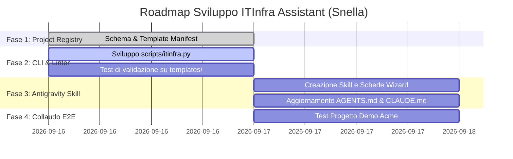

# Piano di Sviluppo e Roadmap: Suite ITInfra Assistant

## 1. Fasi di Sviluppo

---

## 2. Dettaglio Deliverable

### Step 1: Base Progetti & Manifest (`projects/`)
- `projects/_schema/project-manifest.schema.json`
- `projects/_template/project-manifest.yaml`
- `.gitignore` aggiornato

### Step 2: CLI Python & Validatore OKF v0.2 (`scripts/itinfra.py`)
- Sviluppo della CLI Python standalone (senza dipendenze pesanti obbligatorie)
- Comandi: `init`, `validate`, `status`, `list-templates`
- Verifica su tutti i file in `templates/`

### Step 3: Antigravity Skill & Istruzioni Agenti
- `skills/itinfra-assistant/SKILL.md` (e registrazione in `.gemini/antigravity/skills/itinfra-assistant/SKILL.md`)
- Schede guida per intervista a blocchi logici (Networking, Compute, Storage, Security, ATP, Runbook)
- Aggiornamento di `AGENTS.md` e `CLAUDE.md` con riferimenti alla CLI `scripts/itinfra.py`

### Step 4: Collaudo E2E
- Creazione progetto di test demo tramite CLI
- Compilazione assistita e validazione automatica
- Verifica di conformità e assenza errori
