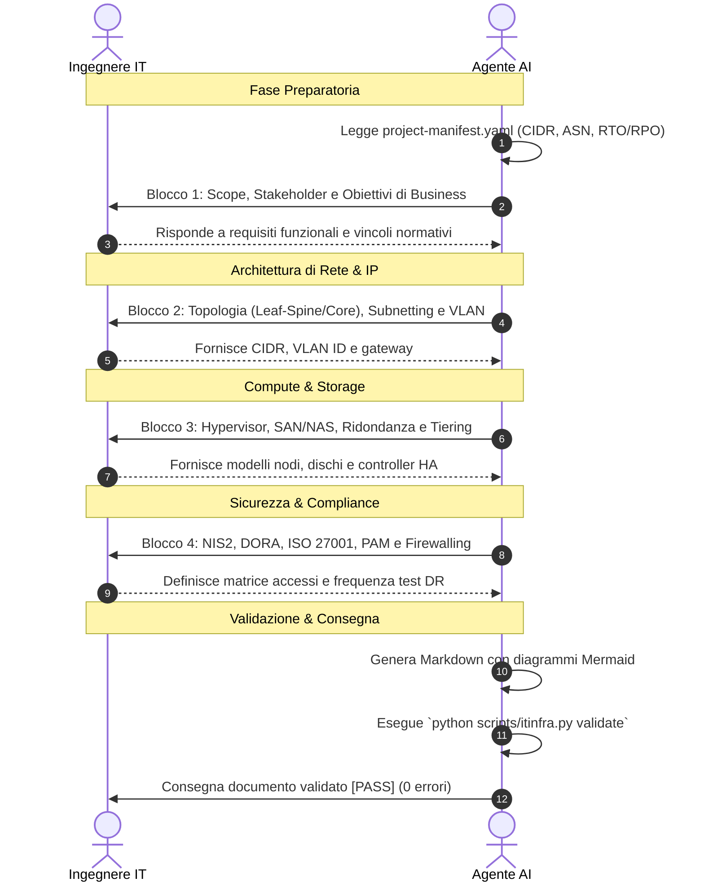

# Guida all'Uso dell'Assistente Agentico: Compilazione Guidata a Turni

<!-- AI-INSTRUCTIONS:
  Questa guida istruisce l'operatore e l'agente AI su come condurre una sessione
  di compilazione interattiva senza prompt monolitici, garantendo accuratezza tecnica.
-->

## 1. La Filosofia dell'Intervista Guidata a Turni

Nelle infrastrutture IT reali e complesse, **nessun ingegnere di sistema possiede tutti i dati architetturali in un unico blocco di testo**. Richiedere all'AI di "generare un LLD" con un solo prompt produce inevitabilmente allucinazioni, omissioni o incongruenze nei piani di indirizzamento IP e nelle matrici di accesso.

L'approccio di **ITInfra Assistant** capovolge il paradigma: **l'agente AI diventa un intervistatore tecnico qualificato**. L'agente guida l'utente attraverso blocchi tematici mirati (3-4 domande per volta), recupera automaticamente i parametri condivisi dal manifesto di progetto e valida il risultato prima di consegnarlo.

---

## 2. Come Usare l'Assistente nei Diversi Framework

### 2.1 Con Google Antigravity
Google Antigravity rileva automaticamente la skill di progetto posizionata in `.agents/skills/itinfra-assistant/SKILL.md`.
- **Come avviare:**
  Scrivi semplicemente in chat:
  > *"Voglio iniziare un nuovo progetto di data center per il cliente Acme SpA e compilare la documentazione a partire dalla Fase 1."*
- **Comportamento dell'agente:**
  1. Esegue `python scripts/itinfra.py init <slug>` per creare la struttura e il manifest.
  2. Verifica le dipendenze della fase con `scripts/itinfra.py status`.
  3. Pone le domande del primo blocco tematico.
  4. Genera il documento e lancia automaticamente `python scripts/itinfra.py validate`.

### 2.2 Con Claude Code (Anthropic CLI)
Claude Code legge automaticamente [`CLAUDE.md`](../CLAUDE.md) ed esegue comandi da terminale Bash/PowerShell.
- Avvia la sessione nella cartella del repository:
  ```bash
  claude
  ```
- Chiedi a Claude di compilare un template:
  > *"Compila 02-HLD per il progetto demo-acme seguendo le istruzioni in CLAUDE.md ed eseguendo le validazioni via CLI."*

### 2.3 Con Cursor / Windsurf / Cline / Roo Code
Questi ambienti leggono automaticamente [`AGENTS.md`](../AGENTS.md). L'agente seguirà il workflow in 7 step e utilizzerà la CLI `scripts/itinfra.py` dal terminale integrato.

---

## 3. La Struttura dell'Intervista per Blocchi Tematici

Quando si compila un documento, l'intervista deve seguire questa suddivisione a blocchi:



---

## 4. Regole Aulee per la Qualità dei Dati

### 4.1 Gestione delle Credenziali
**MAI inserire password in chiaro nei documenti.**
L'agente deve formattare qualsiasi credenziale come riferimento a vault:
```yaml
# Corretto:
admin_password_ref: "vault://it/projects/acme-dc/firewall/admin"
snmp_community_ref: "vault://it/projects/acme-dc/snmp/ro-community"
```

### 4.2 Gestione dei Dati Mancanti & Zero-Hallucination Policy
Se durante l'intervista un dato non è ancora noto o non disponibile (es. indirizzo MAC di uno switch, credenziali, seriali):
- **DIVIETO ASSOLUTO DI INVENTARE DATI:** L'AI non deve mai allucinare o inserire valori fittizi.
- Usa tassativamente il placeholder standard: `<DA-RICHIEDERE>`.
- Inserisci la voce nella tabella "Open Issues" del documento.
- Esegui `python scripts/itinfra.py audit-consistency <slug>` per verificare l'assenza di discrepanze semantiche.

### 4.3 Coerenza delle Relazioni Ontologiche
Nel frontmatter YAML, ogni ID inserito nell'array `related_docs` DEVE avere un corrispondente record in `relations` con medesimo `targetId`. La CLI verificherà questa regola in fase di validazione.

---

## 5. Parallelismo e Git Worktree per Multi-Agente

Nelle implementazioni complesse è possibile attivare più subagenti paralleli per accelerare la redazione del ciclo lavorativo senza conflitti di filesystem:

1. **Creazione dei Worktree isolati:**
   ```bash
   python scripts/itinfra.py worktree add infra-architect
   python scripts/itinfra.py worktree add infra-security
   python scripts/itinfra.py worktree add infra-automation
   python scripts/itinfra.py worktree add infra-qa
   ```
2. **Assegnazione dei compiti:**
   - `infra-architect`: branch `feat/architecture` (HLD, LLD, topologie Mermaid).
   - `infra-security`: branch `feat/security-vault` (Vault AES-256, matrici di accesso, compliance).
   - `infra-automation`: branch `feat/ops-mop` (MOP, script RouterOS `.rsc`, PowerShell `.ps1`, Runbook).
   - `infra-qa`: branch `feat/testing-atp` (Casi di test ATP, Handover, audit coerenza).
3. **Sincronizzazione finale:**
   Al termine, ciascun agente esegue `python scripts/itinfra.py worktree sync <ruolo>` per fondere in modo atomico le modifiche con il branch principale.

