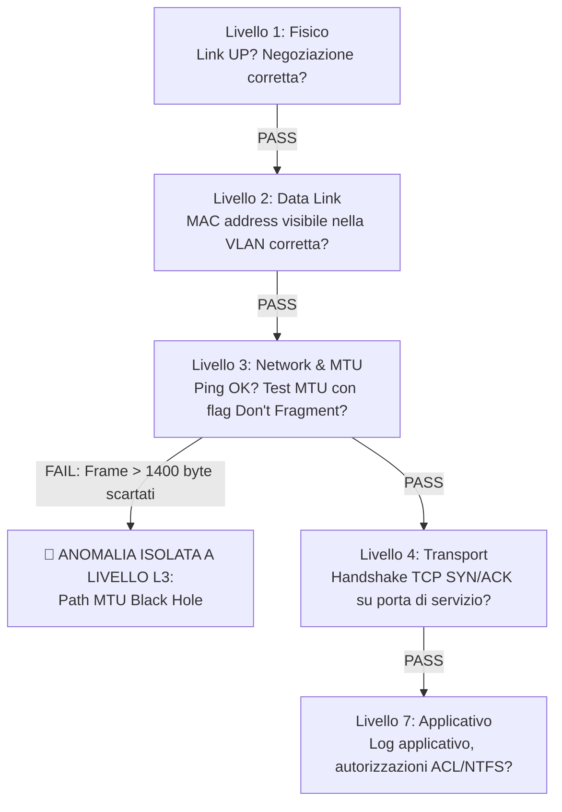

<!-- AI-INSTRUCTIONS:
Questa guida insegna agli operatori umani e agli agenti AI (Google Antigravity, Claude Code, Cursor, Aider, Cline)
come condurre un'indagine diagnostica senza allucinazioni, guidati dalla skill 'itinfra-troubleshooter' e producendo
il documento risolutivo 10-RCA conforme allo standard OKF v0.2.
-->

# Guida Operativa — Risoluzione Disservizi e Troubleshooting IT con Agenti AI

## 1. Principi Fondamentali: Zero Allucinazioni e Strict Grounding

Quando un'infrastruttura di produzione subisce un degrado o un'interruzione di servizio, un agente AI generico tende frequentemente a tentare ipotesi casuali, suggerendo comandi arbitrari o configurazioni prive di riscontro.

Nel framework **ITInfra**, l'agente AI opera sotto vincolo di **Strict Grounding**:
1. **DIVIETO DI INVENTARE CAUSE O DATI:** L'agente non formula conclusioni se non basate su evidenze strumentali certe (output di terminale, log di sistema, telemetria).
2. **FALLBACK SU `DA-RICHIEDERE`:** Qualora un log, un seriale o una versione non siano noti, l'unico valore ammesso è il marcatore di richiesta esplicita.
3. **GROUNDING SU MANIFESTO & AS-BUILT:** Tutti gli host, IP, subnet, VLAN e porte citati devono coincidere al 100% con quelli censiti in `project-manifest.yaml` e `06-As-Built.md`.

---

## 2. I 4 Blocchi di Informazione da Fornire all'AI nel Prompt

Per consentire ad Antigravity o ad altri framework di attivare immediatamente la modalità diagnostica corretta, struttura la tua richiesta includendo questi 4 elementi:

```
[BLOCCO 1: IDENTIFICAZIONE PROGETTO & CLIENTE]
- Slug del progetto: slug_progetto (es. severino-srl)
- Apparato o servizio impattato: nome_servizio (es. Condivisione SMB su FS01)

[BLOCCO 2: SINTOMATOLOGIA & IMPATTO]
- Sintomo esatto osservato dagli utenti (messaggi di errore, timeout, lentezza).
- Ambito dell'impatto: totale o parziale (es. solo utenti remoti via VPN, utenti LAN operativi).
- Orario di inizio del disservizio (CET/UTC).

[BLOCCO 3: TELEMETRIA PRELIMINARE E OUTPUT COMANDI]
- Includi l'output del comando: python scripts/itinfra.py health-check slug_progetto
- Eventuali prove preliminari eseguite (ping, Test-NetConnection, log).

[BLOCCO 4: RICHIESTA ESPLICITA SKILL & OUTPUT ATTESO]
- "Utilizza la skill 'itinfra-troubleshooter' e il template 10-RCA-Troubleshooting.md."
- "Guidami con l'albero diagnostico a strati OSI L1-L7 senza formulare supposizioni."
- "Genera la scheda formale 10-RCA-[ticket_id].md con il metodo dei 5 Perché e piano CAPA."
```

---

## 3. Template di Prompt Pronte per Framework AI

### A. Prompt per Google Antigravity
```markdown
Ho un disservizio aperto sul cliente severino-srl:
- Servizio: File Server FS01 (IP LAN 192.168.120.10, ZeroTier 10.147.19.10)
- Sintomo: Gli utenti remoti via ZeroTier ricevono timeout e errore 0x8007003B durante l'apertura di file superiori a 1 MB, mentre il ping ICMP e l'esplorazione delle cartelle funzionano regolarmente. In sede LAN il problema non si presenta.
- Output preliminare health-check:
  Target: FS01 ZeroTier Overlay (10.147.19.10) | ICMP: PASS | TCP 445: OPEN

Attiva la skill 'itinfra-troubleshooter':
1. Inizializza il ticket con: python scripts/itinfra.py troubleshoot init severino-srl FS01-SMB-Connectivity
2. Guidami passo dopo passo attraverso l'albero diagnostico a 7 strati OSI (L1-L7) chiedendomi i test da eseguire.
3. Applica il metodo dei 5 Perché per identificare la causa radice senza allucinazioni.
4. Genera il documento 10-RCA-FS01-SMB-Connectivity.md conforme a OKF v0.2 con fix e piano CAPA.
```

### B. Prompt per Claude Code / CLI Anthropic
```bash
claude "Esegui il troubleshooting del disservizio per il progetto 'severino-srl' relativo alla raggiungibilità SMB di FS01 su rete overlay. Segui rigidamente le istruzioni in AGENTS.md e la skill itinfra-troubleshooter. Procedi bottom-up da L1 a L7, richiedi i riscontri dei comandi e redigi la scheda 10-RCA finale validandola con itinfra.py validate."
```

### C. Prompt per Cursor / Cline / Roo Code / Aider
```markdown
@AGENTS.md @project-manifest.yaml @06-As-Built.md
Abbiamo un ticket P2-High per il cliente severino-srl: blocco del trasferimento file SMB da rete ZeroTier.
Applica il workflow diagnostico di .agents/skills/itinfra-troubleshooter/SKILL.md:
- Esegui i controlli a strati OSI.
- Nessuna assunzione non dimostrata.
- Scrivi la soluzione in projects/severino-srl/10-RCA-FS01-SMB-Connectivity.md su standard OKF v0.2.
```

---

## 4. Protocollo Diagnostico Guidato a Turni (Intervista Step-by-Step)

Durante l'interazione, l'AI non deve presentare tutta la soluzione in un colpo solo, ma condurre un triage progressivo:



### Come risponde l'operatore umano:
L'operatore copia e incolla i riscontri dei comandi richiesti dall'agente, ad esempio:
- `Test-NetConnection -Port 445` -> `TcpTestSucceeded: True`
- `ping -f -l 1472 [TARGET_IP]` -> `Richiesta scaduta.`
- `ping -f -l 1372 [TARGET_IP]` -> `Risposta con byte=1372 (PASS).`

L'agente elabora l'evidenza, individua l'anomalia (es. frammentazione WAN e scarto ICMP Type 3 Code 4) e formula la Root Cause esatta.

---

## 5. Output Generato dall'AI e Validazione

Al termine dell'indagine, l'agente AI DEVE produrre:
1. **Il file `projects/[slug]/10-RCA-[ticket_id].md` compilato al 100%:**
   - Nessun placeholder aperto.
   - Diagramma di timeline cronologica in formato Mermaid.
   - Tabella diagnostica OSI L1-L7 compilata con gli esiti effettivi.
   - Albero concettuale dei 5 Perché.
   - Script di configurazione esatti (con secret referenziati via `vault://it/projects/[slug]/...`).
   - Tabella dei test di non-regressione TR-01..TR-04 con esito PASS.
   - Piano CAPA assegnato con date e ruoli.
2. **Esecuzione automatica dei controlli di qualità:**
   ```powershell
   python scripts/itinfra.py validate projects/[slug]/10-RCA-[ticket_id].md
   python scripts/itinfra.py audit-consistency [slug]
   python scripts/itinfra.py export-html [slug]
   ```
3. **Riepilogo e link:** Apertura del report HTML aggiornato con la nuova tab "Incident & RCA".

---

## 6. Domande Frequenti (FAQ)

### D: Cosa fare se un dato o un log non è recuperabile?
**R:** Inserire categoricamente `DA-RICHIEDERE` e registrarlo tra le note del ticket. Non inventare mai codici di errore o output fittizi.

### D: Come vengono protette le credenziali utilizzate per applicare il fix?
**R:** È vietato inserire password in chiaro. Usare sempre riferimenti simbolici del vault locale protetto con crittografia AES-256-GCM:
`vault://it/projects/[slug]/[apparato]/[utenza]`.

### D: Il ticket RCA aggiorna automaticamente la documentazione As-Built?
**R:** L'RCA contiene relazioni ontologiche (`relations`) ed esplicita nella Sezione 9 quali documenti devono essere aggiornati. L'agente o l'operatore applicherà quindi l'aggiornamento a LLD, As-Built e Runbook per chiudere il ciclo CAPA.


### D: Cosa accade al rapporto contrattuale e al monte ore del cliente dopo la redazione di un 10-RCA.md?
**R:** Grazie al ponte cross-repo **SPEC-24 / SPEC-22**, la redazione o aggiornamento di un fascicolo `10-RCA.md` in `itinfra` emette automaticamente l'evento `telemetry.incident.created` verso `itinfra-business-ops`. Il Safe Action Gate propone la generazione immediata della bozza di rapportino straordinario (Pipeline B) con calcolo delle maggiorazioni orarie del **CCNL Metalmeccanico / Terziario ICT** (*notturno +20%, festivo +30%/+50%*) e scarico contestuale dal monte ore del contratto SLA attivo del cliente, garantendo zero mancato fatturato o consumo non tracciato.
