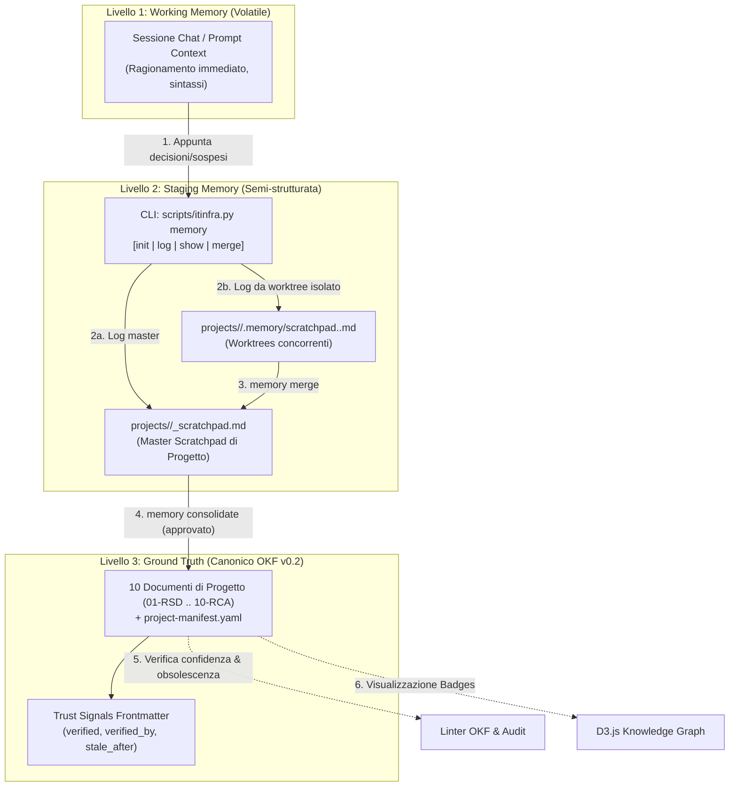
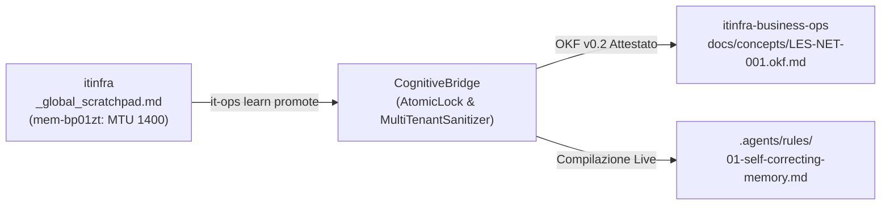

# Guida Operativa: Sistema di Memoria Locale Ibrida a 3 Livelli & Trust Signals

## 1. Obiettivi e Visione Architetturale

Gli agenti conversazionali (Google Antigravity, Claude Code, Cursor, Cline) che operano su progetti complessi di ingegneria delle infrastrutture IT affrontano due criticità fondamentali:
1. **Perdita di contesto:** Al termine della sessione di chat o in caso di riavvio del contesto, i dettagli tecnici concordati con l'operatore vanno persi se non persistiti.
2. **Inquinamento del repository Git (Git Pollution):** Salvare continuamente ogni deduzione provvisoria o frammento di chat direttamente nei 10 documenti ufficiali OKF v0.2 produce decine di micro-commit disordinati, sporcando la cronologia e violando i gate di qualità formale.

Il **Sistema di Memoria Locale Ibrida ITInfra** risolve queste sfide tramite un'architettura **100% File-Based & Git-Native**, completamente priva di demoni esterni (nessun processo SQLite, Redis o ChromaDB in background; nessuna porta TCP locale aperta).



---

## 2. I Tre Livelli Temporali di Memoria

| Livello | Nome | Supporto | Durata | Struttura | Scopo |
|---|---|---|---|---|---|
| **L1** | **Working Memory** | Memoria RAM / Context Window | Singola sessione chat | Volatile | Ragionamento contingente, parsing dei prompt |
| **L2** | **Staging Scratchpad** | `projects/<slug>/_scratchpad.md`<br>+ `projects/_global_scratchpad.md` | Settimane / Mesi | Semi-strutturato (Markdown) | Accumulo decisioni locali, best practice globali e requisiti |
| **L3** | **Ground Truth** | `projects/<slug>/NN-TIPO.md` | Permanente (Tracciato Git) | Rigoroso OKF v0.2 + YAML | Verità ingegneristica certificata per il cliente |

---

## 3. Struttura dello Scratchpad Locale (`_scratchpad.md`)

Ogni progetto dispone di un file di staging dedicato: `projects/<slug>/_scratchpad.md`.

```markdown
# ITInfra Memory Scratchpad — <project-slug>

## 1. Decisioni Tecniche Confermate
- [2026-09-16 11:04] [agent] (Lead Architect) Standardizzato schema subnet management su 192.168.120.0/24 <!-- id:mem-0dc0cb7b -->
- [2026-09-16 11:04] [infra-architect] (Mario Rossi) Confermato passaggio a Jumbo Frame MTU 9000 su VLAN 40 iSCSI <!-- id:mem-faa58890 -->

## 2. Requisiti in Sospeso (<DA-RICHIEDERE>)
- [2026-09-16 11:05] [infra-security] (Sec Lead) <DA-RICHIEDERE> Modello esatto firewall backup per failover WAN <!-- id:mem-9e4c3b67 -->

## 3. Note Operative & Contatti
- [2026-09-16 11:10] [infra-automation] Switch CRS326 accessibile via vault://it/projects/severino-srl/sw-core/admin <!-- id:mem-f1a2b3c4 -->

## 4. Cronologia Consolidamenti
### Consolidamento verso [03-LLD.md] — 2026-09-16 (Mario Rossi (Tech Lead))
- ...
```

### 3.1 Estensione Globale: Staging Scratchpad Cross-Progetto (Release v0.8)
A partire dalla **Release v0.8**, il Livello 2 si estende a livello inter-progetto tramite lo **Staging Scratchpad Globale** ([`projects/_global_scratchpad.md`](file:///c:/Users/auresystem/repos/itinfra/projects/_global_scratchpad.md)).
Questo pool accoglie regole architetturali trasversali, limitazioni hardware verificate su più clienti e raccomandazioni di vendor. È governato da:
- **Sanitizer Preventivo:** Blocca secret leakage (`vault://it/projects/`) verso il pool condiviso.
- **Atomic File Lock:** Previene corruzioni concorrenti da agenti multipli.
- Per tutti i dettagli operativi sui comandi `memory --global` e sulla suite di test, consultare la guida dedicata: [`10-GUIDA-GLOBAL-MEMORY-SYSTEM-TEST.md`](./10-GUIDA-GLOBAL-MEMORY-SYSTEM-TEST.md).


### Regole dello Scratchpad:
1. **Identificativo univoco (Hash ID):** Ogni voce dispone di un tag `<!-- id:mem-xxxxxxxx -->` calcolato deterministicamente con SHA-256 per prevenire duplicazioni.
2. **Anti-inquinamento Git:** L'agente appunta le risposte dell'utente qui senza modificare i 10 documenti ufficiali.
3. **Strict Grounding:** Le informazioni incomplete o non verificate vengono registrate obbligatoriamente nella Sezione 2 con il marcatore `<DA-RICHIEDERE>`.

---

## 4. Gestione della Concorrenza Multi-Agente sui Git Worktree

Quando più subagenti AI (es. `infra-architect`, `infra-security`, `infra-automation`) operano in parallelo su rami e worktree isolati:
1. Specificando `--role <ruolo>` nel comando `log`, la memoria viene registrata in:
   `projects/<slug>/.memory/scratchpad.<ruolo>.md`
2. Questo impedisce conflitti di concorrenza o merge conflicts sul file `_scratchpad.md`.
3. Al termine dell'elaborazione parallela, si esegue:
   ```bash
   python scripts/itinfra.py memory merge <slug>
   ```
   Il comando estrae le voci da tutti gli scratchpad di ruolo, scarta gli ID già presenti, le appende nelle rispettive sezioni di `_scratchpad.md` ed elimina automaticamente i file temporanei fusi.

---

## 5. Ciclo di Consolidamento Guidato (L2 &rarr; L3)

Il passaggio dalla memoria di staging alla verità canonica avviene tramite consolidamento esplicito:

```bash
python scripts/itinfra.py memory consolidate <slug> --target <doc> --reviewer "<Nome Revisore>" [--stale-days 90]
```

### Cosa accade durante il consolidamento:
1. **Safety Check:** Se le decisioni da consolidare contengono residui `<DA-RICHIEDERE>`, il comando **blocca l'operazione** per impedire il passaggio di dati allucinati o incompleti.
2. **Aggiornamento YAML Target:** Inietta nel frontmatter del documento target i metadati di confidenza (**Trust Signals**).
3. **Iniezione Documentale:** Inserisce in fondo al corpo Markdown del documento target la sezione `## Decisioni Tecniche Consolidate da Staging Memory` con le voci formalizzate e firmate.
4. **Archiviazione Scratchpad:** Rimuove le decisioni consolidate dalla Sezione 1 dello scratchpad e le registra in Sezione 4 (`## 4. Cronologia Consolidamenti`).

---

## 6. Trust Signals: Metadati di Confidenza e Obsolescenza

Lo standard OKF v0.2 è esteso con quattro metadati canonici di confidenza:

```yaml
verified: true                   # Booleano: certifica validazione umana formale
verified_by: "Mario Rossi (Tech Lead)"  # Identificativo dell'approvatore
last_vetted: "2026-09-16"        # Data ISO dell'ultima revisione confermata
stale_after: "2026-12-15"        # Data ISO di scadenza della validità tecnica
```

### Comportamento del Linter e del Grafo:
- **Linter `itinfra.py validate`:**
  - Se `verified: true`, esige la presenza di `verified_by` e `last_vetted`.
  - Se la data odierna supera `stale_after`, emette un avviso `[STALE-WARNING]`:
    *`[STALE-WARNING] Documento scaduto il YYYY-MM-DD (stale_after superato). Richiede ricertificazione tecnica prima dell'uso.`*
- **Audit `itinfra.py audit-consistency`:**
  - Riporta il numero di documenti verificati e segnala qualsiasi documento con certificazione scaduta.
- **Knowledge Graph D3.js `itinfra.py export-graph`:**
  - I nodi con `verified: true` presentano un bordo verde brillante `✓` e un badge dedicato nel pannello dettagli.
  - I nodi con `stale_after` scaduto presentano un bordo tratteggiato rosso/arancione `⚠` con avviso di ricertificazione.

---

## 7. Prontuario Comandi CLI (`scripts/itinfra.py memory`)

| Comando | Descrizione |
|---|---|
| `python scripts/itinfra.py memory init <slug>` | Crea `projects/<slug>/_scratchpad.md` con sezioni predefinite. |
| `python scripts/itinfra.py memory log <slug> --section decisioni --text "..." [--role <ruolo>]` | Registra una decisione confermata con timestamp e ID univoco. |
| `python scripts/itinfra.py memory log <slug> --section sospesi --text "<DA-RICHIEDERE> ..."` | Registra un requisito aperto in attesa di risposta. |
| `python scripts/itinfra.py memory log <slug> --section note --text "..."` | Registra una nota operativa o riferimento a credenziali `vault://`. |
| `python scripts/itinfra.py memory show <slug>` | Visualizza a terminale lo stato dello scratchpad e le statistiche. |
| `python scripts/itinfra.py memory merge <slug>` | Fonde le memorie isolate dei worktree paralleli nello scratchpad master. |
| `python scripts/itinfra.py memory consolidate <slug> --target 03-LLD --reviewer "Nome"` | Consolda le decisioni in L3 e applica i Trust Signals. |
| `python scripts/itinfra.py memory prune <slug>` | Archivia lo scratchpad corrente in `_scratchpad.archive.md` e ripristina lo stato vuoto. |

---

## 8. Integrazione nelle Skill Agentiche (Antigravity, Cursor, Claude Code)

Nelle conversazioni con agenti AI:
1. **Fase di Avvio:** L'agente legge `_scratchpad.md` prima di condurre l'intervista tecnica per non porre domande a cui l'utente ha già risposto.
2. **Durante il Dialogo:** Al raggiungimento di ogni accordo tecnico su IP, subnet, VLAN o sizing hardware, l'agente esegue automaticamente `itinfra.py memory log`.
3. **In Chiusura:** Quando il documento tecnico è completo, l'agente propone il consolidamento esplicito (`memory consolidate`), assicurando la conformità a OKF v0.2.

---

## 9. Federazione Cross-Repo & Cognitive Bridge (`SPEC-17`)

Le decisioni tecniche e le scoperte infrastrutturali archiviate nel pool L2 globale (`projects/_global_scratchpad.md`) possono essere promosse a **Guardrail Attestati Immutabili** condivisi tra `itinfra` e `itinfra-business-ops`.



### Flusso di Promozione da L2 a Guardrail Attestato:
1. **Identificazione della Lesson Learned**: un pattern tecnico consolidato (es. *ZeroTier MTU 1400 / TCP MSS Clamping per evitare stalli SMB*) viene registrato in `projects/_global_scratchpad.md`.
2. **Validazione di Sicurezza Multi-Tenant**: il modulo `validate_global_entry_safety` verifica l'assenza assoluta di dati sensibili del cliente (IP privati, FQDN, credenziali, nomi aziendali).
3. **Promozione Attestata**: tramite la CLI di governance (`it-ops learn promote <entry_id> --code LES-NET-001 --title "..."`), la decisione viene trascritta in un nodo OKF v0.2 con metadati di confidenza, sigillo SHA-256 e status `attested`.
4. **Attivazione Direttiva AI**: il motore `MemoryEngine` compila automaticamente la regola all'interno di `.agents/rules/01-self-correcting-memory.md`, rendendo il guardrail attivo a costo zero di token per ogni sessione di Antigravity.

