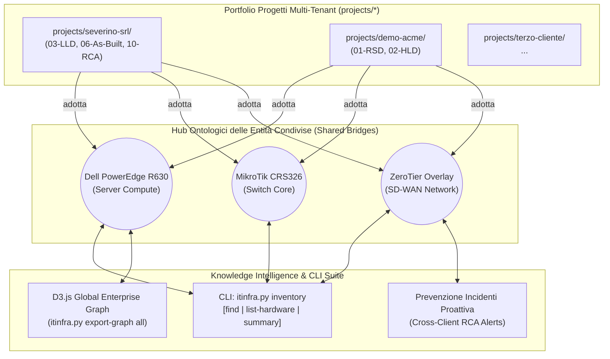

# Guida Operativa: Global Enterprise Asset & Entity Knowledge Graph

## 1. Obiettivi e Visione Architetturale

La maggior parte dei sistemi documentali isola i progetti cliente in cartelle stagne: se un integratore o un team di ingegneria gestisce 20 clienti diversi, le informazioni su modelli hardware, apparati di rete, bug firmware e configurazioni convalidate rimangono intrappolate nel singolo progetto.

Il **Global Enterprise Asset & Entity Knowledge Graph di ItInfra (Release v0.7)** trasforma questo patrimonio documentale in una **rete ontologica enterprise federata**, consentendo:
1. **Interpolazione Cross-Progetto:** Interrogare istantaneamente quali clienti utilizzano uno specifico server (es. *Dell PowerEdge R630*), switch (es. *MikroTik CRS326*) o tecnologia (*ZeroTier*, *Hyper-V*).
2. **Nodi Ponte (Shared Entity Bridges):** Nel visualizzatore D3.js interattivo, le entità condivise emergono come nodi cerniera dorati che collegano i documenti di clienti differenti.
3. **Cross-Client Incident Intelligence:** Se un cliente ha subito un disservizio risolto con una RCA (`10-RCA-*.md`), il sistema avvisa automaticamente chiunque consulti o progetti su apparati omologhi presso altri clienti.
4. **Zero-Leakage Multi-Tenant Security Policy:** I dati sensibili e le credenziali rimangono strettamente cifrati nei singoli file `.vault.enc` di ciascun cliente; solo le entità tecniche non sensibili partecipano alla federazione globale.



---

## 2. Nodi Ponte e Hub Ontologici delle Entità

Nello standard **OKF v0.2**, ogni documento dichiara le sue entità nel frontmatter YAML:

```yaml
entities:
  - name: "Dell PowerEdge R630"
    type: "technology"
    description: "Server cluster di virtualizzazione compute"
  - name: "MikroTik CRS326 Port Mapping"
    type: "toolchain"
    description: "Switch ToR di aggregazione e management"
```

Quando il motore `GlobalInventoryEngine` o il generatore D3.js scansionano la directory `projects/`:
- Identificano le entità che compaiono in più documenti o in progetti distinti.
- Generano automaticamente un **Nodo Hub Entità** centrale (`type: entity_hub`, colore `#f59e0b` ambra dorato).
- Tracciano archi orientati `uses_entity` da ogni documento verso l'hub comune.
- Cliccando sul nodo hub, l'operatore o l'AI ottengono l'elenco esatto di:
  - Tutti i clienti che adottano quella tecnologia.
  - I documenti di riferimento (As-Built, LLD, ATP).
  - Eventuali ticket RCA o disservizi pregressi correlati.

---

## 3. Prontuario Comandi CLI (`scripts/itinfra.py inventory`)

| Comando | Descrizione |
|---|---|
| `python scripts/itinfra.py inventory find "<termine>"` | Ricerca un modello hardware, brand o tecnologia su tutti i progetti, visualizzando clienti, file As-Built e alert RCA. |
| `python scripts/itinfra.py inventory list-hardware [--vendor <vendor>]` | Mostra la tabella normalizzata di tutti i server, switch, router e apparati censiti nel portfolio. |
| `python scripts/itinfra.py inventory summary` | Genera la dashboard statistica con il riepilogo per vendor, categorie tecnologiche e progetti attivi. |

### Esempi Pratici:

```bash
# Cercare tutti i server Dell R630 o hardware Dell:
python scripts/itinfra.py inventory find "Dell"

# Cercare quali progetti impiegano switch MikroTik:
python scripts/itinfra.py inventory find "MikroTik"

# Elencare tutto l'hardware con filtro vendor:
python scripts/itinfra.py inventory list-hardware --vendor Dell
python scripts/itinfra.py inventory list-hardware --vendor MikroTik

# Ottenere la dashboard statistica globale:
python scripts/itinfra.py inventory summary
```

---

## 4. Mappa Interattiva D3.js Enterprise Knowledge Graph

Per generare la visualizzazione globale ad alta densità con tutti i progetti e i ponti ontologici:

```bash
python scripts/itinfra.py export-graph all [--out projects/global-graph.html]
```

### Funzionalità dell'Interfaccia Grafica:
- **Menu a tendina "Tutti i Progetti":** Consente di isolare un singolo cliente (`severino-srl`, `demo-acme`) o osservare la federazione completa.
- **Pulsante Toggle `🔗 Entità Condivise (ON/OFF)`:** Permette di nascondere o mostrare i nodi ponte per focalizzarsi sui soli documenti o sulle interconnessioni hardware.
- **Sidebar Dinamica per Hub Entità:**
  - Mostra descrizione ontologica.
  - Elenco dei clienti che utilizzano l'asset.
  - Box `⚠️ Cross-Client Incident Alert` qualora esistano ticket RCA storicizzati su quell'apparato.

---

## 5. Cross-Client Incident Intelligence & Prevenzione RCA

Uno dei principali vantaggi della federazione è la **prevenzione proattiva dei guasti**:

1. **Il Caso:** Nel progetto `severino-srl`, il server `FS01` su rete `ZeroTier Overlay Network` ha registrato timeout SMB risolti impostando TCP MSS Clamping su MTU 1400 (documentato in `10-RCA-FS01-SMB-Connectivity.md`).
2. **L'Intelligence:** Se un ingegnere o un subagente AI progetta una nuova rete con `ZeroTier` o server omologhi per `Acme Corporation`, il comando `inventory find "ZeroTier"` o il grafo globale segnalano immediatamente:
   ```
   ⚠️ CROSS-CLIENT INCIDENT ALERT (1 ticket RCA collegati a questo termine):
      - [INC-2026-001] Severino Srl (P2-High): Timeout e Degrado Connessioni SMB FS01 su Rete Overlay ZeroTier
   ```
3. **Il Risultato:** Il progettista applica la mitigazione (MTU 1400) già nell'LLD del nuovo cliente, eliminando alla radice la possibilità che il disservizio si ripeta.

---

## 6. Zero-Leakage Multi-Tenant Security Policy

La sicurezza e la privacy dei dati tra clienti diversi sono garantite a livello architetturale:

1. **Secret Isolati:** Ogni progetto conserva le sue credenziali nel file locale cifrato `projects/<slug>/.vault.enc` con chiave e file locking separati.
2. **Nessun Secret nel Grafo:** Il generatore `graph_generator.py` e il modulo `itinfra_inventory.py` leggono esclusivamente il frontmatter OKF v0.2 (`entities`, `title`, `phase`, `author`) e le tabelle hardware pubbliche, scartando qualsiasi blocco cifrato o segreto.
3. **Piena Conformità Normativa:** Mantiene il rispetto rigoroso dei requisiti di confidenzialità NIS2, ISO/IEC 27001 e GDPR.

---

## 7. Linee Guida per gli Agenti AI (Antigravity, Claude Code, Cursor)

Quando l'utente pone domande sul patrimonio infrastrutturale globale:
1. **Domanda di esempio:** *"Quali clienti utilizzano switch MikroTik CRS326 o server Dell R630?"*
2. **Comportamento dell'agente:**
   - Esegue `python scripts/itinfra.py inventory find "<termine>"`.
   - Restituisce una risposta sintetica, strutturata e priva di allucinazioni:
     - Elenco clienti e progetti coinvolti.
     - Documento As-Built di riferimento e indirizzo IP allocato.
     - Eventuali avvisi RCA di rilievo correlati all'apparato.
