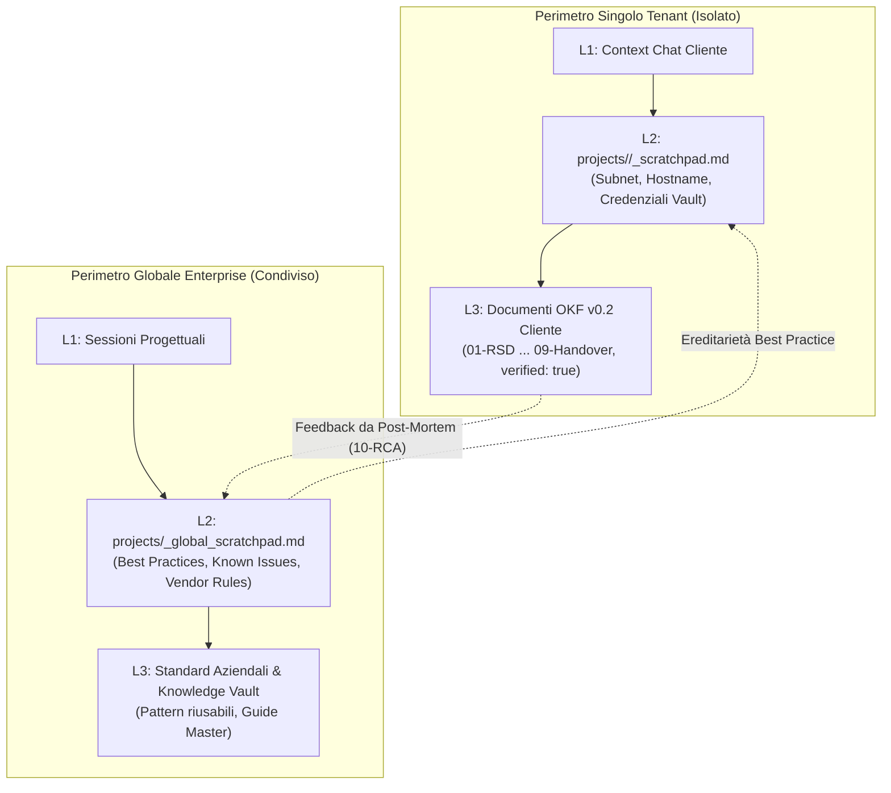

# Guida Operativa: Global Enterprise Memory & Unified Verification Dashboard (Release v0.8)

<!-- AI-INSTRUCTIONS:
  Questa guida descrive l'architettura, la sicurezza multi-tenant e l'uso operativo
  dello Staging Scratchpad Globale (_global_scratchpad.md) e della Test Suite automatizzata
  con dashboard HTML unificata (system-test-report.html).
-->

## 1. Introduzione e Motivazioni Architetturali

La **Release v0.8** risponde a due esigenze primarie emerse nella gestione di infrastrutture IT complesse multi-cliente:
1. **Capitalizzare la conoscenza trasversale (Global Staging Memory):** I singoli tenant mantengono i loro dati confidenziali strettamente segregati, ma l'organizzazione deve poter raccogliere e riutilizzare *best practice di configurazione*, *bug di firmware noti* e *linee guida hardware* scoperte durante i progetti.
2. **Collaudo End-to-End e Certificazione dello Stato di Salute (System Test Suite):** Disporre di un comando unificato in grado di verificare l'intero framework su tutti i 10 moduli fondamentali e produrre una dashboard visiva offline immediatamente consultabile dal management e dai revisori tecnici.

---

## 2. Architettura della Memoria: Tenant Memory vs Global Enterprise Memory

Il sistema a 3 livelli si articola ora su due perimetri complementari:



### Le 4 Sezioni della Memoria Globale (`_global_scratchpad.md`)
1. `## 1. Best Practices & Design Patterns`: Regole architetturali collaudate (es. MTU 1400 su tunnel ZeroTier, Dynamic SET su Hyper-V).
2. `## 2. Known Issues & Hardware Limitations`: Bug noti, drop pacchetti, workaround da analisi post-mortem (es. Black Hole PMTU, link flapping su determinate schede).
3. `## 3. Hardware & Vendor Guidelines`: Requisiti minimi di BIOS, firmware iDRAC e compatibilità ottica transceiver SFP+.
4. `## 4. Open Architectural Questions`: Questioni aperte e decisioni in valutazione a livello di comitato architetturale.

---

## 3. Sicurezza Multi-Tenant & Concorrenza (File Locking)

Per garantire la massima affidabilità in ambienti multi-agente o multi-processo:
- **`AtomicFileLock`:** Ogni operazione di scrittura su `projects/_global_scratchpad.md` acquisisce in modo trasparente un lock atomico su `_global_scratchpad.lock` con timeout a 10s e rimozione automatica dei lock obsoleti (>120s).
- **`Multi-Tenant Sanitizer`:** Il motore analizza ogni riga prima dell'inserimento nella memoria globale. Se rileva pattern `vault://it/projects/...` o password in chiaro, **l'operazione viene bloccata all'istante** con un'eccezione di sicurezza (`[SECURITY BLOCKED] Violazione Multi-Tenant`).

---

## 4. Riferimento Comandi CLI per la Memoria Globale

```bash
# 1. Inizializzare lo scratchpad globale (se non esistente):
python scripts/itinfra.py memory init --global

# 2. Registrare una best practice o una limitazione hardware:
python scripts/itinfra.py memory log --global --section best-practices --text "MikroTik CRS3xx: abilitare sempre hw=yes sui bridge VLAN" --role network-eng
python scripts/itinfra.py memory log --global --section known-issues --text "Dell R630: Broadcom BCM5720 richiede firmware >= 21.60 per evitare flapping" --role hardware

# 3. Visualizzare l'intero catalogo di memoria globale e statistiche:
python scripts/itinfra.py memory show --global

# 4. Archiviare e reimpostare lo scratchpad globale pulito:
python scripts/itinfra.py memory prune --global [--no-archive]
```

---

## 5. Enterprise System Test Suite (`itinfra.py test-suite`)

La suite automatizzata esegue il collaudo sequenziale dei 16 moduli cardine del framework itinfra:

| Modulo | Codice | Nome Modulo | Descrizione Collaudo |
|---|---|---|---|
| **01** | `MOD-01` | **OKF v0.2 Formal Linter** | Verifica conformità e frontmatter di tutti i template e documenti |
| **02** | `MOD-02` | **Strict Grounding Audit** | Verifica semantica IP, assenza parametri fuori subnet o allucinazioni |
| **03** | `MOD-03` | **Local Encrypted Vault** | Test cifratura AES-256-GCM sandboxata, lock atomico e assenza leak Git |
| **04** | `MOD-04` | **Multi-Agent Worktree** | Verifica toolchain isolamento branch paralleli per i 4 ruoli |
| **05** | `MOD-05` | **Configuration Playbooks** | Estrazione e convalida sintattica script RouterOS (`.rsc`) e PowerShell (`.ps1`) |
| **06** | `MOD-06` | **Incident & Telemetry** | Validazione conformità schede RCA (`10-RCA`) su standard OSI L1-L7 e telemetria |
| **07** | `MOD-07` | **Hybrid Memory System** | Test memoria locale tenant, globale enterprise, FileLock e Sanitizer |
| **08** | `MOD-08` | **Global Asset Inventory** | Scansione portfolio, normalizzazione vendor e censimento apparati |
| **09** | `MOD-09` | **Cross-Client RCA Alert** | Verifica allarmi preventivi intelligenti correlati a tecnologie con RCA |
| **10** | `MOD-10` | **D3.js Knowledge Graph** | Verifica integrità grafo federato, archi semantici pesati e nodi ponte |
| **11** | `MOD-11` | **Local Workspace & Central Publish** | Architettura workspace SSD locale, publishing e quality gate |
| **12** | `MOD-12` | **Client Interactive & Auto-Dist** | Continuous delivery su share master, auto-sync e interattività |
| **13** | `MOD-13` | **Project Scaffolding & Manifest** | Auto-scaffolding atomico e propagazione manifest |
| **14** | `MOD-14` | **Resiliency & Reverse Reconciliation** | Protezione da typo, rollback atomico e riconciliazione inversa |
| **15** | `MOD-15` | **Enterprise Integrity & Drift Guard** | Mermaid linter offline, anti-leak credenziali e drift detection |
| **16** | `MOD-16` | **Remote Resiliency & VPN FastPath** | TTL vault su tunnel lenti e bypass failover per VPN ZeroTier |

### Sintassi di Esecuzione:
```bash
# Esecuzione completa con esportazione della Dashboard HTML:
python scripts/itinfra.py test-suite

# Esecuzione solo terminale (senza generare file HTML):
python scripts/itinfra.py test-suite --no-html

# Esecuzione con percorso di output personalizzato:
python scripts/itinfra.py test-suite --out exports/system-audit.html
```

---

## 6. Unified Verification Dashboard HTML (`projects/system-test-report.html`)

La dashboard HTML generata è progettata con i seguenti criteri industriali:
- **100% Zero-CDN & Air-Gapped:** Non carica risorse esterne. Tutto il CSS e il codice JavaScript sono incorporati direttamente nel file HTML, consentendo l'ispezione in ambienti data center senza connettività internet.
- **KPI Scorecard Esecutiva:** Visualizza ad alto impatto il Pass Rate complessivo (100%), il tempo di collaudo (es. ~7.3s), il conteggio delle allucinazioni (0) e dei secret leak (0).
- **Accordion Interattivi & Filtri Tab:** Permette di navigare tra categorie (*Core & Compliance, Sicurezza, Automazione, Telemetria, Memoria, Inventario, Distribuzione, Resilienza*) e filtrare istantaneamente tramite la barra di ricerca live.
- **Pulsante One-Click Copy:** Consente di copiare il riepilogo formattato negli appunti per verbali o comunicazioni interne.
- **Collegamenti Rapidi:** Link diretti a `global-graph.html` e ai report di progetto offline.

---

## 7. Checklist di Validazione & Gate di Qualità

Prima di dichiarare completata una sessione o un rilascio:
- [x] Lo scratchpad globale `projects/_global_scratchpad.md` supera `itinfra.py validate`.
- [x] Il sanitizer multi-tenant blocca i secret e impedisce commistioni tra progetti.
- [x] L'esecuzione di `python scripts/itinfra.py test-suite` restituisce `16/16 PASS (100.0%)`.
- [x] Il file `projects/system-test-report.html` è generato e visualizzabile offline in qualsiasi browser moderno.

---

## 8. Integrazione con Cognitive Bridge (`SPEC-17`)

Lo Staging Scratchpad Globale funge da vivaio per le regole architetturali cross-progetto.
Tramite il modulo connettore `CognitiveBridge` (`itinfra-business-ops/scripts/core/cognitive_bridge.py`):
1. I tecnici e gli agenti leggono `projects/_global_scratchpad.md` liberamente per consultare soluzioni consolidate.
2. Quando una voce raggiunge maturità e valore permanente (es. `mem-bp01zt` per ZeroTier MSS clamping), il comando `it-ops learn promote mem-bp01zt --code LES-NET-001` la promuove automaticamente a **Guardrail Attestato OKF v0.2**.
3. Il file di lock atomico `projects/_global_scratchpad.lock` garantisce la mutua esclusione sia da `itinfra` che da `itinfra-business-ops`, prevenendo corruzioni concorrenti.

