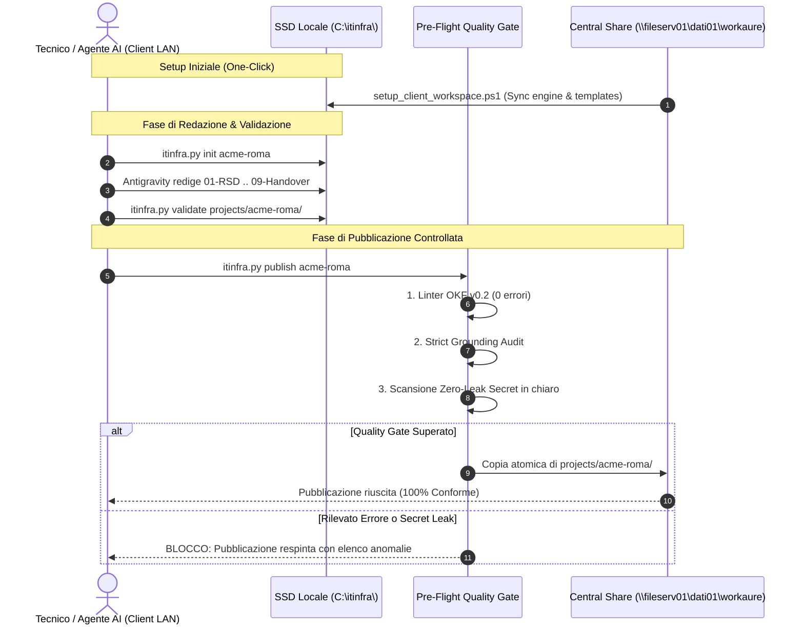

# Guida Operativa: Architettura Local Workspace & Central Publish (Release v0.9)

<!-- AI-INSTRUCTIONS:
  Questa guida definisce lo standard architetturale per la distribuzione e l'utilizzo multi-operatore
  della suite ITInfra. Istruisce tecnici e agenti AI a lavorare su workspace locali veloci su SSD
  e a pubblicare progetti verso lo storage master centrale esclusivamente previo superamento del Quality Gate.
-->

## 1. Obiettivi e Visione Architetturale

L'architettura **Local Workspace & Central Publish** (Release v0.9) risolve alla radice le complessità tipiche degli ambienti multi-operatore in rete locale:
1. **Prestazioni Native SSD:** Gli agenti AI (come Antigravity) operano su file system locale ad altissima velocità, eliminando le latenze SMB e i timeout dei file watcher di Windows su percorsi di rete UNC.
2. **Inviolabilità del Motore Centrale:** I file sorgente (`scripts/`), i template normativi (`templates/`), le guide (`docs/`) e il repository `.git/` rimangono protetti sulla macchina di sviluppo master e non sono esposti a modifiche accidentali da parte dei client secondari.
3. **Quality Gate Prima della Condivisione:** Nessun progetto può essere riversato nello storage centrale se presenta errori formali OKF v0.2, placeholder illegali o credenziali in chiaro.
4. **Isolamento Multi-Tenant Totale:** Ciascun operatore lavora esclusivamente sulla cartella del cliente assegnato (`projects/<slug>/`), senza alcun rischio di sovrascrivere o corrompere i progetti dei colleghi.

---

## 2. Topologia del Flusso di Lavoro



---

## 3. Guida per l'Amministratore Master (Setup Storage Centrale)

Sulla macchina di sviluppo master (utente `auresystem`):

1. **Inizializzazione della Share Master:**
   Eseguire lo script PowerShell per allestire e allineare la cartella condivisa:
   ```powershell
   powershell -ExecutionPolicy Bypass -File scripts/init_central_share.ps1
   ```
   Lo script:
   - Crea le cartelle `scripts/`, `templates/`, `docs/` e `projects/` su `\\fileserv01\dati01\workaure`.
   - Sincronizza tutti gli script Python, i template OKF v0.2 e le guide ufficiali.
   - Allinea i file di governance (`README.md`, `ROADMAP.md`, `AGENTS.md`).

---

## 4. Guida per i Tecnici LAN (Allestimento Client Windows 11)

Su qualsiasi workstation client della rete LAN o VPN:

1. **Setup One-Click del Workspace Locale:**
   Aprire PowerShell ed eseguire:
   ```powershell
   powershell -ExecutionPolicy Bypass -File \\fileserv01\dati01\workaure\scripts\setup_client_workspace.ps1
   ```
   L'automazione:
   - Crea la cartella di lavoro su disco locale `C:\itinfra\`.
   - Scarica la copia più recente del motore, dei template e delle guide.
   - Crea il file di configurazione `.itinfra_config.json` con puntamento predefinito a `\\fileserv01\dati01\workaure`.
   - Verifica la presenza dell'interprete Python nel sistema.

2. **Inizializzare un Nuovo Progetto Cliente:**
   ```powershell
   cd C:\itinfra
   python scripts/itinfra.py init <slug> --client "<Nome Cliente>" --name "<Titolo Progetto>"
   ```

3. **Lavorare con l'Agente AI:**
   - Aprire la cartella `C:\itinfra` in Antigravity.
   - Condurre l'intervista tecnica guidata per compilare i documenti OKF v0.2 in `projects/<slug>/`.

---

## 5. Comando `publish`: Meccanismo di Pubblicazione, Quality Gate & Drift Guard (Release v0.9 / v0.9.13)

Quando la documentazione di un cliente è completata o pronta per il rilascio di milestone:

### Sintassi del Comando
```powershell
python scripts/itinfra.py publish <slug> [--dest <path>] [--dry-run] [--force] [--include-vault]
```

### Parametri e Opzioni
| Parametro | Descrizione |
|---|---|
| `<slug>` | Nome univoco della cartella progetto in `projects/` da pubblicare |
| `--dest` | *(Opzionale)* Sovrascrive il percorso della share centrale configurata in `.itinfra_config.json` |
| `--dry-run` | Esegue il Quality Gate completo e mostra l'elenco dei file pronti senza copiare nulla sul server |
| `--force` | Forza la sovrascrittura in caso di progetti approvati o conflitti di drift rilevati sulla share |
| `--include-vault` | Include il file cifrato dei secret (`.vault.enc`) nella cartella remota pubblicata |

### Controlli del Pre-Flight Quality Gate
1. **Linter OKF v0.2 & Mermaid Syntax Linter:** Tutti i documenti Markdown in `projects/<slug>/` vengono analizzati con `OKFValidator`. Vengono controllati schema OKF v0.2, campi obbligatori e diagrammi Mermaid (24 tipi canonici e parentesi bilanciate).
2. **Strict Grounding Audit:** Verifica semantica dell'assenza di placeholder illegali o subnet incongruenti, con supporto ai blocchi canonici ```yaml:inventory e ```yaml:network.
3. **Scansione Anti-Leak:** Ispezione riga per riga contro credenziali in chiaro (es. `admin_password: "..."`). Le credenziali devono usare riferimenti `vault://it/projects/<slug>/...` o `<DA-RICHIEDERE>`.

### Protezioni Distribuite (Release v0.9.12 & v0.9.13)
- **Lock Remoto Distribuito (`RemoteShareLock`):** Acquisizione atomica O_CREAT|O_EXCL del lockfile `.publish_<slug>.lock` sulla share prima del trasferimento per prevenire scritture concorrenti.
- **Rilevamento del Drift Remoto (`.publish_manifest.json`):** Generazione automatica dell'impronta crittografica SHA-256 di tutti i file sincronizzati. Se un file sulla share master è stato modificato out-of-band, il comando blocca il publish segnalando `[CONFLITTO REMOTO RILEVATO]`.
- **Staging-then-Swap Atomico:** Scrittura preliminare su `.staging_<slug>_<pid>_<ts>` e trasferimento finale atomico per prevenire corruzioni da disconnessioni di rete.

### Esempio di Risultato di Successo
```text
[SUCCESSO] Progetto 'severino-srl' pubblicato con successo!
  Sorgente: C:\itinfra\projects\severino-srl
  Destinazione centrale: \\fileserv01\dati01\workaure\projects\severino-srl
  File sincronizzati: 14 (512.4 KB)
  Protezione Concorrenza: Lock atomico acquisito e rilasciato con successo
  Quality Gate OKF v0.2: 100% CONFORME (0 errori)
```

---

## 6. Comando `sync-engine`: Aggiornamento del Motore Locale

Quando l'amministratore rilascia nuovi template normativi, aggiornamenti alla CLI o guide operative:

```powershell
python scripts/itinfra.py sync-engine [--source <path>] [--dry-run]
```

- Esegue la scansione differenziale tra la share centrale e il workspace locale.
- Aggiorna automaticamente i file di `templates/`, `scripts/` e `docs/` che presentano una data di modifica più recente sul server master.
- Lascia **ermeticamente intatti** tutti i file di lavoro presenti nella cartella locale `projects/`.

---

## 7. Matrice di Sicurezza & Conformità Operativa

| Risorsa | Posizione Locale (`C:\itinfra`) | Posizione Centrale (`\\fileserv01\...`) | Protezione Applicata |
|---|---|---|---|
| **Sorgenti Python (`scripts/`)** | Esecuzione locale veloce | Storage protetto | Modificabile solo dal Developer master |
| **Template OKF v0.2** | Copia di lavoro | Standard ufficiale | Immutabili durante le sessioni di compilazione |
| **Progetti Cliente (`projects/`)** | Cartella del singolo tenant | Raccolta progetti aziendali | Sincronizzati solo via Quality Gate atomico |
| **Secret Vault (`.vault.enc`)** | Cifrato in AES-256-GCM locale | Escluso dalla pubblicazione | Zero credenziali in chiaro trasmesse in rete |
