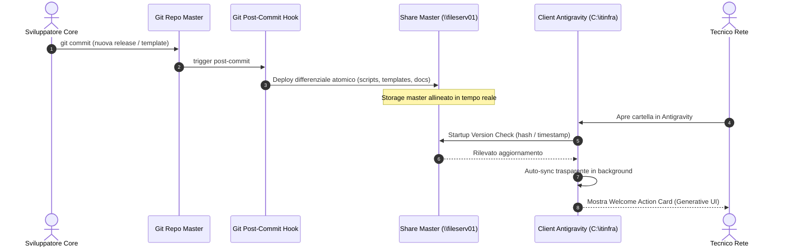

# Specifica Tecnica: Client Interactive Experience & Automated Distribution Workflow (Release v0.9.5)

<!-- AI-INSTRUCTIONS:
  Questo documento fissa l'architettura tecnica e le specifiche implementative per la Release v0.9.5,
  focalizzata sull'automazione della distribuzione (Continuous Delivery su share centrale),
  sull'auto-aggiornamento trasparente dei client e sull'arricchimento dell'esperienza utente
  tramite Task GUI One-Click, Generative UI Action Cards e Slash Commands in Google Antigravity.
-->

## 1. Obiettivi e Principi di Progettazione

La Release v0.9.5 ha lo scopo di eliminare qualsiasi attrito operativo sia per il team di sviluppo che per i tecnici client:
1. **Zero-Manual Deploy:** Chi sviluppa nel repository master non deve eseguire script di copia manuale: ogni `git commit` aggiorna automaticamente lo storage centrale `\\fileserv01\dati01\workaure`.
2. **Zero-Manual Update:** I tecnici sui client remoti non devono ricordarsi di lanciare `sync-engine`: Antigravity rileva all'avvio le nuove versioni e sincronizza in background.
3. **One-Click GUI Experience:** I tecnici possono invocare qualsiasi operazione (check permessi, validazione, pubblicazione) tramite pulsanti GUI dell'IDE o card interattive in chat, senza dover digitare comandi da terminale.

---

## 2. Architettura del Flusso di Distribuzione Continua



---

## 3. Specifica dei Componenti Software

### 3.1 Motore di Auto-Deploy (`scripts/itinfra_deploy.py`)
Il componente `itinfra_deploy.py` gestisce la sincronizzazione differenziale dal repository master verso la share centrale:
- **Hashing Differenziale:** Calcola l'hash SHA-256 e il timestamp di modifica dei file sorgente (`scripts/`, `templates/`, `docs/`, `skills/`, `.agents/`, root markdown).
- **Copia Atomica:** Aggiorna esclusivamente i file modificati o aggiunti, evitando scritture ridondanti su rete SMB.
- **Inviolabilità di `projects/`:** Non tocca mai la sottocartella `projects/`, che appartiene esclusivamente ai progetti cliente pubblicati.
- **Integrazione CLI:** Esposto tramite `python scripts/itinfra.py deploy-share [--dry-run] [--force]`.

### 3.2 Git Post-Commit Hook (`.git/hooks/post-commit`)
Script di hook locale che intercetta la finalizzazione di ogni commit Git:
```bash
#!/bin/sh
python scripts/itinfra_deploy.py --quiet
```
- Esecuzione non bloccante: se la share non è raggiungibile (es. sviluppatore offline o senza VPN), l'hook emette un avviso informativo senza interrompere il flusso di Git.

### 3.3 Motore Client Startup Auto-Sync (`scripts/itinfra_sync.py`)
Eseguito sul client all'apertura del workspace:
- Legge il file di configurazione locale `.itinfra_config.json`.
- Interroga lo stato della share centrale dichiarata.
- Se presenti differenze nei template o negli script del framework, applica l'aggiornamento rapido in locale.
- Aggiorna il timestamp `"last_sync_timestamp"` in `.itinfra_config.json`.

### 3.4 Configurazione Attività GUI One-Click (`.vscode/tasks.json`)
Fornisce un menu di 8 attività integrate richiamabili tramite tastiera (`Ctrl+Shift+B` per la validazione automatica del documento corrente) o dalla barra dei menu:
1. `[ITInfra] Diagnostica Connessione e Permessi Share (check-share)`
2. `[ITInfra] Sincronizza Motore e Template da Server (sync-engine)`
3. `[ITInfra] Inizializza Nuovo Progetto Cliente (init)`
4. `[ITInfra] Valida Documento OKF v0.2 Attivo (validate)`
5. `[ITInfra] Audit Coerenza e Zero-Hallucination (audit-consistency)`
6. `[ITInfra] Pubblica Progetto su Storage Master (publish)`
7. `[ITInfra] Esegui Enterprise System Test Suite (test-suite)`
8. `[ITInfra] Genera e Apri Knowledge Graph D3.js (export-graph)`

### 3.5 Generative UI Action Cards (`scripts/itinfra_ui.py`)
Generatore di markup HTML/CSS moderno conforme allo standard Generative UI per Google Antigravity:
- **Welcome Action Card:** Presentata al primo avvio o su richiesta di stato:
  - Indicatori di stato: connessione share, versione locale, conformità permessi.
  - Pulsanti cliccabili con azione immediata: *Nuovo Progetto*, *Controlla Permessi*, *Allinea Template*.
- **Pre-Flight Quality Gate Card:** Presentata prima della pubblicazione di un progetto:
  - Semaforo a 3 vie: Validazione OKF v0.2 (0 errori), Strict Grounding (IP conformi), Scansione Anti-Leak (0 secret in chiaro).
  - Pulsante di pubblicazione atomica con conferma visiva.

### 3.6 Zero-Friction CLI & Desktop Launcher (`it.cmd`, `update.cmd`, Desktop Shortcut)
Per eliminare la necessità di memorizzare comandi complessi:
- **`update.cmd`**: Eseguibile batch immediato nella radice del workspace che lancia `itinfra_sync.py`.
- **`it.cmd`**: Wrapper CLI a 1 parola (`it start`, `it update`, `it check`, `it publish <slug>`), registrato automaticamente nel `PATH` utente.
- **Desktop Launcher 1-Clic (`ITInfra - Aggiorna e Avvia.cmd`)**: Creato sul Desktop utente da `setup_client_workspace.ps1`. Implementa un probe TCP non-bloccante sulla porta 445 (timeout 1.5s):
  - Se online: esegue la sincronizzazione e lancia Antigravity.
  - Se offline: notifica lo stato disconnesso e avvia comunque l'IDE locale senza bloccare l'operatività del tecnico.

---

## 4. Matrice di Sicurezza & Zero-Leakage Policy

| Livello | Meccanismo di Controllo | Garanzia di Sicurezza |
| :--- | :--- | :--- |
| **Sviluppatore** | Git Post-Commit Hook | Deploy limitato strettamente a core/templates (nessun tocco su `projects/`) |
| **Share Master** | ACL NTFS su `workaure` | Sola lettura per `gruppo_tecnici` su core; Modifica solo in `projects/` |
| **Client Local** | Pre-Flight Quality Gate | Blocco immediato se presenti secret in chiaro (obbligo `vault://`) |
| **Client Local** | Startup Auto-Sync | Sincronizzazione unidirezionale server → client (nessun overwrite del server) |

---

## 5. Piano di Collaudo e Modulo MOD-12

L'Enterprise System Test Suite (`scripts/itinfra_test_suite.py`) viene arricchita con il nuovo modulo **`MOD-12`**:
- **Test 1:** Validazione sintattica e strutturale del file `.vscode/tasks.json`.
- **Test 2:** Simulazione del Deploy Engine differenziale su directory mock temporanea.
- **Test 3:** Simulazione dell'Auto-Sync Engine client con rilevamento differenze.
- **Test 4:** Generazione e validazione del markup HTML Generative UI.
