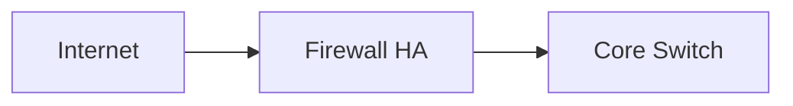

# Esempio prompt — HLD (High-Level Design)

Scenario: proseguimento del progetto Acme Milano, dopo RSD/URS già compilato.

---

## Scenario di esempio

- **Progetto**: acme-milano-2026 (stesso del RSD/URS)
- **Documento precedente già compilato**: RSD/URS (id: `specification-acme-milano-rsd-01`)
- **Obiettivo**: tradurre i requisiti del RSD/URS in una proposta architetturale macroscopica

---

## Prompt completo (copia e personalizza)

```text
## RUOLO E CONTESTO

Sei un solution architect senior specializzato in infrastrutture IT enterprise.
Il tuo compito è compilare il template HLD (High-Level Design) partendo dai
requisiti definiti nel RSD/URS già esistente.

Prima di iniziare:
1. Leggi /download/templates/AGENTS.md (o CLAUDE.md)
2. Leggi /download/templates/00-INDEX.md
3. Leggi il documento RSD/URS già compilato:
   /vault/projects/acme-milano-2026/01-RSD-URS.md (id: specification-acme-milano-rsd-01)
4. Conferma con un riepilogo di 5 righe dei requisiti principali (RF-xxx, RNF-xxx)

## INPUT DATI — Progetto

- project_id: acme-milano-2026
- project_name: Sostituzione Infrastruttura Datacenter Milano
- site: MIL-01
- customer: Acme S.p.A.
- author: Mario Rossi (Solution Architect, Integratore)
- reviewer: Giulia Bianchi (Tech Lead)
- approver: Luca Verdi (Sponsor Acme)
- owner_team: Acme Operations

## DATI SPECIFICI — HLD

### Decisioni architetturali già prese (input)
- Compute: 3 nodi Dell PowerEdge R750, cluster VMware vSphere 8.0 U2 (HA + DRS)
- Storage: NetApp FAS8700 dual controller, all-flash + NL-SAS hybrid
- Networking: Cisco Nexus 9300 series per core e ToR (MLAG)
- Firewall: Fortinet FortiGate 200F in HA active/passive
- Backup: Veeam Backup & Replication + hardened Linux repository
- DR: replica async storage verso sito BG-01 (NetApp SnapMirror)
- Monitoring: Zabbix + Grafana
- Identity: integrazione AD esistente (acme.local)

### Diagramma topologico richiesto
- Includere: Internet, firewall HA, core switch MLAG, 2 rack (compute + storage),
  link verso sito DR, sedi remote via SD-WAN

### ADR (Architecture Decision Records) da documentare
- ADR-001: scelta VMware vSphere vs Hyper-V (per coerenza con skills team)
- ADR-002: scelta NetApp vs HPE Alletra (cost/benefit)
- ADR-003: scelta FortiGate vs Palo Alto (licensing + features UTM)

### Vincoli cliente
- Data residency: tutti i dati devono restare in Italia (no cloud estero)
- Vendor support: preferenza per vendor con presenza locale (Cisco, NetApp, Fortinet, Dell)

## TEMPLATE DA COMPILARE

Template path: /download/templates/02-HLD.md
Tipo documento: HLD
Fase: 2

- Leggi attentamente il blocco <!-- AI-INSTRUCTIONS --> nel frontmatter del template
- Rispetta TUTTE le regole elencate
- Sostituisci TUTTI i placeholder <...>
- NON scendere in dettagli puntuali (IP, porte, parametri config): quelli sono LLD
- Includere almeno 1 diagramma logico (blocco mermaid inline)
- Mappare ogni requisito Must del RSD/URS alla componente architetturale (sezione §11)

## DOCUMENTI CORRELATI (depends_on)

- depends_on: [specification-acme-milano-rsd-01]
- Leggi /vault/projects/acme-milano-2026/01-RSD-URS.md prima di iniziare

In related_docs del nuovo HLD, indicare:
- specification-acme-milano-rsd-01 (gia compilato)
- architecture-acme-milano-lld-01 (placeholder, da compilare)
- guide-acme-milano-mop-01 (placeholder, da compilare)

## VINCOLI DI OUTPUT

- Lingua: italiano (lang: it)
- Status: draft
- Versione: 0.1
- ID documento: architecture-acme-milano-hld-01

## FORMATO DI OUTPUT ATTESO

Restituisci:
1. Documento completo in blocco Markdown (```markdown ... ```)
2. Riepilogo sintetico (3-5 righe) incluse le decisioni architetturali principali
3. Path e id suggeriti:
   - Path: /vault/projects/acme-milano-2026/02-HLD.md
   - ID: architecture-acme-milano-hld-01

Compila il documento ora.
```

---

## Output atteso

Documento HLD completo con:

- Executive summary comprensibile a sponsor non tecnici
- Visione architetturale con principi guida (HA by default, defense in depth, IaC first, observability)
- Diagramma logico (Mermaid inline) con topologia macro
- Tabelle componenti principali (vendor/modello/ruolo)
- Topologia di rete con zone (DMZ/PROD/MGMT/STORAGE/BACKUP) e flussi traffico
- Piattaforme tecnologiche scelte con rationale
- Tabella HA con modalità failover per componente
- Almeno 3 ADR documentati (scelte tecnologiche significative)
- Integrazioni con sistemi esterni (AD, SIEM, backup cloud)
- Mappatura requisiti → architettura (sezione §11): ogni RF-xxx e RNF-xxx deve avere una componente che lo soddisfa
- Checklist di validazione completa

---

## Tip & trucchi

### Per coerenza con il RSD/URS
Dopo aver letto il RSD/URS, l'agente dovrebbe **estrarre automaticamente** i requisiti Must e mapparli nella sezione §11 dell'HLD. Verifica che non ne manchi nessuno.

### Per i diagrammi
Se l'agente usa Mermaid, controlla che la sintassi sia corretta. Un diagramma malformato viene visualizzato come codice grezzo. Esempio di sintassi corretta:



### Per le ADR
Le ADR (Architecture Decision Records) sono preziose per audit futuri. Chiedi all'agente di essere esplicito sulle conseguenze (costi, vendor lock-in, future work):

```text
Per ogni ADR, documenta in modo esplicito:
- Contesto: quale requisito spinge la decisione
- Opzioni considerate: almeno 2 alternative
- Decisione: opzione scelta
- Conseguenze: impatto su costi, ops, vendor lock-in, future work
```

### Per progetti multi-vendor
Se l'architettura coinvolge più vendor, fai generare all'agente una matrice di compatibilità (HCL — Hardware Compatibility List) come allegato, citando esplicitamente eventuali vincoli di supporto.
