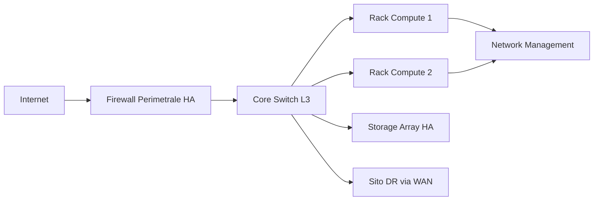

<!-- AI-INSTRUCTIONS:
  Ruolo: tradurre i requisiti del RSD/URS in una proposta architetturale macroscopica.
  Input attesi: documento [[01-RSD-URS]] compilato, eventuali vincoli vendor/cliente,
    audit di compliance precedenti.
  Regole di compilazione:
    1. NON scendere nei dettagli puntuali (IP, porte, parametri config): quelli sono nell'LLD.
    2. Ogni decisione architetturale deve essere motivata (sezione "Decisioni Architetturali").
    3. Includere almeno un diagramma logico di rete (riferimento a file .png/.svg o blocco mermaid).
    4. Mappare ogni requisito Must del RSD/URS (RF-xxx, RNF-xxx) alla componente architetturale che lo soddisfa.
    5. Indicare chiaramente le componenti ridondate/HA e le modalità di failover.
    6. In `depends_on` inserire l'id del RSD/URS da cui deriva.
    7. Validare la checklist in fondo prima di `status: in-review`.
-->

# HLD — High-Level Design

**Progetto:** `<project_name>`
**Cliente:** `<customer>`
**Sito:** `<site>`
**Versione documento:** `<version>`
**Stato:** `<status>`

## 1. Executive Summary

<!-- Sintesi 4-8 righe per stakeholder non tecnici. Cos'è stato progettato, perché, valore business. -->

<Sintesi esecutiva: descrivere in linguaggio comprensibile a sponsor e management l'architettura proposta, i benefici principali e il rapporto con gli obiettivi di business dichiarati nel RSD/URS. Indicare esplicitamente gli ID degli obiettivi business coperti (OB-xxx).>

## 2. Scope dell'Architettura

### 2.1 In Scope
- `<es. Progettazione infrastruttura compute/storage del datacenter primario>`
- `<es. Connettività verso 3 sedi remote via SD-WAN>`
- `<es. Servizi base: AD, DNS, DHCP, NTP, backup>`

### 2.2 Out of Scope
- `<es. Applicativi line-of-business (gestiti da team sviluppo)>`
- `<es. Endpoint dei clienti finali>`
- `<es. Print server e servizi di stampa>`

## 3. Visione Architetturale

### 3.1 Principi Guida
- **Principio 1:** <es. "High Availability by default" — nessun componente single-point-of-failure nei tier mission-critical>
- **Principio 2:** <es. "Defense in depth" — segmentazione di rete in zone con policy differenziate>
- **Principio 3:** <es. "Infrastructure as Code first" — ogni cambio tracciato in Git, niente configurazione manuale persistente>
- **Principio 4:** <es. "Observability by design" — metriche, log e trace esposti nativamente da ogni componente>

### 3.2 Diagramma Logico Macro

<!-- Inserire riferimento a diagramma. Sostituire con path del file reale o blocco mermaid. -->

```
Diagramma: assets/hld-topology-v<version>.png
oppure (solo per bozza): blocco mermaid inline
```



### 3.3 Componenti Architetturali Principali

| ID Componente | Categoria | Ruolo | Ridondanza | Vendor/Modello indicativo |
|---------------|-----------|-------|------------|---------------------------|
| COMP-01 | Perimetro | Firewall next-gen HA | active/active | `<vendor/modello>` |
| COMP-02 | Core network | Switch L3 core | 2 unità (stack/VC) | `<vendor/modello>` |
| COMP-03 | Compute | Cluster hypervisor | n+1 nodi | `<vendor/modello>` |
| COMP-04 | Storage | Array storage primario | dual-controller | `<vendor/modello>` |
| COMP-05 | Backup | Appliance dedupe | singola (mirror remoto) | `<vendor/modello>` |
| COMP-06 | DR | Storage remoto | async replication | `<vendor/modello>` |

## 4. Topologia di Rete Logica

### 4.1 Zone di Rete (Segmentazione)

| Zona | Funzione | VLAN range | Livello trust | Esempi traffico |
|------|----------|------------|---------------|-----------------|
| DMZ | Servizi esposti | `<10-19>` | Low | Reverse proxy, VPN gateway |
| PROD | Carichi produttivi | `<20-49>` | Medium | VM applicative, DB |
| MGMT | Gestione infrastruttura | `<50-69>` | Restricted | iDRAC/iLO, switch mgmt |
| STORAGE | Traffico storage (iSCSI/NFS) | `<70-79>` | Restricted | iSCSI, NFS sync |
| BACKUP | Traffico backup | `<80-89>` | Restricted | Backup server |
| OTHER | `<definire>` | `<...>` | `<...>` | `<...>` |

### 4.2 Flussi di Traffico Primari

<!-- Elencare i flussi significativi: dove nascono, dove finiscono, su quale zona transitano. -->

1. **Utente → DMZ → PROD:** traffico utente finale ai servizi applicativi (via reverse proxy WAF)
2. **PROD → STORAGE:** I/O storage via iSCSI/NFS (10/25 GbE dedicato)
3. **PROD → BACKUP:** traffico notturno di backup (finestra 22:00-06:00)
4. **MGMT → TUTTE LE ZONE:** gestione infrastruttura (solo da subnet management trusted)
5. **SITO PRIMARIO → SITO DR:** replica storage async (continua, priorità QoS)

## 5. Piattaforme Tecnologiche Scelte

### 5.1 Compute / Virtualizzazione
- Hypervisor: `<VMware ESXi 8 / Hyper-V 2022 / Proxmox VE 8 / ...>`
- Cluster mode: `<HA/vMotion/Live Migration>`
- Numero nodi: `<n>`, ognuno con `<n>` CPU, `<n>` RAM, `<n>` NIC
- Razionale: `<perché questa scelta>`

### 5.2 Storage Primario
- Tipo: `<All-flash / Hybrid / NL-SAS>`
- Protocolli: `<iSCSI, NFS, SMB3, FC>`
- Capacità configurata: `<TB>` (raw), `<TB>` (usable con RAID)
- Feature: `<dedupe, compression, snapshot, replication>`
- Razionale: `<perché questa scelta>`

### 5.3 Networking
- Switch core: `<modello>`, throughput `<Tbps>`
- Switch ToR: `<modello>` per rack
- Interconnessione DC-DR: `<tecnologia: WDM/dark fiber/MPLS/Internet+VPN>`
- Razionale: `<perché questa scelta>`

### 5.4 Backup e DR
- Appliance: `<modello>`
- Software: `<Veeam / Commvault / Rubrik / ...>`
- Schema 3-2-1: 3 copie, 2 media, 1 offsite (DR)
- Recovery granularity: `<file/VM/application>`
- Razionale: `<perché questa scelta>`

### 5.5 Sicurezza
- Firewall: `<vendor/modello>`
- SIEM / SOC: `<piattaforma>`
- EDR/antimalware: `<prodotto>`
- Identity & Access Management: `<AD on-prem / Entra ID / IGA / PAM>`
- Razionale: `<perché questa scelta>`

### 5.6 Conformità Normativa e Resilienza (NIS2, ISO 27001:2022, DORA)
- **Segregazione Reti e Accessi (NIS2 Art. 21 / ISO 27001 A.8.20-A.8.22):**
  - `<Strategia di micro-segmentazione, DMZ, zero-trust network access e gestione accessi privilegiati PAM>`
- **Resilienza e Rilevamento Incidenti (NIS2 Art. 23 / DORA Art. 9-11):**
  - `<Piattaforma centralizzata di logging immutabile, detection early warning entro 24h e continuous monitoring>`
- **Test di Resilienza Operativa Digitale (DORA Art. 24-27):**
  - `<Pianificazione vulnerability assessment, threat-led penetration testing (TLPT) e simulazioni periodiche di disaster recovery>`
- **Gestione del Rischio della Catena di Fornitura (NIS2 / DORA Cap. V):**
  - `<Tracciabilità vendor hardware/software, conformità contrattuale e piani di uscita (exit strategy)>`

## 6. Alta Disponibilità e Ridondanza

| Componente | Modalità HA | Failover trigger | Tempo failover stimato |
|------------|-------------|-------------------|-------------------------|
| Firewall perimetrale | active/active (session sync) | link failure, health check | `<2s>` |
| Switch core | MLAG / stacking | link/member failure | `<1s>` |
| Storage primario | dual controller active/active | controller failure | `<30s>` |
| Cluster hypervisor | HA, vMotion/LM | host failure | `<60s>` per riavvio VM |
| WAN primaria ↔ DR | MPLS + Internet failover | BFD detection | `<3s>` |

**Strategia di ridondanza alimenta:**
- Doppia linea elettrica da UPS diversificati
- Doppio gruppo di continuità (2N per componenti tier-1)
- Gruppo elettrogeno di emergenza con autonomia `<n>` ore

## 7. Decisioni Architetturali (ADR)

<!-- Architecture Decision Records. Per ogni decisione significativa, documentare il contesto, le opzioni, la scelta e le conseguenze. -->

### ADR-001: <Titolo decisione, es. "Scelta di storage all-flash per tier-1">
- **Data:** `2026-09-15`
- **Stato:** `<Accepted>`
- **Contesto:** `<perché si deve decidere, requisiti RSD/URS coinvolti>`
- **Opzioni considerate:**
  - Opzione A: `<descrizione>` — pro: `<...>`, contro: `<...>`
  - Opzione B: `<descrizione>` — pro: `<...>`, contro: `<...>`
- **Decisione:** `<opzione scelta>`
- **Conseguenze:** `<impatto su costi, ops, vendor lock-in, future work>`

### ADR-002: <Titolo>
- **Data:** `<...>`
- **Stato:** `<...>`
- **Contesto:** `<...>`
- **Opzioni considerate:** `<...>`
- **Decisione:** `<...>`
- **Conseguenze:** `<...>`

## 8. Integrazioni con Sistemi Esterni

| Sistema esterno | Tipo integrazione | Protocollo | Frequenza | Note |
|------------------|-------------------|-----------|-----------|------|
| `<AD esistente>` | Identity | LDAP/LDAPS | real-time | Trust con dominio corp |
| `<SIEM aziendale>` | Logging | Syslog/TLS | real-time | Forward da tutti i componenti |
| `<Backup cloud>` | Offsite copy | S3 API | giornaliero | Cifrato lato client |
| `<Monitoring>` | Telemetria | SNMP v3 + API | `<polling>` | `<piattaforma target>` |

## 9. Considerazioni su Scalabilità

- **Compute:** espansione orizzontale aggiungendo nodi al cluster fino a `<n>` max
- **Storage:** espansione aggiungendo shelf JBOD fino a `<n>` PB raw
- **Network:** uplink ToR da 10 → 25 → 100 GbE senza riposare cavi (MMF OM4)
- **Siti remoti:** SD-WAN agnostico da venditore, può aggiungere sedi senza riprogettare

## 10. Sicurezza dell'Architettura

- **Cifratura at-rest:** attiva su tutti gli storage tier-1 (AES-256)
- **Cifratura in-transit:** TLS 1.3 per gestione, IPsec per WAN DR
- **Segmentazione:** zone definite in §4.1, policy east-west via microsegmentation
- **Identity:** integrazione con AD esistente, RBAC granulare per componente
- **Audit:** log centralizzato su SIEM, retention 12 mesi

## 11. Mappatura Requisiti → Architettura

<!-- Per ogni requisito Must del RSD/URS, indicare quale componente soddisfa il requisito. -->

| Requisito RSD/URS | Tipo | Componente HLD | Note implementative |
|-------------------|------|----------------|---------------------|
| RF-001 | Must | COMP-01 (Firewall), sezione §10 | Integrazione AD via LDAP |
| RF-002 | Must | COMP-04 (Storage) | Quota via policy storage |
| RNF-001 (disponibilità) | Must | COMP-03 (Cluster HA) | vMotion abilitato |
| RNF-002 (RTO ≤ 4h) | Must | COMP-05 + COMP-06 | Replica async + restore testato |

## 12. Riferimenti e Documenti Correlati

- Documento requisiti: [[01-RSD-URS]]
- Dettaglio implementativo: [[03-LLD]]
- Piano operativo: [[04-MOP]]
- Standard di riferimento: `<es. ISO/IEC 27001:2022>`

## Appendice A — Acronimi e Glossario

| Acronimo | Espansione |
|----------|------------|
| HA | High Availability |
| L3 | Layer 3 (routing) |
| ToR | Top of Rack |
| ADR | Architecture Decision Record |
| MLAG | Multi-Chassis Link Aggregation |

---

## Checklist di Validazione

- [ ] Executive summary comprensibile a non tecnici
- [ ] Almeno un diagramma logico incluso
- [ ] Tutti i requisiti `Must` del RSD/URS mappati in §11
- [ ] Almeno 2 ADR documentati per decisioni significative
- [ ] Modalità HA specificata per ogni componente ridondato
- [ ] Vincoli di compliance indicati (se applicabili)
- [ ] `related_docs` popolato con RSD, LLD, MOP
- [ ] `depends_on` contiene RSD/URS
- [ ] Versione firmware/software indicata nelle tabelle componenti
