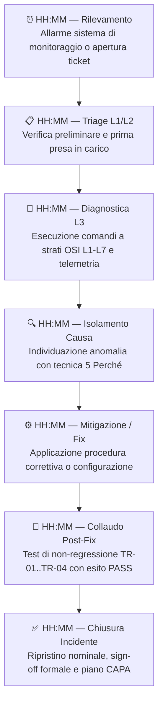
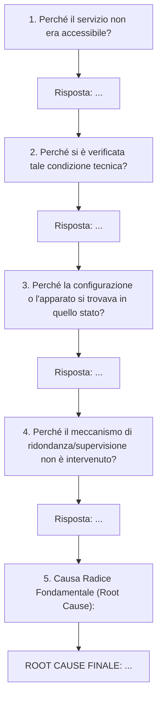

<!-- AI-INSTRUCTIONS:
Questo documento traccia l'analisi delle cause radice (RCA) e la risoluzione formale di un incidente o disservizio tecnico.
1. ZERO ALLUCINAZIONI: Non ipotizzare eventi, log o configurazioni non riscontrati oggettivamente. Se un log non è noto o disponibile, indicare <DA-RICHIEDERE>.
2. METODO DETERMINISTICO A STRATI OSI: Procedere tassativamente dal livello L1 (fisico) fino a L7 (applicativo) per isolare l'anomalia.
3. CONFRONTO STRICT GROUNDING CON AS-BUILT & LLD: Ogni apparato, IP, subnet, VLAN o servizio citato DEVE corrispondere a quanto registrato in [[architecture-roberto-viola-asbuilt-01]] o [[architecture-roberto-viola-lld-01]].
4. METODO DEI 5 PERCHÉ: Identificare la catena logica senza saltare passaggi intermedi.
5. CREDENZIALI: Nessun secret in chiaro. Usare sempre riferimenti simbolici vault://it/projects/acme-milano-dc/...
6. FEEDBACK LOOP: L'RCA deve esplicitare quali documenti di progetto (LLD, As-Built, SOP-Runbook, ATP) devono essere aggiornati per recepire il fix e prevenire recidive.
-->

# RCA & Troubleshooting — <Titolo Disservizio>

## 1. Scheda Incidente & Metriche SLA

| Parametro | Valore | Note / Riferimenti |
|-----------|--------|---------------------|
| **ID Incidente** | `<INCIDENT_ID>` | Es. `INC-2026-001` |
| **Progetto / Cliente** | `<NOME_PROGETTO>` / `<CLIENTE>` | Rif. Manifesto di Progetto |
| **Data e Ora Apertura (UTC/CET)** | `<YYYY-MM-DD HH:MM>` | Timestamp rilevamento / allarme |
| **Data e Ora Chiusura (UTC/CET)** | `<YYYY-MM-DD HH:MM>` | Timestamp ripristino servizio |
| **Severità** | `<P1 / P2 / P3 / P4>` | Rif. Matrice Escalation SOP-Runbook |
| **SLA Obiettivo Risoluzione** | `<ore>` h | Da contratto / RSD |
| **Tempo Effettivo Ripristino** | `<ore>` h | Calcolato da apertura a chiusura |
| **SLA Risoluzione Rispettato?** | `[Sì / No]` | `sla_breached: false` |
| **Apparati / Nodi Impattati** | `<Hostname / IP apparati>` | Rif. [[architecture-roberto-viola-asbuilt-01]] |
| **Servizi Coinvolti** | `<Servizi impattati>` | Es. File Sharing, Routing WAN, DNS |
| **Lead Investigator / Analista** | `<Nome e Cognome>` | L2 / L3 Engineer |

---

## 2. Sintesi Esecutiva & Impatto di Business

### 2.1 Descrizione Sintetica
`<Descrizione ad alto livello di cosa è accaduto, come si è manifestato l'allarme e qual è stato il sintomo primario percepito dagli utenti.>`

### 2.2 Impatto Operativo e Finanziario
- **Utenti / Sedi Coinvolte**: `<Dettaglio sedi o reparti impattati, numero di utenti>`
- **Degrado o Blocco Funzionale**: `<Blocco totale o parziale; degradazione prestazioni o indisponibilità servizio>`
- **Perdita Dati (RPO)**: `Nessuna perdita dati | <DA-RICHIEDERE>`
- **Tempo di Indisponibilità Totale (RTO)**: `<ore e minuti effettivi di fermo>`

---

## 3. Timeline Cronologica dell'Incidente



| Timestamp (Data/Ora) | Fase Operativa | Attore | Azione Eseguita / Rilevamento Strumentale | Esito |
|----------------------|----------------|--------|------------------------------------------|-------|
| `<YYYY-MM-DD HH:MM>` | **Rilevamento** | `<Monitoring / Utente>` | `<Descrizione allarme o ticket>` | Aperto |
| `<YYYY-MM-DD HH:MM>` | **Triage L1/L2** | `<Operatore NOC>` | `<Verifica preliminare raggiungibilità>` | Escalato a L3 |
| `<YYYY-MM-DD HH:MM>` | **Diagnosi L3** | `<System/Network Eng>` | `<Esecuzione comandi diagnostici e log analysis>` | Causa identificata |
| `<YYYY-MM-DD HH:MM>` | **Mitigazione** | `<Ingegnere incaricato>` | `<Applicazione procedura correttiva o configurazione>` | Servizio degradato/ripristinato |
| `<YYYY-MM-DD HH:MM>` | **Collaudo** | `<Ingegnere / Utente>` | `<Verifica funzionale end-to-end>` | OK |
| `<YYYY-MM-DD HH:MM>` | **Chiusura** | `<Incident Manager>` | `<Ripristino nominale e monitoraggio post-fix>` | Risolto |

---

## 4. Analisi Diagnostica Deterministica (Albero OSI L1-L7)

L'indagine diagnostica segue rigidamente il modello a 7 livelli ISO/OSI per evitare supposizioni non provate:

| Strato OSI | Oggetto di Controllo | Comando Eseguito / Telemetria Verificata | Risultato Osservato | Stato |
|------------|----------------------|------------------------------------------|---------------------|-------|
| **L1 - Fisico** | Cavi, SFP, Link LED, Porte | `show interfaces status` / Ispezione visiva / Telemetria porta | `<Link UP/DOWN, negoziazione 1G/10G>` | `[PASS / FAIL / NA]` |
| **L2 - Data Link** | Tabella MAC, ARP, VLAN, Bridge | `/interface bridge host print` / `arp -a` / `show mac address-table` | `<Presenza MAC address, matching VLAN corretta>` | `[PASS / FAIL / NA]` |
| **L3 - Network** | Indirizzamento IP, Routing, Gateway, Tunnel | `ping <IP_DEST>` / `traceroute` / `/ip route print` | `<ICMP reply, hops corretti, tabelle di routing>` | `[PASS / FAIL / NA]` |
| **L4 - Transport** | Porte TCP/UDP, Socket, Handshake SYN | `Test-NetConnection -Port <PORT>` / `nc -zv` / `curl -v telnet://` | `<SYN-ACK ricevuto, timeout, RST received>` | `[PASS / FAIL / NA]` |
| **L5/L6 - Session/Pres.** | TLS Handshake, Cipher, Sessioni RPC | `openssl s_client -connect` / Wireshark capture sessione | `<Session negotiation success, cipher mismatch>` | `[PASS / FAIL / NA]` |
| **L7 - Application** | Protocollo (SMB, DNS, HTTP), Log demone | `Get-WinEvent` / `journalctl` / Log servizio applicativo | `<Codice di errore applicativo, es. STATUS_ACCESS_DENIED>` | `[PASS / FAIL / NA]` |

### 4.1 Evidenze di Log e Output Strumentali
*(Includere solo output reali di comandi diagnostici senza dati sensibili)*

```text
# Comando eseguito:
<COMANDO_DIAGNOSTICO>

# Output rilevato:
<OUTPUT_LOG_EFFETTIVO>
```

---

## 5. Determinazione della Causa Radice (Root Cause Analysis - 5 Perché)



1. **Perché** `<Sintomo primario>`?
   - *Risposta*: `<Causa tecnica immediata>`
2. **Perché** `<Causa tecnica immediata>`?
   - *Risposta*: `<Condizione scatenante>`
3. **Perché** `<Condizione scatenante>`?
   - *Risposta*: `<Fattore abilitante o configurazione difettosa>`
4. **Perché** `<Fattore abilitante>`?
   - *Risposta*: `<Lacuna di processo, testing o monitoraggio mancante>`
5. **Perché (Root Cause Finale)** `<Lacuna di processo o vincolo architetturale>`?
   - *Risposta*: `<ROOT CAUSE: spiegazione chiara, deterministica e inequivocabile della vera radice del problema>`

---

## 6. Azioni di Mitigazione & Workaround (Breve Termine)

Descrizione delle azioni immediate messe in atto per ripristinare il servizio prima del fix definitivo.

| # | Azione di Workaround | Eseguito Da | Impatto / Effetti Collaterali | Rimosso il |
|---|----------------------|-------------|--------------------------------|------------|
| 1 | `<Descrizione azione temporanea, es. routing provvisorio>` | `<Operatore>` | `<Es. banda ridotta, mancata ridondanza>` | `2026-09-15` |

---

## 7. Risoluzione Definitiva & Test di Non-Regressione

### 7.1 Configurazione / Patch Applicata
Dettaglio delle istruzioni o comandi applicati per la risoluzione definitiva:

```powershell
# Script / Comandi eseguiti per il fix permanente:
<COMANDO_FIX>
```

### 7.2 Piano di Collaudo e Non-Regressione
Verifica post-intervento eseguita per accertare che il disservizio sia cessato e che nessun servizio collaterale abbia subito regressioni.

| Test ID | Descrizione Test | Procedura Eseguita | Risultato Atteso | Risultato Effettivo | Esito |
|---------|------------------|-------------------|-------------------|---------------------|-------|
| TR-01 | Raggiungibilità L3 | `ping -n 10 <TARGET_IP>` | Packet loss 0%, RTT nominale | `<loss %>, <RTT ms>` | `[PASS / FAIL]` |
| TR-02 | Socket L4 | `Test-NetConnection -Port <PORT>` | `TcpTestSucceeded: True` | `TcpTestSucceeded: True` | `[PASS / FAIL]` |
| TR-03 | Funzionale L7 | Autenticazione e accesso risorsa | Accesso consentito senza errori | `<Esito reale>` | `[PASS / FAIL]` |
| TR-04 | Non-regressione | Controllo servizi collaterali (DNS, WAN) | Nessun allarme su NMS | `<Esito reale>` | `[PASS / FAIL]` |

---

## 8. Piano Azioni Correttive e Preventive (CAPA)

Azioni strutturali per evitare la reiterazione dell'incidente su questo impianto o su impianti analoghi.

| ID CAPA | Categoria | Descrizione Azione Preventiva | Owner | Scadenza | Documento da Aggiornare | Stato |
|---------|-----------|-------------------------------|-------|----------|-------------------------|-------|
| CAPA-01 | **Monitoring** | Creazione sonda automatica per rilevare l'anomalia prima del blocco | `<Owner>` | `2026-09-15` | [[guide-roberto-viola-sop-runbook-01]] | `[Aperta / In Corso / Chiusa]` |
| CAPA-02 | **Architettura** | Aggiornamento configurazione o hardening del servizio | `<Owner>` | `2026-09-15` | [[architecture-roberto-viola-lld-01]] | `[Aperta / In Corso / Chiusa]` |
| CAPA-03 | **Documentale** | Allineamento As-Built e manuale operativo | `<Owner>` | `2026-09-15` | [[architecture-roberto-viola-asbuilt-01]] | `[Aperta / In Corso / Chiusa]` |
| CAPA-04 | **Testing** | Integrazione test specifico nella suite ATP per futuri rilasci | `<Owner>` | `2026-09-15` | [[specification-roberto-viola-atp-01]] | `[Aperta / In Corso / Chiusa]` |

---

## 9. Documenti di Progetto Aggiornati (Wiki-links)

In seguito all'incidente e alla sua risoluzione, sono stati allineati i seguenti documenti:
- [[architecture-roberto-viola-asbuilt-01]]: Aggiornati parametri di rete/configurazione.
- [[architecture-roberto-viola-lld-01]]: Aggiornate sezioni architetturali impattate.
- [[guide-roberto-viola-sop-runbook-01]]: Aggiunta procedura operativa di recovery nel capitolo troubleshooting.
- [[specification-roberto-viola-atp-01]]: Aggiunto caso di test preventivo.

---

## 10. Checklist di Chiusura Incidente & Sign-off

- [ ] Causa radice identificata in modo oggettivo ed evidenziata nel metodo dei 5 Perché.
- [ ] Nessuna supposizione non dimostrata o dato fittizio inserito (Strict Grounding rispettato).
- [ ] Eventuali credenziali usate riferite tramite `vault://it/projects/acme-milano-dc/...`.
- [ ] Workaround provvisorio rimosso o formalizzato.
- [ ] Test di non-regressione TR-01..TR-04 eseguiti con esito PASS.
- [ ] Piano CAPA assegnato con scadenze e responsabili definiti.
- [ ] Documenti di progetto collegati aggiornati con wiki-links coerenti.
- [ ] File validato tramite `python scripts/itinfra.py validate <file>`.
- [ ] Audit di coerenza semantica superato con `python scripts/itinfra.py audit-consistency <slug>`.

### Firme di Approvazione Chiusura

| Ruolo | Nome e Cognome | Firma / Matricola | Data |
|-------|----------------|-------------------|------|
| **Lead Investigator** | `<Nome>` | `[Approvato digitalmente]` | `2026-09-15` |
| **Service Manager / Reviewer** | `<Nome>` | `[Approvato digitalmente]` | `2026-09-15` |
| **Responsabile IT Cliente** | `<Nome>` | `[Per presa visione e accettazione]` | `2026-09-15` |
