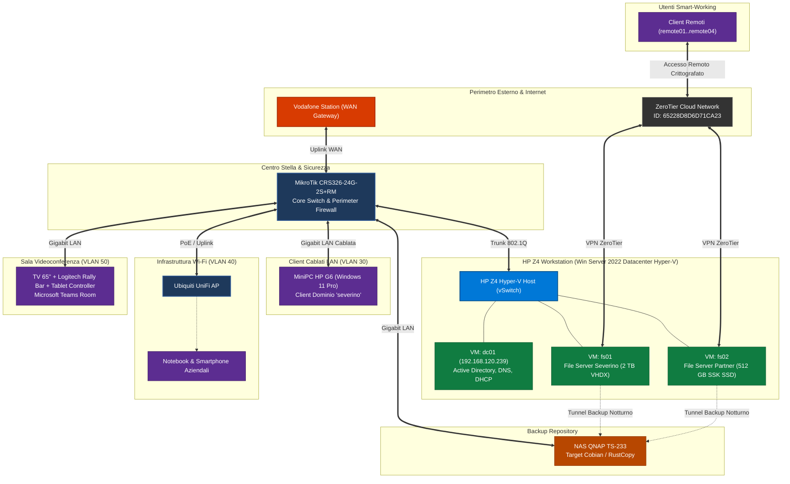

# HLD — High-Level Design: Architettura Severino Srl

<!-- AI-INSTRUCTIONS:
  Questo documento definisce l'architettura logica, fisica, di identità e sicurezza
  per Severino Srl, traducendo i requisiti del RSD/URS in scelte progettuali macroscopiche.
-->

## 1. Executive Summary

Il presente High-Level Design (HLD) definisce l'architettura complessiva dei sistemi informativi, della rete locale e della collaborazione per **Severino Srl**.

L'architettura garantisce:
1. **Controllo centralizzato degli accessi:** Dominio Active Directory `severino` ospitato su VM dedicata `dc01` (`192.168.120.239`).
2. **Prestazioni di rete e sicurezza perimetrale:** Switch Core **MikroTik CRS326-24G-2S+RM** posizionato a valle della Vodafone Station con funzioni di routing, firewalling perimetrale e distribuzione Gigabit a tutte le postazioni fisse (MiniPC HP G6).
3. **Wi-Fi Enterprise flessibile:** Rete wireless con Access Point **Ubiquiti UniFi** con segregazione del traffico aziendale da quello ospiti.
4. **Virtualizzazione robusta e flessibile:** Host fisico su workstation **HP Z4** con Windows Server 2022 Datacenter ed Hyper-V per isolare il Domain Controller (`dc01`), il File Server aziendale (`fs01`, disco 2 TB) e il File Server per aziende partner (`fs02`, storage esterno SSD SSK 512 GB).
5. **Accesso remoto sicuro via ZeroTier:** Rete SD-WAN crittografata (Network ID: `65228D8D6D71CA23`) per consentire agli utenti remoti (`remote01`..`remote04`) di accedere in sicurezza alle condivisioni SMB.
6. **Protezione dei dati aziendali:** Backup giornaliero pianificato su NAS **QNAP TS-233** con Cobian Reflector, predisposto per la transizione alla release proprietaria **[RustCopy v7.4.1+](https://github.com/matrixNeo76/rustcopy)**.
7. **Collaboration immersiva:** Sala riunioni avanzata con TV 65", **Logitech Rally Bar** e controller touch dedicato per riunioni **Microsoft Teams Rooms**.

---

## 2. Scope dell'Architettura

### 2.1 In Scope
- Progettazione e configurazione dello switch core MikroTik CRS326 (VLAN, DHCP relay/server, firewalling perimetrale).
- Connessione con Vodafone Station in modalità DMZ/Bridging.
- Deploy dell'host di virtualizzazione Hyper-V su workstation HP Z4.
- Implementazione delle VM `dc01`, `fs01` e `fs02` con Windows Server 2022.
- Configurazione del Dominio Active Directory `severino`, account utenti, gruppi e permessi NTFS.
- Integrazione della rete SD-WAN ZeroTier (ID `65228D8D6D71CA23`).
- Policy di backup verso NAS QNAP TS-233.
- Allestimento sala meeting con TV 65", Logitech Rally Bar e Tablet Teams Room.

### 2.2 Out of Scope
- Linea di connettività WAN esterna (fornita e gestita da Vodafone).
- Manutenzione hardware interna degli apparati personali (smartphone/tablet BYOD).
- Gestione dei gestionali o applicativi verticali terzi installati sui client.

---

## 3. Visione Architetturale e Schema Logico

---

## 4. Architettura di Rete e Segmentazione (VLAN)

Lo switch **MikroTik CRS326-24G-2S+RM** gestisce la segmentazione logica delle reti tramite VLAN 802.1Q con routing inter-VLAN controllato da regole di firewalling:

| VLAN ID | Nome VLAN | Subnet IPv4 | Gateway | Livello Trust | Scopo e Dispositivi |
|---|---|---|---|---|---|
| **VLAN 10** | `VLAN-MGMT` | `192.168.10.0/24` | `192.168.10.1` | Restricted | Switch MikroTik, AP UniFi, QNAP admin, Host HP Z4 iLO/management |
| **VLAN 20** | `VLAN-SERVER` | `192.168.120.0/24` | `192.168.120.1` | High (Isolata) | Server Hyper-V e VM (`dc01`: `.239`, `fs01`, `fs02`) |
| **VLAN 30** | `VLAN-CLIENT` | `192.168.130.0/24` | `192.168.130.1` | Medium | Postazioni fisse cablate MiniPC HP G6 |
| **VLAN 40** | `VLAN-WIFI-CORP` | `192.168.140.0/24` | `192.168.140.1` | Medium | Notebook e smartphone aziendali autorizzati |
| **VLAN 50** | `VLAN-COLLAB` | `192.168.150.0/24` | `192.168.150.1` | Medium-Low | TV 65", Logitech Rally Bar, Tablet Teams Room |
| **VLAN 90** | `VLAN-GUEST` | `192.168.190.0/24` | `192.168.190.1` | Untrusted | Wi-Fi Ospiti (accesso consentito esclusivamente verso Internet) |

---

## 5. Active Directory, Identità e Controllo Accessi

### 5.1 Struttura del Dominio
- **Nome Dominio:** `severino` (FQDN: `severino.local`)
- **Domain Controller Primario:** `dc01` all'indirizzo IPv4 statico **`192.168.120.239`**
- **Ruoli attivi su `dc01`:** Active Directory Domain Services (AD DS), DNS Server autoritativo, DHCP Server locale.

### 5.2 Matrice Utenze a Dominio

| Account Username | Ruolo / Mansione | Tipologia Utenza | Permessi Share SMB | Note Operative |
|---|---|---|---|---|
| **`francesco.iavarone`** | System Administrator | Domain Admin | Controllo Completo | Amministrazione server e policy GPO |
| **`admin0`** | Amministratore di Rete / Break-Glass | Domain Admin | Controllo Completo | Account amministrativo di emergenza |
| **`dir01`** | Direzione Generale | Domain User Locale | Lettura/Scrittura Direzione & Aziendale | MiniPC HP G6 dedicato |
| **`ops01`** | Gestione Operativa | Domain User Locale | Lettura/Scrittura Operazioni | MiniPC HP G6 dedicato |
| **`adm01`** | Amministrazione & Contabilità | Domain User Locale | Lettura/Scrittura Amministrazione | MiniPC HP G6 dedicato |
| **`adm02`** | Amministrazione & Contabilità | Domain User Locale | Lettura/Scrittura Amministrazione | MiniPC HP G6 dedicato |
| **`hr01`** | Risorse Umane | Domain User Locale | Lettura/Scrittura Risorse Umane (Riservata) | MiniPC HP G6 dedicato |
| **`hr02`** | Risorse Umane | Domain User Locale | Lettura/Scrittura Risorse Umane (Riservata) | MiniPC HP G6 dedicato |
| **`amg01`** | Area Manager | Domain User Locale | Lettura/Scrittura Commerciale | MiniPC HP G6 dedicato |
| **`remote01`** | Collaboratore Remoto 1 | Domain User Remoto | Accesso SMB tramite ZeroTier | Accesso controllato da smart-working |
| **`remote02`** | Collaboratore Remoto 2 | Domain User Remoto | Accesso SMB tramite ZeroTier | Accesso controllato da smart-working |
| **`remote03`** | Collaboratore Remoto 3 | Domain User Remoto | Accesso SMB tramite ZeroTier | Accesso controllato da smart-working |
| **`remote04`** | Collaboratore Remoto 4 | Domain User Remoto | Accesso SMB tramite ZeroTier | Accesso controllato da smart-working |
| **`scanner`** | Scanner / MFP Service Account | Service Account | Scrittura su folder `ScanDoc` | Autenticazione SMB su stampante multifunzione |
| **`backup`** | Backup Service Account | Service Account | Lettura su tutte le share SMB | Account dedicato per Cobian e RustCopy |
| **`printerusr`** | Printer Operator Service | Service Account | Gestione code di stampa | Condivisione stampanti di rete |

---

## 6. Architettura di Virtualizzazione Hyper-V (HP Z4)

L'host fisico HP Z4 monta Windows Server 2022 Datacenter Edition con ruolo Hyper-V attivo.

| Macchina Virtuale | SO Guest | vCPU | vRAM | Storage Assegnato | Ruolo Architetturale |
|---|---|---|---|---|---|
| **`dc01`** | Windows Server 2022 | 2 vCPU | 4 GB | 60 GB VHDX (OS) | Domain Controller, DNS, DHCP (`192.168.120.239`) |
| **`fs01`** | Windows Server 2022 | 4 vCPU | 12 GB | 60 GB OS + 2 TB VHDX Dati | File Server Principale Severino Srl + Client ZeroTier |
| **`fs02`** | Windows Server 2022 | 2 vCPU | 6 GB | 60 GB OS + 512 GB SSK Pass-through | File Server Multi-tenant per 2 Aziende Partner + ZeroTier |

---

## 7. Rete Remota ZeroTier SD-WAN

Per consentire l'accesso sicuro ai dati da remoto senza dover aprire porte SMB o NAT sul perimetro Vodafone:
- **ZeroTier Network ID:** `65228D8D6D71CA23`
- **Amministrazione Rete:** `salviozt01@gmail.com`
- **Nodi autorizzati:**
  - `fs01`: Connesso e autorizzato con IP virtuale fisso ZeroTier.
  - `fs02`: Connesso e autorizzato con IP virtuale fisso ZeroTier.
  - Endpoint remoti `remote01`..`remote04`: Autorizzati nominalmente su ZeroTier Central.

---

## 8. Strategia di Backup e Continuità Operativa

1. **Storage Target:** NAS QNAP TS-233 (2-Bay) posizionato su VLAN 10 (Management/Backup).
2. **Software Fase 1 (Attuale):** **Cobian Reflector** configurato come servizio su `fs01` e `fs02`, con utenza di servizio dedicata `severino\backup`.
3. **Software Fase 2 (Target Roadmap):** Migrazione pianificata al tool ad alte prestazioni **[RustCopy v7.4.1+](https://github.com/matrixNeo76/rustcopy)**, sviluppato per garantire velocità, ridotto consumo di memoria e logging dettagliato su Windows.
4. **Schedulazione:**
   - Ore 22:00: Backup incrementale `fs01` (2 TB) su share dedicata QNAP.
   - Ore 23:00: Backup incrementale `fs02` (512 GB SSK) su share dedicata partner QNAP.
   - Ore 01:00: Backup stato del sistema AD `dc01`.

---

## 9. Decisioni Architetturali (ADR)

### ADR-001: ZeroTier rispetto a VPN IPsec su Vodafone Station
- **Decisione:** Utilizzare ZeroTier per l'accesso remoto di `remote01`..`remote04`.
- **Razionale:** Le linee Vodafone consumer/business spesso presentano limitazioni su IP statici pubblici o doppi NAT. ZeroTier supera il NAT tramite crittografia end-to-end senza richiedere porte aperte verso l'esterno, garantendo massima sicurezza contro attacchi brute-force su SMB.

### ADR-002: Separazione di `fs02` su VM Dedicata con Storage Esterno SSK
- **Decisione:** Creare una seconda macchina virtuale (`fs02`) per le due aziende partner anziché inserire le cartelle in `fs01`.
- **Razionale:** Garantisce isolamento logico rigido conforme a NIS2 e GDPR. Se una delle due aziende partner cessa il rapporto o richiede audit indipendenti, l'intero ambiente dati risiede su volume isolato (SSK 512GB) e non contamina il file server principale di Severino Srl.

### ADR-003: Roadmap di migrazione a RustCopy
- **Decisione:** Mantenere Cobian Reflector in fase iniziale e migrare a RustCopy v7.4.1+ appena convalidato.
- **Razionale:** Assicura continuità operativa immediata e zero rischi durante il go-live, preparando una transizione trasparente verso uno strumento ottimizzato in Rust.

---

## 10. Checklist di Validazione Finale

- [x] Allineamento confermato con tutti i requisiti del documento [[specification-severino-srl-rsd-01]].
- [x] Configurazione IP del Domain Controller verificata (`192.168.120.239`).
- [x] Lista utenti a dominio, ruoli e permessi SMB censiti integralmente.
- [x] Network ID ZeroTier e account di gestione documentati.
- [x] Coerenza tra `related_docs` e `relations` OKF verificata.
- [x] Nessuna password in chiaro presente (esclusivo uso di riferimenti `vault://`).
