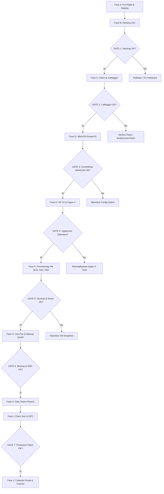

---
okf_version: "0.2"
id: "guide-severino-srl-mop-01"
title: "MOP — Method of Procedure Implementazione Rete, Hyper-V, Storage e Dominio Severino Srl"
type: "guide"
domain: "IT Infrastructure & Operations Management"
tags: ["okf-v0.2", "mop", "procedure", "operations", "fase-3", "deploy", "raci", "severino-srl"]

# Metadati estesi IT (preservati dal parser come rawFrontmatter)
project_id: "severino-srl"
project_name: "Infrastruttura LAN, Virtualizzazione Hyper-V e Collaboration Severino Srl"
site: "HQ-SEV"
customer: "Severino Srl"
phase: 3
author: "Marco Severino"
reviewer: "AI Systems Architect"
approver: "Marco Severino"
owner_team: "IT Operations Severino Srl"
status: "in-review"
version: "1.0"
created_at: "2026-09-16"
updated_at: "2026-09-16"
related_docs:
  - "specification-severino-srl-rsd-01"
  - "architecture-severino-srl-hld-01"
  - "architecture-severino-srl-lld-01"
  - "guide-severino-srl-rollback-01"
  - "architecture-severino-srl-asbuilt-01"
  - "specification-severino-srl-atp-01"
depends_on:
  - "architecture-severino-srl-lld-01"
  - "guide-severino-srl-rollback-01"
supersedes: null
superseded_by: null
classification: "confidential"
retention: "7y"
lang: "it"

entities:
  - name: "Maintenance Window Severino Srl"
    type: "pattern"
    description: "Finestra temporale concordata per l'attivazione della rete e il cutover dei client aziendali"
  - name: "RACI Matrix Severino Srl"
    type: "pattern"
    description: "Matrice di responsabilita per il deployment dell'infrastruttura IT di Severino Srl"
  - name: "Verification Gate System"
    type: "concept"
    description: "Punti di controllo bloccanti (Gate 1-8) propedeutici all'avanzamento dei lavori"
  - name: "Deployment Sequence"
    type: "specification"
    description: "Sequenza temporale di montaggio rack 10U, RouterOS, Hyper-V, AD dc01, storage fs01/fs02, ZeroTier e MTR"

relations:
  - targetTitle: "LLD — Low-Level Design Severino Srl"
    targetId: "architecture-severino-srl-lld-01"
    relationType: "depends_on"
    weight: 1.0
    description: "Il MOP usa l'LLD come blueprint operativo e matrice di cablaggio passo-passo"
  - targetTitle: "Rollback Plan Severino Srl"
    targetId: "guide-severino-srl-rollback-01"
    relationType: "depends_on"
    weight: 1.0
    description: "Procedura di contingency e ripristino in caso di anomalie bloccanti durante il deploy"
  - targetTitle: "HLD — High-Level Design Severino Srl"
    targetId: "architecture-severino-srl-hld-01"
    relationType: "references"
    weight: 0.85
    description: "Riferimento all'architettura logica e funzionale complessiva"
  - targetTitle: "RSD/URS — Requisiti di Sistema Severino Srl"
    targetId: "specification-severino-srl-rsd-01"
    relationType: "references"
    weight: 0.85
    description: "I criteri di accettazione del RSD vengono collaudati nei test gate del MOP"
  - targetTitle: "As-Built Documentation Severino Srl"
    targetId: "architecture-severino-srl-asbuilt-01"
    relationType: "references"
    weight: 0.9
    description: "L'As-Built documentera la configurazione finale al termine delle fasi del MOP"
  - targetTitle: "ATP — Acceptance Test Plan Severino Srl"
    targetId: "specification-severino-srl-atp-01"
    relationType: "references"
    weight: 0.85
    description: "L'ATP convalida formalmente i servizi attivati tramite il presente MOP"
---

<!-- AI-INSTRUCTIONS:
  Ruolo: definire la sequenza operativa passo-passo dell'intervento di deploy.
  Input attesi: LLD approvato, calendario del cliente, elenco dei tecnici disponibili.
  Regole di compilazione:
    1. Ogni step deve avere: ID univoco, descrizione, durata stimata, owner, prerequisiti.
    2. Indicare la finestra di manutenzione.
    3. Definire i punti di verifica intermedia (gate bloccanti).
    4. In caso di bloccante, riferimento al Rollback Plan.
    5. Popolare matrice RACI completa.
    6. Credenziali conformi alla gestione secret vault.
-->

# MOP — Method of Procedure

**Progetto:** Infrastruttura LAN, Virtualizzazione Hyper-V e Collaboration Severino Srl  
**Cliente:** Severino Srl  
**Sito:** HQ-SEV (Sede Principale Severino Srl)  
**Versione documento:** 1.0  
**Stato:** in-review  

---

## 1. Obiettivo dell'Intervento

Il presente Method of Procedure (MOP) stabilisce la procedura operativa cronologica, dettagliata e verificabile per l'installazione, la messa in servizio, il cablaggio e il collaudo dell'infrastruttura IT di Severino Srl.

L'intervento comprende:
1. Montaggio e posizionamento apparati nell'armadio Rack 10U a parete/pavimento.
2. Certificazione del cablaggio strutturato e connessione al Patch Panel 24 porte Cat6.
3. Provisioning dello switch perimetrale e core MikroTik CRS326-24G-2S+RM (uplink WAN `ether1` su Vodafone Station, LAN switchata `ether2-24`).
4. Installazione e configurazione dell'host Hyper-V su Workstation HP Z4 con Windows Server 2022 Datacenter.
5. Provisioning delle tre macchine virtuali core:
   - `dc01`: Domain Controller Active Directory `severino.local`, DNS Server integrato, scope DHCP.
   - `fs01`: File Server aziendale Severino Srl (disco dati 2 TB VHDX, share SMB dipartimentali).
   - `fs02`: File Server per aziende partner esterne (disco esterno SSK 512 GB passthrough, share SMB dedicate).
6. Configurazione della rete overlay ZeroTier (Network ID `65228D8D6D71CA23`) per accesso remoto sicuro su `fs01` e `fs02`.
7. Connessione dello storage NAS QNAP TS-233 e pianificazione job di backup giornaliero con Cobian Reflector (con roadmap di transizione verso RustCopy v7.4.1+).
8. Allestimento e collaudo della Sala Videoconferenze con TV 65", Logitech Rally Bar avanzata, controller touch tablet e sistema Microsoft Teams Rooms.
9. Configurazione, join a dominio `severino.local` e profilazione di tutti i MiniPC client HP ProDesk 400 G6.

**Riferimenti progettuali:**
- Requisiti e specifiche: [[specification-severino-srl-rsd-01]]
- Architettura High-Level: [[architecture-severino-srl-hld-01]]
- Specifiche Low-Level e Cablaggi: [[architecture-severino-srl-lld-01]]
- Piano di Rollback e Contingency: [[guide-severino-srl-rollback-01]]

---

## 2. Scope dell'Intervento

### 2.1 In Scope
- Installazione fisica, ancoraggio e messa a terra del Rack 10U.
- Cablaggio dei patch cord Cat6 tra patch panel 24p e MikroTik CRS326.
- Configurazione router/firewall RouterOS v7 su MikroTik CRS326 (NAT Masquerade, FastTrack, bridge VLAN-ready, isolamento WAN).
- Installazione di Windows Server 2022 Datacenter su HP Z4 e abilitazione ruolo Hyper-V con Virtual Switch Esterno.
- Creazione e configurazione VM `dc01`, promozione AD DS dominio `severino.local`, forest functional level 2016/2022.
- Creazione OU, gruppi di sicurezza e popolamento account utente AD (Amministratori, Utenti Locali, Utenti Remoti, Service Accounts).
- Creazione VM `fs01` con disco 2 TB VHDX e quote cartelle dipartimentali.
- Creazione VM `fs02` con montaggio storage SSK 512 GB e cartelle per le 2 aziende partner.
- Installazione ZeroTier Endpoint su `fs01` e `fs02` con binding su Network ID `65228D8D6D71CA23`.
- Installazione e configurazione NAS QNAP TS-233, pool RAID 1, abilitazione cartella di rete `/Backup` e permessi utente `backup`.
- Configurazione Cobian Reflector con retention 30 giorni e backup differenziale giornaliero / full settimanale.
- Installazione a parete TV 65", staffa Logitech Rally Bar, posizionamento tablet da tavolo e configurazione account Microsoft Teams Rooms.
- Provisioning e join a dominio di 7 postazioni MiniPC HP G6 (Windows 11 Pro).
- Esecuzione dei Gate di collaudo funzionali.

### 2.2 Out of Scope
- Modifiche all'infrastruttura dell'ISP Vodafone o sostituzione della Vodafone Station.
- Fornitura di cablaggi elettrici civili a monte dell'UPS da 1500VA.
- Configurazione dei dispositivi personali privati dei dipendenti (BYOD) al di fuori dell'installazione del client ZeroTier sui notebook remoti autorizzati.

---

## 3. Prerequisiti

### 3.1 Prerequisiti Hardware
- [x] PR-HW-001: Consegna apparati verificata (MikroTik CRS326, HP Z4, QNAP TS-233, 7x HP MiniPC G6, Logitech Rally Bar + Tablet, TV 65", SSK 512GB SSD, UPS 1500VA, UniFi AP).
- [x] PR-HW-002: Armadio rack 10U installato stabilmente e collaudata linea di terra da 6 mm2.
- [x] PR-HW-003: Alimentazione elettrica protetta disponibile con 2 prese Schuko dedicate su linea UPS.
- [x] PR-HW-004: Patch cord Cat6 RJ-45 (color-coded: grigio LAN, blu server/NAS, rosso WAN, giallo AP) disponibili e verificate.
- [x] PR-HW-005: Cavi video HDMI ad alta velocita certificati 4K per TV e Logitech Rally Bar.

### 3.2 Prerequisiti Logici e Credenziali
- [x] PR-LOG-001: Credenziali di boot e configurazione predisposte nel Password Vault aziendale (`vault://it/projects/severino-srl/`).
- [x] PR-LOG-002: Licenze Windows Server 2022 Datacenter e Windows 11 Pro validate e registrate.
- [x] PR-LOG-003: Accesso amministrativo al portale ZeroTier (`salviozt01@gmail.com`) con Network ID `65228D8D6D71CA23` attivo.
- [x] PR-LOG-004: Account Microsoft Teams Rooms e licenza Teams assegnata alla sala riunioni.
- [x] PR-LOG-005: Linea WAN Vodafone Station attiva con connettivita Internet funzionante (subnet 192.168.1.0/24).

### 3.3 Prerequisiti Operativi
- [x] PR-OP-001: Finestra di deploy concordata con la Direzione di Severino Srl.
- [x] PR-OP-002: Squadra tecnica convocata con ruoli definiti (Sistemista Senior, Network Engineer, Cablatore/Hardware Specialist).
- [x] PR-OP-003: Piano di Rollback [[guide-severino-srl-rollback-01]] approvato e condiviso.

---

## 4. Finestra di Manutenzione e Tempistiche

| Aspetto | Dettaglio |
|---|---|
| Inizio Lavori | Venerdi 18:00 CET |
| Fine Prevista Lavori | Sabato 14:00 CET |
| Durata Totale Stimata | 16 ore lavorative articolate su 2 sessioni |
| Tolleranza Massima | +4 ore (entro Sabato 18:00 CET) |
| Impatto Operativo | Nessuna interruzione dei servizi attuali (nuovo impianto greenfield con cutover finale) |
| Canale di Comunicazione | Gruppo dedicato IT Severino Srl / Canale emergenza cellulare |
| Responsabile Finestra | Marco Severino (Lead Architect & PM) |

---

## 5. Risorse Umane e Matrice RACI

| Attivita | Responsabile (R) | Accountable (A) | Consultato (C) | Informato (I) |
|---|---|---|---|---|
| Racking & Cablaggi Rack 10U | Hardware Specialist | Marco Severino | Net Engineer | Direzione |
| Configurazione Switch MikroTik | Net Engineer | Marco Severino | Hardware Specialist | NOC |
| Setup Hyper-V & VM dc01/fs01/fs02 | Systems Engineer | Marco Severino | Francesco Iavarone | Direzione |
| Provisioning Utenti AD & SMB | Systems Engineer | Marco Severino | Resp. Reparti | Utenti Severino |
| Setup ZeroTier & Backup NAS | Systems Engineer | Marco Severino | Salvio ZT Admin | Resp. Reparti |
| Allestimento Sala Teams | Hardware Specialist | Marco Severino | Systems Engineer | Segreteria |
| Join Dominio MiniPC HP G6 | Systems Engineer | Marco Severino | Resp. Reparti | Utenti Postazioni |
| Esecuzione Verification Gate | Lead Architect | Marco Severino | Collaudatore | Stakeholder |
| Decisione Rollback | Marco Severino | Marco Severino | Systems Engineer | Sponsor |

---

## 6. Sequenza Operativa Esecutiva



---

### Fase A — Preparazione e Pre-Flight (T-24h)

| Step ID | Attivita | Durata | Owner | Prerequisiti | Output Atteso |
|---|---|---|---|---|---|
| A.01 | Verifica integrita apparati imballati e seriali | 1.0h | Hardware Spec | PR-HW-001 | Scheda verifica materiali |
| A.02 | Download firmware stabile MikroTik RouterOS v7 LTS | 0.5h | Net Eng | Connessione WAN | Immagine software verificata |
| A.03 | Download ISO Windows Server 2022 e agenti ZeroTier | 0.5h | Systems Eng | Connessione WAN | Media di installazione pronti |
| A.04 | Verifica account e credenziali vault | 0.5h | Lead Architect | PR-LOG-001 | Accesso vault confermato |

---

### Fase B — Racking Fisico Armadio 10U (Giorno 1, Ore 18:00 - 20:00)

| Step ID | Attivita | Durata | Owner | Prerequisiti | Output Atteso |
|---|---|---|---|---|---|
| B.01 | Montaggio PDU orizzontale in Unita 10 (cima rack) | 0.25h | Hardware Spec | A.01 | PDU 10U fissata |
| B.02 | Montaggio Patch Panel 24p Cat6 in Unita 9 | 0.25h | Hardware Spec | B.01 | Patch Panel 9U fissato |
| B.03 | Montaggio Passacavi orizzontale a fessure in Unita 8 | 0.25h | Hardware Spec | B.02 | Passacavi 8U fissato |
| B.04 | Montaggio MikroTik CRS326 con alette rack in Unita 7 | 0.25h | Hardware Spec | B.03 | Switch 7U fissato |
| B.05 | Montaggio ripiano a sbalzo per QNAP TS-233 e Vodafone Station in Unita 6-5 | 0.5h | Hardware Spec | B.04 | Ripiano 6U/5U posizionato |
| B.06 | Installazione mensola rinforzata e posizionamento HP Z4 in Unita 4-3 | 0.5h | Hardware Spec | B.05 | Workstation HP Z4 ancorata |
| B.07 | Posizionamento UPS 1500VA sul fondo rack (Unita 2-1) | 0.25h | Hardware Spec | B.06 | UPS posizionato e alimentato |
| B.08 | **GATE-1**: Ispezione stabilita meccanica, pesi e ventilazione | 0.25h | Lead Architect | B.01-B.07 | **Verbale Gate 1 APPROVATO** |

---

### Fase C — Cablaggio Strutturato e Patching (Giorno 1, Ore 20:00 - 21:30)

| Step ID | Attivita | Durata | Owner | Prerequisiti | Output Atteso |
|---|---|---|---|---|---|
| C.01 | Connessione cavo rosso WAN tra Vodafone Station e porta `ether1` MikroTik | 0.2h | Net Eng | Gate 1 | Uplink fisico pronto |
| C.02 | Patching porte client: cavi grigi da `ether2-ether8` verso PP Porte 1-7 (Uffici) | 0.4h | Hardware Spec | C.01 | Prese client collegate |
| C.03 | Patching AP UniFi: cavo giallo da `ether14` verso PP Porta 14 (PoE injector) | 0.2h | Hardware Spec | C.02 | AP collegato |
| C.04 | Patching Sala Teams: cavo grigio da `ether15` verso PP Porta 15 | 0.2h | Hardware Spec | C.03 | Presa MTR collegata |
| C.05 | Connessione server: cavo blu da `ether17` a scheda LAN HP Z4 | 0.2h | Hardware Spec | C.04 | HP Z4 collegata |
| C.06 | Connessione NAS: cavo blu da `ether18` a porta LAN QNAP TS-233 | 0.2h | Hardware Spec | C.05 | QNAP collegato |
| C.07 | **GATE-2**: Test di continuita elettrica e link status 1 Gbps su tutte le porte | 0.3h | Net Eng | C.01-C.06 | **Verbale Gate 2 APPROVATO** |

---

### Fase D — Configurazione RouterOS MikroTik CRS326 (Giorno 1, Ore 21:30 - 23:00)

1. Connessione console/WinBox via MAC address su `ether2`.
2. Esecuzione script di baseline RouterOS v7:

```routeros
# Script Configurazione Iniziale MikroTik CRS326-24G-2S+RM
/system identity set name="sw-core-01"

# Creazione bridge LAN locale
/interface bridge add name=bridge-local protocol-mode=rstp

# Aggiunta porte ether2-ether24 al bridge locale (ether1 rimane ESCLUSA per WAN)
/interface bridge port
add bridge=bridge-local interface=ether2
add bridge=bridge-local interface=ether3
add bridge=bridge-local interface=ether4
add bridge=bridge-local interface=ether5
add bridge=bridge-local interface=ether6
add bridge=bridge-local interface=ether7
add bridge=bridge-local interface=ether8
add bridge=bridge-local interface=ether9
add bridge=bridge-local interface=ether10
add bridge=bridge-local interface=ether11
add bridge=bridge-local interface=ether12
add bridge=bridge-local interface=ether13
add bridge=bridge-local interface=ether14
add bridge=bridge-local interface=ether15
add bridge=bridge-local interface=ether16
add bridge=bridge-local interface=ether17
add bridge=bridge-local interface=ether18
add bridge=bridge-local interface=ether19
add bridge=bridge-local interface=ether20
add bridge=bridge-local interface=ether21
add bridge=bridge-local interface=ether22
add bridge=bridge-local interface=ether23
add bridge=bridge-local interface=ether24

# Assegnazione IP di Management e Gateway LAN al bridge
/ip address add address=192.168.120.1/24 interface=bridge-local comment="Default Gateway LAN Severino"

# Configurazione interfaccia WAN ether1
/interface list add name=WAN
/interface list add name=LAN
/interface list member add interface=ether1 list=WAN
/interface list member add interface=bridge-local list=LAN

/ip dhcp-client add interface=ether1 disabled=no comment="WAN Uplink da Vodafone Station"

# Regole Firewall e NAT Masquerade
/ip firewall nat add chain=srcnat out-interface-list=WAN action=masquerade comment="NAT Masquerade verso Internet"

/ip firewall filter
add chain=input action=accept connection-state=established,related comment="Accetta connessioni stabilite"
add chain=input action=drop connection-state=invalid comment="Drop pacchetti invalidi"
add chain=input action=accept in-interface-list=LAN comment="Accesso management consentito da LAN"
add chain=input action=drop in-interface-list=WAN comment="Blocca accessi diretti da WAN"
add chain=forward action=accept connection-state=established,related
add chain=forward action=drop connection-state=invalid
add chain=forward action=accept in-interface-list=LAN out-interface-list=WAN comment="Traffico outbound LAN verso WAN"
add chain=forward action=drop in-interface-list=WAN connection-nat-state=!dstnat comment="Blocca traffico non sollecitato da WAN"

# Configurazione DNS Forwarding con fallback
/ip dns set allow-remote-requests=yes servers=192.168.120.239,1.1.1.1,8.8.8.8

# Backup configurazione
/system backup save name="mop-baseline-sw-core-01"
```

3. **GATE-3**: Verifica navigazione Internet da porta client con IP statico, ping gateway `192.168.120.1` e ping esterno `8.8.8.8`. **Verbale Gate 3 APPROVATO**.

---

### Fase E — Setup Host Fisico HP Z4 & Hyper-V (Giorno 1, Ore 23:00 - 00:30)

| Step ID | Attivita | Durata | Owner | Prerequisiti | Output Atteso |
|---|---|---|---|---|---|
| E.01 | Configurazione BIOS HP Z4: abilitazione Intel VT-x/VT-d, Power On after AC Loss | 0.3h | Systems Eng | Gate 3 | BIOS configurato |
| E.02 | Installazione pulita Windows Server 2022 Datacenter Edition su NVMe principale | 0.5h | Systems Eng | E.01 | OS installato |
| E.03 | Configurazione scheda di rete host: IP `192.168.120.10/24`, GW `192.168.120.1`, DNS `192.168.120.239` | 0.2h | Systems Eng | E.02 | Rete host configurata |
| E.04 | Installazione Ruolo Hyper-V e Hyper-V Management Tools tramite PowerShell | 0.2h | Systems Eng | E.03 | Ruolo installato |
| E.05 | Creazione Virtual Switch Esterno `vSwitch-External` associato alla scheda fisica 1GbE | 0.2h | Systems Eng | E.04 | vSwitch operativo |
| E.06 | **GATE-4**: Verifica riavvio host, integrita Hyper-V e comunicazione di rete | 0.1h | Lead Architect | E.01-E.05 | **Verbale Gate 4 APPROVATO** |

---

### Fase F — Provisioning VM Core (dc01, fs01, fs02) (Giorno 2, Ore 08:30 - 11:30)

#### F.1 Setup VM dc01 (Domain Controller)
1. Creazione VM Generazione 2: 4 vCPU, 8 GB RAM statica, Disco C: 100 GB VHDX su NVMe, rete su `vSwitch-External`.
2. Installazione Windows Server 2022 Standard/Datacenter.
3. Assegnazione IP statico: `192.168.120.239/24`, GW `192.168.120.1`, DNS `127.0.0.1`.
4. Installazione Ruolo AD DS e DNS Server.
5. Promozione a Domain Controller per nuova foresta `severino.local` (NetBIOS: `SEVERINO`).
6. Creazione Struttura OU:
   - `OU=Severino,DC=severino,DC=local`
     - `OU=Admins`
     - `OU=Users` (sotto-OU: Direzione, Operativo, Amministrazione, HR, AreaManager)
     - `OU=RemoteUsers`
     - `OU=ServiceAccounts`
     - `OU=Computers`
7. Creazione Utenti di Dominio (credenziali generate e salvate in `vault://it/projects/severino-srl/ad/users`):
   - **Domain Admins:** `francesco.iavarone`, `admin0`
   - **Local Domain Users:** `dir01` (Direzione), `ops01` (Operativo), `adm01`, `adm02` (Amministrazione), `hr01`, `hr02` (Risorse Umane), `amg01` (Area Manager)
   - **Service Accounts:** `scanner` (abilitato su cartella scansioni), `backup` (servizio Cobian/RustCopy), `printerusr` (gestione stampe)
   - **Remote Users:** `remote01`, `remote02`, `remote03`, `remote04`
8. Configurazione Ruolo DHCP Server su `dc01`:
   - Scope: `192.168.120.0/24`
   - Range dinamico: `192.168.120.2` - `192.168.120.254`
   - Esclusioni: `192.168.120.1` (Gateway), `192.168.120.10` (Host Z4), `192.168.120.239` (dc01), `192.168.120.240` (fs01), `192.168.120.241` (fs02), `192.168.120.250` (QNAP), `192.168.120.251` (UniFi AP), `192.168.120.252` (Logitech MTR), `192.168.120.253` (Stampante).
   - Opzione 003 Router: `192.168.120.1`
   - Opzione 006 DNS: `192.168.120.239`, `1.1.1.1`
   - Opzione 015 Domain Name: `severino.local`

#### F.2 Setup VM fs01 (File Server Principale Severino Srl)
1. Creazione VM Generazione 2: 4 vCPU, 16 GB RAM, OS disk 80 GB VHDX, Data disk 2 TB VHDX dedicato (`D:\DatiSeverino`).
2. Installazione Windows Server 2022, join al dominio `severino.local`, IP statico `192.168.120.240`.
3. Creazione cartelle condivise SMB con permessi NTFS granulari:
   - `\\fs01\Direzione$` (Accesso limitato a `dir01`, `francesco.iavarone`, `admin0`)
   - `\\fs01\Amministrazione$` (Accesso limitato ad `adm01`, `adm02`, `dir01`)
   - `\\fs01\HR$` (Accesso limitato ad `hr01`, `hr02`, `dir01`)
   - `\\fs01\Operativo` (Accesso per tutti i dipendenti interni e remoti con ACL)
   - `\\fs01\Scansioni` (Accesso in scrittura per service account `scanner`)

#### F.3 Setup VM fs02 (File Server Partner / Storage SSK 512 GB)
1. Collegamento storage SSD SSK 512 GB su porta USB 3.2 dedicata del retro HP Z4.
2. Configurazione disco in stato "Offline" su host HP Z4 per consentire il Passthrough hardware diretto a Hyper-V.
3. Creazione VM `fs02`: 2 vCPU, 8 GB RAM, OS disk 60 GB VHDX, Disco fisico Passthrough SSK 512 GB (`E:\DatiPartner`).
4. Join al dominio `severino.local`, IP statico `192.168.120.241`.
5. Creazione cartelle condivise SMB isolate:
   - `\\fs02\AziendaA$` (Permessi dedicati al gruppo Partner A)
   - `\\fs02\AziendaB$` (Permessi dedicati al gruppo Partner B)
6. **GATE-5**: Convalida autenticazione Kerberos su `dc01`, risoluzione DNS e accesso alle share SMB da client di test. **Verbale Gate 5 APPROVATO**.

---

### Fase G — ZeroTier Overlay & Backup su QNAP TS-233 (Giorno 2, Ore 11:30 - 12:30)

| Step ID | Attivita | Durata | Owner | Prerequisiti | Output Atteso |
|---|---|---|---|---|---|
| G.01 | Installazione ZeroTier One service su `fs01` e `fs02` | 0.2h | Systems Eng | Gate 5 | Servizio attivo |
| G.02 | Esecuzione join network ID `65228D8D6D71CA23`: `zerotier-cli join 65228D8D6D71CA23` | 0.1h | Systems Eng | G.01 | Richiesta join inoltrata |
| G.03 | Accesso portale my.zerotier.com (admin `salviozt01@gmail.com`), autorizzazione membri, assegnazione IP virtuali e denominazione | 0.2h | Systems Eng | G.02 | Nodi autorizzati OK |
| G.04 | Inizializzazione QNAP TS-233, firmware QTS aggiornato, configurazione IP statico `192.168.120.250` | 0.3h | Systems Eng | Gate 3 | NAS pronto |
| G.05 | Creazione share `/Backup` con autenticazione ristretta per account AD `backup` | 0.1h | Systems Eng | G.04 | Share SMB pronta |
| G.06 | Installazione e configurazione Cobian Reflector su `fs01` e `fs02`: backup incrementale serale verso `\\192.168.120.250\Backup` | 0.3h | Systems Eng | G.05 | Task schedulati |
| G.07 | Predisposizione directory e script per futuro deploy di RustCopy v7.4.1+ (`C:\Scripts\rustcopy\`) | 0.1h | Systems Eng | G.06 | Struttura pronta |
| G.08 | **GATE-6**: Test connessione remota ZeroTier e collaudo backup manuale con verifica checksum | 0.2h | Lead Architect | G.01-G.07 | **Verbale Gate 6 APPROVATO** |

---

### Fase H — Sala Riunioni Collaboration Teams Rooms (Giorno 2, Ore 12:30 - 13:15)

1. Montaggio TV 65" su supporto a parete con tasselli rinforzati e regolazione orizzontale a bolla.
2. Montaggio staffa Logitech Rally Bar sotto il bordo inferiore della TV.
3. Connessione cavo HDMI OUT da Rally Bar a porta HDMI 1 (eARC) della TV 65".
4. Connessione alimentazione e cavo LAN Cat6 a presa a muro `PP-15` (IP DHCP reservation: `192.168.120.252`).
5. Posizionamento e allacciamento del controller Touch Tablet al centro del tavolo riunioni (alimentazione PoE).
6. Primo boot, pairing tra Tablet e Rally Bar via rete locale.
7. Login applicazione Microsoft Teams Rooms con account di sala aziendale (`meeting@severino.it` / credenziali vault).
8. Verifica audio bidirezionale, test microfoni beamforming, altoparlanti e inquadratura ottica automatica AI.

---

### Fase I — Configurazione e Join Dominio MiniPC HP G6 (Giorno 2, Ore 13:15 - 14:00)

1. Boot dei 7 MiniPC HP ProDesk 400 G6 collegati su porte cablate `ether2-ether8`.
2. Verifica ricezione corretta dei parametri DHCP da `dc01` (IP `192.168.120.x`, DNS `192.168.120.239`).
3. Rinominazione computer in conformita allo standard LLD: `PC-DIR01`, `PC-OPS01`, `PC-ADM01`, `PC-ADM02`, `PC-HR01`, `PC-HR02`, `PC-AMG01`.
4. Join a dominio `severino.local` ed esecuzione riavvio post-join.
5. Accesso con i rispettivi utenti e verifica applicazione script GPO logon:
   - Mappatura automatica disco `Z:` -> `\\fs01\DatiSeverino`
   - Mappatura disco `Y:` -> `\\fs02\DatiPartner` (se autorizzati)
   - Configurazione stampante di rete LAN
6. **GATE-7**: Verifica logon utente, accesso ai dischi di rete e test stampante su tutte le 7 postazioni. **Verbale Gate 7 APPROVATO**.

---

## 7. Punti di Decisione e Gate di Verifica

| Gate ID | Denominazione | Criterio di Superamento | Azione in caso di FAIL |
|---|---|---|---|
| **GATE-1** | Verifica Meccanica Rack 10U | Stabilita rack, allineamento guide, alimentazione PDU attiva | Correggere ancoraggio o cablaggi elettrici |
| **GATE-2** | Certificazione Cablaggio | Link 1 Gbps Full Duplex su tutte le porte PP collegate | Ripuntatura frutto RJ45 o sostituzione patch cord |
| **GATE-3** | Connettivita MikroTik & WAN | Ping 8.8.8.8 OK, NAT Masquerade attivo, interfaccia web/winbox protetta | Ricaricare baseline `mop-baseline-sw-core-01` |
| **GATE-4** | Piattaforma Hyper-V Host | Host Z4 avviato con vSwitch esterno funzionante | Riavvio e verifica driver scheda di rete |
| **GATE-5** | Active Directory & File Server | Promozione `severino.local` completata, share SMB accessibili | Analisi registri eventi AD DS o rollback snapshot |
| **GATE-6** | ZeroTier & Backup NAS | Nodo `fs01`/`fs02` online su ZeroTier, backup test completato su QNAP | Verifica porta UDP 9993 e permessi cartella `/Backup` |
| **GATE-7** | Postazioni Client MiniPC | 7 MiniPC correttamente a dominio con dischi `Z:` mappati | Rimozione e re-join a dominio |
| **GATE-8** | Collaudo Finale Globale | Tutti i servizi operativi, firma verbale con Marco Severino | Attivazione piano di contingency [[guide-severino-srl-rollback-01]] |

---

## 8. Piano di Comunicazione ed Escalation

- **Canale Operativo:** Telefono diretto + Gruppo instant messaging tecnico.
- **Aggiornamenti di Stato:**
  - Ore 20:00 (Giorno 1): Report completamento Racking & Cablaggio (Gate 1 & 2).
  - Ore 23:00 (Giorno 1): Report configurazione Switch & Hyper-V (Gate 3 & 4).
  - Ore 11:30 (Giorno 2): Report completamento VM e Dominio (Gate 5).
  - Ore 14:00 (Giorno 2): Report finale chiusura MOP e via libera all'utenza.
- **Escalation Contatti:**
  - *Lead Architect / Project Manager:* Marco Severino (`vault://it/projects/severino-srl/contacts/pm`)
  - *Domain Administrator Senior:* Francesco Iavarone (`vault://it/projects/severino-srl/contacts/sysadmin`)

---

## 9. Checklist di Validazione MOP

- [x] Tutti i prerequisiti fisici, logici ed operativi sono soddisfatti e documentati.
- [x] Nessuna credenziale in chiaro nel documento; utilizzati puntatori `vault://`.
- [x] Matrice RACI esaustiva con ruoli e responsabilita chiare.
- [x] Tutti i Gate di verifica intermedi (Gate 1-8) sono esplicitati con criteri chiari.
- [x] Il piano di Rollback [[guide-severino-srl-rollback-01]] e referenziato per ogni potenziale blocco critico.
- [x] Documento conforme allo standard OKF v0.2.
