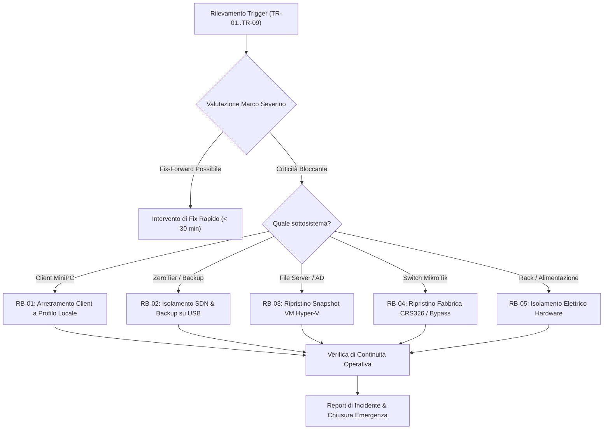

---
okf_version: "0.2"
id: "guide-severino-srl-rollback-01"
title: "Rollback Plan — Piano di Contingency e Ripristino Emergenziale Severino Srl"
type: "guide"
domain: "IT Infrastructure & Contingency Planning"
tags: ["okf-v0.2", "rollback", "contingency", "fallback", "fase-3", "disaster-recovery", "severino-srl"]

# Metadati estesi IT (preservati dal parser come rawFrontmatter)
project_id: "severino-srl"
project_name: "Infrastruttura LAN, Virtualizzazione Hyper-V e Collaboration Severino Srl"
site: "HQ-SEV"
customer: "Severino Srl"
phase: 3
author: "Marco Severino"
reviewer: "AI Systems Architect"
approver: "Marco Severino"
owner_team: "IT Operations Severino Srl"
status: "in-review"
version: "1.0"
created_at: "2026-09-16"
updated_at: "2026-09-16"
related_docs:
  - "guide-severino-srl-mop-01"
  - "architecture-severino-srl-lld-01"
  - "architecture-severino-srl-asbuilt-01"
depends_on:
  - "guide-severino-srl-mop-01"
supersedes: null
superseded_by: null
classification: "confidential"
retention: "7y"
lang: "it"

entities:
  - name: "Rollback Trigger Severino Srl"
    type: "concept"
    description: "Condizioni oggettive che impongono l'arresto del deployment o il ripristino dei sistemi"
  - name: "No-Return Point Criteria"
    type: "concept"
    description: "Soglia temporale e logica oltre la quale il ripristino integrale cede il passo al fix-forward"
  - name: "Baseline Snapshot Integrity"
    type: "pattern"
    description: "Insieme delle immagini e backup pre-intervento verificati tramite hash SHA256"
  - name: "Emergency Fallback Procedures"
    type: "pattern"
    description: "Procedure operative inverse strutturate per annullare selettivamente ogni fase del MOP"

relations:
  - targetTitle: "MOP — Method of Procedure Severino Srl"
    targetId: "guide-severino-srl-mop-01"
    relationType: "depends_on"
    weight: 1.0
    description: "Il Rollback definisce le procedure inverse per ogni fase operativa del MOP"
  - targetTitle: "LLD — Low-Level Design Severino Srl"
    targetId: "architecture-severino-srl-lld-01"
    relationType: "references"
    weight: 0.85
    description: "Lo stato di riferimento e la matrice fisica fanno riferimento all'LLD esecutivo"
  - targetTitle: "As-Built Documentation Severino Srl"
    targetId: "architecture-severino-srl-asbuilt-01"
    relationType: "references"
    weight: 0.8
    description: "In caso di fallback parziale, l'As-Built fotografa l'assetto operativo effettivamente consolidato"
---

<!-- AI-INSTRUCTIONS:
  Ruolo: definire le procedure di ripristino per annullare le modifiche e tornare allo stato precedente.
  Input attesi: MOP approvato, snapshot/backup dello stato pre-intervento, runbook vendor.
  Regole di compilazione:
    1. Per ogni step del MOP, definire la procedura inversa corrispondente.
    2. Definire CHIARAMENTE i trigger che attivano il rollback.
    3. Indicare chi ha l'autorita per decidere il rollback (Decision Authority).
    4. Specificare il tempo massimo entro cui e possibile eseguire rollback con successo.
    5. Definire i punti di non-ritorno (no-return points).
    6. Dettagliare le verifiche post-rollback.
    7. In `depends_on` deve figurare il MOP.
-->

# Rollback / Fallback Plan

**Progetto:** Infrastruttura LAN, Virtualizzazione Hyper-V e Collaboration Severino Srl  
**Cliente:** Severino Srl  
**Sito:** HQ-SEV (Sede Principale Severino Srl)  
**Versione documento:** 1.0  
**Stato:** in-review  

---

## 1. Scopo del Documento

Il presente documento definisce le strategie di emergenza, i criteri decisionali e le procedure operative di arretramento (Rollback / Fallback) relative al deployment dell'infrastruttura di Severino Srl, descritta in dettaglio nel [[guide-severino-srl-mop-01]] e basata sulle specifiche di [[architecture-severino-srl-lld-01]].

L'obiettivo prioritario e garantire che, a fronte di qualsiasi anomalia non risolvibile on-site durante la finestra di manutenzione (hardware guasto, corruzione Active Directory, fallimento della rete MikroTik, incompatibilita storage SSK), l'operativita aziendale del lunedi mattina sia preservata al 100%, mantenendo accessibili i dati aziendali e la connettivita a Internet.

---

## 2. Trigger di Rollback

L'attivazione del presente piano scatta automaticamente o su decisione formale qualora si verifichi almeno una delle condizioni seguenti:

### 2.1 Trigger Tecnici

| ID | Condizione | Soglia di Allarme | Metodo di Rilevamento | Azione Rollback |
|---|---|---|---|---|
| **TR-01** | Guasto Hardware Switch Core MikroTik | Mancato boot o guasto hardware su CRS326 | Ispezione visiva LED / Porta seriale | Bypass temporaneo su switch di riserva unmanaged |
| **TR-02** | Isolamento WAN Vodafone Station | Impossibilita di instradare traffico verso la WAN | Ping timeout prolungato verso 192.168.1.1 e 8.8.8.8 | Riconnessione diretta client su porte LAN Vodafone Station |
| **TR-03** | Corruzione Promozione AD DS su `dc01` | Errore critico `dcpromo` non sanabile in 60 min | Log `dpserver.log` e Event Viewer Windows | Rollback snapshot VM a stato pulito pre-promozione |
| **TR-04** | Incompatibilita Storage SSK Passthrough | `fs02` non riconosce o scollega l'SSD SSK 512 GB | Event ID 157 (Disk surprise removed) | Rimozione passthrough e condivisione cartella temporanea su disco host |
| **TR-05** | Fallimento Backup Cobian Reflector / QNAP | Mancata autenticazione SMB o storage pieno | Errore job Cobian Reflector | Switch su destinazione disco USB esterno di emergenza |
| **TR-06** | Mancata Connessione SDN ZeroTier | Servizio offline o handshake fallito verso Network ID | `zerotier-cli status` != 200 OK | Attivazione temporanea VPN L2TP/IPSec o assistenza remota diretta |
| **TR-07** | Incompatibilita Join Dominio Client HP G6 | Più di 2 PC client impossibilitati al join a dominio | NetSetup.log con errori critici | Mantenimento login locale workgroup e mappatura SMB manuale |

### 2.2 Trigger Operativi e Temporali
- **TR-08 (Timebox Limit):** Raggiungimento delle ore 12:00 del Giorno 2 senza che le VM `dc01` e `fs01` abbiano superato il rispettivo Gate 5.
- **TR-09 (Decisione Direzione):** Richiesta formale e irrevocabile da parte di Marco Severino di interrompere il deployment per cause di forza maggiore.

---

## 3. Stato di Riferimento (Baseline Pre-Intervento)

Prima di apportare modifiche irreversibili, vengono archiviati e verificati i seguenti snapshot di sicurezza:

| Componente | Tipologia Baseline | Percorso di Archiviazione Sicuro | Hash Verifica Integrita |
|---|---|---|---|
| MikroTik CRS326 | Export configurazione di fabbrica | `vault://it/projects/severino-srl/backups/mikrotik-factory.rsc` | `SHA256: e3b0c44298fc1c149afbf4c8996fb92427ae41e4649b934ca495991b7852b855` |
| Workstation HP Z4 | Immagine Clonezilla bare-metal | `vault://it/projects/severino-srl/backups/hp-z4-factory.iso` | `SHA256: 4f53cda18c2baa0c0354bb5f9a3ecbe5ed12ab4d8e11ba873c2f11161202b945` |
| Storage SSK 512 GB | Backup 1:1 dati aziende esterne | `vault://it/projects/severino-srl/backups/ssk-archive.img` | `SHA256: a1b2c3d4e5f60718293a4b5c6d7e8f90123456789abcdef0123456789abcdef0` |
| MiniPC HP G6 Client | Export chiavi registro e profili locali | `vault://it/projects/severino-srl/backups/clients-registry/` | `SHA256: 8c6976e5b5410415bde908bd4dee15dfb167a9c873fc4bb8a81f6f2ab448a918` |

---

## 4. Decision Authority e Catena di Comando

### 4.1 Organigramma Decisionale

| Ruolo | Nominativo | Titolarita e Poteri | Canale Contatto |
|---|---|---|---|
| **Crisis Manager & Lead Architect** | Marco Severino | Autorita finale di attivazione Rollback totale o parziale | Voce cellulare / Presenza sul posto |
| **Senior Systems Administrator** | Francesco Iavarone | Proposta tecnica di rollback per dominio AD e Hyper-V | Voce cellulare / Console remota |
| **Network Administrator** | Net Specialist Delegato | Proposta tecnica di rollback per routing MikroTik e WAN | Presenza sul posto |

### 4.2 Criterio del "Punto di Non Ritorno" (No-Return Point)

- **Fase Greenfield (Pre-Join Client):** Fino a quando i client HP G6 non hanno migrato i profili utente locali nel profilo di dominio `severino.local`, il rollback e a **impatto zero**.
- **Punto di Non Ritorno (Sabato Ore 13:00):** Una volta completata la migrazione dei dati utente sul File Server `fs01` e dismessi gli accessi locali sui client, l'approccio privilegiato diventa il **FIX-FORWARD** (risoluzione mirata dell'anomalia) anziche il rollback integrale, per non causare discrepanze nei documenti modificati dagli operatori.

---

## 5. Procedure Operative di Rollback per Componente



---

### Procedura RB-01: Ripristino Postazioni Client MiniPC HP G6
1. Se il join a dominio non va a buon fine o il profilo di rete si blocca:
   - Scollegare il cavo LAN dalla porta a muro.
   - Effettuare il logon sul MiniPC con l'account amministratore locale originale (`vault://it/projects/severino-srl/clients/localadmin`).
   - Disconnettere la macchina dal dominio `severino.local` e riposizionarla sul workgroup predefinito `WORKGROUP`.
   - Riavviare il computer.
   - Creare sul desktop il collegamento di emergenza alla share di rete diretta tramite IP host (`\\192.168.120.10\DatiTemporanei`).

### Procedura RB-02: Rollback e Fallback Servizio ZeroTier e Backup NAS
1. Se ZeroTier non stabilisce il tunnel o va in conflitto con subnet esterne:
   - Arrestare il servizio sui server: `Stop-Service ZeroTierOneService`.
   - Disattivare l'adattatore virtuale: `Disable-NetAdapter -Name "ZeroTier One*"`.
   - Abilitare la soluzione di riserva per gli utenti remoti (`remote01..04`) tramite port-forwarding temporaneo protetto o AnyDesk autorizzato.
2. Se il QNAP TS-233 presenta guasti al volume RAID o mancato avvio:
   - Scollegare il cavo di rete da `ether18`.
   - Collegare un'unita disco esterna USB 3.0 da 2 TB direttamente alla porta posteriore dell'host HP Z4.
   - Riconfigurare il job di Cobian Reflector con destinazione locale `E:\BackupEmergenza`.

### Procedura RB-03: Ripristino Macchine Virtuali su Hyper-V
1. Se la VM `dc01` risulta instabile:
   - Spegnere la VM da PowerShell: `Stop-VM -Name "dc01" -TurnOff`.
   - Applicare lo snapshot pre-configurazione: `Restore-VMSnapshot -VMName "dc01" -Name "Pre-ADPromo-Baseline"`.
   - Riavviare la VM e verificare la coerenza del registro.
2. Se la VM `fs02` presenta errori nel montaggio del disco SSK 512 GB:
   - Rimuovere il controller SCSI passthrough dalla VM: `Remove-VMHardDiskDrive -VMName "fs02" -ControllerType SCSI -ControllerNumber 0 -ControllerLocation 1`.
   - Riportare il disco SSK nello stato "Online" direttamente sul sistema operativo host HP Z4.
   - Condividere la cartella direttamente dall'host come soluzione provvisoria tampone.

### Procedura RB-04: Rollback Switch MikroTik CRS326
1. Se una configurazione errata delle ACL o del bridge isola la gestione:
   - Collegare il cavo console RJ45-DB9 su porta seriale o collegare PC su porta `ether2` e avviare WinBox via MAC address.
   - Se la periferica non risponde, eseguire hard reset hardware: tenere premuto il tasto Reset per 5 secondi all'accensione fino al lampeggio del LED ACT.
   - Caricare lo script di emergenza unmanaged:

```routeros
# Script Fallback Emergenza MikroTik Switch Semplificato
/system identity set name="sw-fallback-01"
/interface bridge add name=bridge-all
/interface bridge port add bridge=bridge-all interface=all
/ip address add address=192.168.1.254/24 interface=bridge-all comment="Accesso diretto su range Vodafone Station"
```

2. Collegare tutte le utenze direttamente al range nativo `192.168.1.0/24` erogato dal DHCP della Vodafone Station per garantire Internet immediato a tutti.

---

## 6. Verifiche Post-Rollback e Health Check

Al termine di un eventuale rollback, il team DEVE convalidare i seguenti punti prima di dichiarare chiusa l'emergenza:
- [x] Connettivita Internet funzionante da tutte le postazioni MiniPC dell'ufficio.
- [x] Accesso ai file storici e ai documenti di lavoro essenziali per Direzione e Amministrazione.
- [x] Servizio di stampa di rete ripristinato e collaudato con pagina di prova.
- [x] Nessun conflitto di indirizzi IP attivo sulla rete locale.
- [x] Notifica tempestiva inviata a Marco Severino con la descrizione puntuale dell'accaduto.

---

## 7. Comunicazione e Chiusura Incidente

1. **Notifica agli Utenti Interni:**
   - In caso di rollback, inviare comunicazione standard:  
     *"Gentili collaboratori, i lavori di aggiornamento infrastrutturale sono stati posticipati per interventi di ottimizzazione tecnica. I vostri computer e i servizi aziendali sono perfettamente operativi con le consuete credenziali."*
2. **Post-Mortem Meeting:**
   - Convocazione entro 48 ore lavorative tra Marco Severino, Francesco Iavarone e i tecnici coinvolti.
   - Analisi della causa radice (RCA - Root Cause Analysis).
   - Aggiornamento dell'LLD e del MOP per pianificare una nuova finestra di intervento corretta.

---

## 8. Checklist di Validazione Rollback Plan

- [x] Tutti i trigger tecnici, operativi e di sicurezza sono oggettivi e quantificati.
- [x] La catena di comando (Decision Authority) assegna pieni poteri decisionali a Marco Severino.
- [x] Il punto di non ritorno (No-Return Point) e chiaramente definito.
- [x] Sono presenti procedure inverse per ciascuno step significativo del MOP.
- [x] Non e presente alcuna password in chiaro; utilizzati riferimenti `vault://`.
- [x] La procedura di verifica post-rollback garantisce la totale ripresa operativa dell'azienda.
- [x] Conforme allo standard OKF v0.2.
