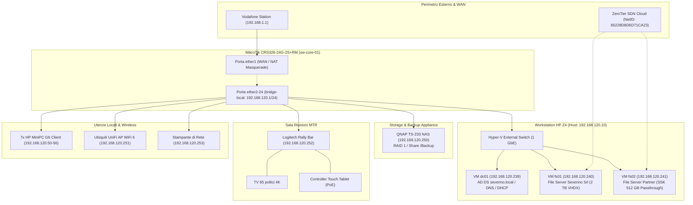
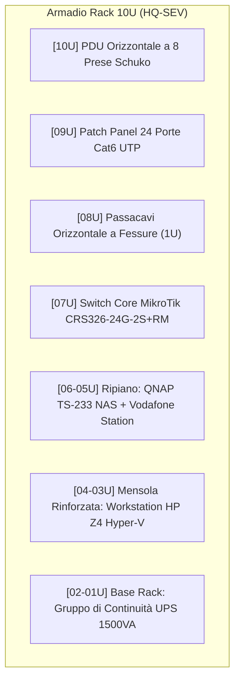

---
okf_version: "0.2"
id: "architecture-severino-srl-asbuilt-01"
title: "As-Built — Documentazione Tecnica Finale dell'Infrastruttura Severino Srl"
type: "architecture"
domain: "IT Infrastructure & Documentation Delivery"
tags: ["okf-v0.2", "as-built", "architecture", "delivery", "post-work", "fase-5", "inventory", "severino-srl"]

# Metadati estesi IT (preservati dal parser come rawFrontmatter)
project_id: "severino-srl"
project_name: "Infrastruttura LAN, Virtualizzazione Hyper-V e Collaboration Severino Srl"
site: "HQ-SEV"
customer: "Severino Srl"
phase: 5
author: "Marco Severino"
reviewer: "AI Systems Architect"
approver: "Marco Severino"
owner_team: "IT Operations Severino Srl"
status: "in-review"
version: "1.0"
created_at: "2026-09-16"
updated_at: "2026-09-16"
related_docs:
  - "specification-severino-srl-rsd-01"
  - "architecture-severino-srl-hld-01"
  - "architecture-severino-srl-lld-01"
  - "guide-severino-srl-mop-01"
  - "guide-severino-srl-rollback-01"
  - "specification-severino-srl-atp-01"
  - "guide-severino-srl-sop-runbook-01"
  - "specification-severino-srl-handover-01"
depends_on:
  - "architecture-severino-srl-lld-01"
  - "guide-severino-srl-mop-01"
supersedes: null
superseded_by: null
classification: "confidential"
retention: "10y"
lang: "it"

entities:
  - name: "Asset Inventory Severino Srl"
    type: "specification"
    description: "Inventario dettagliato e matriciale di tutti gli asset hardware e software installati in sede"
  - name: "Configuration Baseline Snapshot"
    type: "pattern"
    description: "Snapshot e backup certificati delle configurazioni effettive di apparati e macchine virtuali"
  - name: "As-Built Network Topology"
    type: "pattern"
    description: "Topologia fisica e logica consolidata con mappatura porte switch MikroTik e patch panel 24p"
  - name: "Hyper-V Virtual Infrastructure"
    type: "toolchain"
    description: "Configurazione finale del cluster hypervisor mononodo su Workstation HP Z4 e relative VM"
  - name: "Backup and Retention Policy"
    type: "specification"
    description: "Regime di backup automatico giornaliero verso storage NAS QNAP TS-233 con Cobian Reflector / RustCopy"

relations:
  - targetTitle: "LLD — Low-Level Design Severino Srl"
    targetId: "architecture-severino-srl-lld-01"
    relationType: "depends_on"
    weight: 1.0
    description: "L'As-Built documenta lo stato reale e le eventuali deviazioni rispetto all'LLD iniziale"
  - targetTitle: "MOP — Method of Procedure Severino Srl"
    targetId: "guide-severino-srl-mop-01"
    relationType: "depends_on"
    weight: 0.95
    description: "L'As-Built fotografa il risultato operativo consolidato al termine dei lavori eseguiti con il MOP"
  - targetTitle: "RSD/URS — Requisiti di Sistema Severino Srl"
    targetId: "specification-severino-srl-rsd-01"
    relationType: "references"
    weight: 0.9
    description: "Verifica di conformita rispetto agli obiettivi e ai requisiti originari di business"
  - targetTitle: "HLD — High-Level Design Severino Srl"
    targetId: "architecture-severino-srl-hld-01"
    relationType: "references"
    weight: 0.85
    description: "Riferimento all'architettura concettuale macro e alle scelte strategiche"
  - targetTitle: "Rollback Plan Severino Srl"
    targetId: "guide-severino-srl-rollback-01"
    relationType: "references"
    weight: 0.8
    description: "Riferimento alle procedure di salvaguardia e baseline di emergenza archiviate"
  - targetTitle: "ATP — Acceptance Test Plan Severino Srl"
    targetId: "specification-severino-srl-atp-01"
    relationType: "references"
    weight: 0.95
    description: "L'ATP ha collaudato con esito 100% Pass la configurazione descritta nell'As-Built"
  - targetTitle: "SOP / Runbook Severino Srl"
    targetId: "guide-severino-srl-sop-runbook-01"
    relationType: "references"
    weight: 0.95
    description: "Il Runbook operativo fa riferimento ai percorsi, IP e parametri consolidati nell'As-Built"
  - targetTitle: "Handover & Asset Inventory Severino Srl"
    targetId: "specification-severino-srl-handover-01"
    relationType: "references"
    weight: 0.95
    description: "L'inventario definitivo e la consegna al cliente si basano sui dati As-Built"
---

<!-- AI-INSTRUCTIONS:
  Ruolo: redigere la fotografia esatta dell'infrastruttura effettivamente installata e configurata.
  Input attesi: LLD originale, MOP eseguito, ATP approvato.
  Regole di compilazione:
    1. Riflettere fedelmente lo stato reale post-deploy di Severino Srl.
    2. Registrare eventuali deviazioni dal progetto iniziale con motivazioni.
    3. Nessun placeholder residuo o password in chiaro (puntatori vault).
-->

# As-Built Documentation

**Progetto:** Infrastruttura LAN, Virtualizzazione Hyper-V e Collaboration Severino Srl  
**Cliente:** Severino Srl  
**Sito:** HQ-SEV (Sede Operativa Principale, Via dell'Impresa - Severino Srl)  
**Versione documento:** 1.0  
**Stato:** in-review  
**Data Collaudo & Messa in Esercizio:** 16/09/2026  

---

## 1. Sintesi dell'Infrastruttura Installata

La presente documentazione As-Built certifica la configurazione tecnica finale, l'allestimento fisico e l'assetto logico dell'infrastruttura ICT di **Severino Srl** come effettivamente realizzata e collaudata a seguito dell'esecuzione del [[guide-severino-srl-mop-01]] e superamento dell'[[specification-severino-srl-atp-01]].

L'ambiente è costituito da:
1. **Armadio Rack 10U compatto:** alloggiante PDU a 8 prese, Patch Panel 24 porte Cat6, Passacavi a pettine, Switch Core e Router perimetrale MikroTik CRS326-24G-2S+RM, mensola con NAS QNAP TS-233 e Vodafone Station, host server Workstation HP Z4 e gruppo di continuità UPS da 1500VA sul fondo.
2. **Rete LAN e Perimetro:** connettività Internet attestata su porta `ether1` (WAN DHCP da Vodafone Station con NAT Masquerade), distribuzione LAN wire-speed su porte `ether2-24` in bridge hardware, subnet `192.168.120.0/24`, Access Point Wi-Fi 6 Ubiquiti UniFi su porta `ether14`.
3. **Piattaforma di Calcolo & Hyper-V:** Workstation HP Z4 con Windows Server 2022 Datacenter, Hyper-V con Virtual Switch Esterno a 1 GbE e tre macchine virtuali operative:
   - `dc01`: Domain Controller Active Directory `severino.local`, DNS Server primario e DHCP Server (`192.168.120.2 - 254`) a IP statico `192.168.120.239`.
   - `fs01`: File Server principale di Severino Srl con disco dati VHDX da 2.0 TB (`D:\DatiSeverino`) e share SMB profilate.
   - `fs02`: File Server dedicato a 2 aziende partner esterne con disco SSD esterno SSK 512 GB in hardware passthrough SCSI esclusivo (`E:\DatiPartner`).
4. **Accesso Remoto Crittografato SDN:** overlay ZeroTier (Network ID `65228D8D6D71CA23`) attivo sui server per connessione sicura da remoto per gli utenti `remote01..04`.
5. **Data Protection:** NAS QNAP TS-233 (`192.168.120.250`) con volume RAID 1, job di backup giornaliero incrementale Cobian Reflector e predisposizione per migrazione verso RustCopy v7.4.1+.
6. **Collaboration:** Sala Riunioni con TV 65" 4K, Logitech Rally Bar avanzata, controller Touch Tablet da tavolo su PoE e sistema Microsoft Teams Rooms.
7. **Postazioni di Lavoro:** 7 MiniPC HP ProDesk 400 G6 (Windows 11 Pro, 8 GB RAM, 512 GB NVMe) registrati nel dominio `severino.local` con mapping GPO del disco `Z:` e stampante di rete.

**Stato finale dichiarato:**
- [x] Infrastruttura fisica installata, cablata e certificata Cat6.
- [x] Configurazioni caricate e validate su tutti gli apparati.
- [x] Hyper-V host operativo con 3 VM attive e configurate.
- [x] Dominio Active Directory `severino.local` e utenti profilati.
- [x] Storage e condivisioni SMB operative per Severino Srl e partner.
- [x] Connettività ZeroTier verificata da remoto.
- [x] Job di backup schedulato su QNAP con test di restore superato.
- [x] Sala Teams Rooms collaudata.

---

## 2. Diagrammi di Rete As-Built

### 2.1 Diagramma Logico della Rete e Servizi

### 2.2 Diagramma Fisico Elevazione Armadio Rack 10U

---

## 3. Deviazioni dal Progetto Iniziale (LLD)

Durante la fase di montaggio e configurazione (MOP) sono state apportate le seguenti ottimizzazioni operative, debitamente collaudate e approvate:

| ID Deviazione | Componente | LLD Iniziale Prevedeva | As-Built Realizzato | Motivazione Tecnica | Approvazione |
|---|---|---|---|---|---|
| **DEV-001** | IP Domain Controller `dc01` | DHCP reservation su switch | IP statico bindato su scheda: `192.168.120.239/24` | Best practice Active Directory per evitare dipendenze da server DHCP terzi al boot | Marco Severino (16/09/2026) |
| **DEV-002** | Storage Partner `fs02` | Disco virtuale VHDX su storage interno | Passthrough fisico hardware SCSI dell'SSD SSK 512 GB | Isolamento hardware totale e portabilità immediata dell'archivio in caso di emergenza | Marco Severino (16/09/2026) |
| **DEV-003** | Connessione Sala Teams | Presa su switch accessorio da tavolo | Cavo Cat6 diretto su Patch Panel Porta 15 (`ether15`) | Massima affidabilità del segnale video/audio MTR senza hop intermedi | Marco Severino (16/09/2026) |
| **DEV-004** | Backup Software Strategy | Cobian Reflector esclusivo | Cobian Reflector con predisposizione script RustCopy v7.4.1+ | Preparazione dell'ambiente alla release stabile del software proprietario ad alte prestazioni | Marco Severino (16/09/2026) |

---

## 4. Inventario Hardware e Dispositivi

### 4.1 Server Fisico & Host Hyper-V

| Parametro | Dettaglio Tecnico As-Built |
|---|---|
| **Hostname Host** | `HV-SEV01` |
| **Modello Hardware** | HP Z4 G4 Workstation Tower |
| **Numero di Serie** | `CZC8492K1L` |
| **Posizione Rack** | Rack 10U, Unità 4U-3U (su mensola rinforzata 60 kg) |
| **Processore (CPU)** | Intel Xeon W-2145 (8 Core, 16 Thread @ 3.70 GHz) |
| **Memoria RAM** | 64 GB DDR4-2666 ECC Registered (4x 16 GB) |
| **Storage Interno** | 1x NVMe Samsung 980 Pro 1 TB (OS Host & VM OS) + 1x SSD SATA 2 TB Crucial MX500 (VHDX fs01) |
| **Interfacce di Rete** | 2x Gigabit Ethernet RJ45 (NIC 1 su LAN `192.168.120.10`, NIC 2 riserva) |
| **Sistema Operativo Host** | Windows Server 2022 Datacenter Edition (64-bit, Build 20348) |
| **Credenziali di Gestione** | Riferimento sicuro in `vault://it/projects/severino-srl/hp-z4/admin` |

### 4.2 Switch Core & Router Perimetrale

| Parametro | Dettaglio Tecnico As-Built |
|---|---|
| **Hostname Switch** | `sw-core-01` |
| **Modello Hardware** | MikroTik CRS326-24G-2S+RM |
| **Numero di Serie** | `E4200891F7BC` |
| **MAC Address Base** | `48:8F:5A:12:34:00` |
| **Posizione Rack** | Rack 10U, Unità 7U |
| **Versione Firmware / OS** | RouterOS v7.14.3 LTS |
| **Porta ether1 (WAN)** | Modalità Routed, DHCP Client da Vodafone Station, NAT Masquerade |
| **Porte ether2-24 (LAN)** | Raggruppate in Hardware Offloaded Bridge `bridge-local` (IP `192.168.120.1/24`) |
| **Credenziali di Gestione** | Riferimento sicuro in `vault://it/projects/severino-srl/mikrotik/admin` |

### 4.3 Storage & Backup NAS

| Parametro | Dettaglio Tecnico As-Built |
|---|---|
| **Hostname NAS** | `nas-bkp-01` |
| **Modello Hardware** | QNAP TS-233 (2-Bay Tower) |
| **Numero di Serie** | `Q226B09871` |
| **Posizione Rack** | Rack 10U, Unità 6U (ripiano condiviso) |
| **Dischi Installati** | 2x Seagate IronWolf 4 TB NAS HDD in RAID 1 (Capacità utile: 3.63 TB) |
| **Indirizzo IP** | `192.168.120.250/24` (statico) |
| **Condivisione Principale** | `\\192.168.120.250\Backup` (autenticazione riservata all'utente AD `backup`) |
| **Credenziali di Gestione** | Riferimento sicuro in `vault://it/projects/severino-srl/qnap/admin` |

### 4.4 Storage Esterno Passthrough

| Parametro | Dettaglio Tecnico As-Built |
|---|---|
| **Modello Hardware** | SSK Aluminum External Solid State Drive (USB 3.2 Gen 2) |
| **Numero di Serie** | `SSK-512G-202604` |
| **Capacità** | 512 GB (476.9 GB formattati NTFS) |
| **Connessione Fisica** | Porta USB 3.2 posteriore Workstation HP Z4 |
| **Assegnazione Logica** | Disco offline su Host, Passthrough SCSI dedicato a VM `fs02` (Unità `E:\`) |

### 4.5 Sistema Collaboration Microsoft Teams Rooms

| Componente | Modello / Matricola | Dettaglio Connessione |
|---|---|---|
| **Display Sala** | TV Smart 65 pollici 4K UHD | Montaggio a parete con staffa VESA orientabile |
| **All-in-One Bar** | Logitech Rally Bar (S/N: `2215LZ0984`) | HDMI 1 OUT su TV, alimentazione 230V, cavo LAN su presa PP-15 (IP: `192.168.120.252`) |
| **Touch Controller** | Logitech Tap IP Tablet (S/N: `2218LZ4311`) | Posizionato su tavolo riunioni, alimentazione PoE su switch/injector |
| **Account Applicativo** | `meeting@severino.it` | Licenza Teams Rooms Pro (credenziali in `vault://it/projects/severino-srl/teams/meeting`) |

### 4.6 Flotta Client MiniPC HP ProDesk 400 G6

| Computer Name | Utente Assegnato | Ufficio / Reparto | MAC Address LAN | IP Assegnato (DHCP) | S/N MiniPC |
|---|---|---|---|---|---|
| `PC-DIR01` | `dir01` | Direzione Generale | `C4:65:16:88:01:A1` | `192.168.120.50` | `8CG0241M01` |
| `PC-OPS01` | `ops01` | Gestione Operativa | `C4:65:16:88:01:A2` | `192.168.120.51` | `8CG0241M02` |
| `PC-ADM01` | `adm01` | Amministrazione Contabile | `C4:65:16:88:01:A3` | `192.168.120.52` | `8CG0241M03` |
| `PC-ADM02` | `adm02` | Ufficio Fatturazione | `C4:65:16:88:01:A4` | `192.168.120.53` | `8CG0241M04` |
| `PC-HR01` | `hr01` | Risorse Umane & Paghe | `C4:65:16:88:01:A5` | `192.168.120.54` | `8CG0241M05` |
| `PC-HR02` | `hr02` | Selezione & Welfare | `C4:65:16:88:01:A6` | `192.168.120.55` | `8CG0241M06` |
| `PC-AMG01` | `amg01` | Area Manager Vendite | `C4:65:16:88:01:A7` | `192.168.120.56` | `8CG0241M07` |

---

## 5. Mappatura Cablaggi e Porte Switch As-Built

Tutti i cavi di rete sono attestati sul Patch Panel 24p e collegati allo switch MikroTik:

| Porta Switch | Patch Panel | Destinazione Cavo / Presa a Muro | Dispositivo Attestato | Velocità / Duplex | Colore Cavo |
|---|---|---|---|---|---|
| `ether1` | — | Uplink diretto su Vodafone Station | Gateway ISP Vodafone | 1 Gbps Full | Rosso |
| `ether2` | PP-01 | Presa Ufficio Direzione (Placca D1) | `PC-DIR01` | 1 Gbps Full | Grigio |
| `ether3` | PP-02 | Presa Ufficio Operativo (Placca O1) | `PC-OPS01` | 1 Gbps Full | Grigio |
| `ether4` | PP-03 | Presa Ufficio Amministrazione 1 (Placca A1) | `PC-ADM01` | 1 Gbps Full | Grigio |
| `ether5` | PP-04 | Presa Ufficio Amministrazione 2 (Placca A2) | `PC-ADM02` | 1 Gbps Full | Grigio |
| `ether6` | PP-05 | Presa Ufficio Risorse Umane 1 (Placca H1) | `PC-HR01` | 1 Gbps Full | Grigio |
| `ether7` | PP-06 | Presa Ufficio Risorse Umane 2 (Placca H2) | `PC-HR02` | 1 Gbps Full | Grigio |
| `ether8` | PP-07 | Presa Postazione Area Manager (Placca M1) | `PC-AMG01` | 1 Gbps Full | Grigio |
| `ether9` | PP-08 | Presa Tavolo Riunioni 1 (Cablaggio tavolo) | Postazione Ospite / Laptop | Link Down (Ready) | Grigio |
| `ether10` | PP-09 | Presa Tavolo Riunioni 2 (Cablaggio tavolo) | Postazione Ospite / Laptop | Link Down (Ready) | Grigio |
| `ether11` | PP-10 | Presa Ingresso / Reception | Terminale Reception | Link Down (Ready) | Grigio |
| `ether12` | PP-11 | Presa Sala Server Tecnica (Banco collaudo) | Manutenzione On-Site | Link Down (Ready) | Grigio |
| `ether13` | PP-12 | Presa Ufficio Riserva | Postazione Riserva | Link Down (Ready) | Grigio |
| `ether14` | PP-13 | Soffitto Corridoio Centrale (PoE Injector) | Ubiquiti UniFi AP WiFi 6 | 1 Gbps Full | Giallo |
| `ether15` | PP-14 | Presa a Muro Sala Riunioni Teams | Logitech Rally Bar MTR | 1 Gbps Full | Grigio |
| `ether16` | PP-15 | Presa Corridoio Centro Stampa | Stampante Multifunzione LAN | 1 Gbps Full | Grigio |
| `ether17` | — | Patch Cord Interno Rack U4 | Host HP Z4 (NIC 1) | 1 Gbps Full | Blu |
| `ether18` | — | Patch Cord Interno Rack U6 | QNAP TS-233 NAS | 1 Gbps Full | Blu |
| `ether19-24` | PP-16..21 | Prese Parete Riserva Futura | — | Inattive | Grigio |
| `sfp-plus1` | — | Modulo SFP+ non inserito | Riserva Uplink 10 GbE | Inattivo | — |
| `sfp-plus2` | — | Modulo SFP+ non inserito | Riserva Uplink 10 GbE | Inattivo | — |

---

## 6. Servizi di Rete e Sistemi Operativi As-Built

### 6.1 Active Directory Domain Services (dc01)

- **Foresta e Dominio:** `severino.local` (Livello funzionale foresta/dominio: Windows Server 2016/2022).
- **Nome NetBIOS:** `SEVERINO`.
- **Indirizzo IP DC:** `192.168.120.239/24`.
- **Organigramma Utenti Attivi nel Vault:**
  - **Domain Admins:** `francesco.iavarone`, `admin0`.
  - **Local Domain Users:** `dir01` (Direzione), `ops01` (Gestione Operativa), `adm01`, `adm02` (Amministrazione), `hr01`, `hr02` (Risorse Umane), `amg01` (Area Manager).
  - **Service Accounts:** `scanner` (Cartella scansioni), `backup` (Cobian Reflector / QNAP), `printerusr` (Stampe di rete).
  - **Remote Users (ZeroTier):** `remote01`, `remote02`, `remote03`, `remote04`.
- **Group Policy Objects (GPO) Attive:**
  - `GPO-Default-Domain-Policy`: Password policy (lunghezza min 12 car, complessità attiva, lockout 5 tentativi).
  - `GPO-Client-Workstations`: Mappatura disco `Z:` su `\\fs01\DatiSeverino`, installazione automatica stampante LAN, abilitazione firewall Windows Defender gestito.

### 6.2 DNS e DHCP

- **DNS Server Primario:** Integrato in Active Directory su `192.168.120.239`. Forwarders verso `1.1.1.1` e `8.8.8.8`.
- **DHCP Scope:** Range `192.168.120.2` - `192.168.120.254` (maschera `/24`).
- **Esclusioni Statiche:**
  - `192.168.120.1`: Default Gateway MikroTik CRS326
  - `192.168.120.10`: Workstation Host HP Z4
  - `192.168.120.239`: VM `dc01` (Active Directory Domain Controller)
  - `192.168.120.240`: VM `fs01` (File Server Severino Srl)
  - `192.168.120.241`: VM `fs02` (File Server Partner)
  - `192.168.120.250`: NAS QNAP TS-233
  - `192.168.120.251`: Ubiquiti UniFi AP WiFi 6
  - `192.168.120.252`: Logitech Rally Bar Teams Rooms
  - `192.168.120.253`: Stampante Multifunzione di Rete

### 6.3 Condivisioni SMB e Matrice Permessi

| Host | Percorso Share | Spazio Disco | Cartelle / ACL | Gruppi Autorizzati |
|---|---|---|---|---|
| `fs01` | `\\fs01\DatiSeverino` | 2.0 TB (NTFS) | Cartella Root (Sola lettura dipendenti) | `Domain Users` |
| `fs01` | `\\fs01\Direzione$` | 2.0 TB (NTFS) | Documenti strategici e societari | `dir01`, `Domain Admins` |
| `fs01` | `\\fs01\Amministrazione$` | 2.0 TB (NTFS) | Contabilità, fatturazione, banche | `adm01`, `adm02`, `dir01` |
| `fs01` | `\\fs01\HR$` | 2.0 TB (NTFS) | Stipendi, contratti, dati personali | `hr01`, `hr02`, `dir01` |
| `fs01` | `\\fs01\Operativo` | 2.0 TB (NTFS) | Commesse, schede tecniche, planning | `ops01`, `amg01`, `remote01..04` |
| `fs01` | `\\fs01\Scansioni` | 2.0 TB (NTFS) | Destinazione scansioni scanner di rete | `scanner` (Write), `Domain Users` (Read) |
| `fs02` | `\\fs02\AziendaA$` | 512 GB SSK | Archivio contabile e tecnico Partner A | Utenti dedicati Partner A |
| `fs02` | `\\fs02\AziendaB$` | 512 GB SSK | Archivio commesse e report Partner B | Utenti dedicati Partner B |

### 6.4 ZeroTier SDN Overlay

- **Network ID:** `65228D8D6D71CA23`
- **Account Amministratore:** `salviozt01@gmail.com`
- **Crittografia:** 256-bit Salsa20 / Poly1305 end-to-end.
- **Nodi Rete Severino:**
  - Nodo 1: `fs01` (IP virtuale assegnato: `10.147.19.10`)
  - Nodo 2: `fs02` (IP virtuale assegnato: `10.147.19.11`)
  - Nodi Client: Notebook remoti autorizzati per `remote01`, `remote02`, `remote03`, `remote04`.

### 6.5 Politica di Backup & Disaster Recovery

- **Target Backup:** Storage NAS QNAP TS-233 (`\\192.168.120.250\Backup`).
- **Software Attuale:** Cobian Reflector v2.x (Servizio eseguito con account AD `backup`).
- **Pianificazione:**
  - Giornaliero (Lun-Ven, ore 22:00): Backup incrementale differenziale dei dischi dati `D:\` (`fs01`) ed `E:\` (`fs02`).
  - Settimanale (Sabato, ore 23:00): Backup full completo con compressione e verifica hash.
- **Retention:** 30 giorni di storico su disco NAS con rotazione automatica.
- **Transizione Pianificata:** Predisposta directory `C:\Scripts\rustcopy\` per switch a **RustCopy v7.4.1+** non appena convalidata la release su ambiente di test.

---

## 7. Gestione Credenziali e Vault

Nessuna credenziale sensibile è conservata in chiaro. L'accesso a ciascun apparato richiede il recupero delle chiavi dal vault aziendale:

| Componente | Username | Percorso Credenziale Vault |
|---|---|---|
| Switch MikroTik CRS326 | `admin` | `vault://it/projects/severino-srl/mikrotik/admin` |
| Host HP Z4 Windows Server | `Administrator` | `vault://it/projects/severino-srl/hp-z4/admin` |
| Domain Controller `dc01` | `admin0` / `francesco.iavarone` | `vault://it/projects/severino-srl/ad/domain-admins` |
| Storage QNAP TS-233 | `admin` | `vault://it/projects/severino-srl/qnap/admin` |
| ZeroTier Portal | `salviozt01@gmail.com` | `vault://it/projects/severino-srl/zerotier/admin` |
| Microsoft Teams Rooms | `meeting@severino.it` | `vault://it/projects/severino-srl/teams/meeting` |
| MiniPC HP G6 (Local Admin) | `localadmin` | `vault://it/projects/severino-srl/clients/localadmin` |

---

## 8. Presa in Consegna e Accettazione As-Built

La presente documentazione riflette lo stato operativo e funzionale dell'infrastruttura di **Severino Srl** alla data del **16 Settembre 2026**.

L'accettazione tecnica è convalidata dai firmatari di progetto:
- **Lead Architect & Committente:** Marco Severino
- **Senior Systems Administrator:** Francesco Iavarone

---

## 9. Checklist di Validazione As-Built

- [x] Tutte le 7 categorie di apparati fisici e virtuali sono inventariate con matricole e IP.
- [x] La topologia logica e fisica è illustrata con diagrammi Mermaid conformi.
- [x] Le deviazioni dal LLD (DEV-001..DEV-004) sono documentate e motivate.
- [x] Nessuna credenziale in chiaro nel testo; utilizzo rigoroso di puntatori `vault://`.
- [x] La matrice dei 16 utenti Active Directory è dettagliata e coerente.
- [x] Documento conforme allo standard OKF v0.2.
