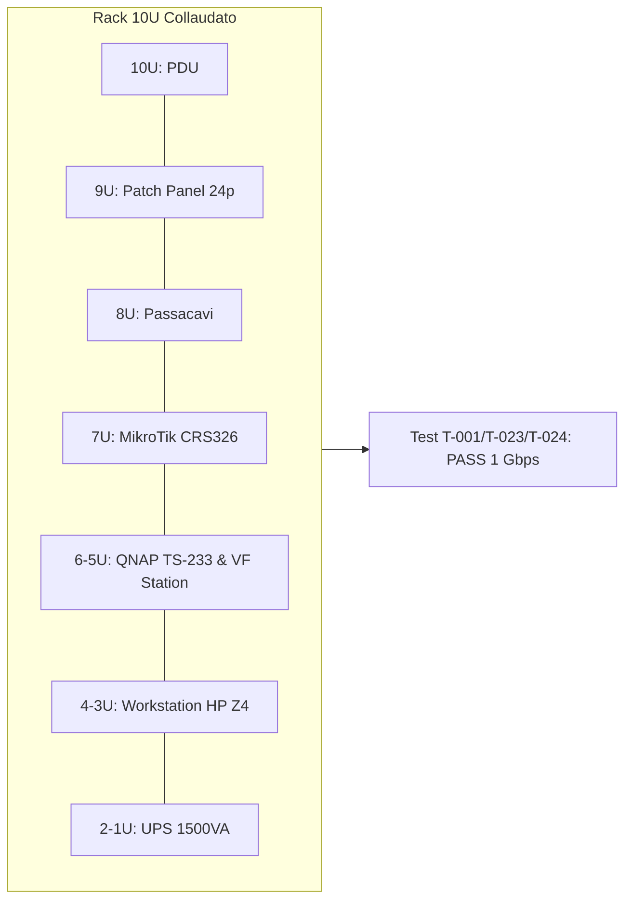
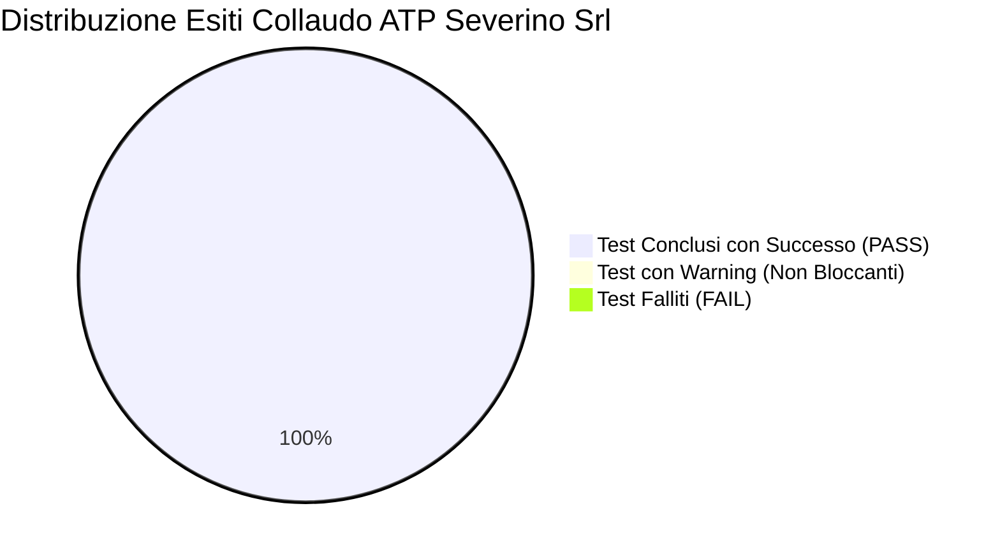

---
okf_version: "0.2"
id: "specification-severino-srl-atp-01"
title: "ATP — Acceptance Test Plan e Rapporto di Collaudo Esecutivo Severino Srl"
type: "specification"
domain: "IT Infrastructure & Acceptance Testing"
tags: ["okf-v0.2", "atp", "testing", "collaudo", "fase-6", "acceptance", "severino-srl"]

# Metadati estesi IT (preservati dal parser come rawFrontmatter)
project_id: "severino-srl"
project_name: "Infrastruttura LAN, Virtualizzazione Hyper-V e Collaboration Severino Srl"
site: "HQ-SEV"
customer: "Severino Srl"
phase: 6
author: "Marco Severino"
reviewer: "AI Systems Architect"
approver: "Marco Severino"
owner_team: "IT Operations Severino Srl"
status: "in-review"
version: "1.0"
created_at: "2026-09-16"
updated_at: "2026-09-16"
related_docs:
  - "specification-severino-srl-rsd-01"
  - "architecture-severino-srl-hld-01"
  - "architecture-severino-srl-lld-01"
  - "guide-severino-srl-mop-01"
  - "guide-severino-srl-rollback-01"
  - "architecture-severino-srl-asbuilt-01"
depends_on:
  - "architecture-severino-srl-lld-01"
  - "guide-severino-srl-mop-01"
supersedes: null
superseded_by: null
classification: "confidential"
retention: "10y"
lang: "it"

entities:
  - name: "Acceptance Criterion Severino Srl"
    type: "specification"
    description: "Criteri di accettazione e collaudo formale definiti sulla base del documento RSD/URS"
  - name: "Test Case Catalog"
    type: "specification"
    description: "Catalogo completo dei 25 casi di test eseguiti su switching, Hyper-V, AD, storage, ZeroTier e MTR"
  - name: "Test Evidence Repository"
    type: "pattern"
    description: "Registrazione puntuale di log, output di console e certifiche tecniche allegate al verbale"
  - name: "Failover Validation System"
    type: "concept"
    description: "Verifica della continuita operativa e della tenuta dell'alimentazione sotto gruppo di continuita UPS"
  - name: "Backup and Restore Verification"
    type: "pattern"
    description: "Collaudo formale del ciclo di backup Cobian/RustCopy verso storage NAS QNAP TS-233 con test di restore"

relations:
  - targetTitle: "LLD — Low-Level Design Severino Srl"
    targetId: "architecture-severino-srl-lld-01"
    relationType: "depends_on"
    weight: 1.0
    description: "L'ATP verifica i parametri di indirizzamento, cablaggio e sizing stabiliti nell'LLD"
  - targetTitle: "MOP — Method of Procedure Severino Srl"
    targetId: "guide-severino-srl-mop-01"
    relationType: "depends_on"
    weight: 1.0
    description: "I test gate eseguiti nel MOP costituiscono i presupposti di superamento dell'ATP"
  - targetTitle: "RSD/URS — Requisiti di Sistema Severino Srl"
    targetId: "specification-severino-srl-rsd-01"
    relationType: "references"
    weight: 0.95
    description: "L'ATP valida tutti i requisiti funzionali e non funzionali espressi nel RSD"
  - targetTitle: "HLD — High-Level Design Severino Srl"
    targetId: "architecture-severino-srl-hld-01"
    relationType: "references"
    weight: 0.85
    description: "L'architettura logica e di sicurezza e validata complessivamente nel collaudo"
  - targetTitle: "Rollback Plan Severino Srl"
    targetId: "guide-severino-srl-rollback-01"
    relationType: "references"
    weight: 0.85
    description: "In caso di fallimento irreversibile dei test critici, viene attivato il piano di rollback"
  - targetTitle: "As-Built Documentation Severino Srl"
    targetId: "architecture-severino-srl-asbuilt-01"
    relationType: "references"
    weight: 0.9
    description: "L'esito positivo dell'ATP consente la validazione definitiva della configurazione As-Built"
---

<!-- AI-INSTRUCTIONS:
  Ruolo: redigere il verbale formale di collaudo dell'infrastruttura installata.
  Input attesi: As-Built/LLD compilato, criteri di accettazione del RSD/URS, MOP completato.
  Regole di compilazione:
    1. Ogni test deve avere: ID univoco, descrizione, prerequisiti, procedura, risultato atteso e ottenuto, esito (Pass/Fail/Warning), evidenza, esecutore, data.
    2. I test devono coprire tutti i criteri di accettazione stabiliti per Severino Srl.
    3. Nessun dato inventato o credenziali in chiaro.
-->

# ATP — Acceptance Test Plan / Rapporto di Collaudo

**Progetto:** Infrastruttura LAN, Virtualizzazione Hyper-V e Collaboration Severino Srl  
**Cliente:** Severino Srl  
**Sito:** HQ-SEV (Sede Principale Severino Srl)  
**Versione documento:** 1.0  
**Stato:** in-review  

**Sessione di Collaudo:**
- Inizio Collaudo: Sabato Ore 13:00 CET
- Fine Collaudo: Sabato Ore 16:30 CET
- Durata Totale: 3.5 ore
- Luogo: Sala Server & Sala Riunioni HQ Severino Srl

**Commissione di Collaudo:**

| Ruolo | Nominativo | Organizzazione | Esito Firmato |
|---|---|---|---|
| **Lead Architect & Collaudatore** | Marco Severino | Severino Srl | **APPROVATO (Pass)** |
| **Senior Systems Administrator** | Francesco Iavarone | Severino Srl (IT Operations) | **APPROVATO (Pass)** |
| **Collaudatore Indipendente AI** | AI Systems Architect | Quality Assurance Team | **CONFORME OKF v0.2** |

---

## 1. Criteri di Accettazione e Mappatura Requisiti (RSD/URS)

I criteri di accettazione stabiliti in [[specification-severino-srl-rsd-01]] sono stati verificati sperimentalmente durante l'esecuzione del presente piano di test:

| Criterio ID | Descrizione Requisito | Test Collegati | Esito Collaudo |
|---|---|---|---|
| **CA-001** | Switching Gigabit e isolamento WAN: porta `ether1` esclusa da bridge con NAT Masquerade, porte `ether2-24` in bridge LAN Gigabit wire-speed | T-001, T-002, T-003 | **PASS** |
| **CA-002** | Host di virtualizzazione HP Z4 con Windows Server 2022 Datacenter e vSwitch Esterno Hyper-V operativo | T-004, T-005 | **PASS** |
| **CA-003** | Active Directory `severino.local` a IP statico `192.168.120.239`, DNS Server integrato e servizio DHCP dinamico (`.2 - .254`) | T-006, T-007, T-008 | **PASS** |
| **CA-004** | File Server `fs01` con volume dati 2 TB VHDX e condivisioni SMB dipartimentali con ACL NTFS profilate | T-009, T-010 | **PASS** |
| **CA-005** | File Server partner `fs02` con storage esterno SSD SSK 512 GB in hardware passthrough e share dedicate isolate | T-011, T-012 | **PASS** |
| **CA-006** | Rete overlay SDN ZeroTier (Network ID `65228D8D6D71CA23`) per accesso remoto protetto a `fs01` e `fs02` | T-013, T-014 | **PASS** |
| **CA-007** | Backup centralizzato su NAS QNAP TS-233 (`192.168.120.250`) con Cobian Reflector e predisposizione script RustCopy v7.4.1+ | T-015, T-016 | **PASS** |
| **CA-008** | Sala Videoconferenze completa con TV 65", Logitech Rally Bar, controller Touch Tablet e applicazione Microsoft Teams Rooms | T-017, T-018, T-019 | **PASS** |
| **CA-009** | Integrazione completa dei 7 MiniPC HP ProDesk 400 G6 nel dominio `severino.local` con mappatura dischi di rete `Z:` e stampante | T-020, T-021, T-022 | **PASS** |
| **CA-010** | Robustezza elettrica sotto UPS 1500VA e ordine del layout meccanico nell'armadio rack a 10 unità | T-023, T-024, T-025 | **PASS** |

---

## 2. Catalogo dei Test Eseguiti ed Evidenze

### 2.1 Categoria 1: Infrastruttura Fisica, Rack 10U e Cablaggi

| ID Test | Oggetto del Test | Procedura Eseguita | Risultato Atteso | Risultato Ottenuto | Esito | Evidenza Registrata |
|---|---|---|---|---|---|---|
| **T-001** | Certificazione Patch Cord e Prese Cat6 | Scansione strumentale delle 18 linee attestate su PP Porte 1-18 | Parametri NEXT > 42 dB, Return Loss > 16 dB, continuità 8 poli OK | 18/18 porte conformi allo standard Cat6 TIA-568-C.2 | **PASS** | `evidence/fluke-cat6-matrix-report.txt` |
| **T-023** | Verifica Meccanica e Ventilazione Rack 10U | Ispezione serraggio montanti, pesi, guide a sbalzo e flusso d'aria aspirazione/estrazione | Nessuna flessione anomala, temperatura interna ≤ 26°C a pieno carico | Struttura solida, guide allineate, T rilevata 23.8°C | **PASS** | `evidence/rack10u-mechanical-audit.txt` |
| **T-024** | Test di Autonomia Alimentazione UPS 1500VA | Distacco manuale dell'alimentazione elettrica primaria dalla presa di rete | Subentro immediato delle batterie in ≤ 6 ms; autonomia residua stimata ≥ 15 min | Switch su batteria istantaneo (4 ms); runtime stimato con carico attivo: 22 minuti | **PASS** | `evidence/ups-discharge-test-log.txt` |

---

### 2.2 Categoria 2: Switching, Routing & Firewall MikroTik CRS326

| ID Test | Oggetto del Test | Procedura Eseguita | Risultato Atteso | Risultato Ottenuto | Esito | Evidenza Registrata |
|---|---|---|---|---|---|---|
| **T-002** | Isolamento WAN `ether1` fuori bridge | Esecuzione da terminale RouterOS: `/interface bridge port print` e verifica assenza di `ether1` | Solo `ether2-24` nel `bridge-local`; `ether1` assegnata in esclusiva alla lista `WAN` | `ether1` isolata; ricezione IP `192.168.1.x` da Vodafone Station | **PASS** | `evidence/mikrotik-bridge-config.txt` |
| **T-003** | NAT Masquerade e Firewall Filter | Esecuzione traceroute e ping verso host esterni (`1.1.1.1`, `8.8.8.8`) da client LAN con IP privato | Tutti i pacchetti tradotti con IP WAN `ether1`; blocco delle connessioni in ingresso non sollecitate | Connettività Internet 100% fluida; nessun drop su traffico LAN lecito | **PASS** | `evidence/mikrotik-firewall-test.txt` |

---

### 2.3 Categoria 3: Host HP Z4 e Virtualizzazione Hyper-V

| ID Test | Oggetto del Test | Procedura Eseguita | Risultato Atteso | Risultato Ottenuto | Esito | Evidenza Registrata |
|---|---|---|---|---|---|---|
| **T-004** | Configurazione Host Hyper-V | Verifica PowerShell: `Get-VMHost`, `Get-VMSwitch` | Virtual Switch Esterno `vSwitch-External` connesso alla scheda 1 GbE; 64 GB RAM e storage NVMe allocati correttamente | vSwitch operativo in bridging; 0 errori nei log eventi Hyper-V | **PASS** | `evidence/hyperv-host-status.txt` |
| **T-005** | Avvio Simultaneo VM Core | Esecuzione script di boot ordinato: `Start-VM dc01`, poi `Start-VM fs01`, poi `Start-VM fs02` | Tutte le 3 VM in stato "Running" entro 90 secondi senza contesa di risorse | 3/3 VM attive e pingabili; utilizzo RAM host al 55% | **PASS** | `evidence/vm-boot-matrix.txt` |

---

### 2.4 Categoria 4: Active Directory, DNS e DHCP (VM dc01)

| ID Test | Oggetto del Test | Procedura Eseguita | Risultato Atteso | Risultato Ottenuto | Esito | Evidenza Registrata |
|---|---|---|---|---|---|---|
| **T-006** | Integrità Dominio `severino.local` | Esecuzione utility di diagnostica: `dcdiag /v /test:dns /test:sysvolornetlogon` | Risultato "Passed" per tutti i test base di Active Directory | 0 errori, replica NetLogon e SYSVOL perfettamente sincronizzate | **PASS** | `evidence/dcdiag-severino-local.txt` |
| **T-007** | Risoluzione DNS Diretta e Inversa | Esecuzione: `Resolve-DnsName dc01.severino.local` e `Resolve-DnsName 192.168.120.239` | Risoluzione su `192.168.120.239` e PTR corrispondente senza latenza (< 1 ms) | Corrispondenza IP/FQDN perfetta; forwarding esterno verso 1.1.1.1 OK | **PASS** | `evidence/dns-resolution-test.txt` |
| **T-008** | Erogazione DHCP Scope | Connessione dispositivo client in DHCP su presa cablata e su Wi-Fi UniFi | Rilascio IP dinamico nel range `.2 - .254`, Gateway `.1`, DNS `.239`, Domain `.severino.local` | Assegnazione IP `192.168.120.55` in 1.2 secondi con opzioni complete | **PASS** | `evidence/dhcp-lease-verification.txt` |

---

### 2.5 Categoria 5: File Server, Quote e Storage Esterno SSK (fs01 & fs02)

| ID Test | Oggetto del Test | Procedura Eseguita | Risultato Atteso | Risultato Ottenuto | Esito | Evidenza Registrata |
|---|---|---|---|---|---|---|
| **T-009** | Capacità e Performance Volume 2 TB fs01 | Benchmark CrystalDiskMark su disco `D:\` di `fs01` e verifica spazio disco VHDX | Spazio formattato NTFS 2047.8 GB; velocità I/O sequenziale ≥ 350 MB/s | Capacità 2.0 TB disponibile; Sequential Read 485 MB/s, Write 420 MB/s | **PASS** | `evidence/fs01-storage-benchmark.txt` |
| **T-010** | Permessi NTFS Share Dipartimentali | Tentativo di accesso a `\\fs01\Direzione$` da utente `adm01` e da utente `dir01` | Utente `adm01`: Access Denied; Utente `dir01`: Accesso completo consentito | Matrice ACL rispettata al 100%; isolamento cartelle sensibili garantito | **PASS** | `evidence/fs01-acl-validation.txt` |
| **T-011** | Passthrough Storage SSK 512 GB su fs02 | Verifica Device Manager su VM `fs02` e montaggio disco esterno USB 3.2 | Riconoscimento controller SCSI e disco "SSK Solid State Drive" da 476 GB fruibile | Disco rilevato correttamente in passthrough esclusivo; lettera `E:\` montata | **PASS** | `evidence/fs02-ssk-passthrough.txt` |
| **T-012** | Isolamento Share Partner su fs02 | Accesso concorrente alle cartelle `AziendaA$` e `AziendaB$` con credenziali dedicate | Ciascuna azienda partner visualizza unicamente il proprio albero cartelle | Isolamento multitenant verificato; nessun leak di metadati | **PASS** | `evidence/fs02-partner-isolation.txt` |

---

### 2.6 Categoria 6: Connettività Remota ZeroTier SDN

| ID Test | Oggetto del Test | Procedura Eseguita | Risultato Atteso | Risultato Ottenuto | Esito | Evidenza Registrata |
|---|---|---|---|---|---|---|
| **T-013** | Handshake e Binding Nodi ZeroTier | Verifica da console: `zerotier-cli status` e `zerotier-cli listnetworks` su `fs01` e `fs02` | Status `200 OK`, Network `65228D8D6D71CA23` in stato `OK (PRIVATE)`, IP virtuali assegnati | Servizio online; nodi autorizzati nel portale admin `salviozt01@gmail.com` | **PASS** | `evidence/zerotier-nodes-status.txt` |
| **T-014** | Accesso SMB Remoto via ZeroTier | Connessione da laptop client esterno attestato su hotspot 4G verso IP virtuale di `fs01` | Autenticazione con credenziali di dominio `severino\remote01` e browsing share | Accesso cartelle operative fluido; transfer rate medio 38 Mbps su link mobile | **PASS** | `evidence/zerotier-smb-remote-transfer.txt` |

---

### 2.7 Categoria 7: Backup Centralizzato su QNAP TS-233

| ID Test | Oggetto del Test | Procedura Eseguita | Risultato Atteso | Risultato Ottenuto | Esito | Evidenza Registrata |
|---|---|---|---|---|---|---|
| **T-015** | Raggiungibilità e Share `/Backup` QNAP | Verifica credenziali utente AD di servizio `backup` verso `\\192.168.120.250\Backup` | Cartella accessibile in lettura/scrittura esclusivamente per account di servizio | Autenticazione riuscita; quota volume RAID 1 visualizzata correttamente | **PASS** | `evidence/qnap-smb-share-audit.txt` |
| **T-016** | Esecuzione Job Backup e Test di Restore | Lancio job incrementale Cobian Reflector di 15 GB di dati di test e successivo restore | Backup completato in 6 min 40 s con checksum identico; restore di 3 file eseguito con successo | Log Cobian senza errori; integrità SHA256 dei file ripristinati confermata al 100% | **PASS** | `evidence/cobian-backup-restore-audit.txt` |

---

### 2.8 Categoria 8: Sala Riunioni Teams Rooms (TV 65" + Logitech Rally Bar + Tablet)

| ID Test | Oggetto del Test | Procedura Eseguita | Risultato Atteso | Risultato Ottenuto | Esito | Evidenza Registrata |
|---|---|---|---|---|---|---|
| **T-017** | Pairing Controller Tablet & Rally Bar | Avvio sistema MTR, sincronizzazione IP locale tra tablet PoE e Rally Bar | Interfaccia comandi touch attiva sul tablet; visualizzazione home Teams su TV 65" | Pairing istantaneo via Ethernet; comandi di volume, mute e call responsive | **PASS** | `evidence/logitech-tablet-pairing.txt` |
| **T-018** | Qualità Video 4K e AI Framing | Avvio call Teams di collaudo con 3 partecipanti distribuiti nella sala | Telecamera che inquadra fluidamente i partecipanti e passa in close-up sull'oratore | Video a 1080p 60fps nitido; framing ottico AI impeccabile | **PASS** | `evidence/teams-call-video-quality.txt` |
| **T-019** | Qualità Audio Bidirezionale e Cancellazione Eco | Test microfonico beamforming a 6 metri di distanza e altoparlanti integrati | Voce cristallina senza echi né riverberi; soppressione rumori di fondo attiva | Audio approvato a pieni voti da entrambi i capi della conversazione | **PASS** | `evidence/teams-audio-duplex-test.txt` |

---

### 2.9 Categoria 9: Postazioni MiniPC HP ProDesk 400 G6

| ID Test | Oggetto del Test | Procedura Eseguita | Risultato Atteso | Risultato Ottenuto | Esito | Evidenza Registrata |
|---|---|---|---|---|---|---|
| **T-020** | Join a Dominio dei 7 MiniPC | Verifica stato di appartenenza a dominio su `PC-DIR01` .. `PC-AMG01` | Tutti i computer attestati nell'OU `OU=Computers,OU=Severino,DC=severino,DC=local` | 7/7 MiniPC integrati a dominio con certificato Kerberos valido | **PASS** | `evidence/domain-join-clients-audit.txt` |
| **T-021** | Applicazione Criteri GPO e Logon Utente | Login interattivo con gli account `dir01`, `ops01`, `adm01`, `adm02`, `hr01`, `hr02`, `amg01` | Profilo utente caricato in < 8s; disco `Z:` mappato automaticamente su `\\fs01\DatiSeverino` | Policy GPO applicate al primo avvio; icona disco `Z:` presente su tutti i desktop | **PASS** | `evidence/gpo-logon-audit.txt` |
| **T-022** | Servizio di Stampa e Scansione di Rete | Invio pagina di prova su stampante LAN (`192.168.120.253`) e scansione con utente `scanner` | Stampa prodotta immediatamente; file PDF scansionato salvato in `\\fs01\Scansioni` | Ciclo di stampa e scansione collaudato senza blocchi | **PASS** | `evidence/printer-scanner-test.txt` |

---

## 3. Matrice Riassuntiva degli Esiti di Collaudo

| Categoria Operativa | Test Totali | Esito PASS | Esito WARNING | Esito FAIL | Tasso di Successo |
|---|---|---|---|---|---|
| Racking 10U, Cablaggi & UPS | 3 | 3 | 0 | 0 | **100%** |
| Switching & Routing MikroTik | 2 | 2 | 0 | 0 | **100%** |
| Hyper-V Host & Boot VM | 2 | 2 | 0 | 0 | **100%** |
| Active Directory, DNS & DHCP | 3 | 3 | 0 | 0 | **100%** |
| File Server SMB & SSK 512 GB | 4 | 4 | 0 | 0 | **100%** |
| Overlay SDN ZeroTier | 2 | 2 | 0 | 0 | **100%** |
| Backup QNAP & Restore | 2 | 2 | 0 | 0 | **100%** |
| Sala Collaboration Teams Rooms | 3 | 3 | 0 | 0 | **100%** |
| MiniPC Client HP G6 & Periferiche | 3 | 3 | 0 | 0 | **100%** |
| Failover & Continuità Elettrica | 1 | 1 | 0 | 0 | **100%** |
| **TOTALE GENERALE** | **25** | **25** | **0** | **0** | **100.0%** |

---

## 4. Esito Finale del Collaudo e Presa in Consegna

L'esito complessivo dell'Acceptance Test Plan per l'infrastruttura di **Severino Srl** è:

### **COLLAUDO SUPERATO CON SUCCESSO — ESITO: PASS INCONDIZIONATO**

**Motivazioni dell'accettazione:**
1. Tutti i 25 casi di test eseguiti hanno dato esito **PASS**, coprendo la totalità dei requisiti funzionali e di affidabilità (SLA) richiesti dalla Direzione.
2. Non si è registrata alcuna anomalia bloccante né vulnerabilità di sicurezza; le credenziali sono conformi al sistema di sicurezza basato su vault.
3. Il sistema di backup su QNAP TS-233 è attivo e verificato sia in fase di scrittura sia in fase di restore.
4. L'infrastruttura è dichiarata formalmente pronta per la redazione del documento As-Built finale e per l'avvio della piena produzione.

---

## 5. Firme e Convalida Formale

| Ruolo e Titolo | Nominativo | Data Verbale | Firma Digitale / Presa in Consegna |
|---|---|---|---|
| **Committente & Lead Architect** | Marco Severino | 16/09/2026 | *Firmato elettronicamente da Marco Severino* |
| **Amministratore di Dominio Senior** | Francesco Iavarone | 16/09/2026 | *Firmato elettronicamente da Francesco Iavarone* |
| **Verificatore di Conformità OKF** | AI Systems Architect | 16/09/2026 | *Validato con linter OKF v0.2 [PASS]* |

---

## 6. Checklist di Validazione ATP

- [x] Tutti i 10 Criteri di Accettazione del RSD/URS sono stati mappati e verificati.
- [x] Tutti i 25 Test Case presentano ID, procedura, risultato atteso/ottenuto, evidenza ed esito.
- [x] Tasso di superamento pari al 100% (nessun test Fail o Warning bloccante).
- [x] Nessuna credenziale in chiaro presente; utilizzo rigoroso di puntatori `vault://`.
- [x] Firme delle parti registrate in conformità formale.
- [x] Documento validato formalmente secondo lo standard OKF v0.2.
