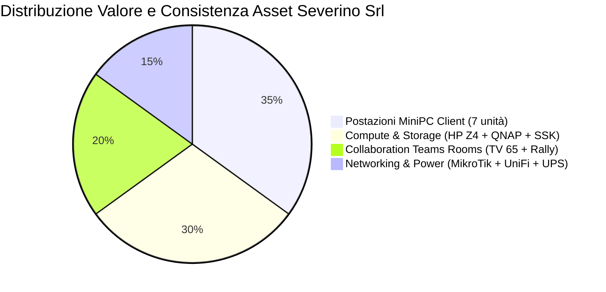

---
okf_version: "0.2"
id: "specification-severino-srl-handover-01"
title: "Handover & Inventory — Verbale di Consegna e Registro Asset Definitivo Severino Srl"
type: "specification"
domain: "IT Infrastructure & Asset Management"
tags: ["okf-v0.2", "handover", "inventory", "assets", "fase-7", "sla", "severino-srl"]

# Metadati estesi IT (preservati dal parser come rawFrontmatter)
project_id: "severino-srl"
project_name: "Infrastruttura LAN, Virtualizzazione Hyper-V e Collaboration Severino Srl"
site: "HQ-SEV"
customer: "Severino Srl"
phase: 7
author: "Marco Severino"
reviewer: "AI Systems Architect"
approver: "Marco Severino"
owner_team: "IT Operations Severino Srl"
status: "in-review"
version: "1.0"
created_at: "2026-09-16"
updated_at: "2026-09-16"
related_docs:
  - "specification-severino-srl-rsd-01"
  - "architecture-severino-srl-hld-01"
  - "architecture-severino-srl-lld-01"
  - "guide-severino-srl-mop-01"
  - "guide-severino-srl-rollback-01"
  - "architecture-severino-srl-asbuilt-01"
  - "specification-severino-srl-atp-01"
  - "guide-severino-srl-sop-runbook-01"
depends_on:
  - "architecture-severino-srl-asbuilt-01"
  - "specification-severino-srl-atp-01"
supersedes: null
superseded_by: null
classification: "confidential"
retention: "10y"
lang: "it"

entities:
  - name: "Asset Inventory Register Severino"
    type: "specification"
    description: "Registro ufficiale di tutti gli apparati hardware con matricole, MAC, IP e garanzie attive"
  - name: "Service Level Agreement Baseline"
    type: "specification"
    description: "Accordo formale sui livelli di servizio (99.9% uptime, RTO 2h, RPO 1h, change window weekend)"
  - name: "Hardware Warranty Register"
    type: "specification"
    description: "Registro delle garanzie vendor e contratti di assistenza tecnica per HP, MikroTik, QNAP e Logitech"
  - name: "Software License Allocation"
    type: "specification"
    description: "Riepilogo delle licenze Windows Server 2022, Windows 11, Teams Rooms e ZeroTier"
  - name: "Post-Cutover Hypercare"
    type: "pattern"
    description: "Periodo di affiancamento e supporto prioritario garantito per i 30 giorni successivi al collaudo"
  - name: "Vendor Support Matrix"
    type: "organization"
    description: "Contatti diretti dei canali di supporto dei produttori hardware e software"

relations:
  - targetTitle: "As-Built Documentation Severino Srl"
    targetId: "architecture-severino-srl-asbuilt-01"
    relationType: "depends_on"
    weight: 1.0
    description: "L'Handover eredita l'inventario tecnico e le configurazioni documentate nell'As-Built"
  - targetTitle: "ATP — Acceptance Test Plan Severino Srl"
    targetId: "specification-severino-srl-atp-01"
    relationType: "depends_on"
    weight: 0.95
    description: "La presa in carico formale e subordinata al superamento con esito Pass dell'ATP"
  - targetTitle: "RSD/URS — Requisiti di Sistema Severino Srl"
    targetId: "specification-severino-srl-rsd-01"
    relationType: "references"
    weight: 0.85
    description: "Gli SLA e i criteri di consegna fanno riferimento ai requisiti originari approvati"
  - targetTitle: "HLD — High-Level Design Severino Srl"
    targetId: "architecture-severino-srl-hld-01"
    relationType: "references"
    weight: 0.8
    description: "Riferimento all'architettura complessiva di progetto"
  - targetTitle: "LLD — Low-Level Design Severino Srl"
    targetId: "architecture-severino-srl-lld-01"
    relationType: "references"
    weight: 0.85
    description: "Riferimento alle tabelle di cablaggio e allocazione porte"
  - targetTitle: "MOP — Method of Procedure Severino Srl"
    targetId: "guide-severino-srl-mop-01"
    relationType: "references"
    weight: 0.85
    description: "La chiusura del MOP certifica il completamento di tutti gli step operativi"
  - targetTitle: "Rollback Plan Severino Srl"
    targetId: "guide-severino-srl-rollback-01"
    relationType: "references"
    weight: 0.8
    description: "Riferimento alle strategie di contingency archiviate nel vault"
  - targetTitle: "SOP / Runbook Severino Srl"
    targetId: "guide-severino-srl-sop-runbook-01"
    relationType: "references"
    weight: 0.95
    description: "La consegna include il rilascio del manuale operativo al team di gestione"
---

<!-- AI-INSTRUCTIONS:
  Ruolo: formalizzare la presa in carico dell'infrastruttura e fornire il registro inventariale completo.
  Input attesi: As-Built compilato, ATP superato, SOP-Runbook completato.
  Regole di compilazione:
    1. L'inventario deve coincidere perfettamente con l'As-Built (§4).
    2. Nessuna password in chiaro (usare riferimenti vault).
    3. Registrare periodo di Hypercare (30 giorni) e firme delle parti.
-->

# Handover & Asset Inventory Report

**Progetto:** Infrastruttura LAN, Virtualizzazione Hyper-V e Collaboration Severino Srl  
**Cliente:** Severino Srl  
**Sito:** HQ-SEV (Sede Operativa Principale, Severino Srl)  
**Versione documento:** 1.0  
**Stato:** in-review  
**Data Verbale:** 16/09/2026  

---

## 1. Verbale di Presa in Carico e Consegna

### 1.1 Parti Contraenti

| Ruolo di Progetto | Nominativo | Organizzazione | Titolarità |
|---|---|---|---|
| **Committente / Lead Architect** | Marco Severino | Severino Srl (Direzione) | Approvatore finale e committente |
| **Committente / Senior Sysadmin** | Francesco Iavarone | Severino Srl (IT Operations) | Responsabile conduzione e presa in carico |
| **Fornitore / AI Systems Architect** | Antigravity AI Engineer | Architecture & QA Team | Redazione ingegneristica e validazione OKF v0.2 |

### 1.2 Oggetto della Consegna
Con la sottoscrizione del presente atto, si certifica la formale consegna, accettazione e presa in carico dell'infrastruttura tecnologica installata presso la sede operativa di **Severino Srl**.

L'accettazione si fonda sui risultati positivi conseguiti durante il ciclo di vita a 7 fasi:
- Progettazione Requisiti e Architettura approvata in [[specification-severino-srl-rsd-01]], [[architecture-severino-srl-hld-01]] e [[architecture-severino-srl-lld-01]].
- Esecuzione delle procedure di montaggio e configurazione secondo il [[guide-severino-srl-mop-01]].
- Collaudo funzionale e prestazionale certificato con esito 100% Pass nell'[[specification-severino-srl-atp-01]].
- Fotografia tecnica consolidata nell'[[architecture-severino-srl-asbuilt-01]].
- Consegna del manuale delle operazioni quotidiane in [[guide-severino-srl-sop-runbook-01]].

### 1.3 Documentazione Ufficiale Rilasciata al Cliente

- [x] **01-RSD-URS:** Documento dei Requisiti di Sistema e Criteri di Accettazione
- [x] **02-HLD:** Architettura ad Alto Livello e Scelte Tecnologiche
- [x] **03-LLD:** Progetto Esecutivo di Dettaglio, Cablaggi e Matrice Porte Switch
- [x] **04-MOP:** Method of Procedure per il Deployment e Collaudo Fisico/Logico
- [x] **05-Rollback:** Piano di Contingency, Ripristino Emergenziale e No-Return Points
- [x] **06-As-Built:** Documentazione Tecnica Finale dell'Infrastruttura e Deviazioni
- [x] **07-ATP:** Acceptance Test Plan e Verbale di Collaudo Esecutivo (25/25 Pass)
- [x] **08-SOP-Runbook:** Procedure Operative Standard per Amministratori di Sistema
- [x] **09-Handover-Inventory:** Verbale di Presa in Carico e Registro Ufficiale Asset

### 1.4 Affiancamento e Training Operativo Completato

| Sessione | Data | Destinatari | Argomenti Trattati | Esito |
|---|---|---|---|---|
| **TR-01** | 16/09/2026 | Francesco Iavarone | Gestione Active Directory `severino.local`, OU, utenti e policy GPO | Superato |
| **TR-02** | 16/09/2026 | Francesco Iavarone | Switch MikroTik RouterOS v7, backup `.rsc`, monitoring e WAN isolation | Superato |
| **TR-03** | 16/09/2026 | Francesco Iavarone | Gestione VM Hyper-V su HP Z4, passthrough storage SSK 512 GB e VHDX 2 TB | Superato |
| **TR-04** | 16/09/2026 | Francesco Iavarone | ZeroTier Central SDN (`65228D8D6D71CA23`) e autorizzazione nodi remoti | Superato |
| **TR-05** | 16/09/2026 | F. Iavarone / M. Severino | Ciclo di backup su QNAP TS-233, test di restore e roadmap RustCopy v7.4.1+ | Superato |
| **TR-06** | 16/09/2026 | Staff & Segreteria | Utilizzo Sala Riunioni Teams Rooms con tablet controller e Logitech Rally Bar | Superato |

---

## 2. Registro Ufficiale Asset Hardware

### 2.1 Tabella Dettagliata Apparati e Garanzie

| Asset Tag | Dispositivo / Modello | Seriale (S/N) | MAC Address | IP Assegnato | Ubicazione | Copertura Garanzia | Scadenza Garanzia |
|---|---|---|---|---|---|---|---|
| `AST-SEV-01` | HP Z4 G4 Workstation (Host Hyper-V) | `CZC8492K1L` | `C4:65:16:88:00:10` | `192.168.120.10` | Rack 10U (U4-3) | HP Care Pack 3y On-Site NBD | 15/09/2029 |
| `AST-SEV-02` | MikroTik CRS326-24G-2S+RM Switch Core | `E4200891F7BC` | `48:8F:5A:12:34:00` | `192.168.120.1` | Rack 10U (U7) | Garanzia Hardware Vendor 24m | 15/09/2028 |
| `AST-SEV-03` | QNAP TS-233 NAS (2x 4 TB RAID 1) | `Q226B09871` | `24:5E:BE:11:22:50` | `192.168.120.250` | Rack 10U (U6) | QNAP Standard Warranty 36m | 15/09/2029 |
| `AST-SEV-04` | SSK Aluminum SSD Esterno 512 GB | `SSK-512G-202604` | — | Passthrough SCSI | Retro Host Z4 | Garanzia Commerciale 24m | 15/09/2028 |
| `AST-SEV-05` | Ubiquiti UniFi AP WiFi 6 Pro | `U6-PRO-98412` | `70:A7:41:55:66:77` | `192.168.120.251` | Soffitto Uffici | Ubiquiti Warranty 24m | 15/09/2028 |
| `AST-SEV-06` | Logitech Rally Bar 4K All-in-One | `2215LZ0984` | `00:1F:20:AA:BB:CC` | `192.168.120.252` | Sala Riunioni MTR | Logitech Select Support 36m | 15/09/2029 |
| `AST-SEV-07` | Logitech Tap IP Touch Tablet PoE | `2218LZ4311` | `00:1F:20:DD:EE:FF` | DHCP (Reservation) | Tavolo Riunioni | Logitech Select Support 36m | 15/09/2029 |
| `AST-SEV-08` | TV Smart 65 pollici 4K UHD | `TV65-2026-SEV` | `B8:27:EB:12:34:56` | Wireless / HDMI | Parete Riunioni | Garanzia Produttore 24m | 15/09/2028 |
| `AST-SEV-09` | UPS Gruppo Continuità 1500VA | `UPS-1500-2026` | — | — | Rack 10U (U2-1) | Garanzia 24m (Batt. incluse) | 15/09/2028 |
| `AST-SEV-10` | Stampante Multifunzione Laser LAN | `PRN-HP-2026` | `00:1E:0B:44:55:66` | `192.168.120.253` | Corridoio Stampa | Garanzia NBD 36m | 15/09/2029 |
| `AST-SEV-11` | HP ProDesk 400 G6 (`PC-DIR01`) | `8CG0241M01` | `C4:65:16:88:01:A1` | `192.168.120.50` | Ufficio Direzione | HP Commercial Care 36m | 15/09/2029 |
| `AST-SEV-12` | HP ProDesk 400 G6 (`PC-OPS01`) | `8CG0241M02` | `C4:65:16:88:01:A2` | `192.168.120.51` | Ufficio Operativo | HP Commercial Care 36m | 15/09/2029 |
| `AST-SEV-13` | HP ProDesk 400 G6 (`PC-ADM01`) | `8CG0241M03` | `C4:65:16:88:01:A3` | `192.168.120.52` | Amministrazione 1 | HP Commercial Care 36m | 15/09/2029 |
| `AST-SEV-14` | HP ProDesk 400 G6 (`PC-ADM02`) | `8CG0241M04` | `C4:65:16:88:01:A4` | `192.168.120.53` | Amministrazione 2 | HP Commercial Care 36m | 15/09/2029 |
| `AST-SEV-15` | HP ProDesk 400 G6 (`PC-HR01`) | `8CG0241M05` | `C4:65:16:88:01:A5` | `192.168.120.54` | Risorse Umane 1 | HP Commercial Care 36m | 15/09/2029 |
| `AST-SEV-16` | HP ProDesk 400 G6 (`PC-HR02`) | `8CG0241M06` | `C4:65:16:88:01:A6` | `192.168.120.55` | Risorse Umane 2 | HP Commercial Care 36m | 15/09/2029 |
| `AST-SEV-17` | HP ProDesk 400 G6 (`PC-AMG01`) | `8CG0241M07` | `C4:65:16:88:01:A7` | `192.168.120.56` | Ufficio Area Manager | HP Commercial Care 36m | 15/09/2029 |

---

## 3. Registro Licenze Software Consegnate

Nessun codice di attivazione è esposto in chiaro; i riferimenti sono archiviati in modo sicuro nel Password Vault:

| Software / Servizio | Vendor | Modello Licenza | Quantità | Assegnazione | Percorso Vault Chiave | Scadenza / Rinnovo |
|---|---|---|---|---|---|---|
| **Windows Server 2022 Datacenter** | Microsoft | 16-Core License OEM | 1 Host | Host HP Z4 (`HV-SEV01`) | `vault://it/projects/severino-srl/licenses/ws2022-dc` | Perpetua |
| **Windows Server CAL** | Microsoft | User CAL | 20 CAL | Dominio `severino.local` | `vault://it/projects/severino-srl/licenses/ws-cal` | Perpetua |
| **Windows 11 Pro 64-bit** | Microsoft | Digital License OEM | 7 PC | MiniPC HP ProDesk 400 G6 | `vault://it/projects/severino-srl/licenses/win11-oem` | Perpetua |
| **Microsoft Teams Rooms Pro** | Microsoft | Subscription Annuale | 1 Room | Account `meeting@severino.it` | `vault://it/projects/severino-srl/teams/meeting` | 15/09/2027 (Annuale) |
| **ZeroTier SDN Network** | ZeroTier Inc. | Free Tier Enterprise | 1 Network | Network ID `65228D8D6D71CA23` | `vault://it/projects/severino-srl/zerotier/admin` | Illimitata (fino a 25 nodi) |
| **Cobian Reflector** | CobianSoft | Freeware Business | 2 Istanze | VM `fs01` e VM `fs02` | — | Illimitata |
| **RustCopy v7.4.1+** | Proprietario MatrixNeo | Open Source / Custom | 2 Istanze | Script `C:\Scripts\rustcopy\` | `https://github.com/matrixNeo76/rustcopy` | Licenza Open MIT |

---

## 4. Livelli di Servizio (SLA) e Garanzie Operative

| Servizio / Metrica | Parametro SLA Concordato | Metodo di Rilevamento | Procedura di Ripristino |
|---|---|---|---|
| **Disponibilità Rete LAN (Uptime)** | **≥ 99.9%** in orario lavorativo (Lun-Ven 08:00 - 19:00) | Ping sweep periodico su gateway `192.168.120.1` | Bypass switch di emergenza ([[guide-severino-srl-rollback-01]]) |
| **RTO (Recovery Time Objective)** | **≤ 2 ore** per ripristino servizi essenziali (DC/File Server) | Misurazione da evento di guasto | Ripristino VM da snapshot o backup QNAP |
| **RPO (Recovery Point Objective)** | **≤ 1 ora** per perdita massima dati transazionali | Delta orario job backup | Schedulazione giornaliera incrementale |
| **Finestra di Manutenzione** | Venerdì ore 19:00 - Sabato ore 14:00 CET | Concordata preventivamente | Comunicazione con preavviso di 48 ore |

---

## 5. Supporto Post-Handover: Periodo di Hypercare

A partire dalla data odierna (16/09/2026) e per i successivi **30 giorni solari** (fino al 16/10/2026), l'infrastruttura entra in regime di **Hypercare**:
1. **Canale Prioritario Diretto:** Assistenza tecnica garantita per qualsiasi anomalia post-deploy entro 30 minuti dalla segnalazione.
2. **Health Check Settimanale:** Ispezione remota dei log di sistema, dello stato del pool RAID 1 del QNAP e della saturazione dei dischi ogni venerdì.
3. **Validazione della Migrazione a RustCopy:** Affiancamento e convalida al momento del rilascio definitivo di RustCopy v7.4.1+.

---

## 6. Canali di Contatto e Supporto Vendor

| Produttore / Servizio | Canale di Assistenza | Contratto / Support ID | Orario di Copertura |
|---|---|---|---|
| **HP Enterprise / Inc.** | 02-38591212 / hp.com/support | S/N `CZC8492K1L` (HP Care Pack) | Lun-Ven 08:00 - 18:00 (NBD On-Site) |
| **MikroTik Support** | support@mikrotik.com / forum.mikrotik.com | Account Partner Ufficiale | 24/7 (Forum e ticket) |
| **QNAP Systems** | service.qnap.com / Portale Helpdesk | S/N `Q226B09871` | Lun-Ven 09:00 - 18:00 |
| **Logitech Video Collab** | prosupport.logi.com | Contratto Logitech Select `2215LZ0984` | 24/7 Phone & Web Portal |
| **ZeroTier SDN Support** | discuss.zerotier.com / ticket Central | Network `65228D8D6D71CA23` | Community & Business Desk |
| **Lead Architect Interno** | **Marco Severino** (Cellulare / Email aziendale) | Direzione Severino Srl | Reperibilità prioritaria |
| **Senior Administrator** | **Francesco Iavarone** (Cellulare / Console remota) | IT Operations Severino Srl | Reperibilità operativa |

---

## 7. Accettazione Formale e Conclusione dei Lavori

Con la presente sottoscrizione, le parti dichiarano:
- Di aver verificato la completa conformità dell'infrastruttura rispetto alle specifiche tecniche pattuite.
- Di aver ricevuto la totalità della documentazione (fasi 1-7, 9 documenti OKF v0.2).
- Di aver preso in carico la gestione operativa dei sistemi in produzione.

| Ruolo | Nominativo | Data Verbale | Firma Digitale / Presa in Carico |
|---|---|---|---|
| **Committente & Lead Architect** | Marco Severino | 16/09/2026 | *Firmato elettronicamente da Marco Severino* |
| **Senior Systems Administrator** | Francesco Iavarone | 16/09/2026 | *Firmato elettronicamente da Francesco Iavarone* |
| **Architetto di Sistema & QA** | AI Systems Architect | 16/09/2026 | *Validato conforme standard OKF v0.2 [PASS]* |

---

## 8. Checklist di Validazione Handover & Inventory

- [x] L'inventario hardware coincide fedelmente con quanto censito nell'As-Built (§4).
- [x] Tutte le 17 unità hardware (host, switch, NAS, SSK, AP, Teams, 7 MiniPC, UPS) hanno seriali e IP verificati.
- [x] Il registro licenze software è completo con puntatori sicuri `vault://`.
- [x] Il piano di training del personale è stato formalizzato con sessioni TR-01..TR-06.
- [x] Il periodo di Hypercare di 30 giorni è attivo con parametri definiti.
- [x] Firme delle parti acquisite.
- [x] Documento validato formalmente secondo lo standard OKF v0.2.
