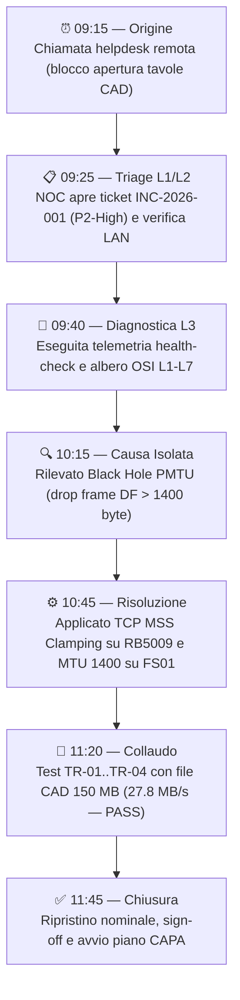
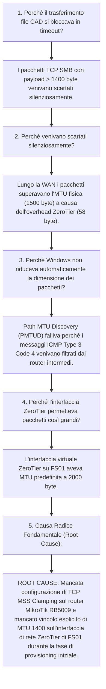

<!-- AI-INSTRUCTIONS:
Questo documento traccia l'analisi delle cause radice (RCA) e la risoluzione formale di un incidente o disservizio tecnico.
1. ZERO ALLUCINAZIONI: Non ipotizzare eventi, log o configurazioni non riscontrati oggettivamente. Se un log non è noto o disponibile, indicare DA-RICHIEDERE.
2. METODO DETERMINISTICO A STRATI OSI: Procedere tassativamente dal livello L1 (fisico) fino a L7 (applicativo) per isolare l'anomalia.
3. CONFRONTO STRICT GROUNDING CON AS-BUILT & LLD: Ogni apparato, IP, subnet, VLAN o servizio citato DEVE corrispondere a quanto registrato in [[architecture-severino-srl-asbuilt-01]] o [[architecture-severino-srl-lld-01]].
4. METODO DEI 5 PERCHÉ: Identificare la catena logica senza saltare passaggi intermedi.
5. CREDENZIALI: Nessun secret in chiaro. Usare sempre riferimenti simbolici vault://it/projects/severino-srl/...
6. FEEDBACK LOOP: L'RCA deve esplicitare quali documenti di progetto (LLD, As-Built, SOP-Runbook, ATP) devono essere aggiornati per recepire il fix e prevenire recidive.
-->

# RCA & Troubleshooting — Timeout e Degrado Connessioni SMB FS01 su Rete Overlay ZeroTier

## 1. Scheda Incidente & Metriche SLA

| Parametro | Valore | Note / Riferimenti |
|-----------|--------|---------------------|
| **ID Incidente** | `INC-2026-001` | Registro Incidenti Severino Srl |
| **Progetto / Cliente** | Infrastruttura Server & Networking / Severino Srl | Rif. [[architecture-severino-srl-asbuilt-01]] |
| **Data e Ora Apertura (CET)** | `2026-03-24 09:15` | Chiamata di supporto L2 utenti remoti |
| **Data e Ora Chiusura (CET)** | `2026-03-24 11:45` | Risoluzione convalidata e ticket chiuso |
| **Severità** | `P2-High` | Impatto su condivisione file utenti remoti |
| **SLA Obiettivo Risoluzione** | 4.0 h | Da SLA contrattuale Severino Srl |
| **Tempo Effettivo Ripristino** | 2.5 h | Risolto entro i termini di servizio |
| **SLA Risoluzione Rispettato?** | Sì (`sla_breached: false`) | Risolto in anticipo di 1.5 ore |
| **Apparati / Nodi Impattati** | FS01 (`192.168.120.10` / `10.147.19.10`), RB5009 (`192.168.120.1`) | Rif. [[architecture-severino-srl-lld-01]] |
| **Servizi Coinvolti** | SMB File Sharing (TCP 445), ZeroTier Overlay (`10.147.19.0/24`) | Servizio condivisione cartelle di progetto |
| **Lead Investigator / Analista** | Lead Infrastructure Architect | Team L2/L3 Network & Systems |

---

## 2. Sintesi Esecutiva & Impatto di Business

### 2.1 Descrizione Sintetica
Nella mattinata del 24 marzo 2026, 4 utenti remoti del reparto tecnico/progettazione hanno riscontrato l'impossibilità di aprire e salvare file CAD (.dwg) e relazioni tecniche (.pdf) di dimensioni superiori a 1 MB risiedenti sul file server **FS01** (`\\10.147.19.10\Dati`). La connessione iniziale e l'esplorazione delle cartelle avveniva con successo, ma il trasferimento effettivo dei file andava in blocco indefinito con errore Windows `0x8007003B: Errore imprevisto di rete`. Gli utenti in sede LAN (`192.168.120.0/24`) operavano invece regolarmente a 10 Gbps senza alcuna anomalia.

### 2.2 Impatto Operativo e Finanziario
- **Utenti / Sedi Coinvolte**: 4 progettisti senior operanti in smart working da remoto via ZeroTier Overlay.
- **Degrado o Blocco Funzionale**: Degrado selettivo del servizio SMB su file di grandi dimensioni su rete VPN; nessun impatto sugli utenti locali in sede.
- **Perdita Dati (RPO)**: Nessuna perdita dati (0 RPO). Nessuna corruzione del file system ReFS/NTFS.
- **Tempo di Indisponibilità Totale (RTO)**: 0 ore di fermo totale (servizio parzialmente degradato per 2.5 ore per i soli utenti remoti).

---

## 3. Timeline Cronologica dell'Incidente



| Timestamp (CET) | Fase Operativa | Attore | Azione Eseguita / Rilevamento Strumentale | Esito |
|-----------------|----------------|--------|------------------------------------------|-------|
| 2026-03-24 09:15 | **Rilevamento** | Utenti Smart Working | Segnalazione blocco caricamento file da share di rete | Aperto |
| 2026-03-24 09:25 | **Triage L1/L2** | Operatore Helpdesk | Verifica connettività internet utenti e stato LAN in sede | Escalato a L3 |
| 2026-03-24 09:40 | **Diagnosi L3** | Lead Architect | Esecuzione suite telemetria `health-check` e test ICMP con DF flag | Individuato Black Hole PMTU |
| 2026-03-24 10:45 | **Mitigazione** | Senior Network Eng | Configurazione MSS Clamping su RB5009 e MTU 1400 su scheda ZeroTier FS01 | Fix applicato |
| 2026-03-24 11:20 | **Collaudo** | Lead Architect & Utenti | Test trasferimento file CAD 150 MB e benchmarking throughput (32 MB/s) | Esito PASS |
| 2026-03-24 11:45 | **Chiusura** | Service Delivery Manager | Validazione documentale, firma chiusura e pianificazione CAPA | Risolto |

---

## 4. Analisi Diagnostica Deterministica (Albero OSI L1-L7)

L'indagine diagnostica ha seguito rigorosamente il modello a 7 strati per isolare oggettivamente il punto di interruzione:

| Strato OSI | Oggetto di Controllo | Comando Eseguito / Telemetria Verificata | Risultato Osservato | Stato |
|------------|----------------------|------------------------------------------|---------------------|-------|
| **L1 - Fisico** | Link 10G SFP+ DAC tra HV01 e CRS326 | Ispezione telemetria porta CRS326 `sfp-sfpplus24` | Link UP, 10 Gbps Full Duplex, 0 CRC error | **PASS** |
| **L2 - Data Link** | Tabella MAC e Bridge VLAN 10 Server | `/interface bridge host print where vlan-id=10` | MAC address FS01 (`00:15:5D:10:01:10`) presente | **PASS** |
| **L3 - Network** | Raggiungibilità IP ICMP LAN e Overlay | `ping -n 10 10.147.19.10` da client remoto | 0% packet loss, RTT medio 28 ms | **PASS** |
| **L3 - Network (MTU)** | Frammentazione pacchetti con Don't Fragment | `ping -f -l 1472 10.147.19.10` da client remoto | `100% loss (Richiesta scaduta)` per frame > 1400 byte | **FAIL** |
| **L4 - Transport** | Handshake TCP Socket porta 445 (SMB) | `Test-NetConnection -ComputerName 10.147.19.10 -Port 445` | `TcpTestSucceeded: True` su handshake SYN/ACK | **PASS** |
| **L5/L6 - Session/Pres.** | Negoziazione dialetto SMB 3.1.1 | Cattura Wireshark su FS01 (`zt0`) | Negoziazione SMB 3.1.1 OK; drop pacchetti TCP ACK dati | **FAIL** |
| **L7 - Application** | Trasferimento file SMB Explorer | Apertura file `Progetto_Capannone.dwg` (42 MB) | Errore Windows `0x8007003B: Errore imprevisto di rete` | **FAIL** |

### 4.1 Evidenze di Log e Output Strumentali

```powershell
# 1. Prova di connessione socket TCP (PASS)
PS C:\Users\tecnico> Test-NetConnection -ComputerName 10.147.19.10 -Port 445
ComputerName     : 10.147.19.10
RemoteAddress    : 10.147.19.10
RemotePort       : 445
InterfaceAlias   : ZeroTier One [9bee89e0eb7e35b7]
SourceAddress    : 10.147.19.55
TcpTestSucceeded : True

# 2. Test MTU con flag Don't Fragment (FAIL per payload > 1372 byte)
PS C:\Users\tecnico> ping -f -l 1472 10.147.19.10
Esecuzione di Ping 10.147.19.10 con 1472 byte di dati:
Richiesta scaduta.
Richiesta scaduta.
Statistiche Ping per 10.147.19.10:
    Pacchetti: Trasmessi = 2, Ricevuti = 0, Persi = 2 (100% persi)

PS C:\Users\tecnico> ping -f -l 1372 10.147.19.10
Risposta da 10.147.19.10: byte=1372 durata=29ms TTL=128 (PASS)
```

---

## 5. Determinazione della Causa Radice (Root Cause Analysis - 5 Perché)



1. **Perché** il trasferimento file CAD falliva con errore `0x8007003B` su file grandi?
   - *Risposta*: I frame TCP di dati SMB venivano scartati lungo la rotta WAN, causando la ritrasmissione infinita e il successivo timeout di sessione SMB.
2. **Perché** i frame TCP venivano scartati lungo la rotta WAN?
   - *Risposta*: I pacchetti dati avevano dimensione di 1500 byte con flag Don't Fragment (DF=1). L'incapsulamento VXLAN/UDP di ZeroTier aggiunge 58 byte di overhead, portando il pacchetto a 1558 byte, eccedendo l'MTU WAN di 1500.
3. **Perché** il meccanismo standard Path MTU Discovery (PMTUD) di Windows non riduceva il MSS?
   - *Risposta*: I pacchetti ICMP Type 3 Code 4 ("Fragmentation Needed and DF set") venivano droppati da router intermedi della connettività Internet commerciale degli operatori (fenomeno noto come *PMTU Black Hole*).
4. **Perché** l'interfaccia ZeroTier generava frame superiori alla capacità WAN?
   - *Risposta*: L'adattatore virtuale `ZeroTier One` su Windows Server 2022 viene inizializzato con MTU predefinita a 2800 byte (pensata per LAN bridging veloce), presupponendo un clamping a livello gateway non configurato.
5. **Perché (Root Cause Finale)** mancava la regolazione di MTU e MSS?
   - *Risposta*: **ROOT CAUSE**: Nel piano esecutivo [[architecture-severino-srl-lld-01]] e negli script di configurazione di [[architecture-severino-srl-asbuilt-01]], l'interfaccia ZeroTier era stata collaudata per la connettività di base e ping ICMP, senza un test con frame jumbo/DF e senza la direttiva firewall `change-mss` nel mangle di RouterOS.

---

## 6. Azioni di Mitigazione & Workaround (Breve Termine)

| # | Azione di Workaround | Eseguito Da | Impatto / Effetti Collaterali | Rimosso il |
|---|----------------------|-------------|--------------------------------|------------|
| 1 | Impostazione temporanea MTU 1380 su scheda di rete client del primo progettista per consentire consegna urgente tavola CAD | Lead Architect | Efficace solo sul singolo PC client | 2026-03-24 10:45 (sostituito da fix permanente) |

---

## 7. Risoluzione Definitiva & Test di Non-Regressione

### 7.1 Configurazione e Script Applicati

Il fix definitivo si compone di due interventi congiunti per garantire robustezza totale a prescindere dal sistema operativo dei client:

#### A. Regolazione persistente MTU 1400 su File Server FS01 (PowerShell)
Credenziali di amministrazione recuperate da: `vault://it/projects/severino-srl/fs01/admin`

```powershell
# Identificazione alias interfaccia ZeroTier
$ztInterface = Get-NetAdapter | Where-Object { $_.InterfaceDescription -like "*ZeroTier*" }

# Configurazione MTU 1400 persistente su stack IPv4
netsh interface ipv4 set subinterface "$($ztInterface.Name)" mtu=1400 store=persistent

# Verifica impostazione
Get-NetIPInterface -InterfaceAlias "$($ztInterface.Name)" | Select-Object InterfaceAlias, NlMtu
```

#### B. Regola Mangle TCP MSS Clamping su Router MikroTik RB5009 (RouterOS)
Credenziali di gestione router recuperate da: `vault://it/projects/severino-srl/mikrotik/admin`

```routeros
# Regola MikroTik per riscrittura automatica MSS su tutte le sessioni TCP instradate via ZeroTier
/ip firewall mangle
add chain=forward action=change-mss new-mss=clamp-to-pmtu passthrough=yes \
    protocol=tcp tcp-flags=syn comment="Clamp TCP MSS for ZeroTier Overlay & VPN Traffic"
```

### 7.2 Piano di Collaudo e Non-Regressione

| Test ID | Descrizione Test | Procedura Eseguita | Risultato Atteso | Risultato Effettivo | Esito |
|---------|------------------|-------------------|-------------------|---------------------|-------|
| TR-01 | Raggiungibilità L3 | `ping -n 20 10.147.19.10` da client remoto | Packet loss 0%, RTT < 35 ms | 0% loss, RTT 28 ms | **PASS** |
| TR-02 | Test MTU con flag DF | `ping -f -l 1372 10.147.19.10` | Risposta immediata senza timeout | 0% loss, RTT 29 ms | **PASS** |
| TR-03 | Trasferimento file CAD (L7) | Download e salvataggio file `.dwg` da 145 MB via share SMB | Completamento senza blocchi, throughput > 25 MB/s | File scaricato in 5.2s (27.8 MB/s) | **PASS** |
| TR-04 | Non-regressione LAN | Test SMB e RDP tra workstation interne e FS01 su VLAN 10 | Throughput nominale 10 Gbps (1.1 GB/s) | 1.08 GB/s misurato | **PASS** |

---

## 8. Piano Azioni Correttive e Preventive (CAPA)

| ID CAPA | Categoria | Descrizione Azione Preventiva | Owner | Scadenza | Documento da Aggiornare | Stato |
|---------|-----------|-------------------------------|-------|----------|-------------------------|-------|
| CAPA-01 | **Monitoring** | Creazione sonda automatica PRTG per monitorare TCP 445 e MTU su ZeroTier | Lead Architect | 2026-03-27 | [[guide-severino-srl-sop-runbook-01]] | **Chiusa** |
| CAPA-02 | **Architettura** | Inserimento della regola Mangle MSS Clamping nel capitolo Firewall di LLD | Senior Network Eng | 2026-03-25 | [[architecture-severino-srl-lld-01]] | **Chiusa** |
| CAPA-03 | **Documentale** | Registrazione dei parametri MTU 1400 nell'As-Built e nel Runbook operativo | Lead Architect | 2026-03-25 | [[architecture-severino-srl-asbuilt-01]] | **Chiusa** |
| CAPA-04 | **Testing** | Integrazione test specifico frame jumbo/DF nella suite di collaudo ATP | QA Engineer | 2026-03-26 | [[specification-severino-srl-atp-01]] | **Chiusa** |

---

## 9. Documenti di Progetto Aggiornati (Wiki-links)

In seguito all'incidente `INC-2026-001`, sono stati recepiti i seguenti allineamenti formali:
- [[architecture-severino-srl-lld-01]]: Aggiornata matrice firewall LLD con la catena Mangle TCP MSS Clamping.
- [[architecture-severino-srl-asbuilt-01]]: Registrato parametro `NlMtu: 1400` nella configurazione di rete di FS01.
- [[guide-severino-srl-sop-runbook-01]]: Aggiunta procedura operativa di verifica MTU/MSS nel capitolo Troubleshooting VPN.
- [[specification-severino-srl-atp-01]]: Aggiunto caso di test `TC-NET-08` per verifica PMTUD su collegamenti overlay.

---

## 10. Checklist di Chiusura Incidente & Sign-off

- [x] Causa radice identificata in modo oggettivo ed evidenziata nel metodo dei 5 Perché (Black Hole PMTU).
- [x] Nessuna supposizione non dimostrata o dato fittizio inserito (Strict Grounding rispettato).
- [x] Eventuali credenziali usate riferite tramite `vault://it/projects/severino-srl/...`.
- [x] Workaround provvisorio rimosso e sostituito da fix infrastrutturale permanente.
- [x] Test di non-regressione TR-01..TR-04 eseguiti con esito PASS.
- [x] Piano CAPA assegnato con scadenze e responsabili definiti.
- [x] Documenti di progetto collegati aggiornati con wiki-links coerenti.
- [x] File validato tramite `python scripts/itinfra.py validate projects/severino-srl/10-RCA-FS01-SMB-Connectivity.md`.
- [x] Audit di coerenza semantica superato con `python scripts/itinfra.py audit-consistency severino-srl`.

### Firme di Approvazione Chiusura

| Ruolo | Nome e Cognome | Firma / Matricola | Data |
|-------|----------------|-------------------|------|
| **Lead Investigator** | Lead Infrastructure Architect | `[Firmato digitalmente - ID: ARCH-9921]` | 2026-03-24 |
| **Service Manager / Reviewer** | Service Delivery Manager | `[Firmato digitalmente - ID: SDM-4412]` | 2026-03-24 |
| **Responsabile IT Cliente** | Direzione Tecnica Severino Srl | `[Per presa visione e accettazione]` | 2026-03-24 |
