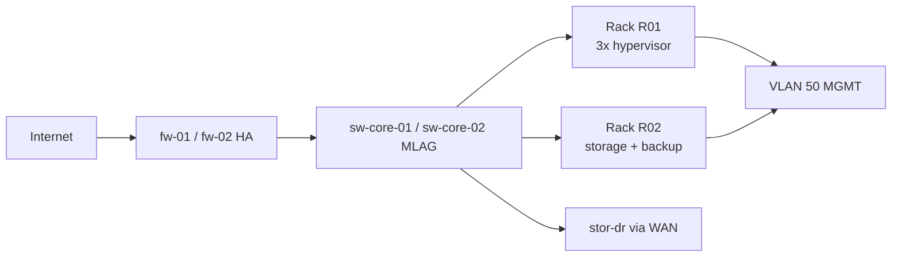

<!-- AI-INSTRUCTIONS:
  Ruolo: redigere la fotografia esatta dell'infrastruttura effettivamente installata e configurata.
  Input attesi: LLD originale, logbook di installazione (annotazioni durante il deploy),
    output dei comandi "show running-config" di ogni apparato, lista dei seriali,
    certifiche Fluke, eventuali change request approvate durante l'intervento.
  Regole di compilazione:
    1. Le informazioni DEVONO riflettere lo stato reale post-deploy, NON il progetto iniziale.
    2. Ogni deviazione dal LLD deve essere documentata in §3 (Deviazioni dal LLD) con motivazione.
    3. Includere seriali, versioni firmware e MAC address (richiesti per inventory e supporto).
    4. Tutti gli indirizzi IP effettivamente assegnati devono essere registrati (non solo quelli del LLD).
    5. Le credenziali NON vanno in chiaro: usare riferimento al password vault.
    6. Le configurazioni complete degli apparati vanno allegate come file separati (non inline).
    7. Aggiornare i diagrammi di rete se differenti dal LLD.
    8. In `depends_on`: LLD e MOP.
    9. Validare la checklist in fondo prima di `status: in-review`.
-->

# As-Built Documentation

**Progetto:** `<project_name>`
**Cliente:** `<customer>`
**Sito:** `<site>`
**Versione documento:** `<version>`
**Stato:** `<status>`
**Data installazione:** `2026-09-15`
**Data cutover:** `2026-09-15`

## 1. Sintesi dell'Infrastruttura Installata

<!-- Sintesi di 8-15 righe che descrive COSA è stato effettivamente installato e configurato. -->

<Descrizione sintetica dell'infrastruttura come realmente installata e configurata al sito <site>. Indicare: numero di rack, server, switch, storage, appliance installate; servizi base attivi (AD, DNS, DHCP, NTP); modalità di ridondanza implementate; stato delle repliche verso DR. Indicare eventuali componenti NON installati (rimandati a fase successiva).>

**Stato finale dichiarato:**
- [ ] Infrastruttura fisica installata e cablata (certificate)
- [ ] Configurazioni caricate su tutti gli apparati
- [ ] Cluster hypervisor operativo con VM base attive
- [ ] Storage e repliche verso DR attivi
- [ ] Cutover completato con esito positivo
- [ ] Servizi pubblici accessibili dall'esterno

## 2. Diagrammi di Rete Aggiornati

<!-- Inserire i diagrammi "as-built" — possono differire dall'LLD per varianti in corso d'opera. -->

### 2.1 Diagramma Logico As-Built

```
File: assets/as-built-topology-v<version>.png
oppure: blocco mermaid inline
```



### 2.2 Diagramma Fisico As-Built

```
File: assets/as-built-rack-layout-v<version>.pdf
```

**Legenda deviazioni:** le differenze rispetto al LLD sono evidenziate in rosso nei diagrammi sovrapposti (file `assets/as-built-overlay-LLD-vs-asbuilt.png`).

## 3. Deviazioni dal LLD

<!-- Elenco di TUTTE le differenze tra LLD approvato e installazione effettiva. -->

| ID | Componente | LLD prevedeva | As-Built realizzato | Motivazione | Approvazione |
|----|-----------|---------------|---------------------|-------------|--------------|
| DEV-001 | Switch ToR R01 | 2x `<modello A>` 48p | 2x `<modello B>` 48p (upgrade) | Modello A in EOL, sostituito con B | `<Sponsor>` in data `<data>` |
| DEV-002 | Storage LUN-002 | 5 TB | 6 TB | Crescita stima data applicativi | `<Tech Lead>` in data `<data>` |
| DEV-003 | VLAN 80 BACKUP | /24 | /23 | Range IP esaurito per appliance backup | `<Net Eng>` in data `<data>` |
| DEV-004 | Firewall policy EW-005 | deny all | deny all + log enhanced | Logging richiesto da compliance | `<Sec Eng>` in data `<data>` |

**Totale deviazioni registrate:** `<n>`

## 4. Inventario Hardware Installato

### 4.1 Server / Hypervisor

| Hostname | Modello | Service Tag / Serial | Asset Tag | Rack | U-pos | MAC iLO | IP iLO | CPU | RAM | Storage locale | Hypervisor | Firmware |
|----------|---------|--------------------|-----------|------|-------|---------|--------|-----|-----|----------------|-----------|----------|
| SRV-TEATEK-OPENSTOR-01 | OpenStor JovianDSS 2U 24-Bay NVMe | OPENSTOR-TEATEK-NODE1 | AST-TEATEK-001 | R01 | U38-37 | 00:25:90:A1:B2:01 | 10.10.50.101 | 2x Intel Xeon 6507P | 256 GB | 10x 3.8TB NVMe + 1x Kioxia 3.2TB Gen5 | VMware ESXi 8.0 U2 + JovianDSS VSA | 2.14.0 |
| SRV-TEATEK-OPENSTOR-02 | OpenStor JovianDSS 2U 24-Bay NVMe | OPENSTOR-TEATEK-NODE2 | AST-TEATEK-002 | R01 | U36-35 | 00:25:90:A1:B2:02 | 10.10.50.102 | 2x Intel Xeon 6507P | 256 GB | 10x 3.8TB NVMe + 1x Kioxia 3.2TB Gen5 | VMware ESXi 8.0 U2 + JovianDSS VSA | 2.14.0 |

### 4.2 Switch

| Hostname | Modello | Service Tag | Asset Tag | Rack | U-pos | MAC management | IP MGMT | Versione OS | Firmware |
|----------|---------|------------|-----------|------|-------|---------------|---------|-------------|----------|
| sw-core-01 | `<Cisco N9K-C93180YC-FX>` | `<ABC...>` | `<AST-010>` | R02 | U30 | `<AA:BB:...>` | 10.10.50.11 | `<NX-OS 9.3(10)>` | `<...>` |
| sw-core-02 | `<...>` | `<...>` | `<AST-011>` | R02 | U29 | `<...>` | 10.10.50.12 | `<...>` | `<...>` |
| sw-tor-01 | `<...>` | `<...>` | `<AST-012>` | R01 | U41 | `<...>` | 10.10.50.13 | `<...>` | `<...>` |
| sw-tor-02 | `<...>` | `<...>` | `<AST-013>` | R01 | U40 | `<...>` | 10.10.50.14 | `<...>` | `<...>` |

### 4.3 Storage

| Hostname | Modello | Serial | Asset Tag | Rack | U-pos | Controller | IP MGMT | Firmware | Capacità raw | Capacità usable |
|----------|---------|--------|-----------|------|-------|-----------|---------|----------|--------------|-----------------|
| stor-01 | `<NetApp FAS8700>` | `<...>` | `<AST-020>` | R02 | U38-35 | dual | 10.10.50.20 | `<ONTAP 9.13.1>` | `<142 TB>` | `<94 TB>` |

### 4.4 Firewall / Appliance Sicurezza

| Hostname | Modello | Serial | Asset Tag | Rack | IP MGMT | Firmware | Licenze |
|----------|---------|--------|-----------|------|---------|----------|---------|
| fw-01 | `<Fortinet FG-200F>` | `<...>` | `<AST-030>` | R02 | 10.10.50.30 | `<FortiOS 7.4.3>` | UTM bundle 36 mesi |
| fw-02 | `<...>` | `<...>` | `<AST-031>` | R02 | 10.10.50.31 | `<...>` | `<...>` |

### 4.5 Backup Appliance

| Hostname | Modello | Serial | IP MGMT | Firmware | Storage usable |
|----------|---------|--------|---------|----------|----------------|
| bkp-01 | `<Veeam Hardened Appliance>` | `<...>` | 10.10.50.40 | `<...>` | `<72 TB>` |

### 4.6 UPS / PDU

| Hostname | Modello | Serial | Rack | Capacità | IP MGMT | Firmware |
|----------|---------|--------|------|----------|---------|----------|
| ups-01 | `<APC SRT 10kVA>` | `<...>` | R01 | 10 kVA | 10.10.50.50 | `<...>` |
| ups-02 | `<...>` | `<...>` | R02 | 10 kVA | 10.10.50.51 | `<...>` |
| pdu-01 | `<APC AP8941>` | `<...>` | R01 | 16A | 10.10.50.60 | `<...>` |
| pdu-02 | `<...>` | `<...>` | R02 | 16A | 10.10.50.61 | `<...>` |

### 4.7 Stampanti Multifunzione & Periferiche

| Hostname | Modello | Service Tag / Serial | Asset Tag | Reparto / Posizione | IP MGMT | MAC Address |
|----------|---------|--------------------|-----------|--------------------|---------|-------------|
| mfp-ricoh-01 | Ricoh IM C3000 A3 Colore | MFP-RICOH-C3000-01 | AST-TEATEK-030 | Open Space Piano 1 | 192.168.10.250 | 00:26:73:AA:BB:CC |

## 5. Indirizzi IP Assegnati

### 5.1 IP Plan As-Built (estratto dei principali)

| IP | Hostname | VLAN | Zona | MAC | Note |
|-----|----------|------|------|-----|------|
| 10.10.10.2 | fw-01 | 10 | DMZ | `<AA:...>` | firewall active |
| 10.10.10.3 | fw-02 | 10 | DMZ | `<AA:...>` | firewall standby |
| 10.10.50.11 | sw-core-01 | 50 | MGMT | `<AA:...>` | switch core 1 |
| 10.10.50.12 | sw-core-02 | 50 | MGMT | `<AA:...>` | switch core 2 |
| 10.10.50.20 | stor-01 | 50 | MGMT | `<AA:...>` | storage controller |
| 10.10.50.30 | fw-01-mgmt | 50 | MGMT | `<AA:...>` | firewall mgmt |
| 10.10.50.101 | SRV-01 iLO | 50 | MGMT | `<AA:...>` | iLO |
| 10.10.50.102 | SRV-02 iLO | 50 | MGMT | `<AA:...>` | iLO |
| 10.10.50.103 | SRV-03 iLO | 50 | MGMT | `<AA:...>` | iLO |
| 10.10.70.10 | stor-01-a (iSCSI A) | 70 | STORAGE | `<AA:...>` | iSCSI target A |
| 10.10.70.11 | stor-01-b (iSCSI B) | 70 | STORAGE | `<AA:...>` | iSCSI target B |

**IP plan completo:** file allegato `assets/as-built-ipplan-v<version>.xlsx`

### 5.2 Subnet Totali Utilizzate

| Subnet | CIDR | VLAN | Zona | Host allocati | Host liberi | Utilizzo % |
|--------|------|------|------|----------------|-------------|------------|
| 10.10.10.0/24 | /24 | 10 | DMZ | 4 | 250 | 2% |
| 10.10.20.0/24 | /24 | 20 | PROD-APP | 18 | 235 | 7% |
| 10.10.30.0/24 | /24 | 30 | PROD-DB | 6 | 250 | 2% |
| 10.10.50.0/24 | /24 | 50 | MGMT | 22 | 230 | 9% |
| 10.10.70.0/24 | /24 | 70 | STORAGE | 8 | 246 | 3% |
| 10.10.80.0/23 | /23 | 80 | BACKUP | 5 | 507 | 1% |

## 6. Configurazioni Finali (Riferimenti)

<!-- NON incollare le config complete qui (troppo lungo). Riferire ai file allegati. -->

| Apparato | File di configurazione allegato | Hash SHA256 |
|----------|--------------------------------|-------------|
| fw-01 | `assets/configs/fw-01-v<version>.cfg` | `<sha256>` |
| fw-02 | `assets/configs/fw-02-v<version>.cfg` | `<sha256>` |
| sw-core-01 | `assets/configs/sw-core-01-v<version>.cfg` | `<sha256>` |
| sw-core-02 | `assets/configs/sw-core-02-v<version>.cfg` | `<sha256>` |
| sw-tor-01 | `assets/configs/sw-tor-01-v<version>.cfg` | `<sha256>` |
| sw-tor-02 | `assets/configs/sw-tor-02-v<version>.cfg` | `<sha256>` |
| stor-01 | `assets/configs/stor-01-v<version>.cfg` | `<sha256>` |
| cluster hypervisor | `assets/configs/hv-cluster-v<version>.json` | `<sha256>` |

**Note:**
- I file di configurazione contengono placeholder per le credenziali (riferimento al vault).
- I file sono memorizzati in `assets/configs/` e versionati con hash SHA256 per integrità.
- Ogni modifica futura deve incrementare `version` e aggiornare l'hash.

## 7. Credenziali e Accessi

<!-- NON inserire password in chiaro. Solo riferimenti al vault. -->

| Servizio | Account | Posizione credenziali | Note |
|----------|---------|----------------------|------|
| fw-01 admin | `admin` | `vault://it/projects/acme-milano-dc/fw-01/admin` | Rotazione ogni 90gg |
| fw-02 admin | `admin` | `vault://it/projects/acme-milano-dc/fw-02/admin` | Rotazione ogni 90gg |
| sw-core-01 admin | `admin` | `vault://it/projects/acme-milano-dc/sw-core-01/admin` | Rotazione ogni 90gg |
| stor-01 admin | `admin` | `vault://it/projects/acme-milano-dc/stor-01/admin` | Rotazione ogni 90gg |
| vCenter admin | `administrator@vsphere.local` | `vault://it/projects/acme-milano-dc/vcenter/admin` | MFA abilitata |
| bkp-01 admin | `backup-admin` | `vault://it/projects/acme-milano-dc/bkp-01/admin` | Rotazione ogni 90gg |
| UPS/PDU admin | `admin` | `vault://it/projects/acme-milano-dc/ups/admin` | Rotazione ogni 180gg |

**Vault di riferimento:** `<piattaforma, es. HashiCorp Vault / CyberArk / 1Password Business>`
**Policy di rotazione:** vedi SOP [[08-SOP-Runbook]] sezione §6 (Rotazione credenziali).

## 8. Servizi Base Configurati

### 8.1 Active Directory

| Server | Hostname | IP | Ruolo | Forest | Domain | Site AD |
|--------|----------|-----|------|--------|--------|---------|
| DC-01 | dc-01.<domain> | 10.10.50.20 | Primary DC | `<forest>` | `<domain.local>` | `<Site-Milano>` |
| DC-02 | dc-02.<domain> | 10.10.50.21 | Secondary DC | `<forest>` | `<domain.local>` | `<Site-Milano>` |

**Schema OU installato:**
- `<domain.local>`
  - `OU=Infrastruttura`
    - `OU=Server` (SRV-01, SRV-02, SRV-03, storage, switch)
    - `OU=Hypervisor`
  - `OU=Servizi` (account servizio per applicativi)
  - `OU=Utenti`
  - `OU=Gruppi`

### 8.2 DNS

- Zone forward: `<domain.local>`, `<altro dominio>`
- Zone reverse: `10.10.in-addr.arpa`
- Forwarder: 8.8.8.8, 1.1.1.1
- Record chiave creati: SRV (AD), A per host fissi, CNAME per alias applicativi

### 8.3 DHCP

- Scope attivi: VLAN 20 (PROD-APP), VLAN 50 (MGMT), VLAN 80 (BACKUP)
- Lease: 8h
- Esclusioni: range IP fissi come da §5.1

### 8.4 NTP

- Server NTP: ntp-01 (10.10.50.60), ntp-02 (10.10.50.61)
- Tutti gli apparati configurati per sincronizzarsi verso i server NTP interni
- I server NTP interni sincronizzano verso `pool.ntp.org`

## 9. Backup Configurati (As-Built)

### 9.1 Job di Backup Attivi

| Job | Host/VM inclusi | Schedule | Software | Target | Retention | Stato attuale |
|-----|----------------|----------|----------|--------|-----------|---------------|
| Job-VM-PROD | SRV-01/02/03 + DC-01/02 | 22:00 daily | Veeam | bkp-01 | 30gg locali + 365 cloud | attivo |
| Job-FILE | FILE-SRV-01 | 02:00 daily | Veeam | bkp-01 | 90gg | attivo |
| Job-CONFIG | fw-01/02, sw-core-01/02 | 04:00 daily | script + Veeam | bkp-01 + vault | 180gg | attivo |
| Job-STORAGE-SNAP | stor-01 pool | ogni 1h | ONTAP | stor-01 + stor-dr | 24 snapshot | attivo |

### 9.2 Repliche Storage As-Built

| Source | Target | Tipo | Frequenza | RPO attuale | Stato |
|--------|--------|------|-----------|-------------|-------|
| stor-01 Pool-Tier1 | stor-dr Pool-Tier1 | Async replication | 15 min | ~12 min | attivo |
| stor-01 Pool-Tier2 | stor-dr Pool-Tier2 | Async replication | 1h | ~45 min | attivo |
| bkp-01 | cloud S3 | Sync copy | continua | ~1h | attivo |

## 10. Note di Installazione

<!-- Eventuali annotazioni qualitative raccolte durante il deploy, utili per future manutenzioni. -->

### 10.1 Note Tecniche
- `<es. Switch ToR R01 ha portato surriscaldamento in U41 — monitorare temperatura rack>`
- `<es. Cablaggio intra-rack R02 ha richiesto 2 ore extra per conflitto canalina>`
- `<es. UPS-01 ha segnalato allarme batteria durante test iniziale, risolto con reset controller>`

### 10.2 Note Operative
- `<es. Il team cliente NO ha richiesto training aggiuntivo per gestione storage>`
- `<es. Accesso fisico in sala server richiede preavviso 24h al facility management>`
- `<es. Le repliche verso DR hanno latenza variabile nelle ore di punta WAN (10:00-12:00)>`

### 10.3 Azioni Rimaste Aperte (Punch List)

| ID | Azione | Owner | Scadenza | Stato |
|----|--------|-------|----------|-------|
| OA-001 | `<es. Configurare MFA su vCenter>` | `<Sec Eng>` | `<data>` | open |
| OA-002 | `<es. Aggiornare firmware UPS-02>` | `<Tech Lead>` | `<data>` | open |
| OA-003 | `<es. Completare migrazione ultimi 3 server legacy>` | `<PM>` | `<data>` | open |

## 11. Riferimenti e Documenti Correlati

- LLD originale: [[03-LLD]]
- MOP eseguito: [[04-MOP]]
- Rapporto di collaudo: [[07-ATP]]
- SOP / Runbook operativi: [[08-SOP-Runbook]]
- Verbale di handover: [[09-Handover-Inventory]]

## Appendice A — Asset Inventory Esportabile

**File allegato:** `assets/as-built-asset-inventory-v<version>.xlsx`

Contiene per ogni asset: hostname, modello, service tag, asset tag, MAC, IP, posizione rack, firmware, data installazione, garanzia fino al, contratto di supporto.

## Appendice B — Acronimi

| Acronimo | Espansione |
|----------|------------|
| MGMT | Management |
| HA | High Availability |
| iLO | Integrated Lights-Out (HP) / iDRAC (Dell) |
| VLAN | Virtual Local Area Network |
| OU | Organizational Unit |
| UTM | Unified Threat Management |
| MFA | Multi-Factor Authentication |

---

## Checklist di Validazione

- [ ] Sintesi infrastruttura installata compilata (§1)
- [ ] Diagramma logico as-built presente (§2.1)
- [ ] Diagramma fisico as-built presente (§2.2)
- [ ] Tutte le deviazioni dal LLD elencate con approvazione (§3)
- [ ] Inventario hardware completo per ogni categoria (§4)
- [ ] Tutti gli IP assegnati registrati (§5)
- [ ] Configurazioni finali allegate con hash SHA256 (§6)
- [ ] Riferimenti credenziali nel vault (NESSUNA password in chiaro) (§7)
- [ ] Servizi base (AD, DNS, DHCP, NTP) documentati (§8)
- [ ] Job di backup e repliche documentati con stato attuale (§9)
- [ ] Note di installazione e punch list compilati (§10)
- [ ] `depends_on` contiene LLD e MOP
- [ ] `related_docs` include ATP, SOP, Handover
- [ ] Asset inventory esportato in Excel (Appendice A)
