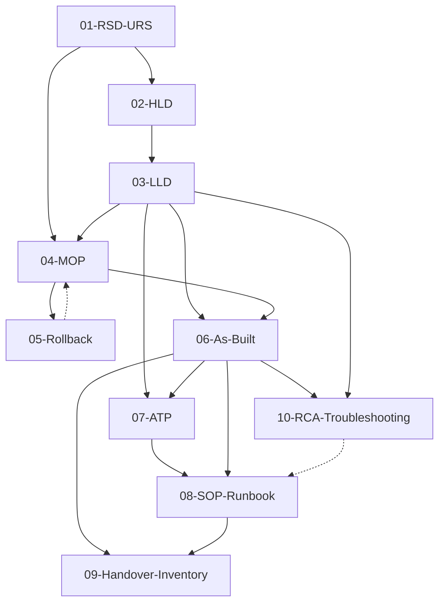

<!-- AI-INSTRUCTIONS:
  Questo file NON è un template da compilare. È l'indice navigazionale
  del knowledge vault. Quando un agente AI riceve un task di compilazione,
  deve SEMPRE consultare questo indice per:
    1. Identificare il tipo di documento richiesto
    2. Recuperare i documenti correlati (related_docs) da consultare come contesto
    3. Verificare le dipendenze (depends_on) che devono essere già compilate
    4. Rispettare l'ordinamento temporale delle fasi
  Non modificare mai la struttura delle 7 fasi senza approvazione esplicita.
-->

# Indice Navigazionale — Template Ciclo Lavorativo IT

## File di Orientamento

Prima di iniziare a compilare qualsiasi template, consulta questi file:

- **README.md** — introduzione umana al sistema, struttura del repository, FAQ
- **AGENTS.md** — istruzioni auto-caricate da Cursor/Aider/Continue/Cline/Roo Code e altri agenti che seguono la convenzione
- **CLAUDE.md** — istruzioni auto-caricate da Claude Code (CLI Anthropic); contenuto equivalente ad AGENTS.md
- **examples/README.md** — indice degli esempi di prompt per agenti AI

## Mappa delle Fasi e dei Documenti

La tabella seguente mappa ciascuna delle **7 fasi operative** ai **documenti** che le appartengono e ai **template** che l'agente AI deve compilare. I riferimenti `[[id]]` sono link nello stile wiki-link (Obsidian/Logseq) e permettono di relazionare i documenti nel knowledge vault.

| Fase | Denominazione | Documenti Prodotti | Template Collegati |
|------|---------------|--------------------|------------------------|
| 1. Analisi | Assessment & Site Survey | RSD / URS | [[01-RSD-URS]] |
| 2. Progettazione | Architectural Design | HLD, LLD | [[02-HLD]], [[03-LLD]] |
| 3. Approvvigionamento | Procurement & Staging | MOP, Rollback Plan | [[04-MOP]], [[05-Rollback]] |
| 4. Posa e Montaggio | Racking & Cabling | (registro installazione → confluisce in As-Built) | [[06-As-Built]] |
| 5. Configurazione | Commissioning & Implementation | (log di configurazione → confluisce in As-Built) | [[06-As-Built]] |
| 6. Collaudo | Testing & Validation | ATP / Rapporto di Collaudo | [[07-ATP]] |
| 7. Rilascio | Go-Live / Handover | As-Built, SOP/Runbook, Handover & Inventory | [[06-As-Built]], [[08-SOP-Runbook]], [[09-Handover-Inventory]] |
| 7. Post-Rilascio | Incident Troubleshooting & RCA | Root Cause Analysis, Mitigazione & CAPA | [[10-RCA-Troubleshooting]] |

## Classificazione Temporale

### Documenti Pre-Lavoro (Design & Planning)
Prodotti prima dell'avvio operativo. Definiscono requisiti, vincoli e architettura approvata.

- [[01-RSD-URS]] — Requisiti funzionali, vincoli di conformità, RTO/RPO, capacità
- [[02-HLD]] — Architettura macroscopica, flussi di traffico primari, scelte tecnologiche
- [[03-LLD]] — Blueprint esecutivo: IP plan, VLAN, rack elevation, cable matrix, storage, ACL
- [[04-MOP]] — Piano operativo passo-passo con finestre di manutenzione e responsabilità
- [[05-Rollback]] — Procedure di ripristino in caso di criticità bloccanti

### Documenti Post-Lavoro (Delivery & Operations)
Redatti a conclusione dei lavori. Certificano quanto realizzato e garantiscono manutenibilità.

- [[06-As-Built]] — Fotografia dell'infrastruttura effettivamente installata (con deviazioni da LLD)
- [[07-ATP]] — Verbale di collaudo con test eseguiti e esito Pass/Fail
- [[08-SOP-Runbook]] — Manualistica operativa per sistemisti primo/secondo livello
- [[09-Handover-Inventory]] — Registro inventariale e verbale formale di presa in carico
- [[10-RCA-Troubleshooting]] — Analisi deterministica cause radice (OSI L1-L7, 5 Perché, CAPA) per ticket di incidente post-go-live

## Workflow di Compilazione Suggerito per Agenti AI

Quando un agente AI riceve in chat i dati per compilare un documento, deve seguire questo ordinamento logico per garantire coerenza tra documenti correlati:

1. **Popolare i metadata del frontmatter** (id univoco, project_id, phase, related_docs)
2. **Consultare i documenti `depends_on`** citati come contesto (es. per compilare l'LLD, leggere RSD/URS e HLD)
3. **Compilare tutte le sezioni del body** seguendo le AI-INSTRUCTIONS del singolo template
4. **Validare i campi obbligatori** tramite la checklist in fondo a ciascun template
5. **Aggiornare `status`** da `draft` → `in-review` → `approved` man mano che avanza la revisione
6. **Registrare le relazioni** in `related_docs` usando gli id (non i titoli) dei documenti collegati
7. **In caso di revisione sostanziale**: incrementare `version`, popolare `supersedes`/`superseded_by`

## Link Graph dei Documenti



Legenda:
- `-->` dipendenza forte (il documento target necessita del documento sorgente)
- `-.->` riferimento bidirezionale (rollback referenzia il MOP e viceversa)

## Convenzioni di Naming dei File

```
NN-CODICE.md          (template documentali)
CODICE.md             (file di orientamento: README, AGENTS, CLAUDE, INDEX)
examples/NN-prompt-CODICE.md  (esempi di prompt per agenti AI)
```

| Codice | Documento | Nome File |
|--------|-----------|-----------|
| — | Indice navigazionale | `00-INDEX.md` |
| 01 | RSD/URS | `01-RSD-URS.md` |
| 02 | HLD | `02-HLD.md` |
| 03 | LLD | `03-LLD.md` |
| 04 | MOP | `04-MOP.md` |
| 05 | Rollback | `05-Rollback.md` |
| 06 | As-Built | `06-As-Built.md` |
| 07 | ATP | `07-ATP.md` |
| 08 | SOP/Runbook | `08-SOP-Runbook.md` |
| 09 | Handover & Inventory | `09-Handover-Inventory.md` |
| 10 | RCA & Troubleshooting | `10-RCA-Troubleshooting.md` |

### File di orientamento (non compilabili)

| File | Scopo | Letto da |
|------|-------|----------|
| `README.md` | Introduzione umana, struttura, FAQ | Umani |
| `AGENTS.md` | Istruzioni operative per agenti AI | Cursor, Aider, Continue, Cline, Roo Code, ... |
| `CLAUDE.md` | Istruzioni per Claude Code | Claude Code (CLI Anthropic) |
| `examples/README.md` | Indice esempi di prompt | Umani |
| `examples/00-prompt-master-template.md` | Struttura generica di prompt | Umani + agenti AI |
| `examples/NN-prompt-*.md` | Prompt di esempio per ogni tipo di documento | Umani (da copiare per chat agentic) |

## Schema Frontmatter Standard (OKF v0.2 nativo)

Tutti i template utilizzano lo schema YAML nativo dello standard OKF v0.2 (compatibile col parser `src/lib/okfParser.ts` del Knowledge Vault). Lo schema è composto da **campi canonici obbligatori** + **metadati estesi IT**.

### Campi canonici OKF v0.2 (riconosciuti dal parser)

```yaml
okf_version: "0.2"           # OBBLIGATORIO — deve essere "0.2"
id: "<type>-<project>-<seq>" # FACOLTATIVO ma raccomandato (univoco nel vault)
title: "..."                  # OBBLIGATORIO (max 120 caratteri)
type: "<canonical>"          # OBBLIGATORIO — uno dei 6 tipi canonici
domain: "..."               # OBBLIGATORIO — ambito tematico
tags: ["..."]                 # OBBLIGATORIO (min 2, lowercase)
entities:                    # OBBLIGATORIO (min 1)
  - name: "..."
    type: "concept|framework|technology|toolchain|pattern|organization"
    description: "..."
relations:                   # RACCOMANDATO (può essere [])
  - targetTitle: "..."
    targetId: "..."
    relationType: "references|implements|depends_on|extends|documents|..."
    weight: 0.85
    description: "..."
```

### 6 tipi canonici OKF v0.2

Mappatura tra i 9 tipi documentali IT e i 6 tipi canonici OKF:

| Tipo IT | Tipo canonico OKF | Razionale |
|---------|-------------------|-----------|
| RSD/URS | `specification` | Definisce requisiti e contratti formali |
| HLD | `architecture` | Blueprint architetturale macro |
| LLD | `architecture` | Blueprint architetturale esecutivo |
| MOP | `guide` | Procedura operativa passo-passo |
| Rollback | `guide` | Procedura operativa di contingency |
| As-Built | `architecture` | Stato reale dell'infrastruttura installata |
| ATP | `specification` | Contratto di collaudo con criteri formali |
| SOP/Runbook | `guide` | Manuale operativo |
| Handover & Inventory | `specification` | Verbale formale di presa in carico |

### Metadati estesi IT (preservati in `rawFrontmatter` dal parser)

Questi campi non sono canonici OKF ma vengono conservati dal parser come rawFrontmatter e possono essere letti dal KnowledgeReader per visualizzazione custom:

```yaml
# Identità estesa
status: "draft|in-review|approved|superseded"
version: "0.1"
created_at: "YYYY-MM-DD"
updated_at: "YYYY-MM-DD"

# Progetto
project_id: "<PROJECT_ID>"
project_name: "..."
site: "<SITE_CODE>"
customer: "..."
phase: 1-7

# Persone
author: "..."
reviewer: "..."
approver: "..."
owner_team: "..."

# Relazioni estese (complementari a `relations` canonico)
related_docs: ["<id1>", "<id2>"]
depends_on: ["<id1>"]
supersedes: "<old-id>"
superseded_by: "<new-id>"

# Governance
classification: "internal|confidential|public"
retention: "..."
lang: "it"
```

### Pattern degli ID

Il campo `id` deve essere univoco nel vault. Pattern suggerito:

```
<type-canonical>-<project-slug>-<seq>
```

Esempi:
- `specification-acme-milano-rsd-01`
- `architecture-acme-milano-hld-01`
- `architecture-acme-milano-lld-01`
- `guide-acme-milano-mop-01`
- `architecture-acme-milano-asbuilt-01`

### Coerenza `relations` vs `related_docs`

- `relations` (canonico OKF) — usato dal grafo D3 per visualizzare archi nel grafo
- `related_docs` (esteso IT) — usato dai template per tracciare collegamenti logici tra documenti

**Regola**: per ogni entry in `related_docs`, creare una corrispondente entry in `relations` con lo stesso `targetId` e un `relationType` semanticamente appropriato. Questo garantisce che il grafo D3 visualizzi correttamente le relazioni.

## Note per la Manutenzione dei Template

- I template sono file `.md` puri (nessun binario embedded); le immagini devono essere referenziate come path relativi in una sottocartella `assets/`.
- I placeholder usano la sintassi `<...>` per i valori singoli e `[...]` per gli array.
- Le istruzioni per l'agente AI sono racchiuse in blocchi HTML commentati `<!-- AI-INSTRUCTIONS: ... -->` per renderli invisibili nei renderer Markdown standard ma leggibili come testo.
- Le checklist di validazione in fondo a ciascun template devono essere completate (tutti i flag `[ ]` → `[x]`) prima di passare `status: approved`.
